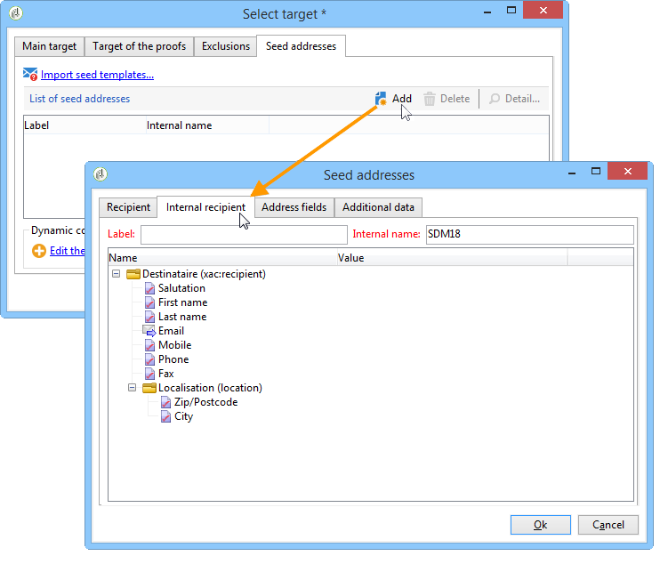

# Uso de una lista de distribución externa{#using-an-external-recipient-table}

Si la lista de distribución es una tabla externa, debe realizar ajustes adicionales. The **[!UICONTROL nms:seedmember]** schema must be extended. Se añade una pestaña a las direcciones sembradas para definir los campos adecuados, como se muestra a continuación:

En este caso, para añadir direcciones sembradas al envío, introduzca los campos adecuados directamente en la pestaña correspondiente o importe las plantillas de dirección:

La extensión del esquema **nms:seedMember** se encuentra en [esta sección](../../configuration/using/seed-addresses.md).
