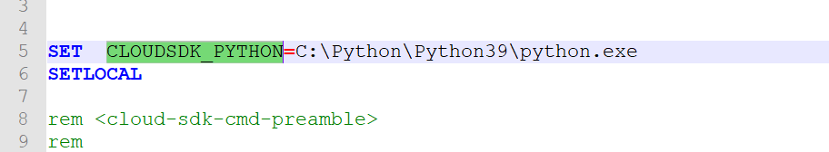

# Configuración del acceso a Google BigQuery {#configure-fda-google-big-query}


Uso de Adobe Campaign Classic **Acceso de datos federado** (FDA) para procesar la información almacenada en una base de datos externa. Siga estos pasos para configurar el acceso a [!DNL Google BigQuery].

1. Configurar [!DNL Google BigQuery] el [Windows](#google-windows) o [Linux](#google-linux)
1. Configure las variables [!DNL Google BigQuery] [cuenta externa](#google-external) en Adobe Campaign Classic
1. Configuración de [!DNL Google BigQuery] carga masiva del conector en [Windows](#bulk-load-windows) o [Linux](#bulk-load-linux)

>[!NOTE]
>
> [!DNL Google BigQuery] El conector está disponible para implementaciones alojadas, híbridas y locales. Para obtener más información, consulte [esta página](../../installation/using/capability-matrix.md).


## Google BigQuery en Windows {#google-windows}

### Controlador configurado en Windows {#driver-window}

1. Descargue [el controlador ODBC para Windows](https://cloud.google.com/bigquery/docs/reference/odbc-jdbc-drivers).

1. Configure el controlador ODBC en Windows. Para obtener más información, consulte [esta página](https://storage.googleapis.com/simba-bq-release/jdbc/Simba%20JDBC%20Driver%20for%20Google%20BigQuery%20Install%20and%20Configuration%20Guide.pdf).

1. Para el [!DNL Google BigQuery] para que el conector funcione, Adobe Campaign Classic requiere los siguientes parámetros para conectarse:

   * **[!UICONTROL Project]**: cree o utilice un proyecto existente.

     Para obtener más información, consulte esta [página](https://cloud.google.com/resource-manager/docs/creating-managing-projects).

   * **[!UICONTROL Service account]**: cree una cuenta de servicio.

     Para obtener más información, consulte esta [página](https://cloud.google.com/iam/docs/creating-managing-service-accounts).

   * **[!UICONTROL Key File Path]**: el **[!UICONTROL Service account]** requiere un **[!UICONTROL Key File]** para un [!DNL Google BigQuery] mediante ODBC.

     Para obtener más información, consulte esta [página](https://cloud.google.com/iam/docs/creating-managing-service-account-keys).

   * **[!UICONTROL Dataset]**: **[!UICONTROL Dataset]** es opcional para una conexión ODBC. Dado que cada consulta debe proporcionar el conjunto de datos donde se encuentra la tabla, especificar una **[!UICONTROL Dataset]** es obligatorio para [!DNL Google BigQuery] Conector de FDA en Adobe Campaign Classic.

     Para obtener más información, consulte esta [página](https://cloud.google.com/bigquery/docs/datasets).

1. En Adobe Campaign Classic, puede configurar los [!DNL Google BigQuery] cuenta externa. Para obtener más información sobre cómo configurar la cuenta externa, consulte [esta sección](#google-external).

### Configuración de carga masiva en Windows {#bulk-load-window}

>[!NOTE]
>
>Necesita instalar Python para que funcione el SDK de Google Cloud.
>
>Recomendamos utilizar Python3, consulte esto [página](https://www.python.org/downloads/).

La utilidad Carga masiva permite una transferencia más rápida, que se logra a través del SDK de Google Cloud.

1. Descargue el archivo de 64 bits de Windows (x86_64) desde aquí [página](https://cloud.google.com/sdk/docs/downloads-versioned-archives) y extráigalo en el directorio correspondiente.

1. Ejecute el `google-cloud-sdk\install.sh` script. Debe aceptar la configuración de la variable de ruta.

1. Después de la instalación, compruebe que la variable de ruta `...\google-cloud-sdk\bin` está configurado. Si no es así, añádalo manualmente.

1. En el  `..\google-cloud-sdk\bin\bq.cmd` , añada el `CLOUDSDK_PYTHON` variable local, que redireccionará a la ubicación de la instalación de Python.

   Por ejemplo:

   

1. Reinicie Adobe Campaign Classic para que se tengan en cuenta los cambios.

## Google BigQuery en Linux {#google-linux}

### Controlador configurado en Linux {#driver-linux}

Antes de configurar el controlador, tenga en cuenta que el usuario raíz debe ejecutar el script y los comandos. También se recomienda utilizar Google DNS 8.8.8.8, mientras se ejecuta la secuencia de comandos.

Para configurar [!DNL Google BigQuery] En Linux, siga los pasos a continuación:

1. Antes de la instalación de ODBC, compruebe que los siguientes paquetes estén instalados en la distribución Linux:

   * Para Red Hat/CentOS:

     ```
     yum update
     yum upgrade
     yum install -y grep sed tar wget perl curl
     ```

   * Para Debian:

     ```
     apt-get update
     apt-get upgrade
     apt-get install -y grep sed tar wget perl curl
     ```

1. Actualizar el sistema antes de la instalación:

   * Para Red Hat/CentOS:

     ```
     # install unixODBC driver manager
     yum install -y unixODBC
     ```

   * Para Debian:

     ```
     # install unixODBC driver manager
     apt-get install -y odbcinst1debian2 libodbc1 odbcinst unixodbc
     ```

1. Antes de ejecutar el script, puede obtener más información especificando el argumento —help:

   ```
   cd /usr/local/neolane/nl6/bin/fda-setup-scripts
   ./bigquery_odbc-setup.sh --help
   ```

1. Acceda al directorio en el que se encuentra el script y ejecute el siguiente script como usuario raíz:

   ```
   cd /usr/local/neolane/nl6/bin/fda-setup-scripts
   ./bigquery_odbc-setup.sh
   ```

### Configuración de carga masiva en Linux {#bulk-load-linux}

>[!NOTE]
>
>Necesita instalar Python para que funcione el SDK de Google Cloud.
>
>Recomendamos utilizar Python3, consulte esto [página](https://www.python.org/downloads/).

La utilidad Carga masiva permite una transferencia más rápida, que se logra a través del SDK de Google Cloud.

1. Antes de la instalación de ODBC, compruebe que los siguientes paquetes estén instalados en la distribución Linux:

   * Para Red Hat/CentOS:

     ```
     yum update
     yum upgrade
     yum install -y python3
     ```

   * Para Debian:

     ```
     apt-get update
     apt-get upgrade
     apt-get install -y python3
     ```

1. Acceda al directorio en el que se encuentra el script y ejecute el siguiente script:

   ```
   cd /usr/local/neolane/nl6/bin/fda-setup-scripts
   ./bigquery_sdk-setup.sh
   ```

## Cuenta externa de Google BigQuery {#google-external}

Debe crear un [!DNL Google BigQuery] cuenta externa para conectar la instancia de Adobe Campaign Classic a [!DNL Google BigQuery] base de datos externa.

1. De Adobe Campaign Classic **[!UICONTROL Explorer]**, haga clic en **[!UICONTROL Administration]** &#39;>&#39; **[!UICONTROL Platform]** &#39;>&#39; **[!UICONTROL External accounts]**.

1. Haga clic en **[!UICONTROL New]**.

1. Seleccione **[!UICONTROL External database]** como **[!UICONTROL Type]** de su cuenta externa.

1. Configure la cuenta externa [!DNL Google BigQuery]. Debe especificar:

   * **[!UICONTROL Type]**: [!DNL Google BigQuery]

   * **[!UICONTROL Service account]**: correo electrónico de su **[!UICONTROL Service account]**. Para obtener más información, consulte [Documentación de Google Cloud](https://cloud.google.com/iam/docs/creating-managing-service-accounts).

   * **[!UICONTROL Project]**: Nombre de su **[!UICONTROL Project]**. Para obtener más información, consulte [Documentación de Google Cloud](https://cloud.google.com/resource-manager/docs/creating-managing-projects).

   * **[!UICONTROL Key file Path]**:
      * **[!UICONTROL Upload key file to the server]**: seleccione **[!UICONTROL Click here to upload]** si decide cargar la clave a través de Adobe Campaign Classic.

      * **[!UICONTROL Enter manually the key file path]**: copie/pegue la ruta absoluta en este campo si elige utilizar una clave preexistente.

   * **[!UICONTROL Dataset]**: Nombre de su **[!UICONTROL Dataset]**. Para obtener más información, consulte [Documentación de Google Cloud](https://cloud.google.com/bigquery/docs/datasets-intro).

   

El conector admite las siguientes opciones:

| Opción | Descripción |
|:-:|:-:|
| ProxyType | Tipo de proxy utilizado para conectarse a BigQuery mediante conectores ODBC y SDK. </br>HTTP (predeterminado), http_no_túnel, socks4 y socks5 son compatibles actualmente. |
| ProxyHost | Nombre de host o dirección IP donde se puede contactar con el proxy. |
| ProxyPort | Número de puerto en el que se ejecuta el proxy, p. ej. 8080 |
| ProxyUid | Nombre de usuario utilizado para el proxy autenticado |
| ProxyPwd | Contraseña de ProxyUid |
| bqpath | Tenga en cuenta que esto solo es aplicable a la herramienta de carga masiva (Cloud SDK). </br> Para evitar el uso de la variable PATH o si el directorio google-cloud-sdk debe moverse a otra ubicación, puede especificar con esta opción la ruta exacta al directorio bin del sdk en la nube en el servidor. |
| GCloudConfigName | Tenga en cuenta que esto es aplicable a partir de la versión 7.3.4 y solo para la herramienta de carga masiva (Cloud SDK).</br> El SDK de Google Cloud utiliza configuraciones para cargar datos en tablas de BigQuery. La configuración denominada `accfda` almacena los parámetros para cargar los datos. Sin embargo, esta opción permite a los usuarios especificar un nombre diferente para la configuración. |
| GCloudDefaultConfigName | Tenga en cuenta que esto es aplicable a partir de la versión 7.3.4 y solo para la herramienta de carga masiva (Cloud SDK).</br> La configuración activa del SDK de Google Cloud no se puede eliminar sin transferir primero la etiqueta activa a una nueva configuración. Esta configuración temporal es necesaria para volver a crear la configuración principal para cargar datos. El nombre predeterminado para la configuración temporal es `default`, esto se puede cambiar si es necesario. |
| GCloudRecreateConfig | Tenga en cuenta que esto es aplicable a partir de la versión 7.3.4 y solo para la herramienta de carga masiva (Cloud SDK).</br> Cuando se establece en `false`, el mecanismo de carga masiva se abstendrá de intentar volver a crear, eliminar o modificar las configuraciones del SDK de Google Cloud. En su lugar, procede con la carga de datos utilizando la configuración existente en el equipo. Esta función es útil cuando otras operaciones dependen de las configuraciones del SDK de Google Cloud. </br> Si el usuario activa esta opción de motor sin una configuración adecuada, el mecanismo de carga masiva emitirá un mensaje de advertencia: `No active configuration found. Please either create it manually or remove the GCloudRecreateConfig option`. Para evitar más errores, volverá a utilizar el mecanismo de carga masiva predeterminado de inserción de matriz ODBC. |

