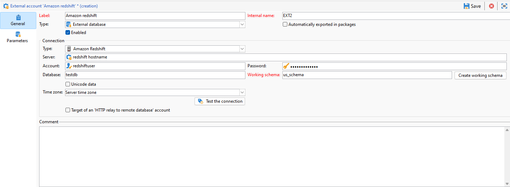

# Configuración del acceso a Amazon Redshift {#configure-access-to-redshift}

Uso de Campaign **Acceso de datos federado** (FDA) para procesar información almacenada en bases de datos externas. Siga los pasos a continuación para configurar el acceso a Amazon Redshift.

1. Configurar [Base de datos Amazon Redshift](#configuring-redshift)
1. Configuración de Amazon Redshift [cuenta externa](#redshift-external) en Campaign

## Amazon Redshift en Linux {#redshift-linux}

Para configurar [!DNL Amazon Redshift] En Linux, siga los pasos a continuación:

1. Antes de la instalación de ODBC, compruebe que los siguientes paquetes estén instalados en la distribución Linux:

   * Para Red Hat/CentOS:

     ```
      yum update
      yum upgrade
      yum install -y grep sed tar wget perl curl
     ```

   * Para Debian:

     ```
      apt-get update
      apt-get upgrade
      apt-get install -y grep sed tar wget perl curl
     ```

1. Antes de ejecutar la secuencia de comandos, puede tener acceso a más información con el `--help` opción:

   ```
   cd /usr/local/neolane/nl6/bin/fda-setup-scripts/
   ./redshift_odbc-setup.sh --help
   ```

1. Acceda al directorio en el que se encuentra la secuencia de comandos y ejecute la siguiente secuencia de comandos como usuario raíz:

   ```
     cd /usr/local/neolane/nl6/bin/fda-setup-scripts
     ./redshift_odbc-setup.sh
   ```

1. Después de instalar los controladores ODBC, debe reiniciar el Campaign Classic. Para ello, ejecute el siguiente comando:

   ```
   systemctl stop nlserver.service
   systemctl start nlserver.service
   ```

1. En Campaign, puede configurar la [!DNL Amazon Redshift] cuenta externa. Para obtener más información sobre cómo configurar la cuenta externa, consulte [esta sección](#redshift-external).

## Cuenta externa Amazon Redshift {#redshift-external}

El [!DNL Amazon Redshift] Una cuenta externa permite conectar la instancia de Campaign a la base de datos externa Amazon Redshift.

1. En Campaign Classic, configure la cuenta externa [!DNL Amazon Redshift]. En **[!UICONTROL Explorer]**, haga clic en **[!UICONTROL Administration]** / **[!UICONTROL Platform]** / **[!UICONTROL External accounts]**.

1. Haga clic **[!UICONTROL New]**.

1. Seleccione **[!UICONTROL External database]** como **[!UICONTROL Type]** de su cuenta externa.

1. Configure la cuenta externa **[!UICONTROL Amazon Redshift]**. Debe especificar:

   * **[!UICONTROL Type]**: Amazon Redshift

   * **[!UICONTROL Server]**: Nombre del DNS

   * **[!UICONTROL Account]**: Nombre del usuario

   * **[!UICONTROL Password]**: Contraseña de la cuenta de usuario

   * **[!UICONTROL Database]**: Nombre de la base de datos si no se especifica en DSN. Se puede dejar vacío si se especifica en el DSN

   * **[!UICONTROL Working schema]**: Nombre del esquema de trabajo. [Más información](https://docs.aws.amazon.com/redshift/latest/dg/r_Schemas_and_tables.html)

   * **[!UICONTROL Time zone]**: Zona horaria del servidor

   

1. Haga clic en **[!UICONTROL Save]**.
