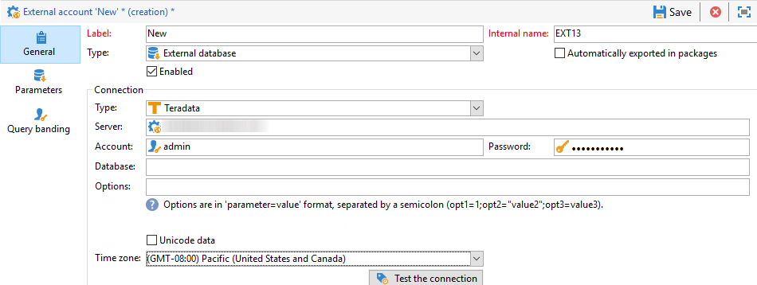

# Configuración del acceso a Teradata {#configure-access-to-teradata}

Utilice la opción [Federated Data Access](../../installation/using/about-fda.md) (FDA) de Campaign para procesar la información almacenada en una base de datos externa. Siga los pasos a continuación para configurar el acceso al Teradata.

1. Instale y configure [controladores de Teradata](#teradata-config)
1. Configuración de la [cuenta externa](#teradata-external) del Teradata en Campaign
1. Configure [configuración adicional](#teradata-additional-configurations) para el Teradata y el servidor de Campaign

## Configuración de teradata {#teradata-config}

Debe instalar controladores para que el Teradata tenga implementada la conexión con Campaign.

1. Instale [el controlador ODBC para Teradata](https://downloads.teradata.com/download/connectivity/odbc-driver/linux).

   Se compone de tres paquetes que pueden instalarse en Red Hat (o CentOS)/Suse en el siguiente orden:

   * TeraGSS
   * tdicu1510 (instálelo con setup_wrapper.sh)
   * tdodbc1510 (install it using setup_wrapper.sh)

1. Configure el controlador ODBC. La configuración se puede realizar en los archivos estándar: **/etc/odbc.ini** para obtener parámetros generales y /etc/odbcinst.ini para declarar controladores:

   * **/etc/odbc.ini**

      ```
      [ODBC]
      InstallDir=/etc/
      ```

      &quot;InstallDir&quot; corresponde a la ubicación del archivo **odbcinst.ini**.

   * **/etc/odbcinst.ini**

      ```
      [ODBC DRIVERS]
      teradata=Installed
      
      [teradata]
      Driver=/opt/teradata/client/15.10/lib64/tdata.so
      APILevel=CORE
      ConnectFunctions=YYY
      DriverODBCVer=3.51
      SQLLevel=1
      ```

1. Especifique las variables de entorno del servidor de Adobe Campaign:

   * **LD_LIBRARY_PATH**: /opt/teradata/client/15.10/lib64 and /opt/teradata/client/15.10/odbc_64/lib.
   * **ODBCINI**: ubicación del archivo odbc.ini (por ejemplo, /etc/odbc.ini).
   * **NLSPATH: ubicación del archivo opermsgs.cat (/opt/teradata/client/15.10/msg/opermsgs.cat)**

>[!NOTE]
>
>La conexión a una base de datos externa de Teradata en FDA requiere pasos de configuración adicionales en el servidor Adobe Campaign. [Más información](#teradata-additional-configurations).


## Cuenta externa Teradata{#teradata-external}

La cuenta externa Teradata permite conectar la instancia de Campaign a la base de datos externa Teradata.

1. En Campaña **[!UICONTROL Explorer]**, haga clic en **[!UICONTROL Administration]** / **[!UICONTROL Platform]** / **[!UICONTROL External accounts]**.

1. Haga clic en **[!UICONTROL New]** y seleccione **[!UICONTROL External database]** como **[!UICONTROL Type]**.

   

1. Para configurar la cuenta externa **[!UICONTROL Teradata]**, debe especificar:

   * **[!UICONTROL Type]**: Elija el  **[!UICONTROL Teradata]** tipo .

   * **[!UICONTROL Server]**: URL o nombre del servidor Teradata

   * **[!UICONTROL Account]**: Nombre de la cuenta utilizada para acceder a la base de datos Teradata

   * **[!UICONTROL Password]**: Contraseña utilizada para conectarse a la base de datos Teradata

   * **[!UICONTROL Database]**: Nombre de la base de datos (opcional)

   * **[!UICONTROL Options]**: Opciones que pasan por Teradata. Utilice el siguiente formato: &#39;parameter=value&#39;. Utilice una semicolumna como separador entre valores.

   * **[!UICONTROL Timezone]**: Zona horaria definida en Teradata. [Obtenga más información](#timezone)

### Banda de consultas

Cuando varios usuarios de Adobe Campaign se conectan con la misma cuenta externa de Teradata FDA, la pestaña **[!UICONTROL Query banding]** permite establecer una banda de consulta, es decir, un conjunto de pares de claves o valores en una sesión.


Cuando se configura esta opción, cada vez que un usuario de Campaign realiza una consulta en la base de datos de Teradata, Adobe Campaign envía metadatos que consisten en una lista de claves asociada a este usuario. Los administradores de Teradata pueden utilizar estos datos para fines de auditoría o para administrar los derechos de acceso.

>[!NOTE]
>
>Para obtener más información sobre **[!UICONTROL Query banding]**, consulte la [Documentación oficial de Teradata](https://docs.teradata.com/reader/cY5B~oeEUFWjgN2kBnH3Vw/a5G1iz~ve68yTMa24kVjVw).

Para configurar la banda de Consulta, siga los pasos a continuación:

1. Utilice la **[!UICONTROL Default]** para introducir una banda de consulta predeterminada que se utilizará si un usuario no tiene ninguna banda de consulta asociada. Si este campo se deja vacío, los usuarios sin banda de consulta no podrán utilizar Teradata.

1. Utilice el campo **[!UICONTROL Users]** para especificar una banda de consulta para cada usuario. Puede agregar todos los pares clave/valor que necesite, por ejemplo, priority=1;workload=high. Si el usuario no tiene ninguna banda de consulta asignada, se aplica el campo **[!UICONTROL Default]**.

1. Marque la casilla **[!UICONTROL Active]** para activar esta función.

#### Solución de problemas de cuentas externas {#external-account-troubleshooting}

Si aparece el siguiente error al probar la conexión **TIM-030008 Date &#39;2&#39;: missing character(s) (iRc=-53)** asegúrese de que el controlador ODBC esté correctamente instalado y de que LD_LIBRARY_PATH (Linux)/PATH (Windows) está configurado para el servidor de Campaign.

Error de ODBC **ODB-240000: [no se encontró el nombre del origen de datos de Microsoft][ODBC Driver Manager] y no se especificó ningún controlador predeterminado.** se produce con Windows si se utiliza un controlador 16.X. Adobe Campaign espera que el nombre de Teradata sea &#39;{teradata}&#39; en odbcinst.ini.

* A partir de Campaign 18.10, puede añadir ODBCDriverName=&quot;Teradata Database ODBC Driver 16.10&quot; en las opciones de la cuenta externa. El número de versión puede cambiar, y se puede encontrar el nombre exacto ejecutando odbcad32.exe y accediendo a la pestaña Controladores.

* Si utiliza una versión anterior de Campaign, deberá copiar la sección de Teradata de odbcinst.ini creada por la instalación del controlador en una nueva sección denominada Teradata. Regedit se puede utilizar en este caso. Si la base está en latin1, tendrá que agregar **APICharSize=1** en las opciones.

## Configuraciones adicionales {#teradata-additional-configurations}

<!--
### Compatibility {#teradata-compatibility}

**Based in Unicode**

| Database version | Driver version |  Minimal Campaign version required |  Note |
|:-:|:-:|:-:|:-:|
| 15  |  15 |  Campaign Classic 17.9 | Under Linux: Queries with timestamp may fail (fixed in build 8937 for 18.4 and 8977 for 18.10) In debug mode, warnings relative to bad memory usage in the driver may occur. |
| 15  | 16  | Campaign Classic 17.9  | Recommended setup for a Teradata 15 database under Linux.  |
|  16 | 16  | Campaign Classic 18.10 |  Unicode characters with surrogate pairs are not fully handled. Using surrogate characters in data should work. Using surrogates in a filtering condition of a query will not work without this change. |
| 16  |  15 |  Campaign Classic 19.0 |  &nbsp; |

**Based in Latin1**

Versions previous to Adobe Campaign Classic 17.9 only supported Teradata Latin-1 database.

Starting from Adobe Campaign Classic 17.9, we now support by default Teradata database in Unicode.

Customers with a Latin-1 Teradata database migrating to a recent Campaign Classic release will have to add the parameter APICharSize=1 in the options of the external account.
-->

### Configuración del usuario {#user-configuration}

Se requieren los siguientes derechos en la base de datos externa: cree, suelte o ejecute procedimientos personalizados, cree, suelte, inserte o seleccione tablas. También es posible que tenga que crear funciones de modo de usuario si desea utilizar las funciones md5 y sha2 en la instancia de Adobe Campaign.

Asegúrese de configurar la zona horaria específica. Debe coincidir con el que se establecerá en la cuenta externa creada en la instancia de Adobe Campaign.

Adobe Campaign no establecerá ningún modo de protección (reserva) en los objetos que creará en la base de datos. Es posible que tenga que establecer un valor predeterminado en el usuario que Adobe Campaign utilizará para conectarse a la base de datos de Teradata mediante la siguiente consulta:

| Disable default fallback |
| :-: |
| ```MODIFY USER $login$ AS NO FALLBACK;``` |

### Instalación de MD5 {#md5-installation}

Si desea utilizar funciones md5 en la instancia de Adobe Campaign, deberá instalar la función de modo usuario en la base de datos de Teradata desde esta [página](https://downloads.teradata.com/download/extensibility/md5-message-digest-udf) (md5_20080530.zip).

El sha1 del archivo descargado es el siguiente: 65cc0bb6935f72fcd84fef1ebcd64c00115dfd1e.

Para instalar MD5:

1. Descomprima el archivo md5_20080530.zip.

1. Vaya al directorio md5/src.

1. Conéctese a la base de datos de Teradata mediante bteq.

1. Ejecute el siguiente comando bteq:

   ```
   .run file = hash_md5.btq
   ```

### Instalación de SHA2 {#sha2-installation}

Si desea utilizar funciones sha2 en la instancia de Adobe Campaign, deberá instalar la función de modo usuario en la base de datos de Teradata desde esta [página](https://github.com/akuroda/teradata-udf-sha2/archive/v1.0.zip) (teradata-udf-sha2-1.0.zip).

El sha1 del archivo descargado es el siguiente e87438d37424836358bd3902cf1adeb629349780.

Para instalar sha2:

1. Descomprima el archivo teradata-udf-sha2-1.0.zip.

1. Vaya al directorio teradata-udf-sha2-1.0/src.

1. Conéctese a la base de datos de Teradata mediante bteq.

1. Ejecute estos dos comandos bteq:

   ```
   .run file = hash_sha256.sql
   .run file = hash_sha512.sql
   ```

### Instalación de UDF_UTF16TO8 {#UDF-UTF16TO8-installation}

Si desea utilizar las funciones udf_utf16to8 en la instancia de Adobe Campaign, deberá instalar la función de modo de usuario en la base de datos de Teradata desde el kit **de herramientas Unicode** de Teradata en esta [página](https://downloads.teradata.com/download/tools/unicode-tool-kit) (utk_release1.7.0.0.zip).

El sha1 del archivo descargado es el siguiente e58235f434f52c71316a577cb48e20b97d24f470.

Para instalar udf_utf16to8:

1. Descomprima el archivo utk_release1.7.0.0.zip.

1. Busque udf_utf16to8.o en los archivos extraídos y vaya al directorio que contiene el archivo. Debe solicitarse utk_release1.7.0.0/utk_release1.7.0.0/04 TranslationUDFs/01 Teradata UDFs/suselinux-x8664/udf_installation/.

1. Conéctese a la base de datos de Teradata mediante bteq.

1. Escriba el siguiente comando bteq:

   ```
   REPLACE FUNCTION udf_utf16to8 (
   inputString VARCHAR(8000) CHARACTER SET UNICODE
   ) RETURNS VARCHAR(16000) CHARACTER SET LATIN
   LANGUAGE C
   NO SQL
   EXTERNAL NAME 'CO!i18n103!udf_utf16to8.o!F!udf_utf16to8'
   PARAMETER STYLE SQL;
   
   -- Test: should return 410042
   SELECT CAST(Char2HexInt(UDF_UTF16to8(_UNICODE'004100000042'XC)) AS VARCHAR(100));
   ```

## Configuración del servidor de Campaign para Linux {#campaign-server-linux}

Se requiere lo siguiente para la instalación del controlador:

* Controlador ODBC Teradata, que se puede encontrar en esta [página](https://downloads.teradata.com/download/connectivity/odbc-driver/linux)

* Herramientas y utilidades de Teradata (utilizadas para la carga masiva), que se pueden encontrar en esta [página](https://downloads.teradata.com/download/tools/teradata-tools-and-utilities-linux-installation-package-0)

Nombres de archivos y sha1:

* tdodbc1620__linux_indep.16.20.00.00-1.tar.gz 121fdd978b56fe1304fc5cb7819741b0847f44fd

* TeradataToolsAndUtilitiesBase__linux_indep.16.20.01.00.tar.gz b 29d0af5ffd8dcf68a9dbbaa6f8639387b19c563

Si no hay ningún paquete para su distribución Linux, puede instalarlos según se explica en CentOS 7 (por ejemplo, usando docker) y luego copiar el contenido de /opt/teradata en su servidor de Adobe Campaign.

### Instalación del controlador ODBC {#odbc-installation}

Para instalar el controlador ODBC:

1. Extraiga el archivo tdodbc1620__linux_indep.16.20.00.00-1.tar.gz.

1. Vaya al directorio tdodbc1620.

1. Es posible que tenga que corregir la secuencia de comandos de configuración:

   ```
   "sed -i s/16.10/16.20/ setup_wrapper.sh".
   ```

1. Ejecute setup_wrapper.sh.

### Instalación de herramientas y utilidades de Teradata {#teradata-tools-installation}

Para instalar las herramientas:

1. Extraiga el archivo TeradataToolsAndUtilitiesBase__linux_indep.16.20.01.00.tar.gz.

1. Vaya al directorio TeradataToolsAndUtilitiesBase/Linux/i386-x8664/tdicu.

1. Ejecute setup_wrapper.sh.

1. Vaya al directorio TeradataToolsAndUtilitiesBase/Linux/i386-x8664/cliv2.

1. Ejecute setup_wrapper.sh.

1. Vaya al directorio TeradataToolsAndUtilitiesBase/Linux/i386-x8664/tptbase.

1. Ejecute setup_wrapper.sh.

1. Debe haber un archivo libtelapi.so disponible en /opt/teradata/client/16.20/lib64.

## Configuración del servidor de Campaign para Windows {#campaign-server-windows}

Primero debe descargar las herramientas y utilidades de Teradata para Windows. Puede descargarlas desde esta [página](https://downloads.teradata.com/download/tools/teradata-tools-and-utilities-windows-installation-package)

Asegúrese de instalar el controlador ODBC y la base del transportador paralelo de Teradata. Instalará telapi.dll, que se utiliza para realizar cargas masivas en la base de datos de Teradata.

Asegúrese de que la ruta del controlador y las utilidades se encuentra en la variable PATH de nlserver durante la ejecución. De forma predeterminada, la ruta es C:\Program Files (x86)\Teradata\Client\15.10\bin para Windows de 32 bits o C:\Programa Files\Teradata\Client\15.10\bin para 64 bits.

## Zona horaria {#timezone}

Teradata utiliza nombres de la zona horaria que no son estándar y puede encontrar la lista en el sitio [Teradata](https://docs.teradata.com/reader/rgAb27O_xRmMVc_aQq2VGw/oGKvgl7gCeBMTGrp59BnwA). Adobe Campaign intentará convertir la zona horaria proporcionada en la configuración externa a algo que Teradata entienda. Si no se encuentra ninguna correspondencia, se encontrará la zona horaria GMT+X (o GMT-X) más cercana para la sesión, con una advertencia en el registro.

La conversión se realiza leyendo un archivo llamado teradata_timezones.txt que debe estar en el siguiente directorio de datos: /usr/local/neolane/nl6/datakit en Linux. Si edita este archivo, asegúrese de ponerse en contacto con el equipo de Adobe Campaign para realizar el cambio en el código fuente. De lo contrario, este archivo se sobrescribirá durante la próxima actualización de Campaign.

La zona horaria usada para conectarse se indicará cuando se ejecuta nlserver con el conmutador -verbose, por ejemplo:

```
15:04:04 >   ODB-240007 Teradata: will use 'Europe Central' as session time zone.
```

Si la zona horaria utilizada no es la correcta, se puede agregar una opción denominada &quot;TimeZoneName&quot; en la cuenta externa. En ese caso, utilice el valor Teradata, por ejemplo &quot;TimeZoneName=Europe Central&quot;.

Cuando se utiliza carga masiva o &quot;carga rápida&quot; en documentos Teradata, Campaign no puede indicar la zona horaria. Por lo tanto, se recomienda establecer la zona horaria predeterminada del usuario que la Campaign utilizará para conectarse:

```
MODIFY USER $login$ AS TIME ZONE = 'Europe Central';
```
