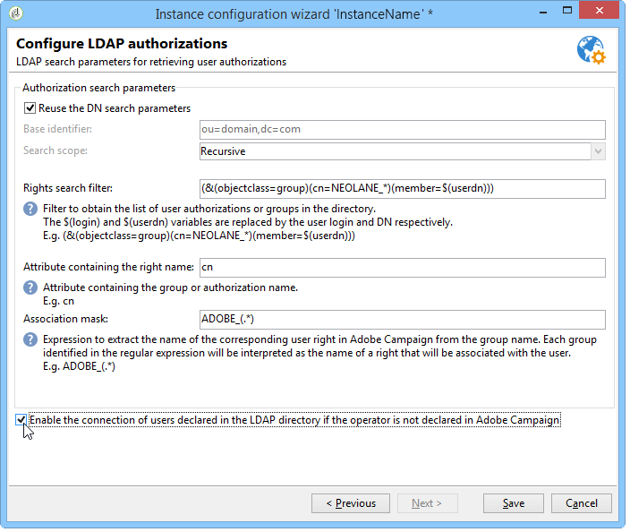

# Conexión mediante LDAP{#connecting-through-ldap}

## Configuración de Campaign y LDAP {#configuring-campaign-and-ldap}

>[!NOTE]
>
>La configuración LDAP solo es posible para instalaciones locales o híbridas.

La configuración LDAP se realiza en el asistente de implementación. La opción **[!UICONTROL LDAP integration]** debe estar seleccionada durante el primer paso de configuración. Consulte [Asistente de implementación](../../installation/using/deploying-an-instance.md#deployment-wizard).

La ventana permite configurar la identificación de los usuarios de Adobe Campaign a través del directorio LDAP especificado.

* Especifique la dirección del servidor LDAP en el campo **[!UICONTROL LDAP server]**. Puede agregar el número de puerto. De forma predeterminada, el puerto utilizado es 389.
* En la lista desplegable, seleccione el método de autenticación para los usuarios:

   * Contraseña cifrada (**md5**)

      Modo predeterminado.

   * Contraseña de texto sin formato + SSL (**TLS**)

      Se cifra todo el procedimiento de autenticación (contraseña incluida). El puerto seguro 636 no debe usarse en este modo: Adobe Campaign cambia automáticamente al modo seguro.

      Cuando utiliza este modo de autenticación, en Linux, el certificado se verifica mediante una biblioteca de cliente openLDAP. Se recomienda utilizar un certificado SSL válido para que el procedimiento de autenticación esté cifrado. De lo contrario, la información estará en texto sin formato.

      El certificado también se verifica en Windows.

   * Administrador de LAN de Windows NT (**NTLM**)

      Autenticación privada de Windows. El **[!UICONTROL Unique identifier]** solo se usa para el nombre de dominio.

   * Autenticación de contraseña distribuida (**DPA**)

      Autenticación privada de Windows. El **[!UICONTROL Unique identifier]** se utiliza solo para el nombre de dominio (domain.com).

   * Contraseña de texto sin formato

      No hay cifrado (solo para su uso en fases de prueba).

* Seleccione el modo de autenticación de usuario: **[!UICONTROL Automatically compute the unique user identifier]** (consulte el paso [Cálculo del nombre distinguido](#distinguished-name-calculation)) o **[!UICONTROL Search the unique user identifier in the directory]** (consulte el paso [Búsqueda de identificadores](#searching-for-identifiers)).

## Compatibilidad {#compatibility}

Los sistemas compatibles dependen del mecanismo de autenticación seleccionado. A continuación se muestra una matriz de compatibilidad de sistemas operativos y servidores LDAP.

<table> 
 <thead> 
  <tr> 
   <th> </th> 
   <th> OpenLDAP  </th> 
   <th> Active Directory  </th> 
  </tr> 
 </thead> 
 <tbody> 
  <tr> 
   <td> md5  </td> 
   <td> Windows, Linux  </td> 
   <td> Linux  </td> 
  </tr> 
  <tr> 
   <td> TLS  </td> 
   <td> Linux  </td> 
   <td> Windows, Linux  </td> 
  </tr> 
  <tr> 
   <td> NTLM y DPA  </td> 
   <td> </td> 
   <td> Windows  </td> 
  </tr> 
  <tr> 
   <td> texto sin formato  </td> 
   <td> Windows, Linux  </td> 
   <td> Windows, Linux  </td> 
  </tr> 
 </tbody> 
</table>

## Cálculo de nombre distintivo {#distinguished-name-calculation}

Si desea calcular los identificadores de Nombre distinguido (DN), el siguiente paso del asistente de implementación le permite configurar el modo de cálculo.

* Especifique el identificador único del usuario en el directorio (Nombre distinguido - DN) en el campo **[!UICONTROL Distinguished Name]**.

   **[!UICONTROL (login)]** se reemplaza con el identificador del operador de Adobe Campaign.

   >[!CAUTION]
   >
   >La configuración **[!UICONTROL dc]** debe estar en minúsculas.

* Seleccione la opción **[!UICONTROL Enable synchronization of user rights from authorizations and groups in the directory]** para sincronizar las asociaciones de grupos y usuarios en el directorio LDAP y las asociaciones de grupos y usuarios en Adobe Campaign.

   Cuando selecciona esta opción, **[!UICONTROL Application level DN used for the search]** y **[!UICONTROL Password of the application login]** están activados.

   Si rellena estos dos campos, Adobe Campaign se conectará al servidor LDAP con su propio inicio de sesión y contraseña. Si están vacías, Adobe Campaign se conectará al servidor de forma anónima.

## Búsqueda de identificadores {#searching-for-identifiers}

Si elige buscar un identificador, el asistente de implementación le permite configurar la búsqueda.

* En los campos **[!UICONTROL Application level DN used for the search]** y **[!UICONTROL Password of the application login]** , proporcione el identificador y la contraseña con los que se conectará Adobe Campaign para buscar el identificador. Si están vacías, Adobe Campaign se conectará al servidor de forma anónima.
* Especifique los campos **[!UICONTROL Base identifier]** y **[!UICONTROL Search scope]** para determinar un subconjunto del directorio LDAP desde el que iniciar la búsqueda.

   Seleccione el modo requerido en la lista desplegable:

   

   1. **[!UICONTROL Recursive (default mode)]**.

      El directorio LDAP se busca en su totalidad, empezando desde un nivel determinado.

   1. **[!UICONTROL Limited to the base]**.

      Todos los atributos se incluyen en la búsqueda.

   1. **[!UICONTROL Limited to the first sub-level of the base]**.

      La búsqueda se realiza en todos los atributos del directorio y a partir del primer nivel del atributo.

* El campo **[!UICONTROL Filter]** permite especificar un elemento para restringir el ámbito de la búsqueda.

## Configuración de autorizaciones LDAP {#configuring-ldap-authorizations}

Esta ventana se muestra al seleccionar la opción **[!UICONTROL Enable synchronization of user rights from authorizations and groups in the directory]**.

Debe especificar varios parámetros para encontrar el grupo o los grupos a los que pertenece el usuario y sus derechos correspondientes, por ejemplo:

* el campo **[!UICONTROL Database identifier]**,
* el campo **[!UICONTROL Search scope]**,

   >[!NOTE]
   >
   >Si ha elegido buscar el DN, puede seleccionar **[!UICONTROL Reuse the DN search parameters]** para transferir los valores seleccionados para el DN y el ámbito de búsqueda de la pantalla anterior.

* el campo **[!UICONTROL Rights search filter]**, en función del inicio de sesión y del nombre de reconocimiento del usuario,
* el campo **[!UICONTROL Attribute containing the group or authorization name]** relativo al usuario,
* el campo **[!UICONTROL Association mask]** que permite la extracción del nombre del grupo en Adobe Campaign y sus derechos asociados. Puede utilizar expresiones regulares para buscar el nombre.
* Seleccione **[!UICONTROL Enable the connection of users declared in the LDAP directory if the operator is not declared in Adobe Campaign]** para que al usuario se le concedan automáticamente derechos de acceso en la conexión.

Haga clic en **[!UICONTROL Save]** para finalizar la configuración de la instancia.

## Administración de operadores {#managing-operators}

Una vez confirmada la configuración, debe definir qué operadores de Adobe Campaign se administran mediante el directorio LDAP.

Para utilizar el directorio LDAP para autenticar un operador, edite el perfil correspondiente y haga clic en el enlace **[!UICONTROL Edit the access parameters]**. Seleccione la opción **[!UICONTROL Use LDAP for authentication]**: El campo **[!UICONTROL Password]** aparece atenuado para este operador.

## Casos de uso {#use-cases}

Esta sección proporciona algunos casos de uso sencillos para ayudarle a lograr las configuraciones más adecuadas según sus necesidades.

1. Se ha creado un usuario en el directorio LDAP, pero no en Adobe Campaign.

   Adobe Campaign se puede configurar para que el usuario acceda a la plataforma mediante su autenticación LDAP. Adobe Campaign debe poder controlar la validez de la combinación de ID y contraseña en el directorio LDAP, de modo que el operador se pueda crear sobre la marcha en Adobe Campaign. Para ello, marque la opción **[!UICONTROL Enable the connection of users declared in the LDAP directory if the operator is not declared in Adobe Campaign]**. En este caso, también es necesario configurar la sincronización de grupos: la opción **[!UICONTROL Enable synchronization of user rights from authorizations and groups in the directory]** debe estar seleccionada.

1. El usuario se ha creado en Adobe Campaign pero no en el directorio LDAP.

   No podrán iniciar sesión en Adobe Campaign.

1. Hay un grupo en el directorio LDAP que no existe en Adobe Campaign.

   Este grupo no se creará en Adobe Campaign. Debe crear el grupo y sincronizar los grupos para habilitar una coincidencia mediante la opción **[!UICONTROL Enable synchronization of user rights from authorizations and groups in the directory]**.

1. Los grupos existen en Adobe Campaign y el directorio LDAP se activa después del evento: los grupos de usuarios en Adobe Campaign no se sustituyen automáticamente por el contenido de los grupos LDAP. Del mismo modo, si un grupo solo existe en Adobe Campaign, no se puede añadir ningún usuario LDAP hasta que el grupo se haya creado y sincronizado en LDAP.

   Los grupos nunca se crean sobre la marcha, ya sea por Adobe Campaign o por LDAP. Deben crearse individualmente, tanto en Adobe Campaign como en el directorio LDAP.

   Los nombres de los grupos en el directorio LDAP deben coincidir con los nombres de los grupos de Adobe Campaign. Su máscara de asociación se define en el último paso de configuración del asistente de implementación: Adobe Campaign_(.*), por ejemplo.
