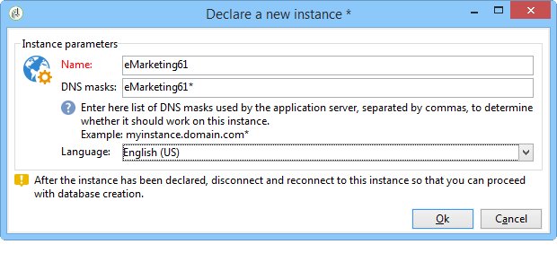

# Creación de una instancia e inicio de sesión{#creating-an-instance-and-logging-on}

Para crear una nueva instancia y una base de datos de Adobe Campaign, siga el siguiente proceso:

1. Cree la conexión.
1. Inicie sesión para crear la instancia relacionada.
1. Creación y configuración de la base de datos.

>[!NOTE]
>
>Solo el identificador **internal** puede realizar estas operaciones. Para obtener más información, consulte [esta sección](../../installation/using/configuring-campaign-server.md#internal-identifier).

Cuando se inicia la consola de Adobe Campaign, se accede a una página de inicio de sesión.

Para crear una nueva instancia, siga los pasos a continuación:

1. Haga clic en el vínculo en la esquina superior derecha de los campos de credenciales para acceder a la ventana de configuración de conexión. Este vínculo puede ser **[!UICONTROL New...]** o un nombre de instancia existente.

   

1. Haga clic en **[!UICONTROL Add > Connection]** e introduzca la etiqueta y la dirección URL del servidor de aplicaciones de Adobe Campaign.

   

1. Especifique una conexión con el servidor de aplicaciones de Adobe Campaign a través de una URL. Utilice un DNS o un alias del equipo o su dirección IP.

   Por ejemplo, puede utilizar la dirección URL de tipo [`https://<machine>.<domain>.com`](https://myserver.adobe.com) .

   >[!CAUTION]
   >
   >Para la dirección URL de conexión, utilice solamente los caracteres siguientes: `[a-z]`, `[A-Z]`, `[0-9]` y guiones (-) o paradas completas.

1. Haga clic en **[!UICONTROL Ok]** para confirmar la configuración: ahora puede empezar con el proceso de creación de instancias.
1. En la ventana **[!UICONTROL Connection settings]** , introduzca el inicio de sesión **internal** y su contraseña para conectarse al servidor de aplicaciones de Adobe Campaign. Una vez conectado, puede acceder al asistente de creación de instancias para declarar una nueva instancia
1. En el campo **[!UICONTROL Name]**, introduzca el **nombre de instancia**. Como este nombre se utiliza para generar un archivo de configuración **config-`<instance>`.xml** y se utiliza en los parámetros de línea de comandos para identificar la instancia, asegúrese de elegir un nombre corto sin caracteres especiales. Por ejemplo: **eMarketing**.

   

   El nombre de la instancia añadida al nombre de dominio no debe superar los 40 caracteres. Esto permite restringir el tamaño de los encabezados &quot;Message-ID&quot; e impide que los mensajes se consideren correo no deseado, especialmente mediante herramientas como SpamAssassin.

1. En los campos **[!UICONTROL DNS masks]**, introduzca la **lista de máscaras DNS** a la que debe adjuntarse la instancia. El servidor de Adobe Campaign utiliza el nombre de host que aparece en las solicitudes HTTP para determinar a qué instancia llegar.

   El nombre de host está contenido entre la cadena **https://** y el primer carácter de barra diagonal **/** de la dirección del servidor.

   Puede definir una lista de valores separados por comas.

   El ? Los caracteres y * pueden utilizarse como comodines para reemplazar uno o varios caracteres (DNS, puerto, etc.). Por ejemplo, el valor **demo*** funcionará con &quot;https://demo&quot;, como sucederá con &quot;https://demo:8080&quot; e incluso con &quot;https://demo2&quot;.

   Los nombres utilizados deben definirse en el DNS. También puede informar de la correspondencia entre un nombre DNS y una dirección IP en el archivo **c:/windows/system32/drivers/etc/hosts** en Windows y en el archivo **/etc/hosts** en Linux. Por lo tanto, debe modificar la configuración de conexión para utilizar este nombre DNS para conectarse a la instancia elegida.

   El servidor debe identificarse con este nombre, especialmente para cargar imágenes en correos electrónicos.

   Además, el servidor debe poder conectarse a sí mismo por este nombre y, si es posible, por una dirección de bucle de retorno (127.0.0.1), especialmente para permitir que los informes se exporten en formato PDF.

1. En la lista desplegable **[!UICONTROL Language]**, seleccione el **idioma de instancia**: inglés (EE. UU.), inglés (Reino Unido), francés o japonés.

   Las diferencias entre el inglés de EE. UU. y el inglés de Reino Unido se describen en [esta sección](../../platform/using/adobe-campaign-workspace.md#date-and-time).

   >[!CAUTION]
   >
   >El idioma de la instancia no se puede modificar después de este paso. Las instancias de Adobe Campaign no son multilingües: no puede cambiar la interfaz de un idioma a otro.

1. Haga clic en **[!UICONTROL Ok]** para confirmar la declaración de la instancia. Cierre la sesión y vuelva a iniciarla para declarar la base de datos.

   >[!NOTE]
   >
   >La instancia se puede crear desde la línea de comandos. Para obtener más información, consulte [Líneas de comandos](../../installation/using/command-lines.md).
