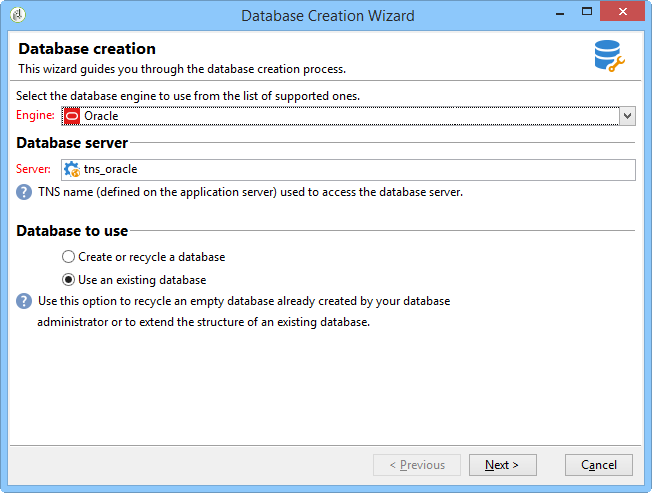
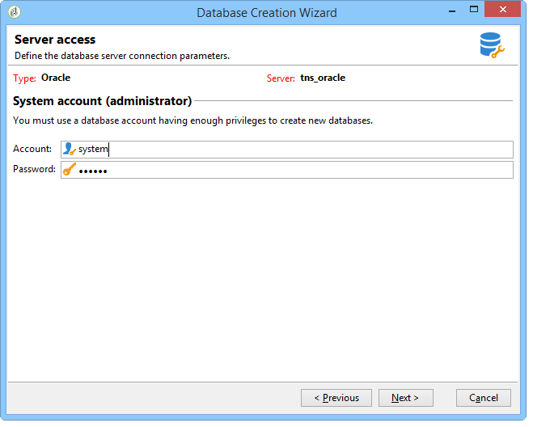
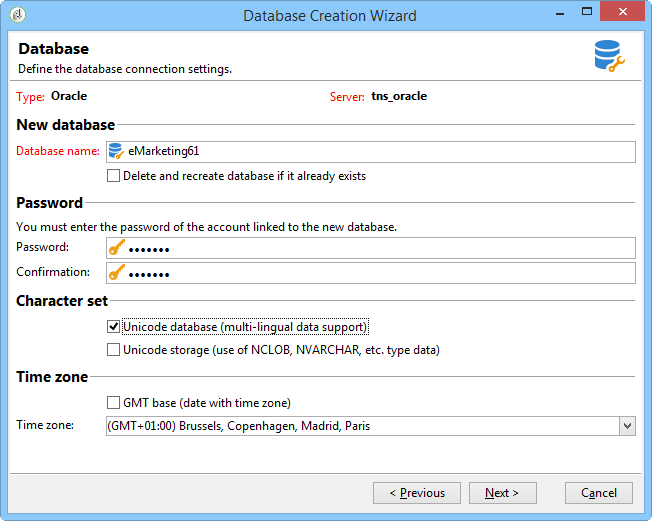
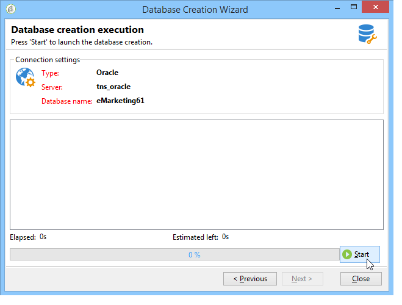

# Creación y configuración de la base de datos{#creating-and-configuring-the-database}

Al crear una base de datos, Adobe Campaign ofrece dos opciones diferentes:

1. Creación o reciclado de una base de datos: elija esta opción si desea crear una nueva base de datos o reutilizar una existente. Consulte [Caso 1: Creación/reciclado de una base de datos](#case-1--creating-recycling-a-database).
1. Uso de una base de datos existente: elija esta opción si el administrador ya ha creado una base de datos vacía y desea utilizarla; o ampliar la estructura de una base de datos existente. Consulte [Caso 2: Uso de una base de datos existente](#case-2--using-an-existing-database).

Los pasos de configuración se detallan a continuación.

>[!CAUTION]
>
>Los nombres de bases de datos, usuarios y esquemas no deben comenzar con un número ni incluir caracteres especiales.
>
>Solo el identificador **internal** puede realizar estas operaciones. Para obtener más información, consulte [esta sección](../../installation/using/configuring-campaign-server.md#internal-identifier).

## Caso 1: Creación/reciclado de una base de datos {#case-1--creating-recycling-a-database}

A continuación se presentan los pasos para crear una base de datos o reciclar una base existente. Algunas configuraciones dependen del motor de base de datos utilizado:

Se trata de los siguientes pasos:

* [Paso 1: Selección del motor](#step-1---selecting-the-database-engine) de base de datos,
* [Paso 2: Conexión al servidor](#step-2---connecting-to-the-server),
* [Paso 3: Conexión y características de la base de datos](#step-3---connection-and-characteristics-of-the-database),
* [Paso 4: Paquetes para instalar](#step-4---packages-to-install),
* [Paso 5: Pasos](#step-5---creation-steps) de creación,
* [Paso 6: Creación de la base de datos](#step-6---creating-the-database).

### Paso 1: Selección del motor de base de datos {#step-1---selecting-the-database-engine}

Seleccione el motor de base de datos entre los de la lista desplegable.


Las bases de datos compatibles se enumeran en la [Matriz de compatibilidad](../../rn/using/compatibility-matrix.md) de Campaign.

Identifique el servidor y elija el tipo de operación que desea realizar. En este caso, **[!UICONTROL Create or recycle a database]**.



Según el motor de base de datos seleccionado, la información de identificación del servidor puede variar.

* Para un motor **Oracle**, rellene el **nombre TNS** definido para el servidor de aplicaciones.
* Para un motor **PostgreSQL** o **DB2**, debe especificar el nombre DNS (o la dirección IP) definido en el servidor de aplicaciones para acceder al servidor de bases de datos.
* Para un motor **Microsoft SQL Server**, debe definir: el nombre DNS (o dirección IP) definido en el servidor de aplicaciones para acceder al servidor de base de datos: **DNS** o **DNS`\<instance>`** (modo de instancia),

   >[!CAUTION]
   >
   > A partir de la versión 20.3, la autenticación de Windows NT se retirará del mercado. **[!UICONTROL SQL Server authentication]** es ahora el único modo de autenticación disponible para Microsoft SQL Server. [Más información](../../rn/using/deprecated-features.md)

   

### Paso 2: Conexión al servidor {#step-2---connecting-to-the-server}

En la ventana **[!UICONTROL Server access]**, defina el acceso al servidor de la base de datos.



Para ello, introduzca el nombre y la contraseña de una **Administration system account** que tenga permiso para acceder a las bases de datos, es decir:

* **** para una base de datos de Oracle,
* **** para una base de datos de Microsoft SQL Server,
* **** postgress para una base de datos PostgreSQL,
* **db2inst1** para una base de datos DB2.

### Paso 3: Conexión y características de la base de datos {#step-3---connection-and-characteristics-of-the-database}

El siguiente paso permite configurar los parámetros para iniciar sesión en la base de datos.



Debe definir la siguiente configuración:

* Especifique el nombre de la base de datos que se va a crear.

   >[!NOTE]
   >
   >Para una base de datos DB2, el nombre de la base de datos no debe exceder los 8 caracteres.

* Introduzca la contraseña de la cuenta vinculada a esta base de datos.
* Indique si la base de datos debe estar o no en Unicode.

   La opción **[!UICONTROL Unicode database]** permite almacenar todos los tipos de caracteres en Unicode independientemente del idioma.

   >[!NOTE]
   >
   >Con una base de datos de Oracle, la opción **[!UICONTROL Unicode storage]** permite utilizar los campos de tipo **NCLOB** y **NVARCHAR**.
   > 
   >Si no selecciona esta opción, el conjunto de caracteres (charset) de la base de datos de Oracle debe habilitar el almacenamiento de datos en todos los idiomas (se recomienda AL32UTF8).

* Elija una zona horaria para la base de datos y especifique si desea que esté en UTC (si está disponible).

   Para obtener más información, consulte [Administración de huso horario](../../installation/using/time-zone-management.md).

### Paso 4: Paquetes para instalar {#step-4---packages-to-install}

Seleccione los paquetes que desee instalar.

Consulte el contrato de licencia para comprobar qué soluciones y opciones tiene derecho a instalar, como &quot;Interacción&quot; o &quot;Marketing social&quot;.


### Paso 5: Pasos de creación {#step-5---creation-steps}

La ventana **[!UICONTROL Creation steps]** permite mostrar y editar la secuencia de comandos SQL utilizada para crear las tablas.


* Para un Oracle, Microsoft SQL Server o la base de datos PostgreSQL, el administrador también puede definir los **parámetros de almacenamiento** que se utilizarán al crear objetos de base de datos.

   Estos parámetros reciben los nombres exactos del tablespace (advertencia: con distinción de mayúsculas y minúsculas). Se almacenan respectivamente en el nodo **[!UICONTROL Administration > Platform > Options]** en las siguientes opciones (consulte [esta sección](../../installation/using/configuring-campaign-options.md#database)):

   * **WdbcOptions_TableSpaceUser**: tablas de usuario basadas en un esquema
   * **WdbcOptions_TableSpaceIndex**: índice de tablas de usuario basadas en un esquema
   * **WdbcOptions_TableSpaceWork**: tablas de trabajo sin esquema
   * **WdbcOptions_TableSpaceWorkIndex**: índice de tablas de trabajo sin esquema

* Para una base de datos de Oracle, el usuario de Adobe Campaign debe tener acceso a las bibliotecas de Oracle, normalmente como miembro del grupo **install**.
* La opción **[!UICONTROL Set or change the administrator password]** permite introducir la contraseña vinculada al operador de Adobe Campaign con derechos de administrador.

   Se recomienda definir una contraseña de administrador de cuentas de Adobe Campaign por motivos de seguridad.

### Paso 6: Creación de la base de datos {#step-6---creating-the-database}

El último paso del asistente le permite crear la base de datos. Haga clic en **[!UICONTROL Start]** para confirmar.



Una vez creada la base de datos, puede volver a conectarse para finalizar la configuración de la instancia.

Ahora debe iniciar el asistente de implementación para finalizar la configuración de la instancia. Consulte [Asistente de implementación](../../installation/using/deploying-an-instance.md#deployment-wizard).

La configuración de conexión de la base de datos vinculada a la instancia se almacena en el archivo **`/conf/config-<instance>.xml`** que se encuentra en el directorio de instalación de Adobe Campaign.

Ejemplo de una configuración de Microsoft SQL Server en la base de datos base61 vinculada a la cuenta &quot;campaña&quot; con su contraseña cifrada:

```
<dbcnx encrypted="1" login="campaign:myBase" password="myPassword" provider="DB" server="dbServer"/>
```

## Caso 2: Uso de una base de datos existente {#case-2--using-an-existing-database}

La base de datos, así como el usuario, deben haber sido creados por el administrador de la base de datos y los derechos de acceso correctamente configurados.

Por ejemplo, para una base de datos de Oracle, los derechos mínimos requeridos son: CONCEDER CONNECT, RECURSO y TABLA ILIMITADA.

Para utilizar una base de datos existente, los pasos de configuración son los siguientes:

* [Paso 1: Selección del motor](#step-1---choosing-the-database-engine) de base de datos,
* [Paso 2: Configuración](#step-2---database-connection-settings) de conexión a la base de datos
* [Paso 3: Paquetes para instalar](#step-3---packages-to-install),
* [Paso 4: Pasos](#step-4---creation-steps) de creación,
* [Paso 5: Creación de la base de datos](#step-5---creating-the-database).

### Paso 1: Selección del motor de base de datos {#step-1---choosing-the-database-engine}

Elija el motor de la base de datos en la lista desplegable.


Identifique el servidor y elija el tipo de operación que desea realizar. En este caso, **[!UICONTROL Use an existing database]**.


Según el motor de base de datos seleccionado, la información de identificación del servidor puede variar.

* Para un motor **Oracle**, rellene el **nombre TNS** definido para el servidor de aplicaciones.
* Para un motor **PostgreSQL** o **DB2**, debe especificar el nombre DNS (o la dirección IP) definido en el servidor de aplicaciones para acceder al servidor de bases de datos.
* Para un motor **Microsoft SQL Server**, debe definir:

   1. el nombre DNS (o dirección IP) definido en el servidor de aplicaciones para acceder al servidor de bases de datos,
   1. el método de seguridad utilizado para acceder a Microsoft SQL Server: **[!UICONTROL SQL Server authentication]** o **[!UICONTROL Windows NT authentication]**.

      

### Paso 2: Configuración de conexión a la base de datos {#step-2---database-connection-settings}

En la ventana **[!UICONTROL Database]**, defina la configuración de conexión de la base de datos.


Debe definir la siguiente configuración:

* Introduzca el nombre de la base de datos que desea utilizar.
* Introduzca el nombre y la contraseña de la cuenta asociada con esta base de datos.

   >[!NOTE]
   >
   >Asegúrese de que tanto el nombre del esquema como el nombre de usuario coincidan. La forma recomendada de crear la base de datos es mediante el cliente de la consola de campañas.
   >Para una base de datos de Oracle, no es necesario introducir el nombre de cuenta.

* Indique si la base de datos debe ser Unicode o no.

### Paso 3: Paquetes para instalar {#step-3---packages-to-install}

Seleccione los paquetes que desee instalar.

Consulte el acuerdo de licencia para comprobar qué soluciones y opciones tiene derecho a instalar, como &quot;Interacción&quot; o &quot;Posibles clientes&quot;.


### Paso 4: Pasos de creación {#step-4---creation-steps}

La ventana **[!UICONTROL Creation steps]** permite mostrar y editar la secuencia de comandos SQL utilizada para crear las tablas.


* Para las bases de datos de Oracle, Microsoft SQL Server o PostgreSQL, el administrador puede definir los **parámetros de almacenamiento** que se utilizarán al crear objetos de base de datos.
* Para una base de datos de Oracle, el usuario de Adobe Campaign debe tener acceso a las bibliotecas de Oracle, normalmente como miembro del grupo **install**.
* La opción **[!UICONTROL Set or change the administrator password]** permite introducir la contraseña vinculada al operador de Adobe Campaign con derechos de administrador.

   Se recomienda definir una contraseña de administrador de cuentas de Adobe Campaign por motivos de seguridad.

### Paso 5: Creación de la base de datos {#step-5---creating-the-database}

El último paso del asistente le permite crear la base de datos. Haga clic en **[!UICONTROL Start]** para confirmar.


Una vez completada la creación de la base de datos, puede volver a conectarse para finalizar la configuración de la instancia.

Ahora debe iniciar el asistente de implementación para finalizar la configuración de la instancia. Consulte [Asistente de implementación](../../installation/using/deploying-an-instance.md#deployment-wizard).

La configuración de conexión de la base de datos vinculada a la instancia se almacena en el archivo **`/conf/config-<instance>.xml`** que se encuentra en el directorio de instalación de Adobe Campaign.

Ejemplo de una configuración de Microsoft SQL Server en la base de datos base61 vinculada a la cuenta &quot;campaña&quot; con su contraseña cifrada:

```
<dbcnx encrypted="1" login="campaign:myBase" password="myPassword" provider="DB" server="dbServer"/>
```
