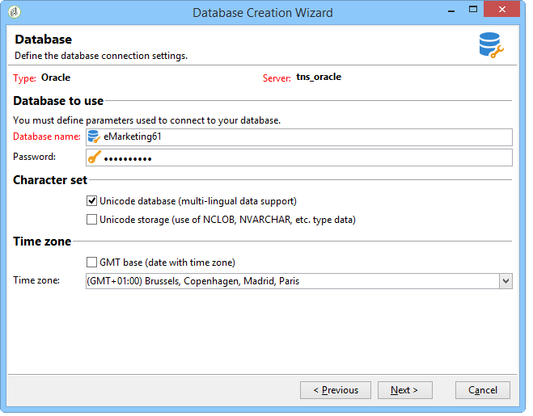

# Creación y configuración de la base de datos{#creating-and-configuring-the-database}

Al crear una base de datos, Adobe Campaign ofrece dos opciones diferentes:

1. Creación o reciclaje de una base de datos: elija estas opciones si desea crear una nueva base de datos o reutilizar una existente. Véase el [caso 1: Creación/reciclaje de una base de datos](#case-1--creating-recycling-a-database).
1. Uso de una base de datos existente: seleccione esta opción si el administrador ya ha creado una base de datos vacía y desea utilizarla; o ampliar la estructura de una base de datos existente. Véase el [caso 2: Uso de una base de datos](#case-2--using-an-existing-database)existente.

Los pasos de configuración se detallan a continuación.

>[!CAUTION]
>
>Los nombres de bases de datos, usuarios y esquemas no deben tener inicio con un número ni incluir caracteres especiales.
>
>Sólo el identificador **interno** puede realizar estas operaciones. For more on this, refer to [Internal identifier](../../installation/using/campaign-server-configuration.md#internal-identifier).

## Caso 1: Creación/reciclaje de una base de datos {#case-1--creating-recycling-a-database}

A continuación se presentan los pasos para crear una base de datos o reciclar una base existente. Algunas configuraciones dependen del motor de base de datos utilizado:

Se trata de los siguientes pasos:

* [Paso 1: Selección del motor](#step-1---selecting-the-database-engine)de la base de datos,
* [Paso 2: Conexión al servidor](#step-2---connecting-to-the-server),
* [Paso 3 - Conexión y características de la base de datos](#step-3---connection-and-characteristics-of-the-database),
* [Paso 4 - Paquetes para instalar](#step-4---packages-to-install),
* [Paso 5: pasos](#step-5---creation-steps)de creación,
* [Paso 6: Creación de la base de datos](#step-6---creating-the-database).

### Paso 1: Selección del motor de procesamiento de la base de datos {#step-1---selecting-the-database-engine}

Seleccione el motor de base de datos entre los de la lista desplegable.


Las bases de datos admitidas se enumeran en la matriz [de](../../rn/using/compatibility-matrix.md)compatibilidad de Campañas.

Identifique el servidor y elija el tipo de operación que desea realizar. En este caso, **[!UICONTROL Create or recycle a database]**.


Según el motor de base de datos seleccionado, la información de identificación del servidor puede variar.

* Para un motor **Oracle** , rellene el nombre **** TNS definido para el servidor de aplicaciones.
* Para un motor **PostgreSQL** o **DB2** , debe especificar el nombre DNS (o dirección IP) definido en el servidor de aplicaciones para acceder al servidor de bases de datos.
* Para un motor de **Microsoft SQL Server** , debe definir: nombre DNS (o dirección IP) definido en el servidor de aplicaciones para acceder al servidor de bases de datos: **DNS** o **DNS`\<instance>`** (modo de instancia),

   >[!CAUTION]
   >
   > A partir de la versión 20.3, la autenticación de Windows NT se cierra. **[!UICONTROL SQL Server authentication]** es ahora el único modo de autenticación disponible para Microsoft SQL Server. [Más información](../../rn/using/deprecated-features.md)

   

### Paso 2: Conexión al servidor {#step-2---connecting-to-the-server}

En la **[!UICONTROL Server access]** ventana, defina el acceso al servidor de la base de datos.


Para ello, introduzca el nombre y la contraseña de una cuenta **del sistema de** administración que tenga permiso para acceder a las bases de datos, es decir:

* **sistema** para una base de datos Oracle,
* **sa** para una base de datos de Microsoft SQL Server,
* **pósters** para una base de datos PostgreSQL,
* **db2inst1** para una base de datos DB2.

### Paso 3: Conexión y características de la base de datos {#step-3---connection-and-characteristics-of-the-database}

El paso siguiente le permite configurar las opciones para iniciar sesión en la base de datos.


Debe definir la siguiente configuración:

* Especifique el nombre de la base de datos que se va a crear.

   >[!NOTE]
   >
   >Para una base de datos DB2, el nombre de la base de datos no debe exceder los 8 caracteres.

* Introduzca la contraseña de la cuenta vinculada a esta base de datos.
* Indique si la base de datos debe estar o no en Unicode.

   La **[!UICONTROL Unicode database]** opción permite almacenar todos los tipos de caracteres en Unicode, independientemente del idioma.

   >[!NOTE]
   >
   >Con una base de datos Oracle, la **[!UICONTROL Unicode storage]** opción le permite utilizar campos de tipo **NCLOB** y **NVARCHAR** .
   > 
   >Si no selecciona esta opción, el juego de caracteres (charset) de la base de datos Oracle debe habilitar el almacenamiento de datos en todos los idiomas (se recomienda AL32UTF8).

* Elija una zona horaria para la base de datos y especifique si desea que esté en UTC (si está disponible).

   For more on this, refer to [Time zone management](../../installation/using/time-zone-management.md).

### Paso 4: Paquetes para instalar {#step-4---packages-to-install}

Seleccione los paquetes que desee instalar.

Consulte el contrato de licencia para comprobar qué soluciones y opciones tiene derecho a instalar, como &quot;Interacción&quot; o &quot;Marketing social&quot;.


### Paso 5: pasos de creación {#step-5---creation-steps}

La **[!UICONTROL Creation steps]** ventana permite mostrar y editar la secuencia de comandos SQL utilizada para crear las tablas.


* Para una base de datos Oracle, Microsoft SQL Server o PostgreSQL, el administrador también puede definir los parámetros **de** almacenamiento que se utilizarán al crear objetos de base de datos.

   Estos parámetros reciben los nombres exactos del tablespace (advertencia: distingue entre mayúsculas y minúsculas). Se almacenan respectivamente en el **[!UICONTROL Administration > Platform > Options]** nodo en las siguientes opciones (consulte [esta sección](../../installation/using/configuring-campaign-options.md#database)):

   * **WdbcOptions_TableSpaceUser**: tablas de usuario basadas en un esquema
   * **WdbcOptions_TableSpaceIndex**: índice de tablas de usuario basado en un esquema
   * **WdbcOptions_TableSpaceWork**: tablas de trabajo sin esquema
   * **WdbcOptions_TableSpaceWorkIndex**: índice de tablas de trabajo sin esquema

* Para una base de datos Oracle, el usuario de Adobe Campaign debe tener acceso a las bibliotecas de Oracle, normalmente como miembro del grupo **oinstall** .
* La **[!UICONTROL Set or change the administrator password]** opción le permite introducir la contraseña vinculada al operador de Adobe Campaign con derechos de administrador.

   Se recomienda definir una contraseña de administrador de cuentas de Adobe Campaign por motivos de seguridad.

### Paso 6: Creación de la base de datos {#step-6---creating-the-database}

La etapa final del asistente le permite crear la base de datos. Haga clic en **[!UICONTROL Start]** para confirmar.


Una vez creada la base de datos, puede volver a conectarse para finalizar la configuración de instancias.

Ahora debe poner en inicio el asistente de implementación para finalizar la configuración de la instancia. Consulte el Asistente [de implementación](../../installation/using/deploying-an-instance.md#deployment-wizard).

La configuración de conexión de la base de datos vinculada a la instancia se almacena en el archivo **`/conf/config-<instance>.xml`** que se encuentra en el directorio de instalación de Adobe Campaign.

Ejemplo de una configuración de Microsoft SQL Server en la base de datos base61 vinculada a la cuenta &#39;campaña&#39; con su contraseña cifrada:

```
<dbcnx encrypted="1" login="campaign:myBase" password="myPassword" provider="DB" server="dbServer"/>
```

## Caso 2: Uso de una base de datos existente {#case-2--using-an-existing-database}

La base de datos, así como el usuario, deben haber sido creados por el administrador de la base de datos y los derechos de acceso están configurados correctamente.

Por ejemplo, para una base de datos Oracle, los derechos mínimos requeridos son: OTORGAR CONNECT, RECURSOS Y ESPACIO DE TABLAS ILIMITADO.

Para utilizar una base de datos existente, los pasos de configuración son los siguientes:

* [Paso 1: Selección del motor](#step-1---choosing-the-database-engine)de la base de datos,
* [Paso 2: Configuración](#step-2---database-connection-settings)de conexión de base de datos,
* [Paso 3 - Paquetes para instalar](#step-3---packages-to-install),
* [Paso 4: pasos](#step-4---creation-steps)de creación,
* [Paso 5: Creación de la base de datos](#step-5---creating-the-database).

### Paso 1: Selección del motor de procesamiento de la base de datos {#step-1---choosing-the-database-engine}

Elija el motor de base de datos en la lista desplegable.


Identifique el servidor y elija el tipo de operación que desee realizar. En este caso, **[!UICONTROL Use an existing database]**.


Según el motor de base de datos seleccionado, la información de identificación del servidor puede variar.

* Para un motor **Oracle** , rellene el nombre **** TNS definido para el servidor de aplicaciones.
* Para un motor **PostgreSQL** o **DB2** , debe especificar el nombre DNS (o dirección IP) definido en el servidor de aplicaciones para acceder al servidor de bases de datos.
* Para un motor de **Microsoft SQL Server** , debe definir:

   1. nombre DNS (o dirección IP) definido en el servidor de aplicaciones para acceder al servidor de bases de datos,
   1. el método de seguridad utilizado para obtener acceso a Microsoft SQL Server: **[!UICONTROL SQL Server authentication]** o **[!UICONTROL Windows NT authentication]**.

      

### Paso 2: Ajustes de conexión a la base de datos {#step-2---database-connection-settings}

En la **[!UICONTROL Database]** ventana, defina la configuración de conexión de la base de datos.



Debe definir la siguiente configuración:

* Introduzca el nombre de la base de datos que se va a utilizar.
* Introduzca el nombre y la contraseña de la cuenta asociada a esta base de datos.

   >[!NOTE]
   >
   >Asegúrese de que coinciden tanto el nombre de esquema como el nombre de usuario. La forma recomendada de crear la base de datos es a través del cliente de la consola de campaña.
   >Para una base de datos Oracle, no es necesario introducir el nombre de la cuenta.

* Indique si la base de datos debe ser Unicode o no.

### Paso 3: Paquetes para instalar {#step-3---packages-to-install}

Seleccione los paquetes que desee instalar.

Consulte el contrato de licencia para comprobar qué soluciones y opciones tiene derecho a instalar, como &quot;Interacción&quot; o &quot;Posibles clientes&quot;.


### Paso 4: pasos de creación {#step-4---creation-steps}

La **[!UICONTROL Creation steps]** ventana permite mostrar y editar la secuencia de comandos SQL utilizada para crear las tablas.


* Para las bases de datos Oracle, Microsoft SQL Server o PostgreSQL, el administrador puede definir los parámetros **de** almacenamiento que se utilizarán al crear objetos de base de datos.
* Para una base de datos Oracle, el usuario de Adobe Campaign debe tener acceso a las bibliotecas de Oracle, normalmente como miembro del grupo **oinstall** .
* La **[!UICONTROL Set or change the administrator password]** opción le permite introducir la contraseña vinculada al operador de Adobe Campaign con derechos de administrador.

   Se recomienda definir una contraseña de administrador de cuentas de Adobe Campaign por motivos de seguridad.

### Step 5 - Creating the database {#step-5---creating-the-database}

La etapa final del asistente le permite crear la base de datos. Haga clic en **[!UICONTROL Start]** para confirmar.


Una vez creada la base de datos, puede volver a conectarse para finalizar la configuración de instancias.

Ahora debe poner en inicio el asistente de implementación para finalizar la configuración de la instancia. Consulte el Asistente [de implementación](../../installation/using/deploying-an-instance.md#deployment-wizard).

La configuración de conexión de la base de datos vinculada a la instancia se almacena en el archivo **`/conf/config-<instance>.xml`** que se encuentra en el directorio de instalación de Adobe Campaign.

Ejemplo de una configuración de Microsoft SQL Server en la base de datos base61 vinculada a la cuenta &#39;campaña&#39; con su contraseña cifrada:

```
<dbcnx encrypted="1" login="campaign:myBase" password="myPassword" provider="DB" server="dbServer"/>
```

