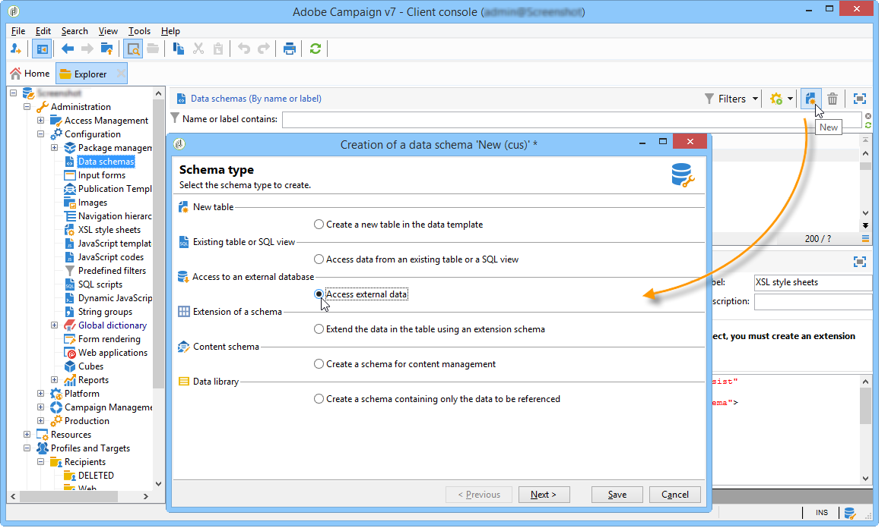

# Creación del esquema de datos {#creating-the-data-schema}

Para crear un esquema en una base de datos externa:

1. Haga clic en el botón **[!UICONTROL New]** sobre la lista de esquemas de datos y elija **[!UICONTROL Access external data]**.

   

1. Escriba **[!UICONTROL Namespace]** y **[!UICONTROL Name]** para el esquema y seleccione **[!UICONTROL External account]** que habilitará la conexión con la base de datos. Esto permite acceder a la lista de tablas disponibles en la base externa.

   

1. En el campo **[!UICONTROL Table name]**, elija la tabla que contiene los datos que se van a recopilar.

   Con Snowflake, puede seleccionar aquí sus vistas si se han concedido los privilegios correctos al usuario de la base de datos. Tenga en cuenta que cuando utilice vistas, Adobe Campaign no podrá generar automáticamente el esquema XML, tendrá que crearlo usted mismo. Para obtener más información, consulte [Documentación de Snowflake](https://docs.snowflake.com/en/user-guide/views-introduction.html).

   

1. Haga clic en **[!UICONTROL OK]** para confirmar. Adobe Campaign detecta automáticamente la estructura de la tabla seleccionada y genera el esquema lógico. Tenga en cuenta que Adobe Campaign no genera enlaces.

1. Haga clic en **[!UICONTROL Save]** para confirmar la creación.

   >[!CAUTION]
   >
   >Con Snowflake, es obligatorio usar una clave principal.

   

Los índices se crean automáticamente al asignar una tabla (asignación estándar o FDA).
