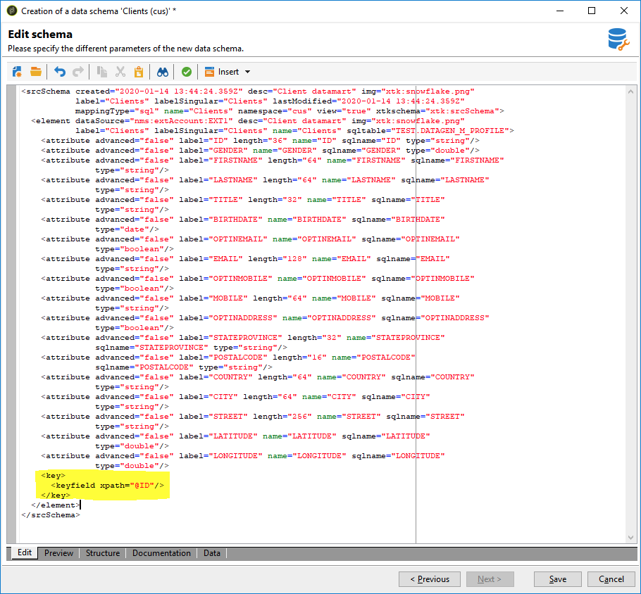

# Creación del esquema de datos {#creating-the-data-schema}

Para crear un esquema en una base de datos externa:

1. Haga clic en el botón **[!UICONTROL New]** sobre la lista de esquemas de datos y elija **[!UICONTROL Access external data]**.

   

1. Introduzca un nombre y una descripción para el esquema y seleccione la cuenta externa que activa la conexión con la base de datos. Esto permite acceder a la lista de tablas disponibles en la base externa. Seleccione la tabla que contiene los datos que se van a recopilar.

   

1. Haga clic en **[!UICONTROL OK]** para confirmar. Adobe Campaign detecta automáticamente la estructura de la tabla seleccionada y genera el esquema lógico. Tenga en cuenta que Adobe Campaign no genera enlaces.

1. Haga clic en **[!UICONTROL Save]** para confirmar la creación.

   >[!CAUTION]
   >
   >Con Snowflake, es obligatorio usar una clave principal.

   

Los índices se crean automáticamente al asignar una tabla (asignación estándar o FDA).
