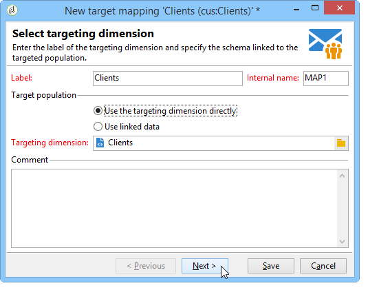
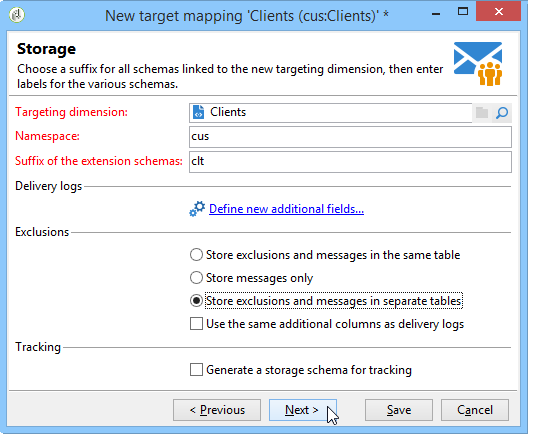
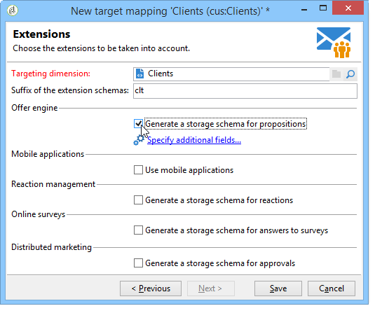

# Definición de asignación de datos externos {#defining-data-mapping}

Adobe Campaign le permite definir la asignación en los datos de una tabla externa.

Para ello, una vez que se haya creado el esquema de la tabla externa, debe crear una nueva asignación de envío para utilizar los datos de esta tabla como objetivo de envío.

Para ello, siga los siguientes pasos:

1. Cree una nueva asignación de envíos y elija la dimensión de segmentación, como por ejemplo el esquema que acaba de crear.

   

1. Indique los campos donde se almacena la información de envío (apellidos, nombre, correo electrónico, dirección, etc.).

   

1. Especifique los parámetros para el almacenamiento de información, incluido el sufijo de los esquemas de extensión para que se puedan identificar fácilmente.

   

   Puede elegir si desea almacenar las exclusiones (**excludelog**), con mensajes (**broadlog**) o en una tabla independiente.

   También puede elegir si desea administrar el seguimiento para esta asignación de envíos (**trackinglog**).

1. A continuación, seleccione las extensiones que se van a tener en cuenta. El tipo de extensión depende de los parámetros y opciones de la plataforma (consulte el contrato de licencia).

   

   Haga clic en el botón **[!UICONTROL Save]** para iniciar la creación de la asignación de entrega: todas las tablas vinculadas se crean automáticamente en función de los parámetros seleccionados.
