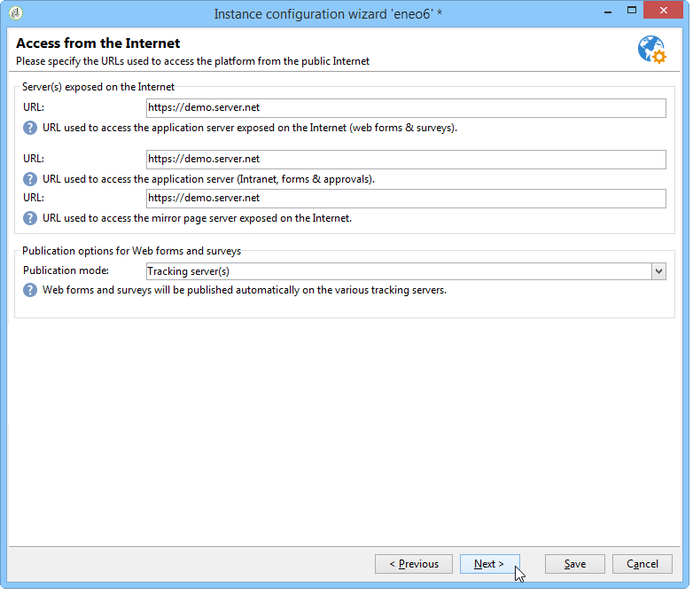

# Implementación de una instancia{#deploying-an-instance}

>[!NOTE]
>
>Las configuraciones del lado del servidor sólo pueden ser realizadas por Adobe para implementaciones alojadas en Adobe. Para obtener más información sobre las diferentes implementaciones, consulte la sección [Hosting models](../../installation/using/hosting-models.md) o [esta página](../../installation/using/capability-matrix.md).

## Asistente de implementación {#deployment-wizard}

Un asistente gráfico, disponible en la consola de cliente de Adobe Campaign, le permite definir los parámetros de la instancia a la que se va a conectar.

Para crear inicios en el asistente de implementación, seleccione **Herramientas > Avanzadas > Asistente de implementación**.


Los pasos de configuración son los siguientes:

1. [Parámetros generales](#general-parameters)
1. [Parámetros de canal de correo electrónico](#email-channel-parameters)
1. [Administración de correos electrónicos devueltos](#managing-bounced-emails)
1. [Configuración de seguimiento](#tracking-configuration)
1. [Parámetros de canal móvil](#mobile-channel-parameters)
1. [Configuración regional](#regional-settings)
1. [Acceso desde Internet](#access-from-the-internet)
1. [Administración de recursos públicos](#managing-public-resources)
1. [Purgar datos](#purging-data)

## Parámetros generales {#general-parameters}

El primer paso del asistente de implementación permite introducir información general sobre la instancia.


### Información general {#general-information}

La sección inferior de la ventana permite seleccionar las opciones que se activarán.

* **[!UICONTROL Customer identifier used in billing]** :: puede ser el nombre de la instancia y el número de versión.
* **[!UICONTROL Common name of the customer]** :: Introduzca una cadena de caracteres con el nombre de la compañía. Esta información se puede utilizar en los vínculos bajas.
* **[!UICONTROL Namespace]** :: Escriba un identificador corto en minúsculas. El objetivo es distinguir entre su configuración específica y la configuración de fábrica en caso de una actualización. La Área de nombres predeterminada es **cus** - para el cliente.

### Opciones técnicas {#technical-options}

La sección inferior de la ventana permite seleccionar las opciones que se activarán.

Estas son las opciones disponibles:

* **[!UICONTROL Email channel]** :: para activar el envío de correo electrónico. Consulte [Parámetros de canal de correo electrónico](#email-channel-parameters).
* **[!UICONTROL Tracking]** :: Para habilitar el seguimiento de la población de destinatarios (aperturas y clics). Consulte [Configuración de seguimiento](#tracking-configuration).
* **[!UICONTROL Managing bounced emails]** :: Para definir la cuenta POP utilizada para recoger el correo electrónico entrante. Consulte [Administración de correos electrónicos devueltos](#managing-bounced-emails).
* **[!UICONTROL LDAP integration]** :: Para configurar la autenticación de usuarios mediante un directorio LDAP. Consulte [Conexión a través de LDAP](../../installation/using/connecting-through-ldap.md).

## Parámetros de canal de correo electrónico {#email-channel-parameters}

El paso siguiente le permite definir la información que se mostrará en los encabezados de mensaje.

Estos parámetros se pueden sobrecargar en Plantillas de envíos e individualmente para cada envío (si los usuarios tienen los derechos necesarios).

### Parámetros para correos electrónicos enviados {#parameters-for-delivered-emails}


Indique los siguientes parámetros:

* **[!UICONTROL Sender name]** :: Nombre del remitente,
* **[!UICONTROL Sender address]** :: La dirección del remitente,
* **[!UICONTROL Reply address text]** :: El nombre, que es personalizable, que se utilizará cuando el destinatario haga clic en el  **[!UICONTROL Reply]** botón del software cliente de correo electrónico,
* **[!UICONTROL Reply address]** :: La dirección de correo electrónico que se utilizará cuando el destinatario haga clic en el  **[!UICONTROL Reply]** botón del software cliente de correo electrónico,
* **[!UICONTROL Error address]** :: Dirección de correo electrónico de los mensajes con errores. Esta es la dirección técnica que se utiliza para gestionar el correo de devolución, incluidos los correos electrónicos recibidos por el servidor de Adobe Campaign debido a que no existen direcciones de destinatario.

Además de esto, puede especificar las **máscaras** autorizadas para la dirección del remitente y la dirección de error. Si es necesario, estas máscaras se pueden separar mediante comas. Esta configuración es opcional. Cuando se introducen campos, Adobe Campaign comprueba en el momento del envío (durante la análisis, si la dirección no incluye variables) que las direcciones son válidas. Este modo operativo garantiza que no se utilice ninguna dirección que pueda desencadenar problemas de envío. Las direcciones de envío deben configurarse en el servidor de envío.

### Caracteres autorizados en direcciones {#characters-authorized-in-addresses}

<!--This window enables you to define, for all email campaigns, the delivery and address-quality management options.-->

En la base de datos de Adobe Campaign, todas las direcciones de correo electrónico deben crearse de la siguiente manera: `x@y.z`. Los caracteres **x**, **y** y **z** no deben estar vacíos y no deben incluir caracteres no autorizados.

Aquí puede definir los caracteres autorizados (&#39;política de datos&#39;) en el campo de correo electrónico de la base de datos. Los caracteres no incluidos en la lista estarán prohibidos y, por lo tanto, se rechazarán al introducir información en la base de datos a través de la interfaz, a través de un formulario web y también al importar datos.

Hay dos listas disponibles: **Solo europeo** o **sólo EE.UU.**. Si es necesario, se pueden añadir otros caracteres.

### Parámetros de entrega {#delivery-parameters}

Parámetros **avanzados...** le permite acceder a opciones de envío, parámetros vinculados a reintentos y cuarentenas.


Esta ventana le permite definir, para todas las campañas de correo electrónico, las opciones de administración de calidad de dirección y envío.

Estas son las opciones disponibles:

* **[!UICONTROL Delivery duration of messages]** :: Más allá de este tiempo, el envío se detiene (de forma predeterminada, 5 días),
* **[!UICONTROL Online resources validity duration]** :: Tiempo durante el cual se guarda la información del perfil de destinatario para generar páginas espejo,
* **[!UICONTROL Exclude recipients who no longer wish to be contacted]** :: Cuando se selecciona esta opción, no se contactará con los destinatarios de  de lista de bloqueados.
* **[!UICONTROL Automatically ignore doubles]** :: Cuando se selecciona esta opción, no se realizará el envío en las direcciones de duplicado.

### Parámetros de reintento {#retry-parameters}

La información sobre las recuperaciones se proporciona en los campos **Períodos de recuperación** y **Número de recuperaciones**: cuando un destinatario está inaccesible, por ejemplo si su bandeja de entrada está llena, de forma predeterminada el programa intentará comunicarse con ellos 5 veces, con un intervalo de una hora entre cada intento (durante el tiempo de envío máximo). Estos valores se pueden cambiar para adaptarlos a sus necesidades.

### Parámetros de cuarentena {#quarantine-parameters}

Las opciones de configuración para cuarentenas son las siguientes:

* **[!UICONTROL Duration between two significant errors]** :: escriba un valor (&quot;1d&quot; de forma predeterminada: 1 día) para definir el tiempo que la aplicación espera antes de incrementar el contador de errores en caso de error,
* **[!UICONTROL Maximum number of errors before quarantine]** :: una vez alcanzado este valor, la dirección de correo electrónico se pone en cuarentena (de forma predeterminada, &quot;5&quot;: la dirección se pondrá en cuarentena en el sexto error). Esto significa que el contacto se excluirá automáticamente de las entregas posteriores.

## Administración de correos electrónicos devueltos {#managing-bounced-emails}

La devolución del correo es extremadamente importante para calificar los errores de envío. Estos errores se clasifican en el directorio NP@I una vez que las reglas han determinado su causa.

Este paso solo está disponible si las opciones de administración **Correo electrónico** y **Devolución de correo** están seleccionadas en la primera etapa del asistente de implementación. Consulte [Parámetros generales](#general-parameters).

Esta etapa le permite definir la configuración para administrar los mensajes de devolución.


### Cuenta POP utilizada para recuperar correos entrantes {#pop-account-used-to-retrieve-incoming-mails}

Indique los parámetros para conectarse a la cuenta para recuperar los correos electrónicos entrantes.

* **[!UICONTROL Label]** :: Nombre que incluye todos los parámetros que se indican a continuación,
* **[!UICONTROL Server]** :: Servidor utilizado para recuperar el correo devuelto (correo entrante),
* **[!UICONTROL Security]** :: Si es necesario, seleccione  **[!UICONTROL SSL]** en la lista desplegable,
* **[!UICONTROL Port]** :: puerto del servidor (generalmente 110),
* **[!UICONTROL Account]** :: Nombre de la cuenta utilizada para el correo de devolución,
* **[!UICONTROL Password]** :: Contraseña asociada a la cuenta.

Una vez especificada la configuración POP, haga clic en **Probar** para asegurarse de que es correcta.

### Correos de devolución sin procesar {#unprocessed-bounce-mails}

Adobe Campaign administra automáticamente las devoluciones, aplicando las reglas enumeradas en el nodo **Administración > Gestión de la campaña > Administración de productos no entregables > Calificación del registro de Envíos**. Para obtener más información sobre esto, consulte [Administración de correo de devolución](../../delivery/using/understanding-delivery-failures.md#bounce-mail-management).

Las devoluciones sin procesar no se muestran en la interfaz de Adobe Campaign. Se eliminan automáticamente a menos que se transfieran a un buzón de terceros mediante los campos siguientes:

* **[!UICONTROL Forwarding address]** :: Rellene este campo para transferir a una dirección de terceros todos los mensajes de error (procesados o no procesados) recopilados por la plataforma Adobe Campaign.
* **[!UICONTROL Address for errors]** :: Rellene este campo para transferir a una dirección de terceros únicamente los mensajes de error que el proceso de inMail no pudo calificar.
* **[!UICONTROL SMTP server]** :: Servidor utilizado para enviar correos electrónicos de devolución sin procesar.

>[!IMPORTANT]
>
>Para reenviar correos electrónicos de devolución sin procesar, Adobe recomienda rellenar solo el campo **[!UICONTROL Address for errors]**. Sin embargo, asegúrese de que la dirección que se utiliza se compruebe con regularidad, ya que esto podría suponer una carga pesada en el servidor de correo. Póngase en contacto con el ejecutivo de cuentas para obtener más información.

## Configuración de seguimiento {#tracking-configuration}

El paso siguiente le permite configurar el seguimiento de la instancia. La instancia debe declararse y registrarse en los servidores de seguimiento.

Este paso solo se ofrece cuando las opciones **canal de correo electrónico** y **Seguimiento** están seleccionadas en la primera página del asistente de implementación. Consulte [Parámetros generales](#general-parameters).

Para obtener información más detallada sobre el seguimiento web (modo de seguimiento, creación e inserción de etiquetas...), consulte [este documento](../../configuration/using/about-web-tracking.md).

### Principio de funcionamiento {#operating-principle}

Al activar el seguimiento en una instancia, las direcciones URL de los envíos se cambian durante el envío para habilitar el seguimiento.

* La información sobre las direcciones URL externas (seguras o no) introducida en esta página del asistente de implementación se utiliza para generar la nueva dirección URL. Además de esta información, el vínculo modificado contiene: los identificadores del envío, el destinatario y la dirección URL.

   Adobe Campaign recopila información de seguimiento en los servidores de seguimiento para enriquecer los perfiles de destinatario y los datos vinculados al envío ( **[!UICONTROL Tracking]** fichas).

   El servidor de aplicaciones de Adobe Campaign solo utiliza la información de las direcciones URL internas para comunicarse con los servidores de seguimiento.

   Para obtener más información sobre esto, consulte [Servidor de seguimiento](#tracking-server).

* Una vez configuradas las direcciones URL, debe habilitar el seguimiento. Para ello, la instancia debe estar registrada en los servidores de seguimiento.

   Para obtener más información sobre esto, consulte [Almacenamiento de seguimiento](#saving-tracking).

### Servidor de seguimiento {#tracking-server}


Para garantizar la eficacia del seguimiento en esta instancia, se debe mostrar la siguiente información:
<!--With Mid-sourcing architecture, you can externalize tracking management. To do this:-->

* **[!UICONTROL External URL]** y/o  **[!UICONTROL Secure external URL]** : Introduzca la dirección URL de redirección que se va a utilizar en el correo electrónico que se va a enviar.
* **[!UICONTROL Internal URL(s)]** :: Las direcciones URL utilizadas únicamente por el servidor de Adobe Campaign para comunicarse con los servidores de seguimiento para recopilar registros y cargar las direcciones URL. No es necesario asociarlo a la instancia.

   Si no especifica una dirección URL, la dirección URL de seguimiento se utilizará de forma predeterminada.

Con la arquitectura Intermediaria, puede externalizar la administración de seguimiento. Para ello:

1. Seleccione la opción **[!UICONTROL Externalize tracking management]**: esto le permite utilizar un servidor intermediaria como servidor de seguimiento.
1. Rellene los campos **[!UICONTROL External account]** y **[!UICONTROL Instance name]** para poder conectarse al servidor intermediaria.

   Para obtener más información, consulte [servidor Intermediaria](../../installation/using/mid-sourcing-server.md).

1. Haga clic en el botón **[!UICONTROL Enable the tracking instance]** para aprobar la conexión con el servidor.

   

### Guardando seguimiento {#saving-tracking}

Una vez completadas las direcciones URL, debe registrar el servidor de seguimiento.

Haga clic en el vínculo **Registro en los servidores de seguimiento** y seleccione una de las opciones disponibles.


Existen tres tipos de arquitectura posibles para implementar el seguimiento:

1. **Añadir compatibilidad para el seguimiento en una instancia existente**

   Esta opción se aplica si la instancia ya se creó para otras necesidades (servidor MTA, etc.) en servidores que se utilizarán como servidores de seguimiento.

   

   Introduzca la contraseña de la cuenta **interna** en los servidores de redirección para configurar la instancia de seguimiento.

   >[!NOTE]
   >
   >Si se utilizan varios servidores de seguimiento, todos deben utilizar el mismo nombre y contraseña.

   Especifique el nombre de la instancia y la contraseña.

1. **Crear una nueva instancia dedicada al seguimiento**

   Esta opción es útil cuando las instancias de seguimiento están reservadas para el seguimiento y no tienen ningún otro módulo de aplicación.

   

   Introduzca la contraseña de la cuenta **interna** en los servidores de redirección para configurar la instancia de seguimiento.

   >[!NOTE]
   >
   >Si hay varios servidores de seguimiento configurados, todos deben utilizar la misma contraseña.

   Especifique el nombre de la instancia, la contraseña y las máscaras DNS asociadas, como **[!UICONTROL Campaign*]**.

1. **Valide una instancia de seguimiento ya preconfigurada para usted**

   Esta opción se utiliza cuando no tiene la contraseña de la cuenta **interna**; En este caso, una cuenta de seguimiento está preconfigurada para usted en los servidores de seguimiento. Introduzca la contraseña de la cuenta de seguimiento de los servidores de redirección para validar la instancia de seguimiento.

   

   Especifique el nombre de la instancia que se va a validar.

Haga clic en **Aprobar** para inicio del proceso de grabación con el servidor de seguimiento.

En la ventana anterior, un mensaje confirma el registro en el nivel de servidor de seguimiento:


Los parámetros vinculados a búsquedas de URL **no deben modificarse** para una instalación estándar. Para todos los demás parámetros, póngase en contacto con Adobe.

## Parámetros de canal móvil {#mobile-channel-parameters}

El siguiente paso le permite definir la configuración predeterminada para envíos a móviles (SMS y WAP Push).

>[!NOTE]
>
>El canal móvil es opcional: esta etapa solo aparecerá si se ha comprado. Compruebe el acuerdo de licencia.


### Cuenta predeterminada para envío SMS {#default-account-for-sms-delivery}

Introduzca la siguiente información:

* **[!UICONTROL Label]** :: Escriba un nombre para esta cuenta push de SMS/Wap. Por ejemplo: puede que desee utilizar el nombre de su router.
* Para los campos **[!UICONTROL Server]**, **[!UICONTROL Port]**, **[!UICONTROL Account]**, **[!UICONTROL Password]**, **[!UICONTROL Connector]**, **[!UICONTROL Send Endpoint]**, **[!UICONTROL Reception Endpoint]**, **[!UICONTROL Notification Endpoint]**: Póngase en contacto con su proveedor de servicio para obtener la configuración necesaria.

### Parámetros de SMS enviados {#parameters-of-sms-sent}

En la lista desplegable **Priority**: Seleccione &quot;Normal&quot;, &quot;Alto&quot; o &quot;Urgente&quot; para aplicarlo a los mensajes que se van a enviar.

### Parámetros avanzados {#advanced-parameters}

Parámetros **avanzados...** le permite acceder a las opciones de reintento y cuarentena.


La información sobre reintentos está disponible en los campos **Período de reintentos** y **Número de reintentos**: Cuando un móvil está inaccesible, de forma predeterminada, el programa lo intentará de nuevo 5 veces a intervalos de al menos 15 minutos (para el período máximo de envío). Estos valores se pueden adaptar a sus necesidades.

Las opciones de configuración para cuarentenas son las siguientes:

* **[!UICONTROL Time between two significant errors]** :: Introduzca un valor predeterminado (de forma predeterminada, &quot;1d&quot;: día) para definir el tiempo que la aplicación espera antes de incrementar el contador de errores en caso de error.
* **[!UICONTROL Maximum number of errors before quarantine]** :: Una vez alcanzado este valor, el número móvil se pone en cuarentena (de forma predeterminada, &quot;5&quot;: el número se pondrá en cuarentena tras el sexto error). Esto significa que el contacto se excluirá automáticamente de futuros envíos.

## Configuración regional {#regional-settings}

Esta etapa permite incluir las preferencias de la directiva de datos.


* **[!UICONTROL Consider all phone numbers as international ones]** :: Cuando se selecciona esta opción, la aplicación aplica el formato internacional a los números de teléfono (el prefijo de país es obligatorio porque no se comprobará el número de dígitos antes de aplicar el formato). Si esta opción no está seleccionada, debe anteponer el número de teléfono internacional con &quot;+&quot; o &quot;00&quot; usted mismo.
* **[!UICONTROL Store all phone numbers using the international format]** :: Esta opción solo afecta a los números de  **** teléfono nacionales que se importan o editan. Defina si desea utilizar un formato doméstico (como 425 555 0150) o el formato internacional (p. ej. +1 425 555 0150)

## Acceso desde Internet {#access-from-the-internet}

>[!IMPORTANT]
>
>Por razones de privacidad, recomendamos utilizar HTTPS para todos los recursos externos.

Este paso le permite definir direcciones URL de acceso para páginas de Adobe Campaign expuestas en Internet.

También debe indicar aquí las opciones de publicación vinculadas a Formularios web.



### Servidores expuestos en la Web {#servers-exposed-on-the-web}

Utilice esta página para rellenar las direcciones URL del servidor para:

1. Acceda al servidor de aplicaciones expuesto en Internet: suscripción/formularios bajas, extranet, etc.
1. Acceda al servidor de aplicaciones para los recursos no expuestos en la Web: formularios, intranet, páginas de confirmación.
1. Acceda a las páginas espejo de envíos.

   Una página espejo es una página dinámica que muestra el contenido del correo electrónico. Se accede a él a través de un vínculo insertado en el mensaje enviado al destinatario y puede contener elementos personalizados. La página espejo ofrece al destinatario la posibilidad de leer el mensaje en un navegador de Internet en lugar del software de correo electrónico, independientemente del formato de envío (texto o HTML). Sin embargo, las páginas espejo solo se generan para un envío determinado si se ha definido el contenido HTML necesario.

Adobe Campaign permite diferenciar estas tres direcciones URL para distribuir la carga en varias plataformas.

## Administración de recursos públicos {#managing-public-resources}

>[!IMPORTANT]
>
>Por razones de privacidad, recomendamos utilizar HTTPS para todos los recursos externos.

Para que se puedan ver desde el exterior, las imágenes utilizadas en los mensajes de correo electrónico y recursos públicos vinculados a las campañas deben estar presentes en un servidor accesible de forma externa. A continuación, pueden estar disponibles para destinatarios o operadores externos.


Para este paso, debe introducir:

1. La nueva dirección URL de recurso público. Para obtener más información, consulte la sección [URL de Recursos públicos](#public-resources-url).
1. Modo de detección de imágenes en un envío. Para obtener más información, consulte la sección [Detección de imágenes de Envío](#delivery-image-detection).
1. Opciones de publicación. Para obtener más información, consulte la sección [Modos de publicación](#publication-modes).

Se puede acceder a los recursos públicos a través del nodo **Administración > Recursos > En línea > Recursos públicos** del árbol de Adobe Campaign. Se recopilan en una biblioteca y pueden incluirse en correos electrónicos, pero también se utilizan en campañas o tareas y en gestoras de contenido.


### URL de recursos públicos {#public-resources-url}

El primer campo permite especificar el inicio de la URL que se utiliza para los recursos una vez cargados. Cuando se cargan, los recursos son accesibles a través de esta nueva dirección URL.

En un envío, puede utilizar imágenes almacenadas en la biblioteca de recursos públicos o cualquier otra imagen local o imagen almacenada en un servidor.

* Para las imágenes de correo electrónico, la dirección URL **https://** server **/res/img**.

   Este valor se puede anular para cada envío.

* Para recursos públicos, la dirección URL **https://** server **/res/** instance ****donde **instance**es el nombre de la instancia de seguimiento.

### Detección de imágenes de envío {#delivery-image-detection}

En un envío, puede utilizar imágenes almacenadas en la biblioteca de recursos públicos o cualquier otra imagen local o imagen almacenada en un servidor.

El campo **máscaras URL** permite especificar la lista de máscaras URL que se omitirán al cargar imágenes automáticamente. Por ejemplo, si utiliza imágenes almacenadas en un sitio al que se puede acceder desde el exterior, en particular en un sitio de Internet, puede introducir la dirección URL del sitio en este campo.


Puede especificar varias máscaras URL utilizando una coma para separarlas.

* Para obtener información sobre cómo usar y administrar imágenes en correos electrónicos, consulte [esta sección](../../delivery/using/defining-the-email-content.md#adding-images).
* En el asistente de envíos, las imágenes llamadas desde estas direcciones URL tendrán el estado &quot;Ignorado&quot;.

### Modos de publicación {#publication-modes}

La sección inferior del asistente le permite seleccionar las opciones de publicación de recursos públicos e imágenes. Estas opciones también están disponibles para Formularios web y encuestas.

Están disponibles los siguientes modos de publicación:

* Servidores de seguimiento

   Los recursos se copiarán automáticamente en los diferentes servidores de seguimiento. Se configuran en el paso [Configuración de seguimiento](#tracking-configuration).

* Otros servidores Adobe Campaign

   Puede utilizar otros servidores de Adobe Campaign donde se copiarán los recursos.

   En el servidor, para utilizar un servidor Adobe Campaign dedicado, debe crear una nueva instancia con el siguiente comando:

   ```
   nlserver config -addtrackinginstance:<trackingA>/<trackingA*>
   ```

   A continuación, introduzca la contraseña.

   Los parámetros de los servidores dedicados se proporcionan en los campos **[!UICONTROL Media URL(s)]**, **[!UICONTROL Password]** y **[!UICONTROL Instance name]**.

   

* Secuencia de comandos de publicación manual (solo para recursos públicos)

   

   Puede publicar las imágenes mediante una secuencia de comandos:

   * Debe crear esta secuencia de comandos: Su contenido depende de la configuración.
   * El comando siguiente llamará a la secuencia de comandos:

      ```
      [INSTALL]/copyToFrontal.vbs "$(XTK_INSTALL_DIR)\var\<instance>\upload\" "img1,img2,img3"
      ```

      donde `[INSTALL]` es la ruta de acceso a la carpeta de instalación de Adobe Campaign.

   * En Unix, asegúrese de que la secuencia de comandos es ejecutable.

Para las imágenes, debe copiarlas de la carpeta &quot;images&quot; especificada mediante la opción **NmsDelivery_ImageSubDirectory** en uno o varios servidores frontales. Estos servidores almacenarán las imágenes para hacerlas accesibles mediante la nueva dirección URL configurada.

De forma predeterminada, en el evento de publicación en un servidor de Adobe Campaign sin una secuencia de comandos de publicación manual, las imágenes de un envío se almacenan en `$(XTK_INSTALL_DIR)/var/res/img/ directory`. La URL correspondiente es la siguiente: **`https://server/res/img`**.

`XTK_INSTALL_DIR)/var/res/$(INSTANCE_NAME)`. La dirección URL correspondiente es la siguiente: **`https://server/res/instance`** donde instance es el nombre de la instancia de seguimiento.

>[!NOTE]
>
>Es posible cambiar el directorio de recurso público almacenamiento. Para obtener más información sobre esto, consulte [Administración de recursos públicos](#managing-public-resources).

### Sincronizando recursos públicos {#synchronizing-public-resources}

Esta funcionalidad le permite **sincronizar recursos públicos** en varios servidores de reserva.

Si un recurso público no está presente en el servidor de seguimiento o si el recurso devuelve un error 404, el servidor de seguimiento intentará encontrar el recurso en uno de los servidores de reserva.

La declaración y la configuración de servidores de repuesto deben realizarse en el archivo **serverConf.xml** del servidor de marketing. Todos los parámetros disponibles en **serverConf.xml** se enumeran en esta [sección](../../installation/using/the-server-configuration-file.md).

**Declaración**

```
<redirection>
<spareServer enabledIf="" id="" url=""/>
</redirection>
```

**Configuración**

Para cada recurso público que se debe sincronizar, debe agregar un atributo de estado al elemento `<url>` en la parte `<relay>`:

El atributo status puede ser uno de los tres valores:

* repuesto: El recurso público está sincronizado

* normal: Comportamiento existente (sin sincronización)

* lista negra: La dirección URL se agrega a la  de lista de bloqueados si devuelve un error 404. La duración (en segundos) de la dirección URL que se encuentra en la  de lista de bloqueados se define mediante un atributo **timeout** cuyo valor predeterminado es 60s.

La configuración predeterminada de la sincronización es:

```
(extracted from the serverConf.xml file)

<redirection P3PCompactPolicy="CAO DSP COR CURa DEVa TAIa OUR BUS IND UNI COM NAV"
databaseId="" defLogCount="30" expirationURL="" maxJobsInCache="100"
startRedirection="true" startRedirectionInModule="true" trackWebVisitors="false" trackingPassword="">
<spareServer enabledIf="" id="1" url=""/>
</redirection>

....


<relay debugRelay="false" forbiddenCharsInAuthority="?#.@/:" forbiddenCharsInPath="?#/"
           modDir="index.html" startRelay="false" startRelayInModule="true" timeout="60">
   <url IPMask="" deny="" hostMask="" relayHost="true" relayPath="true" status="normal" targetUrl="https://localhost:8080" timeout="" urlPath="/view/*"/>
      <url IPMask="" deny="" hostMask="" relayHost="true" relayPath="true" status="blacklist" targetUrl="https://localhost:8080" timeout="" urlPath="*.jsp"/>
      <url IPMask="" deny="" hostMask="" relayHost="true" relayPath="true" status="blacklist" targetUrl="https://localhost:8080" timeout="" urlPath="*.jssp"/>
      <url IPMask="" deny="" hostMask="" relayHost="true" relayPath="true" status="blacklist" targetUrl="https://localhost:8080" timeout="" urlPath="/webApp/*"/>
      <url IPMask="" deny="" hostMask="" relayHost="true" relayPath="true" status="blacklist" targetUrl="https://localhost:8080" timeout="" urlPath="/report/*"/>
      <url IPMask="" deny="" hostMask="" relayHost="true" relayPath="true" status="blacklist" targetUrl="https://localhost:8080" timeout="" urlPath="/jssp/*"/>
      <url IPMask="" deny="" hostMask="" relayHost="true" relayPath="true" status="normal" targetUrl="https://localhost:8080" timeout="" urlPath="/strings/*"/>
      <url IPMask="" deny="" hostMask="" relayHost="true" relayPath="true" status="normal" targetUrl="https://localhost:8080" timeout="" urlPath="/interaction/*"/>
      <url IPMask="" deny="" hostMask="" relayHost="true" relayPath="true" status="normal" targetUrl="https://localhost:8080" timeout="" urlPath="/barcode/*"/>

      <url IPMask="" deny="" hostMask="" relayHost="false" relayPath="false" status="spare" targetUrl="" timeout="" urlPath="/favicon.*"/>
      <url IPMask="" deny="" hostMask="" relayHost="false" relayPath="false" status="spare" targetUrl="" timeout="" urlPath="/*.html"/>
      <url IPMask="" deny="" hostMask="" relayHost="false" relayPath="false" status="spare" targetUrl="" timeout="" urlPath="/*.png"/>
      <url IPMask="" deny="" hostMask="" relayHost="false" relayPath="false" status="spare" targetUrl="" timeout="" urlPath="/*.jpg"/>

 </relay>
```

## Purgando datos {#purging-data}

La última etapa del asistente de implementación le permite configurar la depuración automática de datos obsoletos. Los valores se expresan en días.


Los datos se eliminan automáticamente mediante el flujo de trabajo de limpieza de la base de datos. Para obtener más información sobre cómo configurar y operar este flujo de trabajo y detalles sobre los elementos eliminados, consulte este [documento](../../production/using/database-cleanup-workflow.md).
