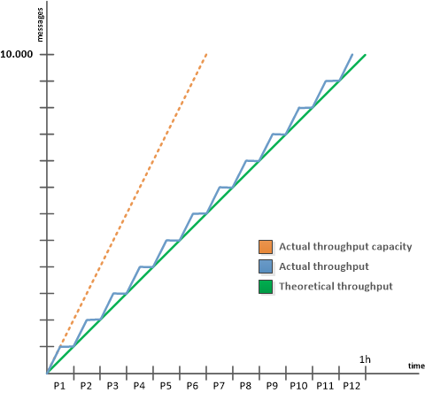

# Configuraciones técnicas de correo electrónico{#email-deliverability}

## Información general {#overview}

En la siguiente sección se proporciona una descripción general de la configuración necesaria para controlar la salida de las instancias de Adobe Campaign al enviar correos electrónicos.

>[!NOTE]
>
>Algunas configuraciones solo se pueden realizar mediante Adobe para implementaciones alojadas en Adobe, por ejemplo, para acceder a los archivos de configuración de instancias y del servidor. Para obtener más información sobre las diferentes implementaciones, consulte la sección [Modelos de alojamiento](../../installation/using/hosting-models.md) o [esta página](../../installation/using/capability-matrix.md).

Para obtener más información sobre los conceptos y las prácticas recomendadas relacionadas con la capacidad de envío con Adobe Campaign, consulte esta [sección](../../delivery/using/about-deliverability.md).

Para profundizar en lo que es la capacidad de envío, incluidas todas las recomendaciones técnicas relacionadas con la entrega y recepción eficientes de correos electrónicos por parte de una plataforma de Adobe, consulte la [Guía de prácticas recomendadas de entrega de Adobe](https://experienceleague.adobe.com/docs/deliverability-learn/deliverability-best-practice-guide/introduction.html).

## Principio de funcionamiento {#operating-principle}

Es posible controlar el resultado de una o más instancias de Adobe Campaign para restringir el número de correos electrónicos enviados según un dominio. Por ejemplo, puede restringir el resultado a 20 000 por hora para las direcciones **yahoo.com**, mientras configura 100 000 mensajes por hora para todos los demás dominios.

El resultado del mensaje debe controlarse para cada dirección IP utilizada por los servidores de envío (**mta**). Varios **mta** desglosados en varios equipos y pertenecientes a varias instancias de Adobe Campaign pueden compartir la misma dirección IP para el envío de correo electrónico: es necesario configurar un proceso para coordinar el uso de estas direcciones IP.

Esto es lo que hace el módulo **stat**: reenvía todas las solicitudes de conexión y mensajes que se enviarán a los servidores de correo para un conjunto de direcciones IP. El servidor de estadísticas realiza un seguimiento de los envíos y puede activar o desactivar los envíos en función de las cuotas establecidas.


* El servidor de estadísticas (**stat**) está vinculado a una base de Adobe Campaign para cargar su configuración.
* Los servidores de envío (**mta**) utilizan un UDP para comunicarse con un servidor de estadísticas que no siempre pertenece a su propia instancia.

### Servidores de envío {#delivery-servers}

El módulo **mta** distribuye los mensajes a sus módulos secundarios **mtachild**. Cada **mtachild** prepara los mensajes antes de solicitar una autorización al servidor de estadísticas y enviarlos.

Los pasos son los siguientes:

1. El **mta** selecciona los mensajes aptos y les asigna un **mtachild** disponible.
1. El **mtachild** carga toda la información necesaria para crear el mensaje (contenido, elementos de personalización, archivos adjuntos, imágenes, etc.) y reenvía el mensaje al **Email Traffic Share**.
1. En cuanto el capítulo de tráfico de correo electrónico recibe la autorización del servidor de estadísticas (**smtp stat**), el mensaje se envía al destinatario.


### Limitaciones y estadísticas del servidor de correo electrónico {#email-server-statistics-and-limitations}

El servidor de estadísticas mantiene las siguientes estadísticas para cada servidor de correo electrónico que recibe mensajes:

* Número de conexiones puntuales abiertas,
* Número de mensajes enviados en la última hora,
* Tasa de conexiones correctas/rechazadas,
* Tasa de conexiones a servidores inaccesibles.

Al mismo tiempo, el módulo carga una lista de limitaciones para ciertos servidores de correo electrónico:

* Número máximo de conexiones simultáneas,
* Número máximo de mensajes por hora,
* Número máximo de mensajes por conexión.

### Administración de direcciones IP {#managing-ip-addresses}

El servidor de estadísticas puede combinar varias instancias o varios equipos con la misma dirección IP pública. Por lo tanto, no está vinculado a una instancia específica, pero tiene que ponerse en contacto con una instancia para recuperar las limitaciones por dominio.

Las estadísticas de entrega se conservan para cada MX de destino y para cada IP de origen. Por ejemplo, si el dominio de destino tiene 5 MX y la plataforma puede utilizar 3 direcciones IP diferentes, el servidor puede administrar hasta 15 series de indicadores para este dominio.

La dirección IP de origen coincide con la dirección IP pública, es decir, la dirección tal como la ve el servidor de correo electrónico remoto. Esta dirección IP puede ser diferente de la dirección del equipo que aloja el **mta**, si se proporciona un router NAT. Por este motivo, el servidor de estadísticas utiliza un identificador que coincide con la IP pública (**publicId**). La asociación entre la dirección local y este identificador se declara en el archivo de configuración **serverConf.xml**. Todos los parámetros disponibles en **serverConf.xml** se enumeran en esta [sección](../../installation/using/the-server-configuration-file.md).

## Control de salida de envío {#delivery-output-controlling}

Para enviar mensajes a los servidores de correo electrónico, el componente **Email Traffic Share** solicita una conexión desde el servidor de estadísticas. Una vez aceptada la solicitud, se abre la conexión.

Antes de enviar mensajes, el módulo solicita &#39;tokens&#39; desde el servidor. Generalmente son conjuntos de al menos 10 tokens, lo que reduce el número de consultas al servidor.

El servidor guarda todas las estadísticas relacionadas con las conexiones y envíos. En caso de reinicio, la información se pierde temporalmente: cada cliente guarda una copia local de sus estadísticas de envío y las devuelve al servidor de forma regular (cada 2 minutos). A continuación, el servidor puede volver a acumular los datos.

Las secciones siguientes describen el procesamiento de un mensaje mediante el componente **Email Traffic Share**.

### Entrega de mensajes {#message-delivery}

Cuando se envía un mensaje, hay 3 resultados posibles:

1. **Correcto**: el mensaje se envió correctamente. Se actualiza el mensaje.
1. **Mensaje fallido**: el servidor contactado rechazó el mensaje para el destinatario elegido. Este resultado coincide con los códigos devueltos 550 a 599, pero se pueden definir excepciones.
1. **Error en la sesión**  (para la versión 5.11 posterior): si  **** target recibe una respuesta para este mensaje, el mensaje se abandona (consulte  [Abandono](#message-abandonment) de mensaje). El mensaje se envía a otra ruta o se establece como pendiente si no hay otras rutas disponibles (consulte [Mensaje pendiente](#message-pending)).

   >[!NOTE]
   >
   >Una **ruta** es una conexión entre el **mta** de Adobe Campaign y el **mta** de destino. Adobe Campaign **mta** puede elegir entre varias IP de inicio y varias IP de dominio de destino.

### Abandono de mensaje {#message-abandonment}

Los mensajes abandonados se devuelven al **mta** y el **mtachild** ya no los gestiona.

El **mta** decide el procedimiento para este mensaje (recuperación, abandono, cuarentena, etc.) según el código de respuesta y las reglas.

### Mensaje pendiente {#message-pending}

Un mensaje está pendiente cuando llega a la cola activa y no hay rutas disponibles.

Una ruta se marca generalmente como no disponible durante un período de tiempo variable después de un error de conexión. El periodo de no disponibilidad depende de la frecuencia y la edad de los errores.

## Configuración del servidor de estadísticas {#statistics-server-configuration}

El servidor de estadísticas se puede utilizar en varias instancias: debe configurarse de forma independiente de las instancias que lo utilizarán.

Comience definiendo la base de datos de Adobe Campaign que alojará la configuración.

### Iniciar configuración {#start-configuration}

De forma predeterminada, el módulo **stat** se inicia para cada instancia. Cuando las instancias se mutualizan en el mismo equipo o cuando las instancias comparten la misma dirección IP, se utiliza un único servidor de estadísticas: los demás tienen que ser discapacitados.

### Definición del puerto del servidor {#definition-of-the-server-port}

De forma predeterminada, el servidor de estadísticas escucha en el puerto 7777. Este puerto se puede modificar en el archivo **serverConf.xml**. Todos los parámetros disponibles en **serverConf.xml** se enumeran en esta [sección](../../installation/using/the-server-configuration-file.md).

```
<stat port="1234"/>
```

## Configuración MX {#mx-configuration}

>[!IMPORTANT]
>
>En el caso de instalaciones alojadas o híbridas, si se ha actualizado al [servidor de correo mejorado](../../delivery/using/sending-with-enhanced-mta.md), ya no se utilizan las reglas de rendimiento de envíos **[!UICONTROL MX management]**. El servidor de correo mejorado utiliza sus propias reglas MX que le permiten personalizar el rendimiento por dominio en función de su propia reputación histórica de correo electrónico y de los comentarios en tiempo real procedentes de los dominios a los que envía correos electrónicos.

Las secciones siguientes solo se aplican a instalaciones locales e instalaciones alojadas/híbridas que utilizan el MTA de Campaign heredado.

### Acerca de las reglas MX {#about-mx-rules}

Las reglas MX (Mail eXchanger) son las reglas que administran la comunicación entre un servidor emisor y un servidor receptor.

Estas reglas se recargan automáticamente cada mañana a las 6 a. m. (hora del servidor) para suministrar regularmente la instancia del cliente.

Según las capacidades materiales y la política interna, un ISP acepta una cantidad predefinida de conexiones y mensajes por hora. El sistema ISP puede modificar estas variables automáticamente según la reputación de la IP y el dominio del remitente. Mediante su plataforma de envío, Adobe Campaign administra más de 150 reglas específicas del ISP y, además, una regla genérica para otros dominios.

El número máximo de conexiones no depende exclusivamente del número de direcciones IP públicas que utiliza el MTA.

Por ejemplo, si ha permitido 5 conexiones en las reglas MX y ha configurado 2 direcciones IP públicas, puede pensar que no puede tener más de 10 conexiones abiertas simultáneamente en este dominio. Esto no es así, en realidad el número máximo de conexiones se refiere a una ruta y a una ruta que combine una de nuestras IP públicas de MTA y una IP pública del MTA del cliente.

En el siguiente ejemplo, el usuario tiene dos direcciones IP públicas configuradas y el dominio es yahoo.com.

```
user:~ user$ host -t mx yahoo.com
                yahoo.com mail is handled by 1 mta5.am0.yahoodns.net.
                yahoo.com mail is handled by 1 mta6.am0.yahoodns.net.
                yahoo.com mail is handled by 1 mta7.am0.yahoodns.net.
```

Los registros MX para yahoo.com nos dicen que yahoo.com tiene 3 intercambiadores de correo. Para conectar el intercambiador de correo de pares, el MTA solicita su dirección IP al DNS.

```
user:~ user$ host -t a mta5.am0.yahoodns.net
                mta5.am0.yahoodns.net has address 98.136.216.26
                mta5.am0.yahoodns.net has address 98.136.217.202
                mta5.am0.yahoodns.net has address 98.138.112.38
                mta5.am0.yahoodns.net has address 66.196.118.37
                mta5.am0.yahoodns.net has address 63.250.192.46
                mta5.am0.yahoodns.net has address 66.196.118.240
                mta5.am0.yahoodns.net has address 98.136.217.203
                mta5.am0.yahoodns.net has address 98.138.112.35
```

Para este registro, el usuario puede ponerse en contacto con 8 direcciones IP de pares. Ya que tiene 2 direcciones IP públicas, le proporciona 8 * 2 = 16 combinaciones para llegar a los servidores de correo de yahoo.com. Cada una de estas combinaciones se denomina path.

El segundo registro MX aparece como:

```
user:~ user$ host -t a mta6.am0.yahoodns.net
                mta6.am0.yahoodns.net has address 98.138.112.38
                mta6.am0.yahoodns.net has address 98.136.216.26
                mta6.am0.yahoodns.net has address 63.250.192.46
                mta6.am0.yahoodns.net has address 66.196.118.35
                mta6.am0.yahoodns.net has address 98.136.217.203
                mta6.am0.yahoodns.net has address 98.138.112.32
                mta6.am0.yahoodns.net has address 98.138.112.37
                mta6.am0.yahoodns.net has address 66.196.118.33
```

4 de estas 8 direcciones IP ya se utilizan en mta5 (98.136.216.26, 98.138.112.38, 63.250.192.46 y 98.136.217.203). Este registro permite al usuario utilizar 4 direcciones IP nuevas. El tercer registro MX hace lo mismo.

En total, tenemos 16 direcciones IP remotas. En combinación con nuestras 2 IP públicas locales, tenemos 32 rutas para llegar a los servidores de correo de yahoo.com.

>[!NOTE]
>
>Si 2 registros MX hacen referencia a la misma dirección IP, esta cuenta como una ruta en lugar de dos.

A continuación se muestran algunos ejemplos de uso de las reglas MX:


En el siguiente ejemplo, el usuario tiene un límite de 10 000 mensajes por hora para un dominio determinado, pero la capacidad de rendimiento del MTA es superior a este límite.

En este caso, el tráfico se divide en 12 periodos de 5 minutos para cada hora y el límite real es de 833 mensajes por periodo.

Estos mensajes se envían lo más rápidamente posible.



### Configuración de la gestión de MX {#configuring-mx-management}

Las reglas que se deben cumplir para MX se definen en el documento **[!UICONTROL MX management]** del nodo **[!UICONTROL Administration > Campaign Management > Non deliverables Management > Mail rule sets]** del árbol.

Si el documento **[!UICONTROL MX management]** no existe en el nodo, puede crearlo manualmente. Para ello:

1. Cree un nuevo conjunto de reglas de correo.
1. Elija el modo **[!UICONTROL MX management]** .

   

1. Introduzca **defaultMXRules** en el campo **[!UICONTROL Internal name]**.

Para que se tengan en cuenta los cambios, debe reiniciar el servidor de estadísticas.

Para volver a cargar la configuración sin reiniciar el servidor de estadísticas, utilice el siguiente comando en el equipo que aloja el servidor: `nlserver stat -reload`

>[!NOTE]
>
>Se prefiere esta línea de comando a **nlserver restart**. Evita que las estadísticas recopiladas antes del reinicio se pierdan y evita los picos en uso que pueden ir contra las cuotas definidas en las reglas MX.

### Configuración de reglas MX {#configuring-mx-rules}

El documento **[!UICONTROL MX management]** enumera todos los dominios vinculados a una regla MX.

Estas reglas se aplican en secuencia: se aplica la primera regla cuya máscara MX sea compatible con el MX de destino.

Los siguientes parámetros disponibles para cada regla son:

* **[!UICONTROL MX mask]**: dominio en el que se aplica la regla. Cada regla define una máscara de dirección para el MX. Cualquier MX cuyo nombre coincida con esta máscara es elegible. La máscara puede contener &quot;*&quot; y &quot;?&quot; caracteres genéricos.

   Por ejemplo, las siguientes direcciones:

   * a.mx.yahoo.com
   * b.mx.yahoo.com
   * c.mx.yahoo.com

   son compatibles con las siguientes máscaras:

   * *.yahoo.com
   * ?.mx.yahoo.com

   Por ejemplo, para la dirección de correo electrónico foobar@gmail.com, el dominio es gmail.com y el registro MX es:

   ```
   gmail.com mail exchanger = 20 alt2.gmail-smtp-in.l.google.com.
   gmail.com mail exchanger = 10 alt1.gmail-smtp-in.l.google.com.
   gmail.com mail exchanger = 40 alt4.gmail-smtp-in.l.google.com.
   gmail.com mail exchanger = 5  gmail-smtp-in.l.google.com.
   gmail.com mail exchanger = 30 alt3.gmail-smtp-in.l.google.com.
   ```

   En este caso se utilizará la regla MX `*.google.com`. Como puede ver, la máscara de regla MX no necesariamente coincide con el dominio del mensaje. Las reglas MX aplicadas a las direcciones de correo electrónico de gmail.com son las que tienen la máscara `*.google.com`.

* **[!UICONTROL Range of identifiers]**: esta opción permite indicar los intervalos de identificadores (publicID) para los que se aplica la regla. Puede especificar:

   * Un número: la regla solo se aplicará a este publicId,
   * Un rango de números (**number1-number2**): la regla se aplicará a todos publicIds entre estos dos números.

   >[!NOTE]
   >
   >Si el campo está vacío, la regla se aplica a todos los identificadores.

   Una ID pública es un identificador interno de una IP pública utilizada por uno o varios MTA. Estas ID se definen en los servidores MTA del archivo **config-instance.xml**.

   

* **[!UICONTROL Shared]**: define el ámbito de las propiedades de esta regla MX. Cuando se activa, todos los parámetros se comparten en todas las direcciones IP disponibles en la instancia. Cuando se anula la selección, las reglas MX se definen para cada IP. El número máximo de mensajes se multiplica por el número de direcciones IP disponibles.
* **[!UICONTROL Maximum number of connections]**: número máximo de conexiones simultáneas al dominio del remitente.
* **[!UICONTROL Maximum number of messages]**: número máximo de mensajes que se pueden enviar en una conexión. Cuando los mensajes superan este número, la conexión se cierra y se abre una nueva.
* **[!UICONTROL Messages per hour]**: número máximo de mensajes que se pueden enviar en una hora al dominio del remitente.
* **[!UICONTROL Connection time out]**: umbral de tiempo para conectarse a un dominio.

   >[!NOTE]
   >
   >Windows puede emitir un **timeout** antes de este umbral, que depende de su versión de Windows.

* **[!UICONTROL Timeout Data]**: tiempo de espera máximo después de enviar el contenido del mensaje (sección DATA del protocolo SMTP).
* **[!UICONTROL Timeout]**: tiempo de espera máximo para otros intercambios con el servidor SMTP.
* **[!UICONTROL TLS]**: El protocolo TLS, que le permite cifrar envíos de correo electrónico, se puede activar de forma selectiva. Para cada máscara MX, están disponibles las siguientes opciones:

   * **[!UICONTROL Default configuration]**: Esta es la configuración general especificada en el archivo de configuración serverConf.xml que se aplica.

      >[!IMPORTANT]
      >
      >No se recomienda modificar la configuración predeterminada.

   * **[!UICONTROL Disabled]** : Los mensajes se envían sistemáticamente sin encriptación.
   * **[!UICONTROL Opportunistic]** : La entrega de mensajes se cifra si el servidor receptor (SMTP) puede generar el protocolo TLS.

Ejemplo de configuración:


### Administración de formatos de correo electrónico {#managing-email-formats}

Puede definir el formato de los mensajes enviados, de modo que el contenido mostrado se adapte automáticamente según el dominio de la dirección de cada destinatario.

Para ello, vaya al documento **[!UICONTROL Management of email formats]**, que se encuentra en **[!UICONTROL Administration]** > **[!UICONTROL Campaign management]** > **[!UICONTROL Non deliverables management]** > **[!UICONTROL Mail rule sets]**.

Este documento contiene una lista de todos los dominios predefinidos que corresponden a los formatos japoneses administrados por Adobe Campaign. Para obtener más información, consulte [este documento](../../delivery/using/defining-the-email-content.md#sending-emails-on-japanese-mobiles).


El parámetro **MIME structure** (Multipropósito Internet Mail Extensions) permite definir la estructura de mensajes que se envía a los distintos clientes de correo. Hay tres opciones disponibles:

* **Multiparte**: El mensaje se envía en formato texto o HTML. Si no se acepta el formato HTML, el mensaje se puede mostrar en formato de texto.

   De forma predeterminada, la estructura de varias partes es **multipart/alternative**, pero automáticamente se convierte en **multipart/related** cuando se añade una imagen al mensaje. Algunos proveedores esperan el formato **multipart/related** de forma predeterminada, la opción **[!UICONTROL Force multipart/related]** impone este formato incluso si no hay ninguna imagen adjunta.

* **HTML**: Se envía un mensaje de solo HTML. Si no se acepta el formato HTML, el mensaje no se muestra.
* **Texto**: Se envía un mensaje en formato de solo texto. La ventaja de los mensajes de formato de texto es que tienen un tamaño muy pequeño.

Si la opción **[!UICONTROL Image inclusion]** está activada, se muestran directamente en el cuerpo del correo electrónico. Las imágenes se cargan y los vínculos URL se sustituyen por su contenido.

Esta opción la utiliza especialmente el mercado japonés para **Deco-mail**, **Decore Mail** o **Decoration Mail**. Para obtener más información, consulte [este documento](../../delivery/using/defining-the-email-content.md#sending-emails-on-japanese-mobiles).

>[!IMPORTANT]
>
>Insertar imágenes en un correo electrónico aumenta considerablemente su tamaño.

## Configuración del servidor de entrega {#delivery-server-configuration}

### Sincronización de reloj {#clock-synchronization}

Los relojes de todos los servidores que componen la plataforma Adobe Campaign (incluida la base de datos) deben sincronizarse y sus sistemas deben establecerse en la misma zona horaria.

### Coordenadas del servidor de estadísticas {#coordinates-of-the-statistics-server}

La dirección del servidor de estadísticas debe proporcionarse en el **mta**.

La propiedad **statServerAddress** del elemento **mta** de la configuración permite especificar la dirección y el número del puerto que se va a utilizar.

```
<mta statServerAddress="emailStatServer:7777">
   [...]
 </mta>
```

Para utilizar el servidor de estadísticas en el mismo equipo, debe introducir al menos el nombre del equipo con el valor **localhost** :

```
 <mta statServerAddress="localhost">
```

>[!IMPORTANT]
>
>Si este campo no se rellena, el **mta** no se iniciará.

### Lista de direcciones IP para usar {#list-of-ip-addresses-to-use}

La configuración relativa a la administración de tráfico se encuentra en el elemento **mta/child/smtp** del archivo de configuración.

Para cada elemento **IPAffinity**, debe declarar las direcciones IP que se pueden usar en el equipo.

Ejemplo:

```
<IPAffinity localDomain="<domain>" name="default">
  <IP address="192.168.0.11" publicId="1" weight="5"/>
  <IP address="192.168.0.12" heloHost="revdns1.campaign.com" publicId="2" weight="5"/>
  <IP address="192.168.0.13" publicId="3" weight="1"/>
</IPAffinity>
```

Los parámetros son los siguientes:

* **dirección**: esta es la dirección IP del equipo host MTA que se va a usar.
* **heloHost**: este identificador representa la dirección IP tal como la verá el servidor SMTP.

* **publicId**: esta información es útil cuando varias  **** tareas de Adobe Campaign comparten una dirección IP tras un enrutador NAT. El servidor de estadísticas utiliza este identificador para memorizar las estadísticas de conexión y envío entre este punto de inicio y el servidor de destino.
* **peso**: permite definir la frecuencia de uso relativa de la dirección. De forma predeterminada, todas las direcciones tienen un peso igual a 1.

>[!NOTE]
>
>En el archivo serverConf.xml, debe comprobar que una IP corresponde a un solo host con un identificador único (public_id). No se puede asignar a varios hosts, lo que podría provocar problemas de regulación de la entrega.

En el ejemplo anterior, con condiciones normales, las direcciones se distribuyen de la siguiente manera:

    * &quot;1&quot;: 5 / (5+5+1) = 45%
    * &quot;2&quot;: 5 / (5+5+1) = 45%
    * &quot;3&quot;: 1 / (5+5+1) = 10 %

Si, por ejemplo, la primera dirección no se puede utilizar para un MX determinado, los mensajes se envían de la siguiente manera:

    * &quot;2&quot;: 5 / (5+1) = 83%
    * &quot;3&quot;: 1 / (5+1) = 17 %

* **includeDomains**: permite reservar esta dirección IP para correos electrónicos pertenecientes a un dominio específico. Esta es una lista de máscaras que pueden contener uno o más comodines (&#39;*&#39;). Si no se especifica el atributo, todos los dominios pueden utilizar esta dirección IP.

   Ejemplo: **includeDomains=&quot;wanadoo.com,orange.com,yahoo*&quot;**

* **excludeDomains**: excluye una lista de dominios para esta dirección IP. Este filtro se aplica después del filtro **includeDomains**.

   

## Optimización de envío de correo electrónico {#email-sending-optimization}

La arquitectura interna del **mta** de Adobe Campaign tiene un impacto en la configuración para optimizar el envío de correo electrónico. A continuación se ofrecen algunas sugerencias para mejorar los envíos.

### Ajuste el parámetro maxWaitingMessages {#adjust-the-maxwaitingmessages-parameter}

El parámetro **maxWaitingMessages** indica el número más alto de mensajes preparados de antemano por el **mtachild**. Los mensajes solo se eliminan de esta lista una vez que se han enviado o abandonado.

Este parámetro es muy importante y especialmente crítico si los mensajes no se ordenan por dominio.

Una vez que se alcanza el umbral **maxWorkingSetMb** (256), el servidor de envío deja de enviar mensajes. El rendimiento disminuirá significativamente hasta que el **mtachild** vuelva a iniciarse. Para evitar este problema, puede aumentar el umbral del parámetro **maxWorkingSetMb** o reducir el umbral del parámetro **maxWaitingMessages**.

El parámetro **maxWorkingSetMb** se calcula empíricamente multiplicando el número máximo de mensajes por el tamaño medio del mensaje y multiplicando el resultado por 2,5. Por ejemplo, si un mensaje tiene un tamaño medio de 50 kB y el parámetro **maxWaitingMessages** es igual a 1.000, la memoria utilizada será el promedio 1 25 MB.

### Ajuste el número de mtachild {#adjust-the-number-of-mtachild}

El número de niños no debe superar el número de procesadores de la máquina (aprox. 1000 sesiones). Le recomendamos que no supere 8 **mtachild**. A continuación, puede aumentar el número de mensajes por **secundario** (**maxMsgPerChild**) para lograr una vida útil suficiente.
