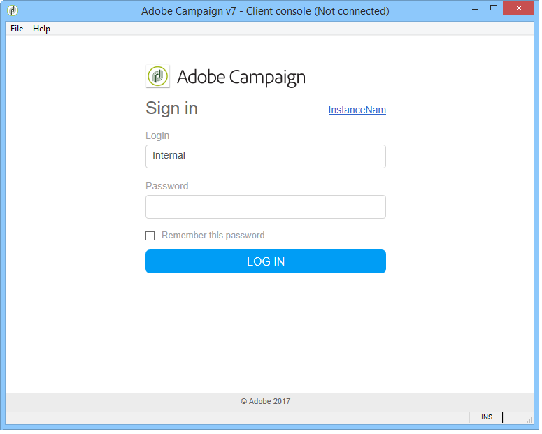

# Implementación empresarial{#enterprise-deployment}

Ésta es la configuración más completa. Se basa en la configuración estándar para la buena seguridad y disponibilidad:

* servidores de redirección dedicados detrás de un equilibrador de carga HTTP o TCP, para escalabilidad y disponibilidad,
* dos servidores de aplicaciones para mejorar el rendimiento y la capacidad de failover (tolerancia a fallas) y que están aislados en la LAN.

La comunicación general entre servidores y procesos se realiza según el siguiente esquema:


Con este tipo de configuración, el rendimiento esperado puede superar los 100.000 correos por hora con el ancho de banda y el ajuste adecuados.

## Funciones {#features}

### Ventajas {#advantages}

* Seguridad optimizada: Sólo los servidores que necesitan estar expuestos al exterior están instalados en el equipo en la DMZ.
* La alta disponibilidad es más fácil de garantizar: Sólo el equipo visible desde el exterior debe ser administrado teniendo en cuenta la alta disponibilidad.

### Desventajas {#disadvantages}

Mayor costo de hardware y administración.

### Equipo recomendado {#recommended-equipment}

* Servidores de aplicaciones: CPU de cuatro núcleos de 2 GHz, 4 GB de RAM, unidad de disco duro SATA RAID 1 de software de 80 GB.
* Servidores de redirección: CPU de cuatro núcleos de 2 GHz, 4 GB de RAM, unidad de disco duro SATA RAID 1 de software de 80 GB.

>[!NOTE]
>
>Es posible reutilizar un equilibrador de carga existente para el tráfico a los servidores de redirección.

## Pasos de instalación y configuración {#installation-and-configuration-steps}

### Requisitos previos {#prerequisites}

* JDK en ambos servidores de aplicaciones,
* Servidor web (IIS, Apache) en ambos frontales,
* Acceso a un servidor de bases de datos en ambos servidores de aplicaciones,
* Buzón de salida hacia otro sitio accesible mediante POP3,
* Creación de dos alias DNS en el equilibrador de carga:

   * el primero expuesto al público para rastrear y apuntar al equilibrador de carga en una dirección IP virtual (VIP) y que luego se distribuye a los dos servidores frontales,
   * la segunda se expone a los usuarios internos para obtener acceso a través de la consola y señala a un equilibrador de carga en una dirección IP virtual (VIP) y que luego se distribuye a los dos servidores de aplicaciones.

* Servidor de seguridad configurado para abrir STMP (25), DNS (53), HTTP (80), HTTPS (443), SQL (1521 para Oracle, 5432 para PostgreSQL, etc.) puertos. Para obtener más información, consulte la sección [Acceso a la base de datos](../../installation/using/network-configuration.md#database-access).

>[!CAUTION]
>
>Si los servidores de aplicaciones señalan a una instancia de base de datos única, después de importar un paquete estándar en una instancia, el esquema contenido en el paquete no se carga en la otra instancia.
>  
>Si los servidores de la aplicación apuntan a una instancia de base de datos única, después de cambiar el esquema en una instancia, el esquema no se carga en la otra.
>
>Para recuperar estos problemas, debe reiniciar el proceso &quot;web@default&quot; en la segunda instancia en la que se produjo un error.

### Instalación y configuración del servidor de aplicaciones 1 {#installing-and-configuring-the-application-server-1}

En los siguientes ejemplos, los parámetros de la instancia son:

* Nombre de la instancia: demostración
* Máscara DNS: tracking.campaña.net*, console.campaña.net* (el servidor de aplicaciones gestiona las direcciones URL de las conexiones e informes de la consola cliente y de las páginas espejo y páginas bajas)
* Idioma: Inglés
* Base de datos: campaña:demo@dbsrv

Los pasos para instalar el primer servidor son:

1. Siga el procedimiento de instalación del servidor de Adobe Campaign: **paquete nlserver** en Linux o **setup.exe** en Windows.

   Para obtener más información sobre esto, consulte [Requisitos previos para la instalación de Campaña en Linux](../../installation/using/prerequisites-of-campaign-installation-in-linux.md) (Linux) y [Requisitos previos para la instalación de Campaña en Windows](../../installation/using/prerequisites-of-campaign-installation-in-windows.md) (Windows).

1. Una vez instalado el servidor de Adobe Campaign, inicio el servidor de aplicaciones (web) mediante el comando **nlserver web -tomcat** (el módulo Web le permite inicio de Tomcat en modo de servidor Web independiente escuchando en el puerto 8080) y para asegurarse de que Tomcat inicio correctamente:

   ```
   12:08:18 >   Application server for Adobe Campaign Classic (7.X YY.R build XXX@SHA1) of DD/MM/YYYY
   12:08:18 >   Starting Web server module (pid=28505, tid=-1225184768)...
   12:08:18 >   Tomcat started
   12:08:18 >   Server started
   ```


   >[!NOTE]
   >
   >La primera vez que se ejecuta el módulo Web, crea los archivos **config-default.xml** y **serverConf.xml** en el directorio **conf** de la carpeta de instalación. Todos los parámetros disponibles en **serverConf.xml** se enumeran en esta [sección](../../installation/using/the-server-configuration-file.md).

   Presione **Ctrl+C** para detener el servidor.

   Para obtener más información sobre esto, consulte las siguientes secciones:

   * Para Linux: [Primer inicio del servidor](../../installation/using/installing-packages-with-linux.md#first-start-up-of-the-server)
   * Para Windows: [Primer inicio del servidor](../../installation/using/installing-the-server.md#first-start-up-of-the-server)

1. Cambie la contraseña **interna** mediante el comando:

   ```
   nlserver config -internalpassword
   ```

   Para obtener más información sobre esto, consulte [Identificador interno](../../installation/using/campaign-server-configuration.md#internal-identifier).

1. Cree la instancia **demo** con las máscaras DNS para el seguimiento (en este caso, **tracking.campaña.net**) y el acceso a consolas de cliente (en este caso, **console.campaña.net**). Hay dos formas de hacerlo:

   * Cree la instancia a través de la consola:

      

      Para obtener más información sobre esto, consulte [Creación de una instancia e inicio de sesión](../../installation/using/creating-an-instance-and-logging-on.md).

      o

   * Cree la instancia mediante líneas de comandos:

      ```
      nlserver config -addinstance:demo/tracking.campaign.net*,console.campaign.net*
      ```

      Para obtener más información sobre esto, consulte [Creación de una instancia](../../installation/using/command-lines.md#creating-an-instance).

1. Edite el archivo **config-demo.xml** (creado mediante el comando anterior y ubicado junto al archivo **config-default.xml**), compruebe que **mta** (envío), **wfserver** (flujo de trabajo), **inMail** (reta) los mensajes de correo enlazados) y los procesos **stat** (estadísticas) están habilitados, luego configure la dirección del servidor de estadísticas **app**:

   ```
   <?xml version='1.0'?>
   <serverconf>  
     <shared>    
       <!-- add lang="eng" to dataStore to force English for the instance -->    
       <dataStore hosts="tracking.campaign.net*,console.campaign.net*">      
         <mapping logical="*" physical="default"/>    
       </dataStore>  </shared>  
       <mta autoStart="true" statServerAddress="app">
       <wfserver autoStart="true"/>  
       <inMail autoStart="true"/>  
       <sms autoStart="false"/>  
       <listProtect autoStart="false"/>
   </serverconf>
   ```

   Para obtener más información sobre esto, consulte [Habilitación de procesos](../../installation/using/campaign-server-configuration.md#enabling-processes).

1. Edite el archivo **serverConf.xml** y especifique el dominio de envío, luego especifique las direcciones IP (o host) de los servidores DNS utilizados por el módulo MTA para responder consultas DNS de tipo MX.

   ```
   <dnsConfig localDomain="campaign.com" nameServers="192.0.0.1, 192.0.0.2"/>
   ```

   >[!NOTE]
   >
   >Los parámetros **nameServers** sólo se utilizan en Windows.

   Para obtener más información sobre esto, consulte [configuración del servidor de Campaña](../../installation/using/campaign-server-configuration.md).

1. Copie el programa de configuración de la consola de cliente (**setup-client-7.XX**, **YYYY.exe** para v7 o **setup-client-6.XX**, **YYYY.exe** para v6.1) en **/datakit/nl carpeta /eng/jsp**.

   Para obtener más información sobre esto, consulte las siguientes secciones:

   * Para Linux: [Disponibilidad de la consola del cliente para Linux](../../installation/using/client-console-availability-for-linux.md)
   * Para Windows: [Disponibilidad de la consola de cliente para Windows](../../installation/using/client-console-availability-for-windows.md).

1. Inicio el servidor Adobe Campaign (**net inicio nlserver6** en Windows, **/etc/init.d/nlserver6 inicio** en Linux) y ejecute el comando **nlserver pdump** una vez más para comprobar la presencia de todos los módulos habilitados.

   >[!NOTE]
   >
   >A partir de 20.1, se recomienda utilizar el siguiente comando en su lugar (para Linux): **inicio de sistema nlserver**


   ```
   12:09:54 >   Application server for Adobe Campaign Classic (7.X YY.R build XXX@SHA1) of DD/MM/YYYY
   syslogd@default (7611) - 9.2 MB
   stat@demo (5988) - 1.5 MB
   inMail@demo (7830) - 11.9 MB
   watchdog (27369) - 3.1 MB
   mta@demo (7831) - 15.6 MB
   wfserver@demo (7832) - 11.5 MB
   web@default (28671) - 40.5 MB
   ```

   Este comando también le permite conocer la versión y el número de compilación del servidor de Adobe Campaign instalado en el equipo.

1. Pruebe el módulo **nlserver web** con la dirección URL: [https://console.campaign.net/nl/jsp/logon.jsp](https://tracking.campaign.net/r/test).

   Esta URL le permite acceder a la página de descarga del programa de configuración del cliente.

   Introduzca el inicio de sesión **interno** y la contraseña asociada cuando llegue a la página de control de acceso.

   

   Para obtener más información sobre esto, consulte las siguientes secciones:

   * Para Linux: [Disponibilidad de la consola del cliente para Linux](../../installation/using/client-console-availability-for-linux.md)
   * Para Windows: [Disponibilidad de la consola de cliente para Windows](../../installation/using/client-console-availability-for-windows.md)

### Instalación y configuración del servidor de aplicaciones 2 {#installing-and-configuring-the-application-server-2}

Siga estos pasos:

1. Instale el servidor de Adobe Campaign.
1. Copie los archivos de la instancia creada en el servidor de aplicaciones 1.

   Conservamos el mismo nombre de instancia que el servidor de aplicaciones 1.

1. Cambie el **interno** por el mismo que el servidor de aplicaciones 1.
1. Vincule la base de datos a la instancia:

   ```
   nlserver config -setdblogin:PostgreSQL:campaign:demo@dbsrv -instance:demo
   ```

1. Edite el archivo **config-demo.xml** (creado mediante el comando anterior y ubicado junto al archivo **config-default.xml**), compruebe que **mta** (envío), **wfserver** (flujo de trabajo), **inMail** (reta) los mensajes de correo enlazados) y los procesos **stat** (estadísticas) están habilitados, luego configure la dirección del servidor de estadísticas **app**:

   ```
   <?xml version='1.0'?>
   <serverconf>  
     <shared>    
       <!-- add lang="eng" to dataStore to force English for the instance -->    
       <dataStore hosts="tracking.campaign.net*,console.campaign.net*">      
         <mapping logical="*" physical="default"/>    
       </dataStore>  </shared>  
       <mta autoStart="true" statServerAddress="app">
       <wfserver autoStart="true"/>  
       <inMail autoStart="true"/>  
       <sms autoStart="false"/>  
       <listProtect autoStart="false"/>
   </serverconf>
   ```

   Para obtener más información sobre esto, consulte [Habilitación de procesos](../../installation/using/campaign-server-configuration.md#enabling-processes).

1. Edite el archivo **serverConf.xml** y rellene la configuración DNS del módulo MTA:

   ```
   <dnsConfig localDomain="campaign.com" nameServers="192.0.0.1, 192.0.0.2"/>
   ```

   >[!NOTE]
   >
   >El parámetro **nameServers** solo se utiliza en Windows.

   Para obtener más información sobre esto, consulte [configuración del servidor de Campaña](../../installation/using/campaign-server-configuration.md).

1. Inicio de los servidores Adobe Campaign.

   Para obtener más información sobre esto, consulte las siguientes secciones:

   * Para Linux: [Primer inicio del servidor](../../installation/using/installing-packages-with-linux.md#first-start-up-of-the-server)
   * Para Windows: [Primer inicio del servidor](../../installation/using/installing-the-server.md#first-start-up-of-the-server)

### Instalación y configuración de los servidores frontales {#installing-and-configuring-the-frontal-servers}

Los procedimientos de instalación y configuración son idénticos en ambos equipos.

Los pasos son los siguientes:

1. Instale el servidor de Adobe Campaign,
1. Siga el procedimiento de integración del servidor Web (IIS, Apache) descrito en las siguientes secciones:

   * Para Linux: [Integración en un servidor Web para Linux](../../installation/using/integration-into-a-web-server-for-linux.md),
   * Para Windows: [Integración en un servidor Web para Windows](../../installation/using/integration-into-a-web-server-for-windows.md).

1. Copie los archivos **config-demo.xml** y **serverConf.xml** creados durante la instalación. En el archivo **config-demo.xml**, active el proceso **trackinglogd** y desactive los procesos **mta**, **inmail**, **wfserver** y **stat**. ...
1. Edite el archivo **serverConf.xml** y rellene los servidores de seguimiento redundantes en los parámetros de la redirección:

   ```
   <spareServer enabledIf="$(hostname)!='front_srv1'" id="1" url="https://front_srv1:8080"/>
   <spareServer enabledIf="$(hostname)!='front_srv2'" id="2" url="https://front_srv2:8080"/>
   ```

1. Inicio del sitio web y prueba la redirección desde la dirección URL: [https://tracking.campaign.net/r/test](https://tracking.campaign.net/r/test)

   El explorador debe mostrar los siguientes mensajes (según la dirección URL redireccionada por el equilibrador de carga):

   ```
   <redir status="OK" date="AAAA/MM/JJ HH:MM:SS" build="XXXX" host="tracking.campaign.net" localHost="front_srv1"/>
   ```

   o

   ```
   <redir status="OK" date="AAAA/MM/JJ HH:MM:SS" build="XXXX" host="tracking.campaign.net" localHost="front_srv2"/>
   ```

   Para obtener más información sobre esto, consulte las siguientes secciones:

   * Para Linux: [Inicio del servidor Web y prueba de la configuración](../../installation/using/integration-into-a-web-server-for-linux.md#launching-the-web-server-and-testing-the-configuration),
   * Para Windows: [Iniciar el servidor Web y probar la configuración](../../installation/using/integration-into-a-web-server-for-windows.md#launching-the-web-server-and-testing-the-configuration).

1. Inicio del servidor Adobe Campaign.

