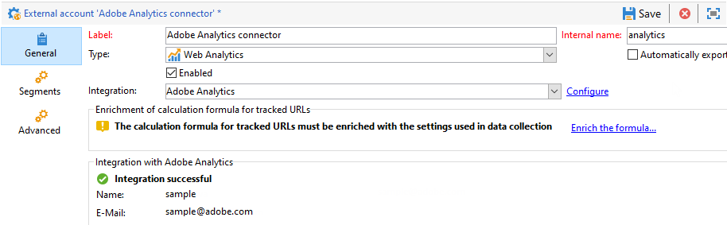
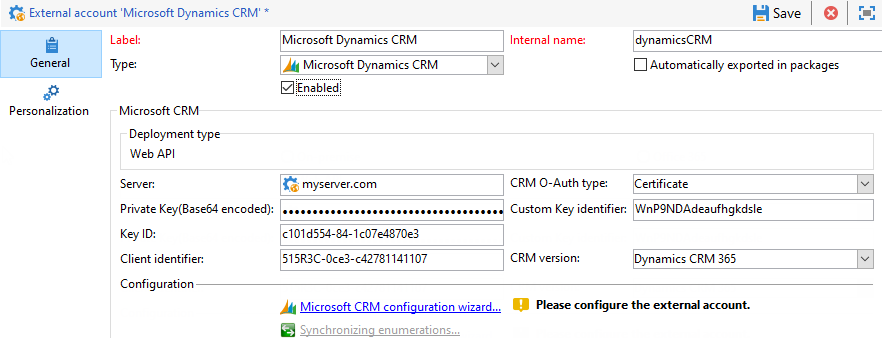

# Cuentas externas{#external-accounts}

Adobe Campaign viene con un conjunto de cuentas externas predefinidas. Para configurar conexiones con sistemas externos, puede crear nuevas cuentas externas.

Los procesos técnicos utilizan las cuentas externas como flujos de trabajo técnicos o flujos de trabajo de campaña. Al configurar una transferencia de archivos en un flujo de trabajo o un intercambio de datos con cualquier otra aplicación (Adobe Target, Experience Manager, etc.), debe seleccionar una cuenta externa.

Puede configurar los siguientes tipos de cuentas externas:

* [Enrutamiento de cuenta externa](#routing-external-account)
* [Cuenta externa de FTP](#ftp-external-account)
* [Cuenta externa de la base de datos externa](#external-database-external-account)
* [Cuenta externa de Web Analytics](#web-analytics-external-account)
* [Facebook conecta una cuenta externa](#facebook-connect-external-account)
* [Cuenta externa de instancia de ejecución](#execution-instance-external-account)
* [Configuración de una cuenta externa de Adobe Experience Cloud](#adobe-experience-cloud-external-account)
* [Cuenta externa SFTP](#sftp-external-account)
* [Cuenta externa de Adobe Experience Manager](#adobe-experience-manager-external-account)
* [Cuenta externa de Amazon Storage Service (S3)](#amazon-simple-storage-service--s3--external-account)
* [Cuenta externa de Microsoft Dynamics CRM](#microsoft-dynamics-crm-external-account)
* [Cuenta externa de Salesforce CRM](#salesforce-crm-external-account)

## Creación de una cuenta externa {#creating-an-external-account}

Para crear una nueva cuenta externa, siga los pasos a continuación. La configuración detallada depende del tipo de cuenta externa.

1. En la Campaña **[!UICONTROL Explorer]**, seleccione **[!UICONTROL Administration]** &#39;>&#39; **[!UICONTROL Platform]** &#39;>&#39; **[!UICONTROL External accounts]**.

   

1. Haga clic en el botón **[!UICONTROL New]**.

   

1. Escriba un **[!UICONTROL Label]** y un **[!UICONTROL Internal Name]**.
1. Seleccione la cuenta externa **[!UICONTROL Type]** que desee crear.
1. Configure el acceso a la cuenta especificando las credenciales según el tipo de cuenta externa elegida.

   La información necesaria suele ser proporcionada por el proveedor del servidor al que está conectándose.

1. Active la opción **[!UICONTROL Enabled]** para activar la conexión.
1. Haga clic en **[!UICONTROL Save]**.

La cuenta externa se crea y se agrega a la lista de cuentas externas.

## Cuenta externa de rebote de correos electrónicos {#bounce-mails-external-account}

La cuenta externa **Rebote de correos electrónicos** especifica la cuenta POP3 externa que se utilizará para conectar con el servicio de correo electrónico. Para obtener más información sobre esta cuenta externa, consulte esta [página](../../workflow/using/inbound-emails.md).

Todos los servidores configurados para el acceso POP3 pueden utilizarse para recibir el correo electrónico devuelto.


Para configurar la cuenta externa **[!UICONTROL Bounce mails (defaultPopAccount)]**:

* **[!UICONTROL Server]**

   URL del servidor POP3.

* **[!UICONTROL Port]**

   Número de puerto de conexión POP3. El puerto predeterminado es 110.

* **[!UICONTROL Account]**

   Nombre del usuario.

* **[!UICONTROL Password]**

   Contraseña de la cuenta de usuario.

* **[!UICONTROL Encryption]**

   Tipo de cifrado elegido entre **[!UICONTROL By default]**, **[!UICONTROL POP3 + STARTTLS]**, **[!UICONTROL POP3]** o **[!UICONTROL POP3S]**.

## Enrutamiento de cuenta externa {#routing-external-account}

La cuenta externa **[!UICONTROL Routing]** permite configurar cada canal disponible en Adobe Campaign según los paquetes instalados.


Se pueden configurar los siguientes canales:

* [Correo electrónico](../../installation/using/deploying-an-instance.md#email-channel-parameters)
* [Móvil (SMS)](../../delivery/using/sms-channel.md#creating-an-smpp-external-account)
* [Teléfono](../../delivery/using/steps-about-delivery-creation-steps.md#other-channels)
* [Correo postal](../../delivery/using/about-direct-mail-channel.md)
* [Agencia](../../delivery/using/steps-about-delivery-creation-steps.md#other-channels)
* [Facebook](../../social/using/publishing-on-facebook-walls.md#delegating-write-access-to-adobe-campaign)
* [Twitter](../../social/using/configuring-publishing-on-twitter.md)
* [Canal de iOS](../../delivery/using/configuring-the-mobile-application.md)
* [Canal de Android](../../delivery/using/configuring-the-mobile-application-android.md)

## Cuenta externa de FTP {#ftp-external-account}

La cuenta externa de FTP permite configurar y probar el acceso a un servidor fuera de Adobe Campaign. Para configurar conexiones con sistemas externos como servidores FTP 898 utilizados para transferencias de archivos, puede crear sus propias cuentas externas. Para obtener más información, consulte [esta página](../../workflow/using/file-transfer.md).

Especifique en esta cuenta externa la dirección y las credenciales utilizadas para establecer la conexión con el servidor FTP.


* **[!UICONTROL Server]**

   Nombre del servidor FTP.

* **[!UICONTROL Port]**

   Número de puerto de conexión FTP. El puerto predeterminado es 21.

* **[!UICONTROL Account]**

   Nombre del usuario.

* **[!UICONTROL Password]**

   Contraseña de la cuenta de usuario.

* **[!UICONTROL Encryption]**

   Tipo de cifrado elegido entre **[!UICONTROL None]** o **[!UICONTROL SSL]**.

Para saber dónde ubicar estas credenciales, consulte esta [página](https://help.dreamhost.com/hc/en-us/articles/115000675027-FTP-overview-and-credentials).

## Cuenta externa de la base de datos externa {#external-database-external-account}

Utilice la cuenta externa de tipo **Base de datos externa** para conectarse a una base de datos externa. Obtenga más información sobre la opción Acceso de datos federado (FDA) en [esta sección](../../installation/using/about-fda.md).

Las bases de datos externas compatibles con la Campaña se enumeran en la [Matriz de compatibilidad](../../rn/using/compatibility-matrix.md)


La configuración de la cuenta externa depende del motor de procesamiento de la base de datos. Obtenga más información en las siguientes secciones:

* Configurar el acceso a [Azure Synapse](../../installation/using/configure-fda-synapse.md)
* Configurar el acceso a [Hadoop](../../installation/using/configure-fda-hadoop.md)
* Configurar el acceso a [Oracle](../../installation/using/configure-fda-oracle.md)
* Configurar el acceso a [Netezza](../../installation/using/configure-fda-netezza.md)
* Configurar el acceso a [SAP HANA](../../installation/using/configure-fda-sap-hana.md)
* Configurar el acceso a [Snowflake](../../installation/using/configure-fda-snowflake.md)
* Configurar el acceso a [Sybase IQ](../../installation/using/configure-fda-sybase.md)
* Configurar el acceso a [Teradata](../../installation/using/configure-fda-teradata.md)

## Cuenta externa de Web Analytics {#web-analytics-external-account}

La cuenta externa **[!UICONTROL Web Analytics (Adobe Analytics - Data connector)]** permite reenviar datos de Adobe Analytics a Adobe Campaign en forma de segmentos. Por el contrario, envía indicadores y atributos de las campañas de correo electrónico que envía Adobe Campaign a Adobe Analytics: conector de datos.



Para esta cuenta externa, la fórmula de cálculo para URL rastreadas debe ser enriquecida y la conexión entre las dos soluciones debe ser aprobada. Para obtener más información, consulte [esta página](../../platform/using/adobe-analytics-data-connector.md#step-2--create-the-external-account-in-campaign).

## Facebook conecta una cuenta externa {#facebook-connect-external-account}

La cuenta externa de **[!UICONTROL Facebook Connect]** permite mostrar contenido personalizado en las aplicaciones de Facebook, lo que facilita la adquisición de clientes potenciales mediante esta red social.

Para cada aplicación de Facebook, es necesario crear una cuenta externa de tipo **[!UICONTROL Facebook Connect]**. Para obtener más información, consulte [esta página](../../social/using/creating-a-facebook-application.md#configuring-external-accounts).


* **[!UICONTROL Hosting mode]**

   Modo de alojamiento de la aplicación entre **[!UICONTROL hosted by a partner]** o **[!UICONTROL hosted by this instance]**.

* **[!UICONTROL Application ID]**

   ID de aplicación de Facebook.

* **[!UICONTROL Application secret]**

   Secreto de aplicación de Facebook.

Si elige el alojamiento mediante este modo de instancia, será necesario pegar Secure Canvas URL en el campo de Facebook **Juegos de Facebook Web (https)**

Para saber dónde ubicar estas credenciales, consulte esta [página](https://developers.facebook.com/docs/facebook-login/access-tokens).

## Cuenta externa de instancia de ejecución {#execution-instance-external-account}

Si tiene una arquitectura desglosada, es necesario especificar las instancias de ejecución vinculadas a la instancia de control y conectarlas. Las plantillas de mensajes transaccionales se implementan en las instancias de ejecución.


* **[!UICONTROL URL]**

   URL del servidor en el que está instalada la instancia de ejecución.

* **[!UICONTROL Account]**

   El nombre de la cuenta debe coincidir con el Agente del centro de mensajes definido en la carpeta del operador.

* **[!UICONTROL Password]**

   Contraseña de la cuenta tal como se define en la carpeta del operador.

Para obtener más información sobre esta configuración, consulte esta [página](../../message-center/using/creating-a-shared-connection.md#control-instance).

## Configuración de una cuenta externa de Adobe Experience Cloud {#adobe-experience-cloud-external-account}

Para conectarse a la consola de Adobe Campaign mediante un Adobe ID, debe configurar la cuenta externa de **[!UICONTROL Adobe Experience Cloud (MAC)]**.


* **[!UICONTROL IMS server]**

   URL del servidor IMS. Asegúrese de que las instancias de ensayo y de producción indiquen el mismo punto final de producción IMS.

* **[!UICONTROL IMS scope]**

   Los ámbitos definidos aquí deben ser un subconjunto de los que proporciona IMS.

* **[!UICONTROL IMS client identifier]**

   ID de su cliente IMS.

* **[!UICONTROL IMS client secret]**

   Credencial del secreto de su cliente IMS.

* **[!UICONTROL Callback server]**

   Acceso URL de su instancia de Adobe Campaign.

* **[!UICONTROL IMS organization ID]**

   ID de la organización IMS Para encontrar su ID de la organización, consulte [esta página](https://docs.adobe.com/content/help/es-ES/core-services/interface/manage-users-and-products/faq.html) (**¿Dónde puedo encontrar mi ID de organización IMS?**).

* **[!UICONTROL Association mask]**

   Sintaxis que permitirá nombres de configuración en Enterprise Dashboard para sincronizar con los grupos en Adobe Campaign.

* **[!UICONTROL Server]**

   URL de su instancia de Adobe Experience Cloud.

* **[!UICONTROL Tenant]**

   Nombre su inquilino de Adobe Experience Cloud.

Para obtener más información sobre esta configuración, consulte esta [página](../../integrations/using/configuring-ims.md).

## Cuenta externa SFTP {#sftp-external-account}

La cuenta externa SFTP permite configurar y probar el acceso a un servidor fuera de Adobe Campaign. Para configurar conexiones con sistemas externos como SFTP utilizados para transferencias de archivos, puede crear cuentas externas propias. Para obtener más información, consulte [esta página](../../workflow/using/file-transfer.md).


* **[!UICONTROL Server]**

   URL del servidor SFTP.

* **[!UICONTROL Port]**

   Número de puerto de conexión FTP. El puerto predeterminado es 22.

* **[!UICONTROL Account]**

   Nombre de cuenta utilizado para conectarse al servidor SFTP.

* **[!UICONTROL Password]**

   Contraseña utilizada para conectarse al servidor SFTP.

## Cuenta externa de Adobe Experience Manager {#adobe-experience-manager-external-account}

La cuenta externa **[!UICONTROL AEM (AEM instance)]** permite administrar el contenido de los envíos de correos electrónicos y los formularios directamente en Adobe Experience Manager.


* **[!UICONTROL Server]**

   URL del servidor de Adobe Experience Manager.

* **[!UICONTROL Port]**

   Nombre de la cuenta que se utiliza para conectarse a la instancia de creación de Adobe Experience Manager.

* **[!UICONTROL Password]**

   La contraseña utilizada para conectarse a la instancia de autor de Adobe Experience Manager.

Para obtener más información, consulte [esta sección](../../integrations/using/about-adobe-experience-manager.md).

## Cuenta externa de Amazon Storage Service (S3){#amazon-simple-storage-service--s3--external-account}

El conector de Amazon Simple Storage Service (S3) se puede utilizar para importar o exportar datos a Adobe Campaign. Se puede configurar en una actividad de flujo de trabajo. Para obtener más información, consulte [esta página](../../workflow/using/file-transfer.md).


Al configurar esta nueva cuenta externa, debe proporcionar los siguientes detalles:

* **[!UICONTROL AWS S3 Account Server]**

   La URL del servidor debe completarse de la siguiente manera:

   ```
   <S3bucket name>.s3.amazonaws.com/<s3object path>
   ```

* **[!UICONTROL AWS access key ID]**

   Para saber dónde encontrar el ID de clave de acceso de AWS, consulte [esta página](https://docs.aws.amazon.com/general/latest/gr/aws-sec-cred-types.html#access-keys-and-secret-access-keys).

* **[!UICONTROL Secret access key to AWS]**

   Para saber dónde encontrar la clave de acceso secreta a AWS, consulte [esta página](https://aws.amazon.com/fr/blogs/security/wheres-my-secret-access-key/).

* **[!UICONTROL AWS Region]**

   Para obtener más información sobre la región AWS, consulte esta [página](https://aws.amazon.com/about-aws/global-infrastructure/regions_az/).

* La casilla de verificación **[!UICONTROL Use server side encryption]** permite almacenar el archivo en modo codificado S3.

Para saber dónde encontrar el ID de clave de acceso y la clave de acceso secreta, consulte la [documentación](https://docs.aws.amazon.com/general/latest/gr/aws-sec-cred-types.html#access-keys-and-secret-access-keys) de los servicios web de Amazon.

## Cuenta externa de Microsoft Dynamics CRM {#microsoft-dynamics-crm-external-account}

La cuenta externa **[!UICONTROL Microsoft Dynamics CRM]** permite importar y exportar datos de Microsoft Dynamics en Adobe Campaign.

Obtenga más información sobre la Campaña - Conector de Microsoft Dynamics CRM en esta [página](../../platform/using/crm-ms-dynamics.md).

>[!NOTE]
>
> **[!UICONTROL On-premise]** y los tipos  **[!UICONTROL Office 365]** de implementación ya no se utilizan. [Más información](../../rn/using/deprecated-features.md).

Con el tipo de implementación **[!UICONTROL Web API]** y la autenticación **[!UICONTROL Password credentials]**, debe proporcionar los siguientes detalles:


* **[!UICONTROL Account]**

   Cuenta utilizada para iniciar sesión en Microsoft CRM.

* **[!UICONTROL Server]**

   URL del servidor Microsoft CRM.

* **[!UICONTROL Client identifier]**

   El ID del cliente se puede encontrar desde el portal de administración de Microsoft Azure en la categoría **[!UICONTROL Update your code]**, campo **[!UICONTROL Client ID]**.

* **[!UICONTROL CRM version]**

   Versión de la CRM entre **[!UICONTROL Dynamics CRM 2007]**, **[!UICONTROL Dynamics CRM 2015]** o **[!UICONTROL Dynamics CRM 2016]**.

Con el tipo de implementación **[!UICONTROL Web API]** y la autenticación **[!UICONTROL Certificate]**, debe proporcionar los siguientes detalles:



* **[!UICONTROL Server]**

   URL del servidor Microsoft CRM.

* **[!UICONTROL Private Key (Base64 encoded)]**

   Clave privada codificada en Base64.

* **[!UICONTROL Custom Key identifier]**

* **[!UICONTROL Key ID]**

* **[!UICONTROL Client identifier]**

   El ID del cliente se puede encontrar desde el portal de administración de Microsoft Azure en la categoría **[!UICONTROL Update your code]**, campo **[!UICONTROL Client ID]**.

* **[!UICONTROL CRM version]**

   Versión de la CRM entre **[!UICONTROL Dynamics CRM 2007]**, **[!UICONTROL Dynamics CRM 2015]** o **[!UICONTROL Dynamics CRM 2016]**.

Para obtener más información sobre esta configuración, consulte esta [página](../../platform/using/crm-connectors.md).

## Cuenta externa de Salesforce CRM {#salesforce-crm-external-account}

La cuenta externa **[!UICONTROL Salesforce CRM]** permite importar y exportar datos de Salesforce a Adobe Campaign.


Para configurar la cuenta externa de Salesforce CRM para que funcione con Adobe Campaign, proporcione los siguientes detalles:

* **[!UICONTROL Account]**

   Cuenta utilizada para iniciar sesión en Salesforce CRM.

* **[!UICONTROL Password]**

   Contraseña utilizada para iniciar sesión en Salesforce CRM.

* **[!UICONTROL Client identifier]**

   Para saber dónde encontrar el identificador de cliente, consulte esta [página](https://help.salesforce.com/articleView?id=000205876&amp;type=1).

* **[!UICONTROL Security token]**

   Para saber dónde encontrar el token de seguridad, consulte esta [página](https://help.salesforce.com/articleView?id=000205876&amp;type=1).

* **[!UICONTROL API version]**

   Versión de la API entre **[!UICONTROL Version 49]**, **[!UICONTROL Version 37]**, **[!UICONTROL Version 21]** o **[!UICONTROL Version 15]**.

Para esta cuenta externa, debe configurar Salesforce CRM con el asistente para configuración.

Para obtener más información sobre esta configuración, consulte esta [página](../../platform/using/crm-connectors.md).
