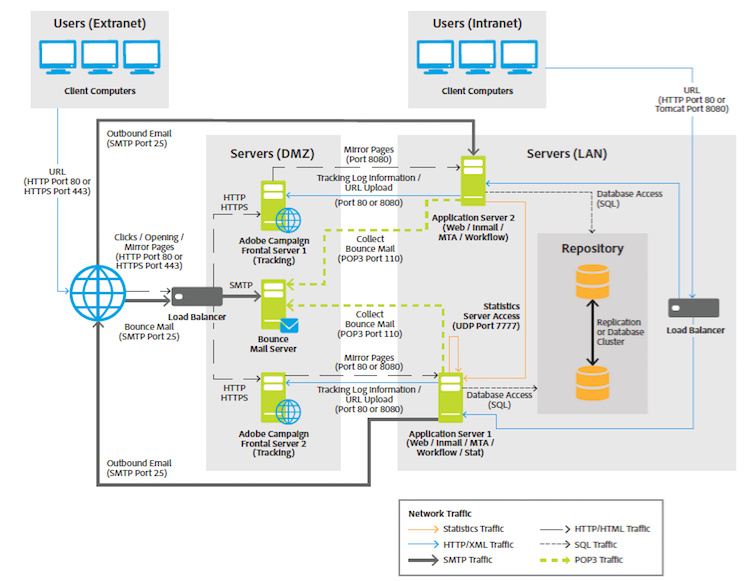

# Arquitectura general{#general-architecture}

La implementación típica de la solución de Adobe Campaign consta de los siguientes componentes:

* **Entorno de cliente personalizado**

  Interfaz gráfica intuitiva en la que los usuarios pueden comunicarse y rastrear ofertas de marketing, crear campañas, revisar y administrar todas las actividades, programas y planes de marketing, incluidos correos electrónicos, flujos de trabajo y páginas de aterrizaje, crear y administrar perfiles de clientes y definir tipos de audiencia de clientes.

* **Entorno de desarrollo**

  Software del lado del servidor que ejecuta las campañas de marketing a través de canales de comunicación seleccionados, incluidos correos electrónicos, SMS, notificaciones push, correo directo, web o social, en función de las reglas y flujos de trabajo definidos en la interfaz de usuario.

* **Contenedores de base de datos**

  Basada en la tecnología de bases de datos relacionales, la base de datos de Adobe Campaign almacena toda la información de los clientes, los componentes de campaña, las ofertas y los flujos de trabajo, así como los resultados de campaña, en contenedores de bases de datos de clientes.

Adobe Campaign se basa en una arquitectura orientada a servicios (SOA) y consta de varios módulos funcionales. Estos módulos se pueden implementar en uno o más equipos, en una o varias instancias, dependiendo de las restricciones en términos de escalabilidad, disponibilidad y aislamiento de servicios. Por lo tanto, el ámbito de las configuraciones de implementación es muy amplio y abarca un único equipo central hasta configuraciones que incluyen varios servidores dedicados en varios sitios.

>[!NOTE]
>
>Como proveedor de software, especificamos infraestructuras de hardware y software compatibles. Las recomendaciones de hardware que se ofrecen aquí son solo para fines informativos y se basan en nuestra experiencia. El Adobe no se responsabilizará de las decisiones que se tomen sobre la base de las mismas. También dependerá de las reglas y prácticas empresariales y de la importancia y los niveles de rendimiento requeridos del proyecto.

>[!CAUTION]
>
>Si no se indica explícitamente lo contrario, la instalación, las actualizaciones y el mantenimiento de todos los componentes de una plataforma de Adobe Campaign son responsabilidad del administrador del equipo que los aloja. Esto incluye implementar los requisitos previos para las aplicaciones de Adobe Campaign y cumplir con Campaign [Matriz de compatibilidad](../../rn/using/compatibility-matrix.md) entre componentes.

## Capa de presentación {#presentation-layer}

Se puede acceder a la aplicación de diferentes formas, según las necesidades de los usuarios: cliente enriquecido, cliente ligero o integración de API.

* **Cliente enriquecido**: la interfaz de usuario principal de la aplicación es un cliente enriquecido; es decir, es una aplicación nativa (Windows) que se comunica con el servidor de aplicaciones de Adobe Campaign únicamente con protocolos de Internet estándar (SOAP, HTTP, etc.). Esta consola proporciona una buena facilidad de uso para la productividad, utiliza muy poco ancho de banda (mediante el uso de una caché local) y está diseñada para facilitar la implementación. Esta consola se puede implementar desde un navegador de Internet, se puede actualizar automáticamente y no requiere ninguna configuración de red específica porque solo genera tráfico HTTP(S).
* **Cliente ligero**: se puede acceder a ciertas partes de la aplicación a través de un sencillo explorador web mediante una interfaz de usuario de HTML, que incluye el módulo de informes, las fases de aprobación de la entrega, las funcionalidades del módulo de Distributed Marketing (central/local), la monitorización de instancias, etc. Este modo permite incluir las funcionalidades de Adobe Campaign en una intranet o extranet.
* **Integración mediante las API**: en determinados casos, se puede llamar al sistema desde una aplicación externa mediante las API de servicios web expuestas mediante el protocolo SOAP.

## Capa de aplicación lógica {#logical-application-layer}

Adobe Campaign es una plataforma única con diferentes aplicaciones que se combinan para crear una arquitectura abierta y escalable. La plataforma de Adobe Campaign está escrita en un nivel de aplicación flexible y es fácilmente configurable para satisfacer las necesidades comerciales de una empresa. Esto se adapta a las crecientes necesidades de la empresa desde una perspectiva funcional, así como desde una perspectiva técnica. La arquitectura distribuida garantiza la escalabilidad lineal del sistema, que puede abarcar desde miles de mensajes hasta millones de mensajes.

Adobe Campaign se basa en un conjunto de procesos del lado del servidor que funcionan juntos.

Los procesos principales son:

**Servidor de aplicaciones** (nlserver web)

Este proceso expone la gama completa de funcionalidades de Adobe Campaign a través de las API de servicios web (SOAP - HTTP + XML). Además, puede generar dinámicamente las páginas web utilizadas para el acceso basado en HTML (informes, formularios web, etc.). Para conseguirlo, este proceso incluye un servidor JSP Apache Tomcat. Este es el proceso al que se conecta la consola.

**Motor de flujo de trabajo** (nlserver wfserver)

Ejecuta los procesos de flujo de trabajo definidos en la aplicación.

También gestiona flujos de trabajo técnicos ejecutados periódicamente, incluidos:

* Seguimiento: Recuperando y consolidando los registros de seguimiento. Permite recuperar los registros del servidor de redirección y crear los indicadores acumulados utilizados por el módulo de creación de informes.
* Cleanup: Limpieza de bases de datos. Se utiliza para purgar registros antiguos y evitar que la base de datos crezca exponencialmente.
* Facturación: envío automático de un informe de actividad para la plataforma (tamaño de la base de datos, número de acciones de marketing, número de perfiles activos, etc.).

**Servidor de entrega** (nlserver mta)

Adobe Campaign tiene la funcionalidad nativa de difusión por correo electrónico. Este proceso funciona como un agente de transferencia de correo SMTP (MTA). Realiza una personalización &quot;uno a uno&quot; de los mensajes y gestiona su envío físico. Funciona mediante trabajos de envío y gestiona reintentos automáticos. Además, cuando el seguimiento está habilitado, reemplaza automáticamente las direcciones URL para que apunten al servidor de redirección.

Este proceso puede gestionar la personalización y el envío automático a un enrutador de terceros para SMS, fax y correo postal.

**Servidor de redirección** (nlserver webmdl)

Para el correo electrónico, Adobe Campaign administra automáticamente el seguimiento de aperturas y clics (el seguimiento transaccional en el nivel de sitio web es una posibilidad adicional). Para conseguirlo, las URL incorporadas en los mensajes de correo electrónico se reescriben para que apunten a este módulo, que registra el paso del usuario de Internet antes de redirigirlo a la URL requerida.

Para garantizar la máxima disponibilidad, este proceso es totalmente independiente de la base de datos: los demás procesos del servidor se comunican con él utilizando llamadas SOAP (HTTP, HTTP(S) y XML) únicamente. Técnicamente, esta funcionalidad se implementa en un módulo de extensión de un servidor HTTP (extensión ISAPI en IIS, o módulo DSO Apache, etc.) y solo está disponible en Windows.

Otros procesos más técnicos también están disponibles:

**Administración de correos electrónicos rechazados** (nlserver enMail)

Este proceso le permite recoger automáticamente el correo electrónico de los buzones configurados para recibir mensajes devueltos en caso de error de entrega. A continuación, estos mensajes se someten a un procesamiento basado en reglas para determinar los motivos de la falta de entrega (destinatario desconocido, cuota excedida, etc.) y para actualizar el estado de envío en la base de datos.

Todas estas operaciones son totalmente automáticas y están preconfiguradas.

**Estado de envío de SMS** (nlserver sms)

Este proceso sondea el enrutador SMS para recopilar el estado de progreso y actualizar la base de datos.

**Escritura de mensajes de registro** (nlserver syslogd)

Este proceso técnico captura los mensajes de registro y los seguimientos generados por los otros procesos y los escribe en el disco duro. Esto hace que haya amplia información disponible para el diagnóstico en caso de problemas.

**Escritura de registros de seguimiento** (nlserver trackinglogd)

Este proceso guarda en disco los registros de seguimiento generados por el proceso de redirección.

**Escritura de eventos entrantes** (nlserver interactivo)

Este proceso garantiza la grabación en disco de eventos entrantes, dentro del marco de Interacción.

**Supervisión de módulos** (nlserver watchdog)

Este proceso técnico actúa como un proceso principal que genera los demás. También los monitoriza y los relanza automáticamente en caso de incidentes, manteniendo así el máximo tiempo de actividad del sistema.

**Servidor de estadísticas** (nlserver stat)

Este proceso mantiene estadísticas sobre el número de conexiones, los mensajes enviados para cada servidor de correo al que se envían los mensajes, así como sus limitaciones (número máximo de conexiones simultáneas, mensajes por hora/hora y/o conexión). También permite federar varias instancias o equipos si comparten las mismas direcciones IP públicas.

>[!NOTE]
>
>La lista completa de módulos de Adobe Campaign está disponible en [este documento](../../production/using/operating-principle.md).

## Capa de persistencia {#persistence-layer}

La base de datos se utiliza como capa de persistencia y contiene casi toda la información administrada por Adobe Campaign. Esto incluye datos funcionales (perfiles, suscripciones, contenido, etc.), datos técnicos (trabajos de envío y registros, registros de seguimiento, etc.) y datos de trabajo (compras, posibles clientes).

La fiabilidad de la base de datos es de suma importancia porque la mayoría de los componentes de Adobe Campaign requieren acceso a la base de datos para realizar sus tareas (con la notable excepción del módulo de redirección).

La plataforma viene predefinida con un data mart centrado en marketing o puede sentarse fácilmente sobre un data mart y esquema existentes usando cualquiera de los principales Sistemas de Administración de Bases de Datos Relacionales (RDBMS). La plataforma Adobe Campaign accede a todos los datos del data mart a través de llamadas SQL de Adobe Campaign a la base de datos. Adobe Campaign también proporciona un complemento completo de herramientas de extracción, transformación y carga (ETL) para importar y exportar datos dentro y fuera del sistema.
