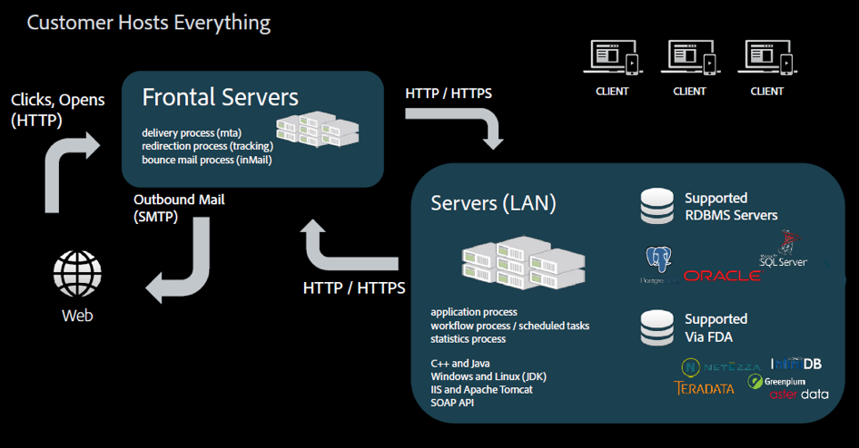
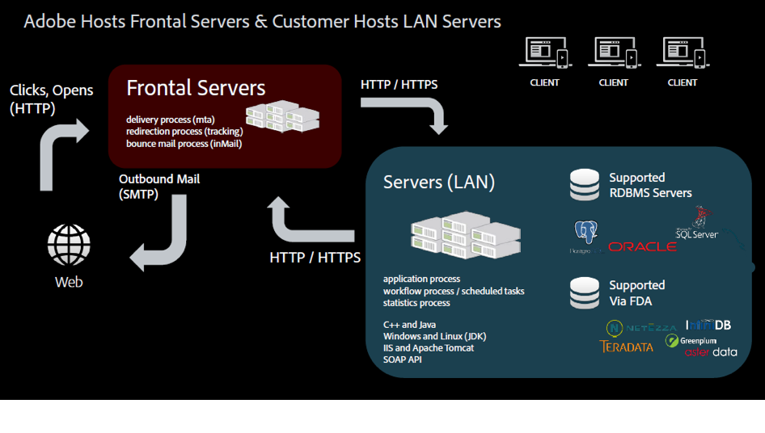

# Modelos de alojamiento{#hosting-models}

Adobe Campaign ofrece una selección de tres modelos de alojamiento, que proporcionan flexibilidad y libertad para elegir el mejor modelo o modelos para satisfacer las necesidades comerciales.

>[!NOTE]
>
>Para entornos alojados en Adobe, los pasos principales de instalación y configuración solo los puede realizar Adobe, como configurar el servidor y personalizar los archivos de configuración de instancia. Para obtener más información sobre las principales diferencias entre los modos de implementación, consulte [esta página](../../installation/using/capability-matrix.md).

## Managed Services/Alojado

Adobe Campaign se puede implementar en as a Managed Service: todos los componentes de Adobe Campaign, incluida la interfaz de usuario, el motor de administración de la ejecución y la base de datos de Campaign del cliente, están totalmente alojados en Adobe, incluida la ejecución de correo electrónico, las páginas espejo, el servidor de seguimiento y los componentes web externos, como la cancelación de suscripción de la página/centro de preferencias y las páginas de aterrizaje.

Como cliente alojado, la mayoría de los pasos de instalación y configuración los realiza Adobe. Puede acceder a las siguientes secciones para personalizar la implementación:

* Configure el seguimiento y las direcciones URL de las páginas espejo por marca. Para mensajes transaccionales, consulte [esta sección](../../message-center/using/additional-configurations.md#configuring-multibranding).
* Instale la consola de cliente: consulte [esta sección](../../installation/using/installing-the-client-console.md).
* Obtenga más información sobre las herramientas de envío y las prácticas recomendadas leyendo la [documentación detallada](../../delivery/using/about-deliverability.md).
* Configurar las opciones de Campaign: consulte [esta sección](../../installation/using/configuring-campaign-options.md).
* Configurar conectores CRM: consulte [esta sección](../../platform/using/crm-connectors.md).

## On-Premise

Adobe Campaign se puede implementar on-premise: todos los componentes de Adobe Campaign, incluida la interfaz de usuario, el motor de administración de la ejecución y la base de datos, residen in situ en el centro de datos del cliente. En este modelo de implementación, el cliente gestiona todas las actualizaciones y ampliaciones de software y hardware, y un administrador de base de datos dedicado debe realizar tareas de mantenimiento y optimización para garantizar la administración de instancias de Campaign.

Como cliente On-Premise, antes de empezar a implementar Campaign Classic, debe cumplir los siguientes requisitos previos y recomendaciones:

* Lea la [Matriz de compatibilidad](../../rn/using/compatibility-matrix.md) que enumera todas las versiones de los sistemas y componentes compatibles con Adobe Campaign.
* Según el entorno, lea los [requisitos previos para Windows](../../installation/using/prerequisites-of-campaign-installation-in-windows.md) y [requisitos previos para Linux](../../installation/using/prerequisites-of-campaign-installation-in-linux.md).
* Conozca las recomendaciones relacionadas con los motores de base de datos [en esta sección](../../installation/using/database.md).
* Compruebe que las capas de acceso a la base de datos requeridas están instaladas en el servidor y que se puede acceder a ellas desde la cuenta de Adobe Campaign. [Más información](../../installation/using/application-server.md).
* Configure las redes, ya que algunos procesos necesitan comunicarse con otros o acceder a la LAN y a Internet. Esto significa que algunos puertos TCP deben estar abiertos para estos procesos. [Más información](../../installation/using/network-configuration.md) acerca de los requisitos de configuración de red.
* Lea [Lista de comprobación de privacidad y seguridad de Campaign](https://helpx.adobe.com/es/campaign/kb/acc-security.html).
* Consulte las directrices generales para estimar los requisitos de hardware para la implementación local [en este artículo](https://helpx.adobe.com/es/campaign/kb/hardware-sizing-guide.html).

## Híbrido

Cuando se implementa como modelo híbrido, el software de la solución Adobe Campaign reside en las instalaciones del cliente, y Adobe proporciona la administración de la ejecución como servicio en la nube. La instancia de marketing de Adobe Campaign se instala dentro del cortafuegos de un cliente, por lo que la información de identificación personal (PII) permanece interna y solo se envían a la nube los datos necesarios para personalizar los correos electrónicos para su ejecución por correo electrónico. La instancia de ejecución, alojada en la nube, recibe las solicitudes de la instancia On-Premise para enviar correos electrónicos. Esta instancia personaliza todos los correos electrónicos y los envía. No se almacenan datos de ningún tipo de forma permanente en la nube.

Como cliente híbrido, la mayoría de los pasos de instalación y configuración los realiza Adobe. Puede acceder a las siguientes secciones para personalizar la implementación:

* Configurar mensajes transaccionales: consulte [esta sección](../../message-center/using/transactional-messaging-architecture.md).
* Configure el seguimiento y las direcciones URL de las páginas espejo por marca. Para mensajes transaccionales, consulte [esta sección](../../message-center/using/additional-configurations.md#configuring-multibranding).
* Instale la consola de cliente: consulte [esta sección](../../installation/using/installing-the-client-console.md).
* Instalar paquetes integrados: consulte [esta sección](../../installation/using/installing-campaign-standard-packages.md).
* Capacidad de entrega: configure [reglas MX](../../installation/using/email-deliverability.md#mx-configuration) y [formatos de correo electrónico](../../installation/using/email-deliverability.md#managing-email-formats). Obtenga más información sobre las herramientas de envío y las prácticas recomendadas leyendo la [documentación detallada](../../delivery/using/about-deliverability.md).
* Configurar las opciones de Campaign: consulte [esta sección](../../installation/using/configuring-campaign-options.md).
* Configure una base de datos externa (Acceso de datos federado): consulte [esta sección](../../installation/using/about-fda.md).
* Configuración de conectores CRM: consulte [esta sección](../../platform/using/crm-connectors.md).
* Para obtener más información sobre los principios de implementación intermediaria, consulte [esta sección](../../installation/using/mid-sourcing-deployment.md).
