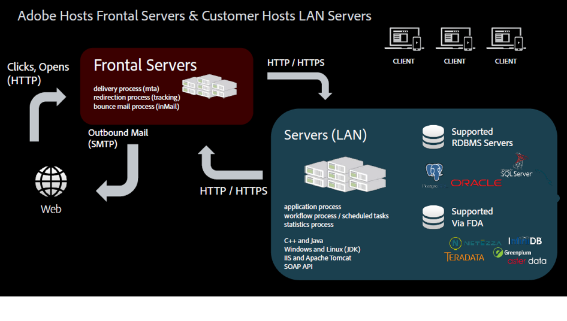

# Modelos de alojamiento{#hosting-models}

Adobe Campaign ofrece una selección de tres modelos de alojamiento, lo que proporciona flexibilidad y libertad para elegir el mejor modelo o modelos para satisfacer las necesidades empresariales.

>[!NOTE]
>
>Adobe solo puede realizar los pasos principales de instalación y configuración para implementaciones alojadas en Adobe. Por ejemplo, para configurar los archivos de configuración de instancia y servidor. Para obtener más información sobre las principales diferencias entre los modos de implementación, consulte [este artículo](https://helpx.adobe.com/campaign/kb/acc-on-prem-vs-hosted.html). Si tiene un modelo alojado o híbrido, consulte esta [sección](../../installation/using/about-hybrid-and-hosted-models.md).

* **Servicios administrados (alojados)**

   Adobe Campaign se puede implementar como un servicio administrado: todos los componentes de Adobe Campaign, incluida la interfaz de usuario, el motor de administración de la ejecución y la base de datos de Campaign del cliente, están totalmente alojados por Adobe, incluida la ejecución por correo electrónico, las páginas espejo, el servidor de seguimiento y los componentes web orientados externamente, como la cancelación de la suscripción de la página o del centro de preferencias y las páginas de aterrizaje. Adobe asigna hasta tres instancias en la nube: desarrollo, prueba/fase y producción. Los pasos de instalación y configuración para este modelo de alojamiento se presentan en esta [sección](../../installation/using/hosted-model.md).

   

* **In situ**

   Adobe Campaign se puede implementar in situ: todos los componentes de Adobe Campaign, incluida la interfaz de usuario, el motor de administración de la ejecución y la base de datos, residen en el centro de datos del cliente. En este modelo de implementación, el cliente administra todas las actualizaciones y actualizaciones de software y hardware, y un administrador de base de datos dedicado debe realizar tareas de mantenimiento y optimización para garantizar la administración de instancias de Campaign.

   

* **Híbrido**

   Cuando se implementa como un modelo híbrido, el software de la solución Adobe Campaign reside in situ en el sitio del cliente y Adobe proporciona la administración de la ejecución como un servicio en la nube. La instancia de marketing de Adobe Campaign se instala dentro del servidor de seguridad de un cliente, por lo que la información de identificación personal (PII) permanece interna y solo los datos necesarios para personalizar los correos electrónicos se envían a la nube para la ejecución por correo electrónico. La instancia de ejecución, alojada en la nube, recibe las solicitudes de la instancia local para enviar correos electrónicos. Esta instancia personaliza todos los correos electrónicos y los envía. Ningún dato de ningún tipo se almacena permanentemente en la nube. Los pasos de instalación y configuración para este modelo de alojamiento se presentan en esta [sección](../../installation/using/hybrid-model.md).

   

