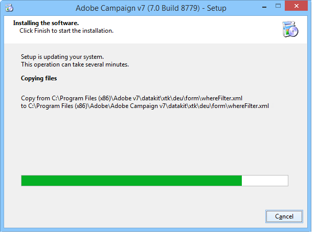

# Instalación del servidor{#installing-the-server}


## Ejecución del programa de instalación {#executing-the-installation-program}

Para una plataforma Windows de 32 bits, instale Adobe Campaign de 32 bits. Para una plataforma Windows de 64 bits, instale Adobe Campaign de 64 bits.

Los pasos de instalación del servidor de Adobe Campaign son los siguientes:

1. Ejecutar el archivo **setup.exe**.

   

1. Seleccione el tipo de instalación.

   

   Hay varios tipos de instalación disponibles:

   * **[!UICONTROL Installation of an application server]** : instale el servidor de aplicaciones de Adobe Campaign y la consola de cliente.
   * **[!UICONTROL Minimal installation (Network)]** : instalación del equipo cliente desde la red. Solo se instalará un número limitado de archivos DLL en el equipo, si es necesario, y todos los demás componentes se utilizarán desde una unidad de red.
   * **[!UICONTROL Installation of a client]** : instalación de los componentes necesarios para el cliente de Adobe Campaign.
   * **[!UICONTROL Custom installation]** : el usuario elige los elementos que se van a instalar.

   Seleccionar **Instalación de un servidor de aplicaciones** y siga los diferentes pasos que se muestran a continuación:

   

1. Seleccione el directorio de instalación:

   

1. Clic **[!UICONTROL Finish]** para iniciar la instalación:

   

   La barra de progreso muestra hasta dónde llega la instalación:

   

   Una vez finalizada la instalación, aparece un mensaje para informarle de lo siguiente:

   

   >[!NOTE]
   >
   >Una vez completada la instalación del servidor, es necesario reiniciar el servidor para evitar posibles problemas de red.

   Una vez finalizada la instalación, inicie Adobe Campaign para crear los archivos de configuración. Consulte [Primer inicio del servidor](#first-start-up-of-the-server).

## Pruebas de instalación de resumen {#summary-installation-testing}

Puede probar la instalación inicial con el siguiente comando:

```
nlserver pdump
```

Si Adobe Campaign no se inicia, la respuesta es:

```
No task
```

## Primer inicio del servidor {#first-start-up-of-the-server}

Una vez finalizada la prueba de instalación, abra un símbolo del sistema a través del **[!UICONTROL Start > Programs > Adobe Campaign]** e introduzca el siguiente comando:

```
nlserver web
```

Los archivos del directorio de instalación se utilizan para configurar los módulos del servidor de Adobe Campaign.

Se muestra la siguiente información:

```
15:30:12 >   Application server for Adobe Campaign Classic (7.X YY.R build XXX@SHA1) of DD/MM/YYYY
15:30:12 >   Web server start (pid=664, tid=4188)...
15:30:12 >   Creation of server configuration file '[INSTALL]bin..confserverConf.xml' server via '[INSTALL]bin..conffraserverConf.xml.sample
15:30:12 >   Creation of server configuration file '[INSTALL]bin..confconfig-default.xml' server via '[INSTALL]bin..confmodelsconfig-default.xml
15:30:12 >   Server started
15:30:12 >   Stop requested (pid=664)
15:30:12 >   Web server stop (pid=664, tid=4188)...
```

Prensa **Ctrl + C** para detener el proceso, introduzca el siguiente comando:

```
nlserver start web
```

Se muestra la siguiente información:

```
12:17:21 >   Application server for Adobe Campaign Classic (7.X YY.R build XXX@SHA1) of DD/MM/YYYY
12:17:21 >   Start of the 'web@default' ('nlserver web -tracefile:web@default -instance:default -detach -tomcat -autorepair') task in a new process 
12:17:21 >   Application server for Adobe Campaign Classic (7.X YY.R build XXX@SHA1) of DD/MM/YYYY
12:17:21 >   Web server start (pid=29188, tid=-1224824320)...
12:17:21 >   Generation of configuration changes '[INSTALL]bin..confserverConf.xml.diff' between '[INSTALL]bin..confserverConf.xml' and '[INSTALL]bin..conffraserverConf.xml.sample'
12:17:22 >   Tomcat started
12:17:22 >   Server started
```

Para detenerlo, escriba:

```
nlserver stop web
```

Se muestra la siguiente información:

```
12:18:31 >   Application server for Adobe Campaign Classic (7.X YY.R build XXX@SHA1) of DD/MM/YYYY
12:18:31 >   Stop requested for 'web@default' ('nlserver web -tracefile:web@default -instance:default -detach -tomcat -autorepair', pid=29188, tid=-1224824320)...
12:18:31 >   Stop requested (pid=29188)
12:18:31 >   Web server stopped (pid=29188, tid=-1224824320)...
```

## Contraseña para el identificador interno {#password-for-the-internal-identifier}

El servidor de Adobe Campaign define un inicio de sesión técnico llamado **interno** que tiene todos los derechos en todas las instancias. Justo después de la instalación, el inicio de sesión no tiene contraseña. Es obligatorio definir uno.

Obtenga más información en [esta sección](../../installation/using/configuring-campaign-server.md#internal-identifier).

## Inicio de servicios de Adobe Campaign {#starting-adobe-campaign-services}

Para iniciar los servicios de Adobe Campaign, puede utilizar el administrador de servicios o escribir lo siguiente en la línea de comandos (con los derechos adecuados):

```
net start nlserver6
```

Si necesita detener los procesos de Adobe Campaign más adelante, utilice el comando:

```
net stop nlserver6
```

## Instalación de LibreOffice {#installing-libreoffice}

Descargue LibreOffice y siga los pasos de instalación regulares.

Agregue la siguiente variable de entorno:

```
OOO_BASIS_INSTALL_DIR="C:\Program Files (x86)\LibreOffice 6\"
```
