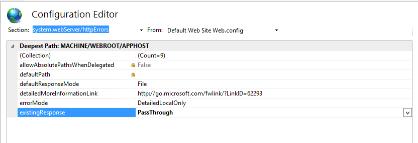

# Integración en un servidor web para Windows{#integration-into-a-web-server-for-windows}

Adobe Campaign incluye Apache Tomcat que actúa como punto de entrada en el servidor de aplicaciones a través de HTTP (y SOAP).

Puede utilizar este servidor Tomcat integrado para servir solicitudes HTTP.

En este caso:

* el puerto de escucha predeterminado es 8080. Para cambiarlo, consulte [esta sección](../../installation/using/configure-tomcat.md).
* Las consolas de cliente se conectan usando una dirección URL como [https:// `<computer>`:8080](https://myserver.adobe.com:8080).

Sin embargo, por motivos de seguridad y administración, recomendamos utilizar un servidor web dedicado como punto de entrada principal para el tráfico HTTP cuando el equipo que ejecuta Adobe Campaign está expuesto en Internet y desea abrir el acceso a la consola fuera de la red.

Un servidor web también permite garantizar la confidencialidad de los datos con el protocolo HTTP.

Del mismo modo, debe utilizar un servidor web cuando desee utilizar la funcionalidad de seguimiento, que solo está disponible como módulo de extensión de servidor web.

>[!NOTE]
>
>Si no utiliza la funcionalidad de seguimiento, puede realizar una instalación estándar de Apache o IIS con una redirección a Campaign. El módulo de extensión del servidor web de seguimiento no es necesario.

## Configuración del servidor web IIS {#configuring-the-iis-web-server}

El procedimiento de configuración de un servidor web IIS es principalmente gráfico. Implica utilizar un sitio web (ya creado o pendiente de creación) para acceder a los recursos del servidor de Adobe Campaign: Archivos Java (.jsp), hojas de estilo (.css, .xsl), imágenes (.png), la DLL ISAPI para redirección, etc.

Las siguientes secciones detallan la configuración en IIS 7. La configuración para IIS8 es básicamente la misma.

Si el servidor Web IIS no está instalado en el equipo, puede instalarlo mediante el menú **[!UICONTROL Add > Remove Programs > Enable or disable Windows functionalities]**.

En IIS 7, además de los servicios estándar, debe instalar las extensiones ISAPI y los filtros ISAPI.


### Pasos de configuración {#configuration-steps}

Aplique los siguientes pasos de configuración:

1. Abra IIS mediante el menú **[!UICONTROL Control panel > Administrative tools > Services]**.
1. Cree y configure el sitio (Adobe Campaign, por ejemplo) según los parámetros de la red (puerto de conexión TCP, host DNS, dirección IP).

   

   Debe especificar al menos el nombre del sitio y la ruta de acceso al directorio virtual. Como no se utiliza la ruta para acceder al directorio del sitio web, puede utilizar el siguiente directorio.

   ```
   C:\inetpub\wwwroot
   ```

   

1. Una secuencia de comandos **VBS** permite configurar automáticamente los recursos utilizados por el servidor de Adobe Campaign en el directorio virtual que acabamos de crear. Para iniciarlo, haga doble clic en el archivo **iis_neolane_setup.vbs** ubicado en la carpeta `[INSTALL]\conf`, donde `[INSTALL]` es la ruta para acceder a la carpeta de instalación de Adobe Campaign.

   

   >[!NOTE]
   >
   >En el caso de una instalación de Windows Server 2008/IIS7, debe iniciar sesión como administrador para ejecutar el script VBS o ejecutar el script como administrador.

   Haga clic en **[!UICONTROL OK]** si el servidor web se utiliza como servidor de redirección de seguimiento; de lo contrario, haga clic en **[!UICONTROL Cancel]**.

   Cuando ya hay varios sitios configurados en el servidor web, se muestra una página intermedia para especificar a qué sitio web se aplica la instalación: introduzca el número vinculado al sitio y haga clic en **[!UICONTROL OK]**.

   

   Se debe mostrar un mensaje de confirmación:

   

1. En la pestaña **[!UICONTROL Content View]**, asegúrese de que el sitio web esté configurado correctamente con los recursos de Adobe Campaign:

   

   Si no se muestra el árbol, reinicie IIS.

### Administración de derechos {#managing-rights}

A continuación, debe configurar la configuración de seguridad de la DLL ISAPI y de los recursos del directorio de instalación de Adobe Campaign.

Para ello, siga los siguientes pasos:

1. Seleccione la pestaña **[!UICONTROL Features View]** y haga doble clic en el enlace **Authentication**.

   

1. En la pestaña **Directory Security** del sitio web, asegúrese de que el acceso anónimo esté habilitado. Si es necesario, haga clic en el enlace **[!UICONTROL Edit]** para cambiar la configuración.

   

### Inicio del servidor web y prueba de la configuración {#launching-the-web-server-and-testing-the-configuration}

Ahora debe comprobar si la configuración es correcta.

Para ello, siga el siguiente procedimiento:

1. Reinicie el servidor IIS utilizando la línea de comandos **iisreset**.
1. Pruebe el módulo de seguimiento insertando la siguiente URL en un explorador web:

   ```
   https://<computer>/r/test
   ```

   El explorador debe mostrar la siguiente respuesta:

   ```
   <redir status='OK' date='YYYY/MM/DD HH:MM:SS' build='XXXX' host='myserver.mydomain.com' localHost='localhost'/>
   ```

Para comprobar la presencia del módulo de redirección, ejecute la siguiente línea de comandos:

```
nlserver pdump
```

Debe devolver la siguiente información:

```
12:00:33 >   Application server for Adobe Campaign Classic (7.X YY.R build XXX@SHA1) of DD/MM/YYYY
webmdl@default (1644) - 18.2 Mo
```

También puede asegurarse de que la DLL ISAPI esté correctamente cargada.

Para ello, siga los siguientes pasos:

1. Edite los filtros ISAPI para el sitio Adobe Campaign haciendo clic en el icono **[!UICONTROL Driver mapping]**.
1. Compruebe el contenido del filtro ISAPI:

   

## Configuraciones adicionales {#additional-configurations}

### Cambio del límite de tamaño del archivo de carga {#changing-the-upload-file-size-limit}

Al configurar el servidor Web IIS, se establece automáticamente un límite de aproximadamente 28 MB para los archivos establecidos que se cargan en el servidor.

Esto puede tener un impacto en Adobe Campaign, especialmente si desea cargar archivos que superen este límite.

Por ejemplo, si utiliza una actividad **Data loading (file)** en un flujo de trabajo para importar un archivo de 50 MB, un error impedirá que el flujo de trabajo se ejecute correctamente.

En este caso, debe aumentar este límite:

1. Abra IIS mediante el menú **[!UICONTROL Start > (Control panel) > Administration tools]**.
1. En el panel **Conexiones**, seleccione el sitio creado para la instalación del Adobe y, a continuación, haga doble clic en **Solicitar filtrado** en el panel principal.
1. En el panel **Acciones**, seleccione **Editar configuración de funciones** para poder editar el valor en el campo **Tamaño máximo autorizado del contenido (bytes)**.

   Por ejemplo, para autorizar la carga de archivos de 50 MB, debe especificar un valor de más de &quot;52428800&quot; bytes.

>[!NOTE]
>
>Para obtener más información sobre esta opción de IIS, consulte la sección &quot;Cómo hacerlo&quot; de la [documentación oficial](https://www.iis.net/configreference/system.webserver/security/requestfiltering/requestlimits).

### Configuración de la visualización del mensaje de error http {#configuring-http-error-message-display}

Si utiliza un servidor IIS de la versión 6.1, los mensajes de error generados pueden ser difíciles de leer debido a que en el mensaje se muestra un código HTML no deseado.

Para solucionar este problema y mostrar el error correctamente, aplique la siguiente configuración:

1. Abra IIS mediante el menú **[!UICONTROL Start > Control Panel > Administrative tools]**.
1. En el panel **Conexiones**, seleccione el sitio creado para la instalación de Adobe Campaign y, a continuación, haga doble clic en **Editor de configuración** en el panel principal.
1. En la lista desplegable **Section**, seleccione **system.webServer** > **httpErrors**.
1. Seleccione el valor **PassThrough** en la línea **existingResponse**.


