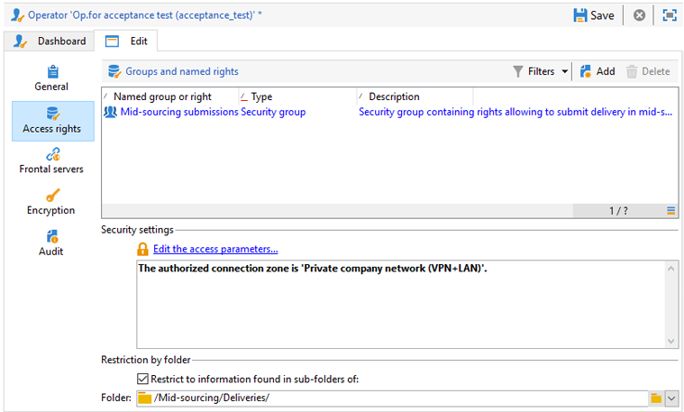

# Servidor intermediario{#mid-sourcing-server}

Esta sección detalla la instalación y configuración de un servidor intermediaria, así como la implementación de una instancia que permite a terceros enviar mensajes en modo **intermediaria**.

La arquitectura &quot;intermediaria&quot; se presenta en [implementación de Intermediarias](../../installation/using/mid-sourcing-deployment.md).

La instalación de un servidor intermediaria sigue el mismo proceso que la instalación de un servidor de la forma normal (consulte la configuración estándar). Es una instancia independiente con su propia base de datos que puede utilizarse para ejecutar envíos. En pocas palabras, contiene una configuración adicional para permitir que las instancias remotas ejecuten envíos en modo intermediaria.

>[!CAUTION]
>
>Una vez configurado el servidor intermediaria y ejecutados los [flujos de trabajo de sincronización](../../workflow/using/about-technical-workflows.md) por primera vez, asegúrese de no actualizar el nombre interno de las cuentas externas intermediaria.

## Pasos para instalar y configurar una instancia {#steps-for-installing-and-configuring-an-instance}

### Requisitos previos para instalar y configurar una instancia {#prerequisites-for-installing-and-configuring-an-instance}

* JDK en el servidor de aplicaciones.
* Acceso a un servidor de bases de datos en el servidor de aplicaciones.
* Servidor de seguridad configurado para abrir puertos HTTP (80) o HTTPS (443) en el servidor intermediaria.

El procedimiento siguiente detalla una configuración que utiliza un único servidor intermediaria. También es posible utilizar varios servidores. Del mismo modo, también es posible enviar determinados mensajes (como notificaciones de flujo de trabajo, por ejemplo) desde una configuración interna.

### Instalación y configuración del servidor de aplicaciones para la implementación de intermediarias {#installing-and-configuring-the-application-server-for-mid-sourcing-deployment}

El procedimiento de instalación es idéntico al de la instancia independiente. Consulte [Instalación y configuración (una sola máquina)](../../installation/using/standalone-deployment.md#installing-and-configuring--single-machine-).

Sin embargo, debe aplicar lo siguiente:

* En el paso **5**, debe deshabilitar los módulos **mta** (envío) y **inMail** (correos de devolución). Sin embargo, el módulo **wfserver** (flujo de trabajo) debe permanecer activado.

   ```
   <?xml version='1.0'?>
   <serverconf>  
     <shared>    
       <!-- add lang="eng" to dataStore to force English for the instance -->    
       <dataStore hosts="console.campaign.net*">      
         <mapping logical="*" physical="default"/>    
       </dataStore>  </shared>  
       <mta autoStart="false"/>  
       <wfserver autoStart="true"/>  
       <inMail autoStart="false"/>  
       <sms autoStart="false"/>  
       <listProtect autoStart="false"/>
   </serverconf>
   ```

   Para obtener más información sobre esto, consulte [Habilitación de procesos](../../installation/using/campaign-server-configuration.md#enabling-processes).

* Los pasos **6**, **9** y **10** no son necesarios.
* Durante los pasos **12** y **13**, debe indicar el puerto 8080 en la dirección URL de la conexión (ya que la consola se comunica directamente con Tomcat, no a través del servidor Web). La dirección URL se convierte en [http://console.campaign.net:8080](http://console.campaign.net). Durante el paso **13**, seleccione el paquete **[!UICONTROL Issue towards Mid-sourcing]**, así como los que desea instalar.

   

   >[!CAUTION]
   >
   >El enrutamiento predeterminado de envíos técnicos se sustituye automáticamente por el enrutamiento de correo electrónico a través del Intermediaria.

### Instalación y configuración del servidor intermediaria {#installing-and-configuring-the-mid-sourcing-server}

Desde la consola del cliente, busque el **enrutamiento de correo electrónico mediante la cuenta de intermediaria intermediaria** (en la carpeta **/Administration/Cuentas externas/**). Rellene la configuración de **URL del servidor**, **cuenta**, **contraseña** y **URL de Página espejo** con la información proporcionada por el proveedor del servidor que aloja el servidor intermediaria. Compruebe la conexión.

>[!NOTE]
>
>La opción **mid-sourcingEmitter** crea dos flujos de trabajo **Intermediaria**. Es un proceso que se ejecuta de forma predeterminada cada 1 hora y 20 minutos y que recopila información de envío en el servidor de intermediaria.

## Implementación de un servidor intermediaria {#deploying-a-mid-sourcing-server}

1. Instalación del servidor de aplicaciones:

   >[!CAUTION]
   >
   >Si instala el servidor intermediaria y desea instalar módulos Adobe Campaign adicionales, le recomendamos que utilice el módulo Envío y no el módulo Campaña.

   Siga el mismo procedimiento que para la implementación estándar, seleccionando sólo la opción **[!UICONTROL Mid-sourcing platform]**.

   

1. Configuración para recibir en modo intermediaria

   Establezca la contraseña de la cuenta de envío: En la carpeta **/Intermediaria/Access Management/Operators/**, la instancia remota utiliza el operador **mid** para envíos en modo intermediaria. Debe establecer una contraseña para este operador y proporcionarla al administrador de la instancia de envío.

   La opción **plataforma de Intermediaria** crea las carpetas predeterminadas para almacenar los envíos enviados y el operador predeterminado que realiza los envíos.

## Multiplexación del servidor intermediaria {#multiplexing-the-mid-sourcing-server}

>[!CAUTION]
>
>La multiplexación solo se admite para entornos in situ.

Es posible que varias instancias de envío compartan una instancia de intermediaria. Cada una de estas instancias debe estar asociada a un operador en la base de datos de intermediaria. Para crear una segunda cuenta en el servidor intermediaria:

1. Cree una carpeta en el nodo **[!UICONTROL Mid-sourcing > Deliveries]** que se asociará con la cuenta de intermediaria predeterminada (por ejemplo: prod).
1. Cree una carpeta en el nodo **[!UICONTROL Mid-sourcing > Deliveries]** con el mismo nombre que la cuenta (por ejemplo: accept_test).

   

1. En **[!UICONTROL Mid-sourcing > Access Management > Operators]**, cree una nueva cuenta.

   

1. En la ficha **[!UICONTROL Access rights]**, otorgue a este operador los derechos del grupo **envíos de Intermediarias**. Este derecho de acceso está disponible en **[!UICONTROL Mid-sourcing > Access Management > Operator groups]**.

   

1. Seleccione la opción **[!UICONTROL Restrict to data in the sub-folders of]** y seleccione la carpeta envíos para restringir este operador a la carpeta envíos intermediaria.

   

1. Reinicie el módulo Web con el siguiente comando: **nlserver reinicie web**.

Debe cambiar la configuración del servidor intermediaria en el archivo serverConf.xml. Se debe agregar la línea siguiente a la sección &quot;Administración de afinidades con direcciones IP&quot;, bajo la línea existente:

```
<IPAffinity IPMask="" localDomain="" name=""/>
```

El atributo &#39;@name&#39; debe respetar las siguientes reglas:

**&#39;marketing_account_operator_name&#39;.&#39;afinidad_name&#39;.&#39;afinidad_grupo&#39;**

&#39;marketing_account_operator_name&#39; se refiere al nombre interno de la cuenta de intermediaria declarada en la instancia de intermediaria.

&#39;Nombre_afinidad&#39; se refiere al nombre arbitrario que se le dio a la afinidad. Este nombre debe ser único. Los caracteres autorizados son `[a-z]``[A-Z]``[0-9]`. El objetivo es declarar un grupo de direcciones IP públicas.

&#39;afinidad_group&#39; hace referencia a la subafinidad declarada en la asignación de destino utilizada en cada uno de los envíos. La última parte, incluyendo el se ignora si no hay subafinidad. Los caracteres autorizados son `[a-z]``[A-Z]``[0-9]`.

Debe detener y luego reiniciar el servidor para que se tenga en cuenta la modificación.

## Configuración del seguimiento en un servidor intermediaria {#configuring-tracking-on-a-mid-sourcing-server}

**Configuración del servidor intermediaria**

1. Vaya a &#39;operadores&#39; y seleccione el operador **[!UICONTROL mid]**.
1. En la ficha **[!UICONTROL Frontal servers]**, introduzca los parámetros de conexión del servidor de seguimiento.

   Para crear una instancia de seguimiento, introduzca la dirección URL del servidor de seguimiento, la contraseña de la cuenta interna del servidor de seguimiento y el nombre de la instancia, su contraseña y las máscaras DNS asociadas a ella.

   

1. Cuando haya introducido los parámetros de conexión, haga clic en **[!UICONTROL Confirm the configuration]**.
1. Si es necesario, especifique la ubicación en la que se almacenarán las imágenes incluidas en los envíos. Para ello, seleccione uno de los modos de publicación de la lista desplegable.

   

   Si elige la opción **[!UICONTROL Tracking server(s)]**, las imágenes se copiarán en el servidor intermediaria.

**Configuración de la plataforma del cliente**

1. Vaya a la cuenta de enrutamiento del intermediaria externo.
1. En la ficha **[!UICONTROL Mid-Sourcing]**, especifique los parámetros de conexión del servidor intermediaria.

   

1. Confirme la configuración haciendo clic en **[!UICONTROL Test the connection]**.
1. Declare la instancia de seguimiento a la que se hace referencia en el servidor intermediaria:

   Haga clic en el vínculo **[!UICONTROL Use this platform as a proxy to access the tracking servers]**,

   Especifique el nombre de la instancia de seguimiento y confirme la conexión con el servidor de seguimiento.

   

Si el envío de mensajes debe ser administrado por varios servidores intermediarias, seleccione la opción **[!UICONTROL Routing with alternating mid-sourcing accounts]** y especifique los diferentes servidores.


