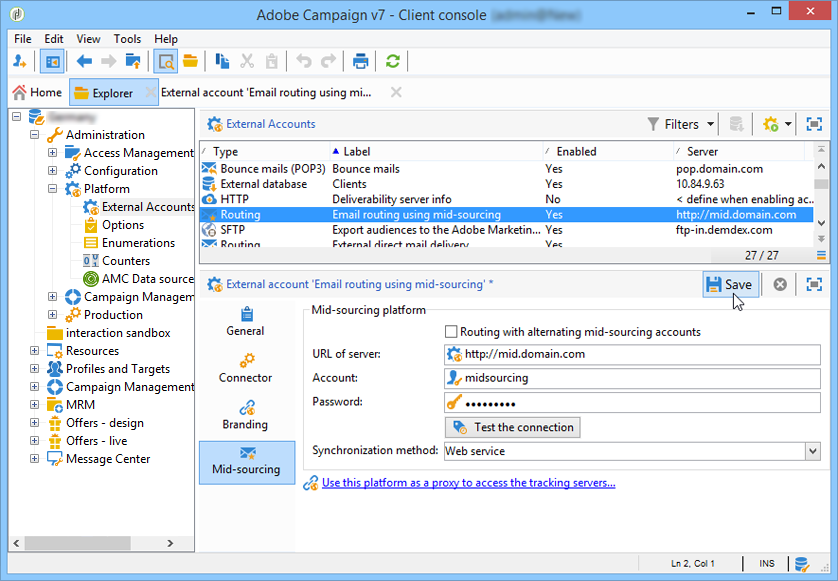

# Servidor intermediario{#mid-sourcing-server}


Esta sección detalla la instalación y configuración de un servidor intermediario, así como la implementación de una instancia que permite a terceros enviar mensajes en **intermediario** modo.

La arquitectura &quot;intermediaria&quot; se presenta en [Implementación intermediaria](../../installation/using/mid-sourcing-deployment.md).

La instalación de un servidor intermediario sigue el mismo proceso que la instalación de un servidor de la manera normal (consulte la configuración estándar). Es una instancia independiente con su propia base de datos que se puede utilizar para ejecutar envíos. En pocas palabras, contiene una configuración adicional para permitir que las instancias remotas ejecuten envíos a través de él en modo intermediario.

>[!CAUTION]
>
>Una vez configurado el servidor intermediario y la variable [sincronizar flujos de trabajo](../../workflow/using/about-technical-workflows.md) Si se han ejecutado por primera vez, asegúrese de no actualizar el nombre interno de las cuentas externas intermediarias.

## Pasos para instalar y configurar una instancia {#steps-for-installing-and-configuring-an-instance}

### Requisitos previos para instalar y configurar una instancia {#prerequisites-for-installing-and-configuring-an-instance}

* JDK en el servidor de aplicaciones.
* Acceso a un servidor de base de datos en el servidor de aplicaciones.
* Firewall configurado para abrir puertos HTTP (80) o HTTPS (443) en el servidor intermediario.

El siguiente procedimiento detalla una configuración mediante un único servidor intermediario. También es posible utilizar varios servidores. Del mismo modo, también es posible enviar ciertos mensajes (como notificaciones de flujo de trabajo, por ejemplo) desde una configuración interna.

### Instalación y configuración del servidor de aplicaciones para la implementación intermediaria {#installing-and-configuring-the-application-server-for-mid-sourcing-deployment}

El procedimiento de instalación es idéntico al de la instancia independiente. Consulte [Instalación y configuración (un solo equipo)](../../installation/using/standalone-deployment.md#installing-and-configuring--single-machine-).

Sin embargo, debe aplicar lo siguiente:

* En el paso **5**, Debe deshabilitar la variable **mta** (envío) y **inMail** módulos (correos electrónicos rechazados). El **wfserver** Sin embargo, el módulo (flujo de trabajo) debe permanecer activado.

  ```
  <?xml version='1.0'?>
  <serverconf>  
    <shared>    
      <!-- add lang="eng" to dataStore to force English for the instance -->    
      <dataStore hosts="console.campaign.net*">      
        <mapping logical="*" physical="default"/>    
      </dataStore>  </shared>  
      <mta autoStart="false"/>  
      <wfserver autoStart="true"/>  
      <inMail autoStart="false"/>  
      <sms autoStart="false"/>  
      <listProtect autoStart="false"/>
  </serverconf>
  ```

  Para obtener más información, consulte [esta sección](../../installation/using/configuring-campaign-server.md#enabling-processes).

* Pasos **6**, **9** y **10** no son necesarios.
* Durante los pasos **12** y **13**, debe indicar el puerto 8080 en la dirección URL de conexión (ya que la consola se comunica con Tomcat directamente, no a través del servidor web). La URL se convierte en `http://console.campaign.net:8080`. Durante el paso **13**, seleccione la **[!UICONTROL Issue towards Mid-sourcing]** así como los que se van a instalar.

  

  >[!CAUTION]
  >
  >El enrutamiento predeterminado de los envíos técnicos se reemplaza automáticamente por el enrutamiento de correo electrónico a través de intermediario.

### Instalación y configuración del servidor intermediario {#installing-and-configuring-the-mid-sourcing-server}

En la consola del cliente, busque **Enrutamiento de correo electrónico mediante intermediario** cuenta intermediaria (en el **/Administration/External accounts/** carpeta). Rellene el **URL del servidor**, **account**, **contraseña** y **URL de página espejo** con la información proporcionada por el proveedor del servidor que aloja el servidor intermediario. Compruebe la conexión.

>[!NOTE]
>
>El **mid-sourcingEmitter** opción crea dos **Mid-sourcing** flujos de trabajo. Es un proceso que se ejecuta de forma predeterminada cada 1 hora y 20 minutos y recopila información de envío en el servidor intermediario.

## Implementación de un servidor intermediario {#deploying-a-mid-sourcing-server}

1. Instalación del servidor de aplicaciones:

   >[!CAUTION]
   >
   >Si instala el servidor intermediario y desea instalar módulos Adobe Campaign adicionales, se recomienda utilizar el módulo Envío y no el módulo Campaign.

   Siga el mismo procedimiento que para el despliegue estándar, seleccionando sólo el **[!UICONTROL Mid-sourcing platform]** opción.

   

1. Configuración para recibir en modo intermediario

   Establezca la contraseña de la cuenta de envío: En la variable **/Mid-sourcing/Access Management/Operators/** carpeta, la **mid** la instancia remota utiliza el operador para los envíos en modo intermediario. Debe establecer una contraseña para este operador y proporcionársela al administrador de la instancia de envío.

   El **Mid-sourcing platform** crea las carpetas predeterminadas para almacenar los envíos enviados y el operador predeterminado que realiza los envíos.

## Multiplexación del servidor intermediario {#multiplexing-the-mid-sourcing-server}

>[!CAUTION]
>
>La multiplexación solo es compatible con entornos locales.

Es posible que varias instancias de envío compartan una instancia de intermediario. Cada una de estas instancias debe asociarse con un operador en la base de datos intermediaria. Para crear una segunda cuenta en el servidor intermediario:

1. Cree una carpeta en la **[!UICONTROL Mid-sourcing > Deliveries]** nodo que se asociará con la cuenta intermediaria predeterminada (por ejemplo: prod).
1. Cree una carpeta en la **[!UICONTROL Mid-sourcing > Deliveries]** nodo con el mismo nombre que la cuenta (por ejemplo: acceptance_test).

   

1. Entrada **[!UICONTROL Mid-sourcing > Access Management > Operators]**, cree una nueva cuenta.

   

1. En el **[!UICONTROL Access rights]** , otorgue a este operador los derechos del **Envíos intermediarios** grupo. Este derecho de acceso está disponible en **[!UICONTROL Mid-sourcing > Access Management > Operator groups]**.

   

1. Seleccione el **[!UICONTROL Restrict to data in the sub-folders of]** y seleccione la carpeta entregas para restringir este operador a la carpeta entregas intermediarias.

   

1. Reinicie el módulo web con el siguiente comando: **nlserver restart web**.

Debe cambiar la configuración del servidor intermediario en el archivo serverConf.xml. La línea siguiente se debe agregar a la sección &quot;Management of affinities with IP addresses&quot;, en la línea existente:

```
<IPAffinity IPMask="" localDomain="" name=""/>
```

El atributo &quot;@name&quot; debe respetar las siguientes reglas:

**&#39;marketing_account_operator_name&#39;.&#39;affinity_name&#39;.&#39;affinity_group&#39;**

&quot;marketing_account_operator_name&quot; hace referencia al nombre interno de la cuenta intermediaria declarada en la instancia intermediaria.

&#39;affinity_name&#39; se relaciona con el nombre arbitrario dado a la afinidad. Este nombre debe ser único. Los caracteres autorizados son `[a-z]``[A-Z]``[0-9]`. El objetivo es declarar un grupo de direcciones IP públicas.

&#39;affinity_group&#39; relaciona la subafinidad declarada en la asignación de destino utilizada en cada uno de los envíos. La última parte, incluido el &#39;.&#39; se ignora si no hay subafinidad. Los caracteres autorizados son `[a-z]``[A-Z]``[0-9]`.

Debe detener y reiniciar el servidor para que se tenga en cuenta la modificación.

## Configuración del seguimiento en un servidor intermediario {#configuring-tracking-on-a-mid-sourcing-server}

**Configuración del servidor intermediario**

1. Vaya a &quot;operadores&quot; y seleccione el operador **[!UICONTROL mid]**.
1. En el **[!UICONTROL Frontal servers]** , introduzca los parámetros de conexión del servidor de seguimiento.

   Para crear una instancia de seguimiento, introduzca la URL del servidor de seguimiento, la contraseña de la cuenta interna del servidor de seguimiento y el nombre de la instancia, su contraseña y las máscaras DNS asociadas a ella.

   

1. Cuando haya introducido los parámetros de conexión, haga clic en **[!UICONTROL Confirm the configuration]**.
1. Si es necesario, especifique la ubicación donde se almacenarán las imágenes contenidas en los envíos. Para ello, seleccione uno de los modos de publicación en la lista desplegable.

   

   Si elige la **[!UICONTROL Tracking server(s)]** , las imágenes se copiarán en el servidor intermediario.

**Configuración de la plataforma del cliente**

1. Vaya a la cuenta de enrutamiento intermediaria externa.
1. En el **[!UICONTROL Mid-Sourcing]** pestaña, especifique los parámetros de conexión del servidor intermediario.

   

1. Confirme la configuración haciendo clic en **[!UICONTROL Test the connection]**.
1. Declare la instancia de seguimiento a la que se hace referencia en el servidor intermediario:

   Haga clic en el vínculo **[!UICONTROL Use this platform as a proxy to access the tracking servers]**,

   Especifique el nombre de la instancia de seguimiento y, a continuación, confirme la conexión con el servidor de seguimiento.

   

Si el envío de mensajes debe administrarse mediante varios servidores intermediarios, seleccione la opción **[!UICONTROL Routing with alternating mid-sourcing accounts]** y especifique los distintos servidores.


