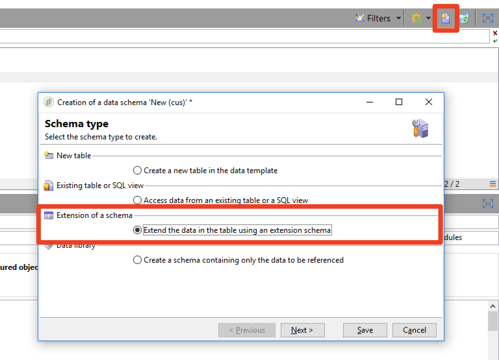

# Privacidad {#privacy}

## Solicitudes de privacidad

Adobe Campaign ofrece un conjunto de herramientas que le ayudan a cumplir con la privacidad de RGPD y CCPA.

Consulte [esta página](../../platform/using/privacy-management.md) para obtener información general sobre qué es la administración de privacidad y los pasos de implementación en Adobe Campaign. También encontrará recomendaciones e información general del proceso y de los perfiles del usuario.

## Personalización de la URL {#url-personalization}

Al añadir enlaces personalizados al contenido, evite siempre cualquier personalización en la parte del nombre de host de la dirección URL para evitar posibles lagunas de seguridad. Los siguientes ejemplos nunca deben utilizarse en todos los atributos de URL &lt;`a href="">` o ``:

* `<%= url >`
* `https://<%= url >`
* `https://<%= domain >/path`
* `https://<%= sub-domain >.domain.tld/path`
* `https://sub.domain<%= main domain %>/path`

### Recomendación

Para validar y asegurarse de que no está utilizando lo anterior, ejecute una consulta en la tabla de URL de seguimiento a través del [Editor de consultas genérico de campaña](../../platform/using/steps-to-create-a-query.md) o cree un flujo de trabajo con criterios de filtro en la [actividad de consulta](../../workflow/using/query.md).

Ejemplo:

1. Cree un flujo de trabajo y añada una actividad Query . Obtenga más información.

1. Abra la actividad Query y cree un filtro en la tabla nmsTrackingUrl de la siguiente manera: la URL de origen comienza con http://&lt;% o la URL de origen comienza con https://&lt;%.

1. Ejecute el flujo de trabajo y compruebe si hay resultados.

1. Si es así, abra la transición de salida para ver la lista de las direcciones URL.


### Mecanismo de firma

Para mejorar la seguridad, en la versión 19.1.4 (9032@3a9dc9c) se ha introducido un nuevo mecanismo de firma para el seguimiento de vínculos en correos electrónicos, que está disponible en las versiones 19.1.4 (9032@3a9dc9c) y 20.2. Esta opción está habilitada de forma predeterminada para todos los clientes.

>[!NOTE]
>
>Cuando se hace clic en una dirección URL firmada con formato incorrecto, se obtiene el siguiente error: &quot;No se encontró la dirección URL solicitada &#39;... &#39;.&quot;

Además, a partir de Campaign 20.2 y la versión Gold Standard, los clientes alojados e híbridos pueden utilizar una mejora para deshabilitar las direcciones URL generadas a partir de compilaciones anteriores. Esta opción está desactivada de forma predeterminada. Puede ponerse en contacto con el [Servicio de atención al cliente](https://helpx.adobe.com/es/enterprise/admin-guide.html/enterprise/using/support-for-experience-cloud.ug.html) para habilitar esta función.

Para activar este nuevo mecanismo, los clientes locales deben seguir estos pasos en todos los servidores de Campaign:

1. En el archivo de configuración del servidor (serverConf.xml), cambie **blockRedirectForUnsignedTrackingLink** a **true**.
1. Reinicie el servicio **nlserver**.
1. En el servidor de seguimiento, reinicie el servidor web (apache2 en Debian, httpd en CentOS/RedHat, IIS en Windows).

Los clientes que ejecutan Gold Standard 19.1.4 pueden experimentar problemas con los envíos de notificaciones push mediante el vínculo de seguimiento o con los envíos que utilizan etiquetas de anclaje. Si es así, Adobe recomienda desactivar el nuevo mecanismo de firma para el seguimiento de vínculos:

**Los** clientes alojados e híbridos deben ponerse en contacto con el  [Servicio de ](https://helpx.adobe.com/es/enterprise/using/support-for-experience-cloud.html) atención al cliente para deshabilitar este mecanismo.

**Los** clientes locales pueden seguir el paso siguiente:

1. En el archivo de configuración del servidor (serverConf.xml), cambie **signEmailLinks** a **false**.
1. Reinicie el servicio **nlserver**.
1. En el servidor de seguimiento, reinicie el servidor web (apache2 en Debian, httpd en CentOS/RedHat, IIS en Windows).

## Restricción de datos

Debe asegurarse de que los usuarios autenticados con privilegios bajos no puedan acceder a las contraseñas cifradas. Para ello, hay dos formas principales: restringir el acceso solo a campos de contraseña o a toda la entidad (necesita una compilación >= 8770).

Esta restricción permite eliminar los campos con contraseñas, pero permite a la cuenta externa acceder a ella desde la interfaz de todos los usuarios. Consulte [esta página](../../configuration/using/restricting-pii-view.md).

1. Vaya a **[!UICONTROL Administration]** > **[!UICONTROL Configuration]** > **[!UICONTROL Data schemas]**.

1. Cree un nuevo **[!UICONTROL Extension of a schema]**.

   

1. Seleccione **[!UICONTROL External Account]** (extAccount).

1. En la última pantalla del asistente, puede editar el nuevo srcSchema para restringir el acceso a todos los campos de contraseña:

   Puede reemplazar el elemento principal (`<element name="extAccount" ... >`) por:

   ```
   <element name="extAccount">
       <attribute accessibleIf="$(loginId) = 0 or $(login) = 'admin'" name="password"/>
       <attribute accessibleIf="$(loginId) = 0 or $(login) = 'admin'" name="clientSecret"/>
   
       <element name="s3Account">
           <attribute accessibleIf="$(loginId) = 0 or $(login) = 'admin'" name="awsSecret"/>
       </element>
       <element name="wapPush">
           <attribute accessibleIf="$(loginId) = 0 or $(login) = 'admin'" name="password"/>
           <attribute accessibleIf="$(loginId) = 0 or $(login) = 'admin'" name="clientSecret"/>
       </element>
       <element name="mms">
           <attribute accessibleIf="$(loginId) = 0 or $(login) = 'admin'" name="password"/>
           <attribute accessibleIf="$(loginId) = 0 or $(login) = 'admin'" name="clientSecret"/>
       </element>
   </element>
   ```

   Por lo tanto, el srcSchema extendido puede tener el siguiente aspecto:

   ```
   <srcSchema _cs="External Accounts (cus)" created="2017-05-12 07:53:49.691Z" createdBy-id="0"
               desc="Definition of external accounts (Email, SMS...) used by the modules"
               entitySchema="xtk:srcSchema" extendedSchema="nms:extAccount" img="" label="External Accounts"
               labelSingular="External account" lastModified="2017-05-12 08:33:49.365Z"
               mappingType="sql" md5="E9BB0CD6A4375F500027C86EA854E101" modifiedBy-id="0"
               name="extAccount" namespace="cus" xtkschema="xtk:srcSchema">
       <createdBy _cs="Administrator (admin)"/>
       <modifiedBy _cs="Administrator (admin)"/>
       <element name="extAccount">
           <attribute accessibleIf="$(loginId) = 0 or $(login) = 'admin'" name="password"/>
           <attribute accessibleIf="$(loginId) = 0 or $(login) = 'admin'" name="clientSecret"/>
   
           <element name="s3Account">
               <attribute accessibleIf="$(loginId) = 0 or $(login) = 'admin'" name="awsSecret"/>
           </element>
           <element name="wapPush">
               <attribute accessibleIf="$(loginId) = 0 or $(login) = 'admin'" name="password"/>
               <attribute accessibleIf="$(loginId) = 0 or $(login) = 'admin'" name="clientSecret"/>
           </element>
           <element name="mms">
               <attribute accessibleIf="$(loginId) = 0 or $(login) = 'admin'" name="password"/>
               <attribute accessibleIf="$(loginId) = 0 or $(login) = 'admin'" name="clientSecret"/>
           </element>
       </element>
   </srcSchema>    
   ```

   >[!NOTE]
   >
   >Puede reemplazar `$(loginId) = 0 or $(login) = 'admin'` por `hasNamedRight('admin')` para permitir que todos los usuarios con derechos de administrador vean estas contraseñas.

## Protección de páginas que contienen PII

Recomendamos encarecidamente a los clientes locales que protejan las páginas que puedan contener información personal, como páginas espejo, aplicaciones web, etc.

El objetivo de este procedimiento es evitar que estas páginas se indexen, evitando así un posible riesgo de seguridad. A continuación se muestran algunos artículos útiles:

* [https://developers.google.com/search/reference/robots_txt](https://developers.google.com/search/reference/robots_txt)
* [https://developers.google.com/search/reference/robots_meta_tag](https://developers.google.com/search/reference/robots_meta_tag)
* [https://www.google.com/webmasters/tools/robots-testing-tool](https://www.google.com/webmasters/tools/robots-testing-tool)

Para proteger sus páginas, siga estos pasos:

1. Agregue un archivo robots.txt en la raíz del servidor web (Apache o IIS). Aquí está el contenido del archivo:

   ```
   # Make changes for all web spiders
   User-agent:
   *Disallow: /
   ```

   Para IIS, consulte [esta página](https://docs.microsoft.com/en-us/iis/extensions/iis-search-engine-optimization-toolkit/managing-robotstxt-and-sitemap-files).

   Para Apache, puede colocar el archivo en **/var/www/robots.txt** (Debian).

1. A veces, añadir un archivo **robots.txt** no es suficiente en términos de seguridad. Por ejemplo, si otro sitio web contiene un vínculo a la página, puede aparecer en un resultado de búsqueda.

Además del archivo **robots.txt**, se recomienda añadir un encabezado **X-Robots-Tag**. Puede hacerlo en Apache o IIS y en el archivo de configuración **serverConf.xml**.

Para obtener más información, consulte [este artículo](https://developers.google.com/search/reference/robots_meta_tag).
