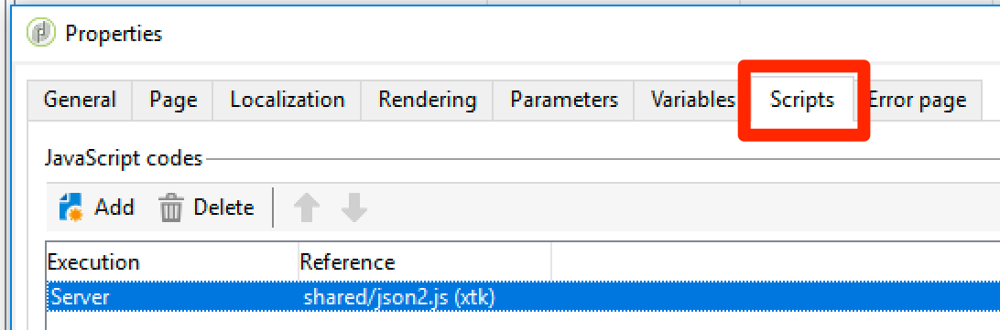

# Directrices de script y código {#scripting-coding-guidelines}

## Secuencia de comandos

Para obtener más información, consulte [Documentación de JSAPI de Campaign](https://docs.adobe.com/content/help/en/campaign-classic/technicalresources/api/index.html).

Si crea secuencias de comandos con flujos de trabajo, aplicaciones web, jssp, siga estas prácticas recomendadas:

* Intente evitar usar instrucciones SQL tanto como pueda.

* Si lo necesita, utilice funciones parametrizadas (instrucción de preparación) en lugar de concatenaciones de cadenas.

   Práctica incorrecta:

   ```
   sqlGetInt( "select iRecipientId from NmsRecipient where sEmail ='" + request.getParameter('email') +  "'  limit 1" )
   ```

   Práctica recomendada:

   ```
   sqlGetInt( "select iRecipientId from NmsRecipient where sEmail = $(sz) limit 1", request.getParameter('email'));
   ```

   >[!IMPORTANT]
   >
   >sqlSelect no admite esta función, por lo que debe utilizar la función de consulta de la clase DBEngine:

   ```
   var cnx = application.getConnection()
   var stmt = cnx.query("SELECT sFirstName, sLastName FROM NmsRecipient where sEmail = $(sz)", request.getParameter('email'))
   for each(var row in stmt) logInfo(row[0] + " : " + row[1])
   cnx.dispose()
   ```

Para evitar inyecciones SQL, las funciones SQL deben agregarse a la lista de permitidos para usar en Adobe Campaign. Una vez añadidos a la lista de permitidos, los operadores del editor de expresiones los verán. Consulte [esta página](../../configuration/using/adding-additional-sql-functions.md).

>[!IMPORTANT]
>
>Si utiliza una compilación anterior a la 8140, la opción **XtkPassUnknownSQLFunctionsToRDBMS** podría establecerse en &quot;1&quot;. Si desea proteger la base de datos, elimine esta opción (o establézcala en &#39;0&#39;).

Si utiliza la entrada del usuario para crear filtros en consultas o instrucciones SQL, siempre debe escaparlos (consulte [Campaign JSAPI documentation](https://docs.adobe.com/content/help/en/campaign-classic/technicalresources/api/index.html) - Data protection: funciones de escape). Estas funciones son:

* NL.XML.escape(data)
* NL.SQL.escape(data)
* NL.JS.escape(data)
* NL.XML.escapeAttribute(data)

## Protección del nuevo modelo de datos

### Base de carpetas

Consulte estas páginas:

* [Propiedades de acceso a carpetas](../../platform/using/access-management.md)
* [Carpeta vinculada](../../configuration/using/configuration.md#linked-folder)

### Derechos asignados

Además del modelo de seguridad basado en carpetas, puede utilizar derechos asignados para limitar las acciones del operador:

* Puede agregar algunos filtros del sistema (sysFilter) para evitar que se lean o escriban en sus datos (consulte [esta página](../../configuration/using/filtering-schemas.md)).

   ```
   <sysFilter name="writeAccess">    
       <condition enabledIf="hasNamedRight('myNewRole')=false" expr="FALSE"/>  
   </sysFilter>
   ```

* También puede proteger algunas acciones (método SOAP) definidas en esquemas. Establezca el atributo de acceso con el derecho asignado correspondiente como valor.

   ```
   <method name="grantVIPAccess" access="myNewRole">
       <parameters>
   ...
       </parameters>
   </method>
   ```

   Para obtener más información, consulte [esta página](../../configuration/using/implementing-soap-methods.md).

>[!IMPORTANT]
>
>Puede utilizar derechos asignados en el nodo de comando de un árbol de navegación. Proporciona una mejor experiencia de usuario, pero no proporciona ninguna protección (utilice solo el lado del cliente para ocultarlos o deshabilitarlos). Debe utilizar el atributo access .

### Tabla de desbordamiento

Si necesita proteger datos confidenciales (parte de un esquema) en función del nivel de acceso del operador, no los oculte en la definición del formulario (condiciones enabledIf/visibleIf).

La pantalla carga la entidad completa y también puede mostrarla en la definición de la columna. Para ello, debe crear una tabla de desbordamiento. Consulte [esta página](../../configuration/using/examples-of-schemas-edition.md#overflow-table).

## Adición de captchas en aplicaciones web

Se recomienda añadir un captcha en páginas de aterrizaje o de suscripción públicas. Desafortunadamente, añadir un captcha en las páginas del DCE (editor de contenido digital) no es fácil. Le mostraremos cómo añadir un captcha v5 o un reCAPTCHA de Google.

La forma general de añadir un captcha en el DCE es crear un bloque personalizado para incluirlo fácilmente dentro del contenido de la página. Deberá agregar una actividad **Script** y una **Prueba**.

### Bloque personalizado

1. Vaya a **[!UICONTROL Resources]** > **[!UICONTROL Campaign Management]** > **[!UICONTROL Personalization blocks]** y cree uno nuevo.

1. Utilice el tipo de contenido **[!UICONTROL Web application]** y marque **[!UICONTROL Visible in the customization menus]**.

   Para obtener más información, consulte [esta página](../../delivery/using/personalization-blocks.md).

   Este es un ejemplo de **Campaign captcha**:

   ```javascript
   <%
   var captchaID = CaptchaIDGen();
   %>
   &width=200&height=50&minWordSize=8&maxWordSize=8"/>
   <input id="captchaValue" name="captchaValue" <%= String(ctx.vars.captchaValid) === "false" ? class="ui-state-error" : "" %>>
   <input type="hidden" name="captchaID" value="<%=captchaID%>"/>
   <%
   if( serverForm.isInputErroneous("captchaValue") ) {
   %>
   <script type="text/javascript"> 
   $("#captchaValue").addClass("ui-state-error")
   </script>
   <%
   }
   %>
   ```

   * Las líneas 1 a 6 generan todas las entradas necesarias.
   * Las líneas 7 al final gestionan los errores.
   * La línea 4 permite cambiar el tamaño del cuadro gris captcha (ancho/alto) y la longitud de la palabra generada (minWordSize/maxWordSize).
   * Antes de usar Google reCAPTCHA, debe registrarse en Google y crear un nuevo sitio reCAPTCHA.

      `<div class="g-recaptcha" data-sitekey="YOUR_SITE_KEY"></div>`
   Debería poder desactivar el botón de validación, pero como no tenemos ningún botón o vínculo estándar, es mejor hacerlo en el propio HTML. Para aprender a hacerlo, consulte [esta página](https://developers.google.com/recaptcha/).

### Actualización de la aplicación web

1. Acceda a las propiedades de la aplicación web para añadir una variable booleana denominada **captchaValid**.

   

1. Entre la última página y la actividad **[!UICONTROL Storage]**, añada **[!UICONTROL Script]** y **[!UICONTROL Test]**.

   Conecte la rama **[!UICONTROL True]** a **[!UICONTROL Storage]** y la otra a la página que tendrá el captcha.

   

1. Edite la condición de la rama True con `"[vars/captchaValid]"` es igual a True.

   

1. Edite la actividad **[!UICONTROL Script]**. El contenido dependerá del motor captcha seleccionado.

1. Finalmente, puede añadir el bloque personalizado en la página: consulte [esta página](../../web/using/editing-content.md).

   

   

>[!IMPORTANT]
>
>Para la integración de reCAPTCHA, debe añadir JavaScript del lado del cliente en el HTML (en `<head>...</head>`):
>
>`<script src="https://www.google.com/recaptcha/api.js" async defer></script>`

### Captcha de campaña

```javascript
var captchaID = request.getParameter("captchaID");
var captchaValue = request.getParameter("captchaValue");
  
if( !CaptchaValidate(captchaID, captchaValue) ) {
  serverForm.logInputError("captchaValue",
                           "The characters you typed for the captcha must match the image ones.",
                           "captchaValue")
  ctx.vars.captchaValid = false
}
else
  ctx.vars.captchaValid = true
```

Línea 6: puede poner cualquier tipo de mensaje de error.

### Google recaptcha

Consulte la [documentación oficial](https://developers.google.com/recaptcha/docs/verify).

```javascript
ctx.vars.captchaValid = false
var gReCaptchaResponse = request.getParameter("g-recaptcha-response");
  
// Call reCaptcha API to validate it
var req = new HttpClientRequest("https://www.google.com/recaptcha/api/siteverify")
req.method = "POST"
req.header["Content-Type"] = "application/x-www-form-urlencoded"
req.body = "secret=YOUR_SECRET_HERE&response=" + encodeURIComponent(gReCaptchaResponse)
req.execute()
var response = req.response
if( response.code == 200 ) {
  captchaRes = JSON.parse(response.body.toString(response.codePage));
  ctx.vars.captchaValid = captchaRes.success
}
  
if( ctx.vars.captchaValid == false ) {
  serverForm.logInputError("reCaptcha",
                           "Please validate the captcha",
                           "reCaptcha")
  logInfo("reCaptcha not validated")
}
```

Para utilizar JSON.parse, debe incluir &quot;shared/json2.js&quot; en su aplicación web:



A partir de la versión 8797, para utilizar la URL de la API de verificación, tiene que añadirla a la lista de permitidos en el archivo serverConf añadiendo el nodo urlPermission:

`<url dnsSuffix="www.google.com" urlRegEx="https://www.google.com/recaptcha/api/siteverify"/>`
