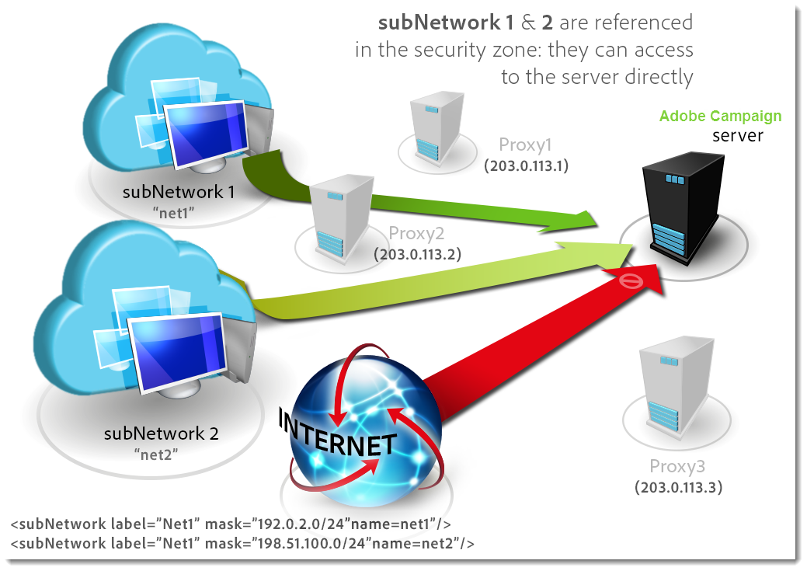

# Definir zonas de seguridad (locales){#defining-security-zones}

Cada operador debe estar vinculado a una zona para iniciar sesión en una instancia y la IP del operador debe incluirse en las direcciones o conjuntos de direcciones definidos en la zona de seguridad. La configuración de la zona de seguridad se realiza en el archivo de configuración del servidor de Adobe Campaign.

Los operadores están vinculados a una zona de seguridad desde su perfil en la consola, accesible en el nodo **[!UICONTROL Administration > Access management > Operators]**. [Más información](#linking-a-security-zone-to-an-operator).

>[!NOTE]
>
>Este procedimiento está restringido a **implementaciones locales**.
>
>Como cliente **alojado**, si puede acceder al [Panel de control de Campaign de campaña](https://experienceleague.adobe.com/docs/control-panel/using/control-panel-home.html?lang=es), puede utilizar la interfaz de autoservicio de la zona de seguridad. [Obtenga más información](https://experienceleague.adobe.com/docs/control-panel/using/instances-settings/ip-allow-listing-instance-access.html?lang=es)
>
>Otros clientes **híbridos/alojados** deben ponerse en contacto con el equipo de asistencia de Adobe para agregar IP a la lista de permitidos.


## Crear zonas de seguridad {#creating-security-zones}

Una zona está definida por:

* uno o más intervalos de direcciones IP (IPv4 e IPv6)
* un nombre técnico asociado a cada rango de direcciones IP

Las zonas de seguridad están interbloqueadas, lo que significa que la definición de una nueva zona dentro de otra zona reduce el número de operadores que pueden iniciar sesión en ella al mismo tiempo que aumentan los derechos asignados a cada operador.

Las zonas deben definirse durante la configuración del servidor, en el archivo **serverConf.xml**. Todos los parámetros disponibles en **serverConf.xml** se enumeran en [esta sección](../../installation/using/the-server-configuration-file.md).

Cada zona define derechos como:

* Conexión HTTP en lugar de HTTPS
* Visualización de errores (errores de Java, JavaScript, C++, etc.)
* Informe y vista previa de la aplicación web
* Autenticación mediante inicio de sesión/contraseña
* Modo de conexión no seguro

>[!NOTE]
>
>**Cada operador debe estar vinculado a una zona**. Si la dirección IP del operador pertenece al rango definido por la zona, el operador puede iniciar sesión en la instancia.\
>La dirección IP del operador se puede definir en varias zonas. En este caso, el operador recibe el **set** de derechos disponibles para cada zona.

El archivo predeterminado **serverConf.xml** incluye tres zonas: **pública, VPN y LAN**.

>[!NOTE]
>
>**La configuración predeterminada es segura**. Sin embargo, antes de migrar desde una versión anterior de Adobe Campaign, puede ser necesario reducir temporalmente la seguridad para migrar y aprobar las nuevas reglas.

Ejemplo de cómo definir una zona en el archivo **serverConf.xml**:

```
<securityZone allowDebug="false" allowHTTP="false" label="Public Network" name="public">
<subNetwork label="All addresses" mask="*" name="all"/>

<securityZone allowDebug="true" allowHTTP="false" label="Private Network (VPN)"
              name="vpn" showErrors="true">

  <securityZone allowDebug="true" allowEmptyPassword="true" allowHTTP="true"
                allowUserPassword="false" label="Private Network (LAN)" name="lan"
                sessionTokenOnly="true" showErrors="true">
    <subNetwork label="Lan 1" mask="192.168.0.0/16" name="lan1"/>
    <subNetwork label="Lan 2" mask="172.16.0.0/12" name="lan2"/>
    <subNetwork label="Lan 3" mask="10.0.0.0/8" name="lan3"/>
    <subNetwork label="Localhost" mask="127.0.0.1/16" name="locahost"/>
    <subNetwork label="Lan (IPv6)" mask="fc00::/7" name="lan6"/>
    <subNetwork label="Localhost (IPv6)" mask="::1/128" name="localhost6"/>
  </securityZone>

</securityZone>
</securityZone>
```

Todos los derechos que definen una zona son los siguientes:

* **allowDebug**: permite ejecutar una webApp en modo &quot;debug&quot;
* **allowEmptyPassword**: autoriza una conexión a una instancia sin contraseña
* **allowHTTP**: se puede crear una sesión sin utilizar el protocolo HTTPS
* **allowUserPassword**: el token de sesión puede tener el siguiente formulario &quot;`<login>/<password>`&quot;
* **sessionTokenOnly**: el token de seguridad no es necesario en la dirección URL de conexión
* **showErrors**: los errores del lado del servidor se reenvían y se muestran

>[!IMPORTANT]
>
>En una definición de zona, cada atributo con el valor **true** reduce la seguridad.

Al utilizar el Centro de mensajes, si hay varias instancias de ejecución, debe crear una zona de seguridad adicional con el atributo **sessionTokenOnly** definido como **true**, donde solo se deben añadir las direcciones IP necesarias. Para obtener más información sobre la configuración de instancias, consulte [este documento](../../message-center/using/configuring-instances.md).

## Prácticas recomendadas para zonas de seguridad {#best-practices-for-security-zones}

En la definición de la zona de seguridad **lan**, es posible añadir una máscara de dirección IP que defina el acceso técnico. Este complemento permite el acceso a todas las instancias alojadas en el servidor.

```
<securityZone allowDebug="true" allowEmptyPassword="false" allowHTTP="true"
                    allowUserPassword="false" label="Private Network (LAN)" name="lan"
                    sessionTokenOnly="true" showErrors="true">
        <subNetwork label="Lan 1" mask="192.168.0.0/16" name="lan1"/>
        <subNetwork label="Lan 2" mask="172.16.0.0/12" name="lan2"/>
        <subNetwork label="Lan 3" mask="10.0.0.0/8" name="lan3"/>
        <subNetwork label="Localhost" mask="127.0.0.1/16" name="locahost"/>
        <subNetwork label="Lan (IPv6)" mask="fc00::/7" name="lan6"/>
        <subNetwork label="Localhost (IPv6)" mask="::1/128" name="localhost6"/>
  
        <!-- Customer internal IPs -->
        <subNetwork id="internalNetwork" mask="a.b.c.d/xx"/>

      </securityZone>
```

Se recomienda definir intervalos de direcciones IP directamente en el archivo de configuración dedicado a la instancia para los operadores que acceden solo a una instancia específica.

En el archivo **`config-<instance>.xml`**:

```
  <securityZone name="public">
   ...
    <securityZone name="vpn">
      <subNetwork id="cus1" mask="a.b.c.d/xx"/>
```

## Subredes y proxies en una zona de seguridad {#sub-networks-and-proxies-in-a-security-zone}

El parámetro **proxy** se puede usar en un elemento **subNetwork** para especificar el uso del proxy en una zona de seguridad.

Cuando se hace referencia a un proxy y se introduce una conexión a través de este proxy (visible a través del encabezado HTTP X-Forwarded-For), la zona verificada es la de los clientes del proxy y no la del proxy.

>[!IMPORTANT]
>
>Si se configura un proxy y es posible anularlo (o si no existe), la dirección IP que se probará podrá falsificarse.
>
>Además, los relés ahora se generan como proxies. Por lo tanto, puede añadir la dirección IP 127.0.0.1 a la lista de proxies en la configuración de la zona de seguridad.
>
>Por ejemplo: &quot; `<subnetwork label="Lan 1" mask="192.168.0.0/16" name="lan1" proxy="127.0.0.1,10.100.2.135" />`&quot;.

Pueden producirse varios casos:

* Se hace referencia directamente a una subred en la zona de seguridad y no se ha configurado ningún proxy: los usuarios de la subred pueden conectarse directamente al servidor de Adobe Campaign.

   

* Se especifica un proxy para una subred en la zona de seguridad: los usuarios de esta subred pueden acceder al servidor de Adobe Campaign a través de este proxy.

   

* Un proxy se incluye en una subred de zona de seguridad: los usuarios que tengan acceso a través de este proxy, independientemente de su origen, pueden acceder al servidor de Adobe Campaign.

   

Las direcciones IP de los proxies que probablemente accedan al servidor de Adobe Campaign deben introducirse tanto en la **`<subnetwork>`** correspondiente como en la subred de primer nivel **`<subnetwork name="all"/>`**. Por ejemplo, aquí para un proxy cuya dirección IP es 10.131.146.102:

```
<securityZone allowDebug="false" allowHTTP="false" label="Public Network" 
                      name="public">
    <subNetwork label="All addresses" mask="*" name="all"
                      proxy="10.131.146.102,127.0.0.1, ::1"/>

    <securityZone allowDebug="true" allowHTTP="false" label="Private Network (VPN)" 
                      name="vpn" showErrors="true">
        <securityZone allowDebug="true" allowEmptyPassword="false" allowHTTP="true" 
                      allowUserPassword="false" label="Private Network (LAN)" 
                      name="lan" sessionTokenOnly="true" showErrors="true">
            <subNetwork label="Lan proxy" mask="10.131.193.182" name="lan3" 
                      proxy="10.131.146.102,127.0.0.1, ::1"/>
            <subNetwork label="Lan 1" mask="192.168.0.0/16" name="lan1" 
                      proxy="127.0.0.1, ::1"/>

        </securityZone>
    </securityZone>
</securityZone>
```

## Vinculación de una zona de seguridad a un operador {#linking-a-security-zone-to-an-operator}

Una vez definidas las zonas, cada operador debe estar vinculado a una de ellas para poder iniciar sesión en una instancia y la dirección IP del operador debe incluirse en las direcciones o el rango de direcciones a las que se hace referencia en la zona.

La configuración técnica de las zonas se realiza en el archivo de configuración del servidor de Campaign: **serverConf.xml**.

Antes de esto, debe empezar configurando la enumeración predeterminada **[!UICONTROL Security zone]** para vincular una etiqueta al nombre interno de la zona definida en el archivo **serverConf.xml** .

Esta configuración se realiza en el explorador de Campaign:

1. Haga clic en el nodo **[!UICONTROL Administration > Platform > Enumerations]**.
1. Seleccione la enumeración del sistema **[!UICONTROL Security zone (securityZone)]**.

   

1. Para cada zona de seguridad definida en el archivo de configuración del servidor, haga clic en el botón **[!UICONTROL Add]** .
1. En el campo **[!UICONTROL Internal name]**, introduzca el nombre de la zona definida en el archivo **serverConf.xml**. Corresponde al atributo **@name** del elemento `<securityzone>`. Introduzca la etiqueta vinculada al nombre interno en el campo **Label**.

   

1. Haga clic en Aceptar y guarde las modificaciones.

Una vez definidas las zonas y configurada la enumeración **[!UICONTROL Security zone]** , se debe vincular cada operador a una zona de seguridad:

1. Haga clic en el nodo **[!UICONTROL Administration > Access management > Operators]**.
1. Seleccione el operador al que desea vincular una zona de seguridad y haga clic en la pestaña **[!UICONTROL Edit]**.
1. Vaya a la pestaña **[!UICONTROL Access rights]** y haga clic en el vínculo **[!UICONTROL Edit access parameters...]**.

   

1. Seleccione una zona en la lista desplegable **[!UICONTROL Authorized connection zone]**

   

1. Haga clic en **[!UICONTROL OK]** y guarde las modificaciones para aplicar estos cambios.


## Recomendaciones

* Asegúrese de que el proxy inverso no esté permitido en subNetwork. Si es así, se detectará **todo** tráfico procedente de esta IP local, por lo que se confiará en él.

* Minimice el uso de sessionTokenOnly=&quot;true&quot;:

   * Advertencia: Si este atributo se establece en true, el operador se puede exponer a un **ataque CRSF**.
   * Además, la cookie sessionToken no está configurada con un indicador httpOnly, por lo que parte del código javascript del lado del cliente puede leerla.
   * Sin embargo, el Centro de mensajes en varias celdas de ejecución necesita sessionTokenOnly: cree una nueva zona de seguridad con sessionTokenOnly configurada como &quot;true&quot; y añada **solo las IP necesarias** en esta zona.

* Cuando sea posible, establezca todos allowHTTP, showErrors como falsos (no para localhost) y compruébelos.

   * allowHTTP = &quot;false&quot;: fuerza a los operadores a utilizar HTTPS
   * showErrors = &quot;false&quot;: oculta errores técnicos (incluidos los SQL). Evita mostrar demasiada información, pero reduce la capacidad del experto en marketing para resolver errores (sin solicitar más información a un administrador)

* Establezca allowDebug en true solo en las IP utilizadas por los usuarios/administradores de marketing que necesiten crear estudios, webApps e informes (de hecho, previsualizarlos). Este indicador permite que estas IP obtengan reglas de transmisión mostradas y las depuren.

* Nunca establezca allowEmptyPassword, allowUserPassword, allowSQLInjection como verdadero. Estos atributos solo están aquí para permitir una migración sin problemas desde las versiones 5 y 6.0:

   * **Los operadores** allowEmptyPasswordlets tienen una contraseña vacía. Si este es el caso, notifique a todos los operadores para que les pidan que establezcan una contraseña con una fecha límite. Una vez que haya pasado esta fecha límite, cambie este atributo a false.

   * **** Los operadores allowUserPasswordlets envían sus credenciales como parámetros (por lo que se registrarán mediante apache/IIS/proxy). Esta función se utilizaba en el pasado para simplificar el uso de la API. Puede consultar la guía (o la especificación) si algunas aplicaciones de terceros utilizan esto. Si es así, debe notificarles que deben cambiar la forma en que utilizan nuestra API y, lo antes posible, eliminar esta función.

   * **** allowSQLInjectionpermite al usuario realizar inyecciones SQL utilizando una sintaxis antigua. Lo antes posible, realice las correcciones descritas en [esta página](../../migration/using/general-configurations.md) para poder establecer este atributo en false. Puede utilizar /nl/jsp/ping.jsp?zones=true para comprobar la configuración de su zona de seguridad. Esta página muestra el estado activo de las medidas de seguridad (calculadas con estos indicadores de seguridad) para la IP actual.

* HttpOnly cookie/useSecurityToken: consulte el indicador **sessionTokenOnly** .

* Minimizar las direcciones IP agregadas a la lista de permitidos: en las zonas de seguridad, hemos agregado los 3 rangos para redes privadas. Es poco probable que utilice todas estas direcciones IP. Por lo tanto, mantenga solamente los que necesite.

* Actualice el operador webApp/internal para que solo sea accesible en localhost.
