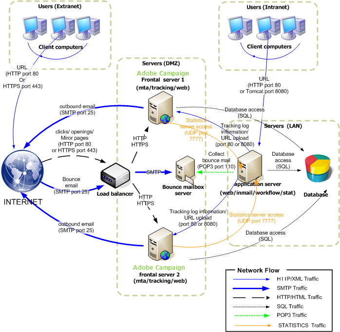

# Implementación estándar{#standard-deployment}

Para esta configuración se requieren tres equipos:

* Un servidor de aplicaciones dentro de la LAN para los usuarios finales (preparación de campañas, sistemas de informes, etc.),
* Dos servidores frontales en la DMZ detrás de un equilibrador de carga.

Los dos servidores de DMZ manejan el seguimiento, las páginas espejo y el envío y son redundantes para alta disponibilidad.

El servidor de aplicaciones de la LAN sirve a los usuarios finales y realiza todos los procesos recurrentes (motor de flujos de trabajo). Por lo tanto, cuando se alcanzan las cargas máximas en los servidores frontales, los usuarios de la aplicación no se ven afectados.

El servidor de la base de datos puede alojarse en un equipo independiente de estos tres. De lo contrario, el servidor de aplicaciones y el servidor de bases de datos compartirán el mismo equipo dentro de la LAN siempre que el sistema operativo sea compatible con Adobe Campaign (Linux o Windows).

La comunicación general entre servidores y procesos se realiza según el siguiente esquema:



Este tipo de configuración puede manejar un gran número de destinatarios (de 500.000 a 1.000.000), ya que el principal factor limitante es el servidor de la base de datos (y el ancho de banda disponible).

## Funciones {#features}

### Ventajas {#advantages}

* Funcionalidad de conmutación por error: la capacidad de cambiar procesos a un equipo en caso de un problema de hardware en el otro.
* Mejor rendimiento general, ya que las funciones de MTA y redirección se pueden implementar en ambos equipos detrás de un equilibrador de carga. Con dos MTAs activos y suficiente ancho de banda, es posible lograr tasas de difusión en la región de 100.000 correos por hora.

## Pasos de instalación y configuración {#installation-and-configuration-steps}

### Requisitos previos {#prerequisites}

* JDK en los tres equipos,
* Servidor web (IIS, Apache) en ambos frontales,
* Acceso a un servidor de bases de datos en los tres equipos,
* Buzón de salida hacia otro sitio accesible mediante POP3,
* Creación de dos alias DNS:

   * el primero expuesto al público para rastrear y apuntar al equilibrador de carga en una dirección IP virtual (VIP) y que luego se distribuye a los dos servidores frontales,
   * el segundo se expone a los usuarios internos para acceder a través de la consola y señala al mismo servidor de aplicaciones.

* Servidor de seguridad configurado para abrir STMP (25), DNS (53), HTTP (80), HTTPS (443), SQL (1521 para Oracle, 5432 para PostgreSQL, etc.) puertos. Para obtener más información, consulte la sección [Acceso a la base de datos](../../installation/using/network-configuration.md#database-access).

### Instalación del servidor de aplicaciones {#installing-the-application-server}

Siga los pasos para instalar una instancia independiente desde el servidor de aplicaciones de Adobe Campaign hasta la creación de la base de datos (paso 12). Consulte [Instalación y configuración (una sola máquina)](../../installation/using/standalone-deployment.md#installing-and-configuring--single-machine-).

Dado que el equipo no es un servidor de seguimiento, no tenga en cuenta la integración con el servidor Web.

En los siguientes ejemplos, los parámetros de la instancia son:

* Nombre de la instancia: **demostración**
* Máscara DNS: **console.campaña.net*** (solo para conexiones de consola de cliente y para informes)
* Idioma: Inglés
* Base de datos: **campaña:demo@dbsrv**

### Instalación de los dos servidores frontales {#installing-the-two-frontal-servers}

El procedimiento de instalación y configuración es idéntico en ambos equipos.

Los pasos son los siguientes:

1. Instale el servidor de Adobe Campaign.

   Para obtener más información sobre esto, consulte [Requisitos previos para la instalación de Campaña en Linux](../../installation/using/prerequisites-of-campaign-installation-in-linux.md) (Linux) y [Requisitos previos para la instalación de Campaña en Windows](../../installation/using/prerequisites-of-campaign-installation-in-windows.md) (Windows).

1. Siga el procedimiento de integración del servidor Web (IIS, Apache) descrito en las siguientes secciones:

   * Para Linux: [Integración en un servidor Web para Linux](../../installation/using/integration-into-a-web-server-for-linux.md)
   * Para Windows: [Integración en un servidor Web para Windows](../../installation/using/integration-into-a-web-server-for-windows.md)

1. Cree la instancia **demo**. Hay dos formas de hacerlo:

   * Cree la instancia a través de la consola:

      

      Para obtener más información sobre esto, consulte [Creación de una instancia e inicio de sesión](../../installation/using/creating-an-instance-and-logging-on.md).

      o

   * Cree la instancia mediante líneas de comandos:

      ```
      nlserver config -addinstance:demo/tracking.campaign.net*
      ```

      Para obtener más información sobre esto, consulte [Creación de una instancia](../../installation/using/command-lines.md#creating-an-instance).
   El nombre de la instancia es el mismo que el del servidor de aplicaciones.

   La conexión al servidor con el módulo **nlserver web** (páginas espejo, bajas) se realizará desde la dirección URL del equilibrador de carga (tracking.campaña.net).

1. Cambie el **interno** por el mismo que el servidor de aplicaciones.

   Para obtener más información sobre esto, consulte [Identificador interno](../../installation/using/campaign-server-configuration.md#internal-identifier).

1. Vincule la base de datos a la instancia:

   ```
   nlserver config -setdblogin:PostgreSQL:campaign:demo@dbsrv -instance:demo
   ```

1. En los archivos **config-default.xml** y **config-demo.xml**, habilite los módulos **web**, **trackinglogd** y **mta**.

   Para obtener más información sobre esto, consulte [Habilitación de procesos](../../installation/using/campaign-server-configuration.md#enabling-processes).

1. Edite el archivo **serverConf.xml** y rellene:

   * la configuración DNS del módulo MTA:

      ```
      <dnsConfig localDomain="campaign.com" nameServers="192.0.0.1, 192.0.0.2"/>
      ```

      >[!NOTE]
      >
      >El parámetro **nameServers** solo se utiliza en Windows.

      Para obtener más información sobre esto, consulte [configuración de Envío](../../installation/using/campaign-server-configuration.md#delivery-settings).

   * los servidores de seguimiento redundantes en los parámetros de redirección:

      ```
      <spareServer enabledIf="$(hostname)!='front_srv1'" id="1" url="https://front_srv1:8080"/>
      <spareServer enabledIf="$(hostname)!='front_srv2'" id="2" url="https://front_srv2:8080"/>
      ```

      Para obtener más información sobre esto, consulte [Seguimiento redundante](../../installation/using/configuring-campaign-server.md#redundant-tracking).

1. Inicio del sitio web y prueba la redirección desde la dirección URL: [https://tracking.campaign.net/r/test](https://tracking.campaign.net/r/test).

   El explorador debe mostrar los siguientes mensajes (según la dirección URL redireccionada por el equilibrador de carga):

   ```
   <redir status="OK" date="AAAA/MM/JJ HH:MM:SS" build="XXXX" host="tracking.campaign.net" localHost="front_srv1"/>
   ```

   o

   ```
   <redir status="OK" date="AAAA/MM/JJ HH:MM:SS" build="XXXX" host="tracking.campaign.net" localHost="front_srv2"/>
   ```

   Para obtener más información sobre esto, consulte las siguientes secciones:

   * Para Linux: [Inicio del servidor Web y prueba de la configuración](../../installation/using/integration-into-a-web-server-for-linux.md#launching-the-web-server-and-testing-the-configuration)
   * Para Windows: [Inicio del servidor Web y prueba de la configuración](../../installation/using/integration-into-a-web-server-for-windows.md#launching-the-web-server-and-testing-the-configuration)

1. Inicio del servidor Adobe Campaign.
1. En la consola de Adobe Campaign, conéctese mediante el inicio de sesión **admin** sin contraseña e inicie el asistente para la implementación.

   Para obtener más información sobre esto, consulte [Implementación de una instancia](../../installation/using/deploying-an-instance.md).

   La configuración es idéntica a una instancia independiente, aparte de la configuración del módulo de seguimiento.

1. Rellene la dirección URL externa (la del equilibrador de carga) utilizada para la redirección y las direcciones URL internas de los dos servidores frontales.

   Para obtener más información sobre esto, consulte [Configuración de seguimiento](../../installation/using/deploying-an-instance.md#tracking-configuration).

   

   >[!NOTE]
   >
   >Utilizamos la instancia existente de los dos servidores de seguimiento creados anteriormente y el inicio de sesión **interno**.

