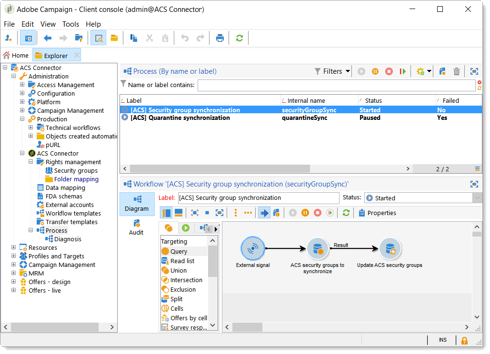
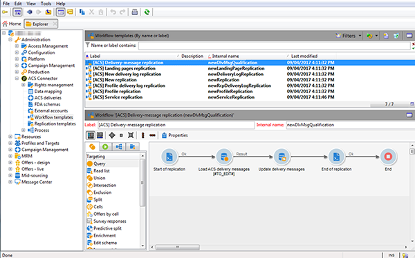

# Principios y ciclo de datos del conector ACS{#acs-connector-principles-and-data-cycle}

## Introducción {#introduction}

El conector ACS vincula Adobe Campaign v7 y Adobe Campaign Standard. Se trata de una función integrada en Campaign v7 que duplica automáticamente los datos en Campaign Standard, lo que une lo mejor de ambas aplicaciones. Campaign v7 cuenta con herramientas avanzadas para administrar la base de datos principal de marketing. La duplicación de datos de Campign v7 permite a Campaign Standard aprovechar los datos enriquecidos en un entorno fácil de usar.

Con el conector ACS, los especialistas en marketing digital siguen usando Campaign Standard para diseñar, dirigir y ejecutar campañas mientras que Campaign v7 está diseñado a medida para usuarios que se centren en datos, tales como los especialistas en marketing de base de datos.

>[!IMPORTANT]
>
>El conector ACS solo está disponible como parte de la oferta Adobe Campaign Prime. Para obtener más información sobre cómo obtener una licencia de Adobe Campaign Prime, póngase en contacto con el administrador de cuentas.
>
>El conector ACS solo está disponible para arquitecturas alojadas e híbridas. No está disponible para instalaciones locales completas.
>
>Para utilizar esta funcionalidad, se debe conectar con Campaign con una Adobe ID (IMS). Consulte [Conexión a través de una Adobe ID](../../integrations/using/about-adobe-id.md).

Este documento presenta las funcionalidades del conector ACS. Las secciones siguientes proporcionan información sobre cómo la funcionalidad duplica datos, además de instrucciones sobre cómo trabajar con perfiles duplicados.

* [Process](#process): Información general sobre el conector ACS y cómo se administra la duplicación de datos.
* [Implementation](#implementation): Información general sobre cómo empezar a utilizar el conector ACS, así como instrucciones para duplicar datos básicos y avanzados.
* [Synchronizing profiles](../../integrations/using/synchronizing-profiles.md): Instrucciones sobre cómo duplicar perfiles y cómo crear entregas con ellos.
* [Synchronizing audiences](../../integrations/using/synchronizing-audiences.md): Instrucciones sobre cómo dirigirse a una lista de destinatarios en Campaign v7 y luego duplicar la lista en Campaign Standard como audiencia.
* [Synchronizing web applications](../../integrations/using/synchronizing-web-applications.md): Instrucciones sobre cómo vincular las aplicaciones web de Campaign v7 a Campaign Standard.
* [Troubleshooting the ACS Connector](../../integrations/using/troubleshooting-the-acs-connector.md): Revise las respuestas a problemas comunes.

>[!NOTE]
>
>El conector ACS se incluye en Campaign v7 dentro del contrato de licencia. Para utilizar el conector ACS, asegúrese de que puede cambiar entre Campaign v7 y Campaign Standard. Si no está seguro de su versión y sus funcionalidades incluidas, póngase en contacto con el administrador.

## Proceso {#process}

### Duplicación de datos {#data-replication}

El conector ACS duplica los siguientes elementos de manera periódica de Campaign v7 a Campaign Standard:

* **Recipients**
* **Suscripciones**
* **Servicios**
* **Páginas de aterrizaje**

De forma predeterminada, la duplicación periódica del conector ACS se produce una vez cada 15 minutos. El intervalo de duplicación periódica se puede configurar para adaptarse a sus necesidades. Póngase en contacto con el consultor si necesita realizar cambios.

La duplicación de datos de destinatarios, suscripciones, servicios y páginas de destino es progresiva, lo que significa que solo se duplican los destinatarios nuevos y las modificaciones a los destinatarios existentes de Campaign v7 a Campaign Standard. Sin embargo, la duplicación de una audiencia se produce en una única instancia. Puede crear una audiencia en Campaign v7 y luego duplicarla una vez en Campaign Standard. La duplicación es inmediata y no se puede configurar para actualizaciones regulares. Para obtener instrucciones, consulte [Sincronización de audiencias](../../integrations/using/synchronizing-audiences.md).

>[!NOTE]
>
>Tenga paciencia al duplicar inicialmente una base de datos de gran tamaño, ya que puede tardar varias horas. Sin embargo, las duplicaciones posteriores son progresivas y mucho más rápidas.

El conector ACS duplica los siguientes elementos de manera regular de Campaign Standard a Campaign v7:

* **[!UICONTROL Delivery IDs]**
* **[!UICONTROL Email broad logs]**
* **[!UICONTROL Email tracking logs]**

La duplicación de ID de entregas y “logs” de correo electrónico permite acceder al historial de entregas y realizar un seguimiento de los datos de los destinatarios de v7 desde Campaign v7.

>[!IMPORTANT]
>
>Solo los “broadlogs” de correo electrónico y los “logs” de seguimiento se duplican desde Campaign Standard a Campaign v7.

### Sincronización de datos {#data-synchronization}

El conector ACS sincroniza cuarentenas entre Campaign v7 y Campaign Standard.

Por ejemplo, un perfil que se ha duplicado de Campaign v7 a Campaign Standard incluye una dirección de correo electrónico. Si la dirección de correo electrónico está en cuarentena en Campaign Standard, los datos se pasan a Campaign v7 durante la siguiente sincronización. Para obtener más información sobre las cuarentenas, consulte [Administración de cuarentenas](../../delivery/using/understanding-quarantine-management.md) y [Cuarentenas de Campaign Standard](https://experienceleague.adobe.com/docs/campaign-standard/using/testing-and-sending/monitoring-messages/understanding-quarantine-management.html).

### Uso de perfiles duplicados {#using-replicated-profiles}

Campaign Standard y Campaign v7 pueden utilizar perfiles duplicados para segmentar flujos de trabajo en las campañas de marketing.

Para obtener instrucciones sobre cómo realizar una entrega en Campaign Standard mediante perfiles duplicados, consulte [Sincronizar perfiles](../../integrations/using/synchronizing-profiles.md). Se ofrecen instrucciones adicionales para compartir los datos de baja de suscripción entre Campaign v7 y Campaign Standard.

### Limitaciones {#limitations}

Se puede acceder fácilmente a los perfiles duplicados para las entregas, pero tienen ciertas limitaciones en Campaign Standard. Revise los siguientes elementos para descubrir la mejor manera de gestionarlos.

* **Perfiles de solo lectura para Campaign Standard**: Los perfiles replicados son de solo lectura en Campaign Standard. Sin embargo, puede editar los destinatarios en Campaign v7 y las modificaciones se actualizan automáticamente en Campaign Standard gracias al conector ACS.
* **Perfiles creados en Campaign Standard**: ACS Connector replica los datos de los destinatarios en una dirección, desde Campaign v7 hasta Campaign Standard. Por lo tanto, los perfiles que se crean en Campaign Standard no se duplican en Campaign v7.
* **Datos básicos del destinatario para Campaign Standard**: ACS Connector replica los datos del destinatario que son adecuados para Campaign Standard. Incluye nombres de destinatarios, direcciones, direcciones de correo electrónico, números de teléfono móvil, números de teléfono fijo y otros datos de contacto relevantes. Si los campos de destinatario adicionales y tablas de objetivos personalizadas disponibles en Campaign v7 son esenciales para el flujo de trabajo, póngase en contacto con su consultor de Adobe.
* **Importing quarantined profiles**: Las listas de perfiles que no desean que se pongan en contacto con ellos se pueden importar en Campaign v7 o Campaign Standard como perfiles en cuarentena. El estado de los perfiles se incluye en la sincronización de cuarentena entre las aplicaciones y no se utilizan en las entregas.
* **Unsubscribe to a service in Campaign Standard**: La opción de dar de baja la suscripción a una entrega no se sincroniza de Campaign Standard a Campaign v7. Sin embargo, se puede configurar una entrega de Campaign Standard para dirigir su vínculo de baja de suscripción a Campaign v7. El perfil de un destinatario que hace clic en el vínculo de baja de suscripción se actualiza en Campaign v7 y los datos se duplican en Campaign Standard. Consulte [Modificación del vínculo de baja de suscripción](../../integrations/using/synchronizing-profiles.md#changing-the-unsubscription-link).
* Solo los “broadlogs” de correo electrónico y los “logs” de seguimiento se duplican desde Campaign Standard a Campaign v7.

### Facturación {#billing}

La facturación no se ve afectada por su aplicación seleccionada para realizar entregas, Campaign v7 o Campaign Standard. La información de facturación se concilia entre Campaign v7 y Campaign Standard. Por lo tanto, si realiza entregas al mismo destinatario utilizando ambas aplicaciones, se cuenta como un perfil activo.

## Implementación {#implementation}

Existen dos tipos de implementación para ACS Connector. El equipo de consultoría de Adobe Campaign siempre se encarga de la aplicación de ambos.

>[!IMPORTANT]
>
>Esta sección está dirigida únicamente a usuarios expertos con el fin de proporcionarles una visión global del proceso de implementación y sus pasos principales.
>
>No intente realizar ninguna de estas implementaciones por su cuenta. Están estrictamente reservadas a los consultores de Adobe Campaign.

La **implementación básica** permite duplicar destinatarios (campos predeterminados), servicios y suscripciones, aplicaciones web y audiencias. Se trata de una duplicación unidireccional de Campaign v7 a Campaign Standard.

La **implementación avanzada** le permite realizar ejemplos de uso más complejos, por ejemplo, si tiene campos de destinatarios o tablas de destinatarios personalizadas adicionales (por ejemplo, una tabla de transacciones). Consulte [Implementación avanzada](#advanced-implementation).

### Instalación del paquete {#installing-the-package}

Para utilizar la función, es necesario instalar el paquete **[!UICONTROL ACS Connector]**. Siempre realizan esta tarea el administrador técnico de Adobe o el consultor.

Todos los elementos técnicos relacionados con ACS Connector están disponibles en el nodo **[!UICONTROL Administration > ACS Connector]** del explorador.

### Flujos de trabajo técnicos y de duplicación {#technical-and-replication-workflows}

Después de la instalación del paquete hay dos flujos de trabajo técnicos disponibles en **[!UICONTROL Administration > ACS Connector > Process]**.

>[!IMPORTANT]
>
>Nunca intente modificar estos flujos de trabajo. Su estado nunca debe ser de fallo ni en pausa. Si esto ocurre, póngase en contacto con el consultor de Adobe Campaign.

* **[!UICONTROL `[ACS] Quarantine synchronization`]** (quarantineSync): este flujo de trabajo sincroniza toda la información en cuarentena. Toda la nueva información en cuarentena en Campaign v7 se duplica en Campaign Standard. Toda la nueva información en cuarentena de Campaign Standard se duplica en Campaign v7. Esto garantiza que todas las reglas de exclusión se sincronizan entre Campaign v7 y Campaign Standard.
* **[!UICONTROL `[ACS] Security group synchronization`]** (securityGroupSync): este flujo de trabajo se utiliza para la conversión de derechos. Consulte [Conversión de derechos](#rights-conversion).

Los siguientes flujos de trabajo de duplicación están disponibles como plantillas “listas para usar”. El consultor de Adobe Campaign debe implementarlo.

* **[!UICONTROL `[ACS] Profile replication`]** (newProfileReplication): este flujo de trabajo incremental duplica los destinatarios a Campaign Standard. De forma predeterminada, duplica todos los campos de destinatario predeterminados. Consulte [Campos de destinatarios predeterminados](#default-recipient-fields).
* **[!UICONTROL `[ACS] Service replication`]** (newServiceReplication): este flujo de trabajo incremental duplica los servicios seleccionados a Campaign Standard. Consulte el caso de uso [Sincronización de aplicaciones web](../../integrations/using/synchronizing-web-applications.md).
* **[!UICONTROL `[ACS] Landing pages replication`]** (newLandingPageReplication): este flujo de trabajo incremental duplica las aplicaciones web seleccionadas en Campaign Standard. Las aplicaciones web de Campaign v7 aparecen como páginas de destino en Campaign Standard. Consulte el caso de uso [Sincronización de aplicaciones web](../../integrations/using/synchronizing-web-applications.md).
* **[!UICONTROL `[ACS] New replication`]** (newReplication): este flujo de trabajo incremental es un ejemplo que puede utilizarse para duplicar una tabla personalizada. Consulte [Implementación avanzada](#advanced-implementation).
* **[!UICONTROL `[ACS] Delivery-mesage replication`]** (newDlvMsgQualification): este flujo de trabajo incremental duplica los mensajes de entrega de Campaign Standard a Campaign v7.
* **[!UICONTROL `[ACS] Profile delivery log replication`]** (newRcpDeliveryLogReplication): este flujo de trabajo incremental duplica las ID de entrega, los “broadlogs” de correo electrónico y los “logs” de seguimiento de correo electrónico desde Campaign Standard hasta Campaign v7. Solo tiene en cuenta las entregas de cuentas realizados desde Campaign Standard a los perfiles que forman parte de la tabla nms:recipients en Campaign v7.
* **[!UICONTROL `[ACS] New delivery log replication`]** (newRcpDeliveryLogReplication): este flujo de trabajo incremental duplica las ID de entrega, los “broadlogs” de correo electrónico y los “logs” de seguimiento de correo electrónico desde Campaign Standard hasta Campaign v7. Solo tiene en cuenta las entregas de cuentas realizados desde Campaign Standard hacia los perfiles que forman parte de una tabla específica (para definir, que no sea nms:recipients) de Campaign v7.

### Campos de destinatario predeterminados {#default-recipient-fields}

Si dispone de campos adicionales o tablas personalizadas (tabla de transacción, por ejemplo), estos no se duplican de forma predeterminada. Es necesario realizar una configuración avanzada. Consulte [Implementación avanzada](#advanced-implementation).

A continuación puede consultar la lista de campos de destinatario que se duplican con la implementación básica. Estos son los campos predeterminados:

<table> 
 <tbody> 
  <tr> 
   <td> <strong>Etiqueta</strong>  </td> 
   <td> <strong>Nombre interno</strong>  </td> 
  </tr> 
  <tr> 
   <td> ID de origen  </td> 
   <td> @sourceId  </td> 
  </tr> 
  <tr> 
   <td> Fecha de creación  </td> 
   <td> @created  </td> 
  </tr> 
  <tr> 
   <td> Fecha de modificación  </td> 
   <td> @lastModified  </td> 
  </tr> 
  <tr> 
   <td> Correo electrónico  </td> 
   <td> @email  </td> 
  </tr> 
  <tr> 
   <td> Apellido  </td> 
   <td> @lastName  </td> 
  </tr> 
  <tr> 
   <td> Nombre  </td> 
   <td> @firstName  </td> 
  </tr> 
  <tr> 
   <td> Segundo nombre  </td> 
   <td> @middleName  </td> 
  </tr> 
  <tr> 
   <td> Móvil  </td> 
   <td> @mobilePhone  </td> 
  </tr> 
  <tr> 
   <td> Fecha de nacimiento  </td> 
   <td> @birthDate  </td> 
  </tr> 
  <tr> 
   <td> Sexo  </td> 
   <td> @gender  </td> 
  </tr> 
  <tr> 
   <td> Saludo  </td> 
   <td> @salutation  </td> 
  </tr> 
  <tr> 
   <td> Ya no se puede contactar (por ningún canal)  </td> 
   <td> @blackList  </td> 
  </tr> 
  <tr> 
   <td> Ya no se puede contactar por correo electrónico  </td> 
   <td> @blackListEmail  </td> 
  </tr> 
  <tr> 
   <td> Ya no se puede contactar por SMS  </td> 
   <td> @blackListMobile  </td> 
  </tr> 
  <tr> 
   <td> Teléfono  </td> 
   <td> @phone  </td> 
  </tr> 
  <tr> 
   <td> Fax  </td> 
   <td> @fax  </td> 
  </tr> 
  <tr> 
   <td> Dirección 1 (apartamento)  </td> 
   <td> [location/@address1]  </td> 
  </tr> 
  <tr> 
   <td> Dirección 2  </td> 
   <td> [location/@address2]  </td> 
  </tr> 
  <tr> 
   <td> Dirección 3 (número y calle)  </td> 
   <td> [location/@address3]  </td> 
  </tr> 
  <tr> 
   <td> Dirección 4 (provincia)  </td> 
   <td> [location/@address4]  </td> 
  </tr> 
  <tr> 
   <td> C. P./Código Postal  </td> 
   <td> [location/@zipCode]  </td> 
  </tr> 
  <tr> 
   <td> Ciudad  </td> 
   <td> [location/@city]  </td> 
  </tr> 
  <tr> 
   <td> Estado/Código de provincia  </td> 
   <td> [location/@stateCode]  </td> 
  </tr> 
  <tr> 
   <td> Código de país  </td> 
   <td> [location/@countryCode]  </td> 
  </tr> 
 </tbody> 
</table>

### Conversión de derechos {#rights-conversion}

Los derechos se administran de manera diferente en Campaign v7 y en Campaign Standard. En Campaign v7, la administración de derechos se basa en carpetas, mientras que en Campaign Standard se basa en el acceso a la unidad (unidades organizativas/geográficas). Un usuario de Campaign Standard pertenece al grupo de seguridad que contiene el contexto de restricción. Por lo tanto, el sistema de derechos de Campaign v7 debe convertirse para que coincida con el de Campaign Standard. Existen varias maneras de realizar la conversión de los derechos. A continuación, se muestra un ejemplo de implementación.

1. En **[!UICONTROL Administration > ACS Connector > Rights management > Security groups]**, utilice el botón **[!UICONTROL Synchronize]** para recuperar todos los grupos de seguridad de Campaign Standard. Se excluyen los grupos predeterminados de Campaign Standard.

   

1. Si la administración de derechos se basa en carpetas, vaya a **[!UICONTROL Administration > ACS Connector > Rights management > Folder mapping]** y asigne cada carpeta necesaria con un grupo de seguridad.

   

1. Los flujos de trabajo de duplicación utilizan esta información y añaden las unidades de organización/geográficas correspondientes a cada objeto que desea duplicar.

### Implementación avanzada {#advanced-implementation}

En esta sección se describen algunas de las posibilidades relacionadas con la implementación avanzada.

>[!IMPORTANT]
>
>Esta información solo se puede utilizar como directrices generales. Póngase en contacto con su consultor de Adobe Campaign para la implementación.

La implementación avanzada añade flujos de trabajo de duplicación personalizados según las necesidades del cliente. A continuación se muestran algunos ejemplos:

* duplicación de entrega
* Duplicación de campaña
* Duplicación del programa
* Duplicación de miembros sembrados
* Duplicación transaccional
* Etc.

**Duplicación de campos ampliados en los destinatarios**

Con la implementación básica, se replican los campos de destinatarios predeterminados. Debe identificar los campos personalizados que añadió al esquema de destinatarios si desea replicarlos.

1. En **[!UICONTROL Administration > ACS Connector > Data mapping]**, cree una asignación objetivo en la tabla **[!UICONTROL nms:recipient]**.

   

1. Seleccione los campos adicionales que desee duplicar y otros datos necesarios (índice, vínculos, claves de identificación).

   

1. Abra el flujo de trabajo de duplicación de perfiles específico (no la plantilla, sino la propia instancia del flujo de trabajo). Modifique las actividades **[!UICONTROL Query]** y **[!UICONTROL Update data]** para incluir estos campos. Consulte [Flujos de trabajo técnicos y de duplicación](#technical-and-replication-workflows).

   

   

**Duplicación de tablas de perfil personalizadas**

Con la implementación básica, se duplica la tabla de destinatarios ya existente. Si ha añadido tablas de destinatarios personalizadas, así es como las identifica.

1. En **[!UICONTROL Administration > ACS Connector > Data mapping]**, cree una asignación objetivo en la tabla de perfil personalizada.

   

1. Defina los datos de identificación, el índice, los vínculos y los campos que desee duplicar.

   

1. Si la administración de derechos se basa en carpetas, vaya a **[!UICONTROL Administration > ACS Connector > Rights management > Folder mapping]** y defina un grupo de seguridad para las carpetas asociadas a las tablas personalizadas. Consulte [Conversión de derechos](#rights-conversion).
1. Utilice el flujo de trabajo **[!UICONTROL New replication]** (no la plantilla, sino la propia instancia del flujo de trabajo) para incluir la tabla personalizada y los campos que desea duplicar. Consulte [Flujos de trabajo técnicos y de duplicación](#technical-and-replication-workflows).
