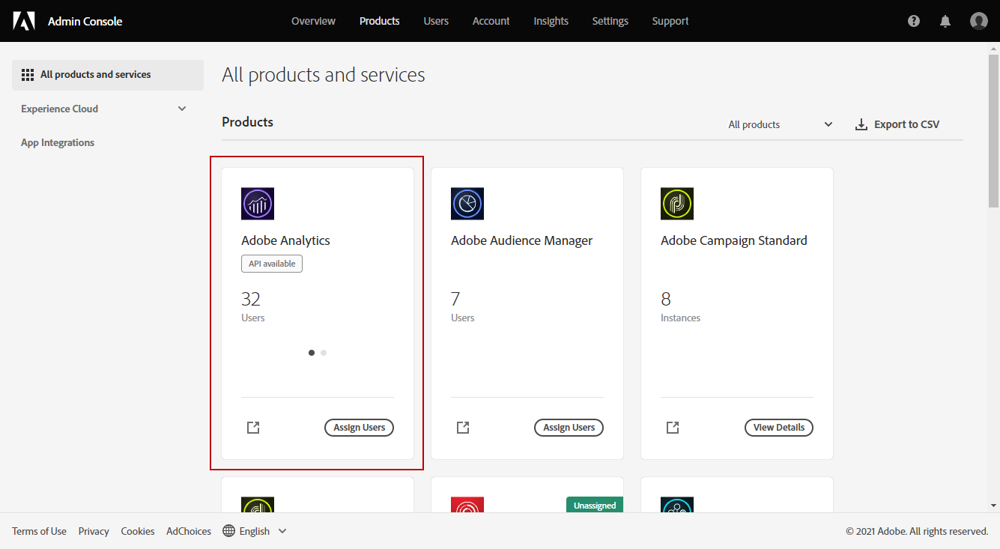

# Aprovisionamiento del Conector de Adobe Analytics {#adobe-analytics-connector-provisioning}

>[!CAUTION]
>
> Estos pasos solo deben realizarlos las implementaciones híbridas y locales.
>
>Para implementaciones de Managed Services alojadas y de Campaign, póngase en contacto con el equipo del [servicio de atención al cliente de Adobe](https://helpx.adobe.com/es/enterprise/admin-guide.html/enterprise/using/support-for-experience-cloud.ug.html).

La integración entre Adobe Campaign Classic y la autenticación de Adobe Analytics es compatible con el servicio Identity Management de Adobe (IMS):

* Si administra una cuenta externa migrada, debe implementar Adobe IMS y conectarse a Adobe Campaign a través de un Adobe ID.

  El usuario que haya iniciado sesión mediante el IMS de Adobe ID debe ser el propietario de la cuenta del **Conector de datos** en Adobe Analytics y debe tener un conjunto de permisos para el **Perfil del producto** mencionado [a continuación](#analytics-product-profile).

El problema era que el propietario del Conector de datos era un usuario diferente al usuario que había iniciado sesión en Campaign y que estaba probando la integración con Analytics.

* Si va a implementar un conector nuevo, la implementación de Adobe IMS es opcional. Sin un usuario de Adobe ID, Adobe Campaign utilizará un usuario técnico para sincronizar con Adobe Analytics.

Para que esta integración funcione, debe crear un perfil de producto de Adobe Analytics que se utilice exclusivamente para el conector de Analytics. A continuación, deberá crear un proyecto de Developer console.

>[!AVAILABILITY]
>
> Adobe va a declarar la credencial Cuenta de servicio (JWT) como obsoleta, las integraciones de Campaign con aplicaciones y soluciones de Adobe ahora dependen de la credencial OAuth de servidor a servidor.  
>
> * Si ha implementado integraciones de entrada con Campaign, debe migrar su Cuenta técnica como se detalla en [esta documentación](https://developer.adobe.com/developer-console/docs/guides/authentication/ServerToServerAuthentication/migration/#_blank). Las credenciales de la cuenta de servicio (JWT) existentes seguirán funcionando hasta el 27 de enero de 2025. 
>
> * Si ha implementado integraciones de salida, como la integración de Campaign-Analytics o la integración de Experience Cloud Triggers, seguirán funcionando hasta el 27 de enero de 2025. Sin embargo, antes de esa fecha, debe actualizar el entorno de Campaign a la versión 7.4.1 y migrar la cuenta técnica a OAuth.

## Creación de un perfil de producto de Adobe Analytics {#analytics-product-profile}

El perfil de producto determina el nivel de acceso que un usuario tiene a sus distintos componentes de Analytics.

Si ya tiene un perfil de producto de Analytics, debe crear otro que utilice exclusivamente para el conector de Analytics. Esto garantizará que el perfil de producto esté configurado con los permisos correctos para esta integración.

Para obtener más información acerca de los perfiles de producto, consulte la [documentación de Admin Console](https://helpx.adobe.com/mt/enterprise/admin-guide.html).

1. En [Admin Console](https://adminconsole.adobe.com/), seleccione su **[!UICONTROL Product]** de Adobe Analytics.

   

1. Haga clic en **[!UICONTROL New Profile]**.

   

1. Añada un **[!UICONTROL Product profile name]**, sugerimos usar la siguiente sintaxis: `reserved_campaign_classic_<Company Name>`. A continuación, haga clic en **[!UICONTROL Next]**.

   Este **[!UICONTROL Product profile]** debe usarse exclusivamente en el Conector de Analytics para evitar errores de configuración.

1. Abra el **[!UICONTROL Product profile]** recién creado y seleccione la pestaña **[!UICONTROL Permissions]**.

   

1. Configure las diferentes capacidades haciendo clic en **[!UICONTROL Edit]** y seleccione los permisos que desea asignar a su **[!UICONTROL Product profile]** haciendo clic en el icono de signo más (+).

   Para obtener más información sobre cómo administrar permisos, consulte la [Documentación de Admin Console](https://helpx.adobe.com/mt/enterprise/using/manage-permissions-and-roles.html).

1. Para la capacidad **[!UICONTROL Report Suites]**, añada el **[!UICONTROL Report Suites]** que debe utilizar más adelante.

   Si no tiene ningún grupo de informes, puede crearlo siguiendo [estos pasos](../../integrations/using/gs-aa.md).

   

1. Para la capacidad **[!UICONTROL Metrics]**, añada el **[!UICONTROL Metrics]** que tendrá que configurar más adelante.

   Si es necesario, puede activar la opción Inclusión automática, que añadirá todos los elementos de permisos a la lista incluida y automáticamente agregará nuevos elementos de permisos.

   

1. Para la capacidad **[!UICONTROL Dimensions]**, añada el **[!UICONTROL Dimensions]** necesario para la configuración futura.

   Asegúrese de que las Dimensiones seleccionadas coinciden con las que se van a configurar en la cuenta externa y se alinean con el número de eVars correspondiente de Adobe Analytics.

1. Para la capacidad **[!UICONTROL Report Suite Tools]**, agregue los siguientes permisos:

   * **[!UICONTROL Report suite Mgmt]**
   * **[!UICONTROL Conversion variables]**
   * **[!UICONTROL Success events]**
   * **[!UICONTROL Custom data Warehouse report]**
   * **[!UICONTROL Data sources manager]**
   * **[!UICONTROL Classifications]**

1. Para la capacidad **[!UICONTROL Analytics Tools]**, agregue los siguientes permisos:

   * **[!UICONTROL Code Manager - Web services]**
   * **[!UICONTROL Logs - Web services]**
   * **[!UICONTROL Web services]**
   * **[!UICONTROL Web service access]**
   * **[!UICONTROL Calculated metric creation]**
   * **[!UICONTROL Segment creation]**

El perfil de producto ya está configurado. A continuación, debe crear el proyecto de OAuth.

## Creación de un proyecto de OAuth {#create-adobe-io}

Para configurar el conector de Adobe Analytics, acceda a la consola de Adobe Developer y cree su proyecto de servidor a servidor OAuth.

Consulte [esta página](oauth-technical-account.md#oauth-service) para obtener la documentación detallada.

## Configuración y uso {#adobe-analytics-connector-usage}

Aprenda a trabajar con Adobe Campaign y Adobe Analytics en [Documentación de Adobe Campaign v8](https://experienceleague.adobe.com/en/docs/campaign/campaign-v8/connect/ac-aa){target="_blank"}.