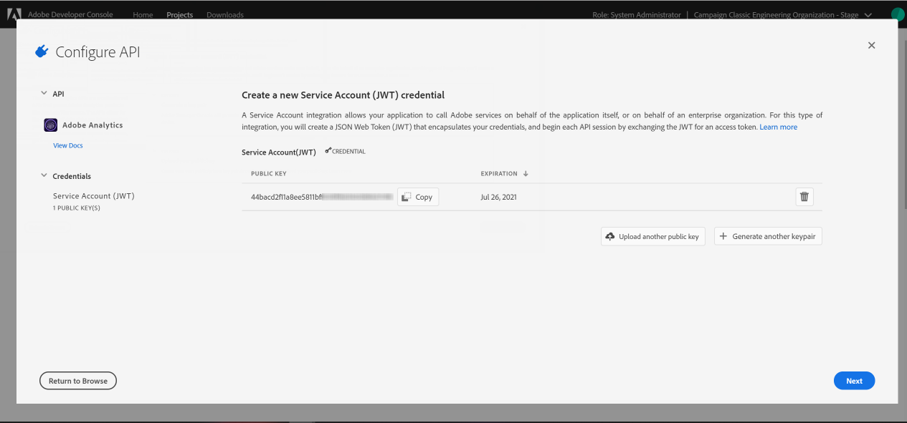

# Configuración de Adobe I/O para los activadores de Adobe Experience Cloud {#configuring-adobe-io}

>[!CAUTION]
>
>Si utiliza una versión anterior de la integración de los activadores mediante autenticación oAuth, **debe pasar a Adobe I/O como se describe a continuación**. El modo de autenticación oAuth heredado con Campaign se eliminará el 30 de noviembre de 2021. [Obtenga más información](https://experienceleaguecommunities.adobe.com/t5/adobe-analytics-discussions/adobe-analytics-legacy-api-end-of-life-notice/td-p/385411)
>
>Tenga en cuenta que durante este cambio a [!DNL Adobe I/O], es posible que se pierdan algunos activadores entrantes.

## Requisitos previos {#adobe-io-prerequisites}

Esta integración solo se aplica a partir de **las versiones de Campaign Classic 20.3, 20.2.4, 19.1.8 y [!DNL Gold Standard] 11**.

Antes de iniciar esta implementación, compruebe lo siguiente:

* **Un identificador de organización** válido: el identificador de organización de Identity Management System (IMS) es el identificador único de Adobe Experience Cloud que se utiliza, por ejemplo, para el servicio VisitorID y el inicio de sesión único (SSO) de IMS. [Obtenga más información](https://experienceleague.adobe.com/docs/core-services/interface/manage-users-and-products/organizations.html?lang=es)
* un **acceso para desarrolladores** para su organización.  Si tiene que solicitar los privilegios de administrador del sistema de la organización de IMS, siga el procedimiento detallado [en esta página](https://helpx.adobe.com/es/enterprise/admin-guide.html/enterprise/using/manage-developers.ug.html) para que todos los perfiles del producto tengan acceso.

## Paso 1: Crear/actualizar proyecto de Adobe I/O {#creating-adobe-io-project}

1. Acceda a [!DNL Adobe I/O] e inicie sesión con el derecho de administrador del sistema correspondiente a la organización IMS.

   >[!NOTE]
   >
   > Asegúrese de haber iniciado sesión en el portal correcto de la organización.

1. Extraiga el ID del cliente de integración existente del archivo de configuración de instancia ims/authIMSTAClientId. El atributo no existente o vacío indica que el ID del cliente no está configurado.

   >[!NOTE]
   >
   >Si el ID del cliente está vacío, puede usar directamente la opción **[!UICONTROL Create a New project]** en Adobe I/O.

1. Identifique el proyecto existente mediante el ID de cliente extraído. Busque proyectos existentes con el mismo ID de cliente que el extraído en el paso anterior.

   

1. Seleccione **[!UICONTROL + Add to Project]** y elija **[!UICONTROL API]**.

   

1. En la ventana **[!UICONTROL Add an API]** seleccione **[!UICONTROL Adobe Analytics]**.

   

1. Elija **[!UICONTROL Service Account (JWT)]** como el tipo de autenticación.

   

1. Si el ID del cliente está vacío, seleccione **[!UICONTROL Generate a key pair]** para crear un par de claves pública y privada.

   Las claves se descargan automáticamente con una fecha de caducidad predeterminada de 365 días. Una vez caducado, deberá crear un nuevo par de claves y actualizar la integración en el archivo de configuración. Con la Opción 2, puede elegir crear y cargar manualmente su **[!UICONTROL Public key]** con una fecha de caducidad más larga.

   

1. Haga clic en **[!UICONTROL Next]**.

   

1. Elija cualquier **[!UICONTROL Product profile]** existente o cree uno nuevo si es necesario. No se requiere permiso para este **[!UICONTROL Product profile]**. Para obtener más información sobre [!DNL Analytics] **[!UICONTROL Product Profiles]**, consulte la [Documentación de Adobe Analytics](https://experienceleague.adobe.com/docs/analytics/admin/admin-console/home.html?lang=es#admin-console).

   A continuación, haga clic en **[!UICONTROL Save configured API]**.

   

1. En el proyecto, seleccione **[!UICONTROL Adobe Analytics]** y copie la siguiente información en **[!UICONTROL Service Account (JWT)]**:

   * **[!UICONTROL Client ID]**
   * **[!UICONTROL Client Secret]**
   * **[!UICONTROL Technical account ID]**
   * **[!UICONTROL Organization ID]**

   

>[!CAUTION]
>
>El certificado de Adobe I/O caducará pasados 12 meses. Debe generar un nuevo par de claves cada año.

## Paso 2: Adición de las credenciales del proyecto en Adobe Campaign {#add-credentials-campaign}

Para añadir las credenciales del proyecto en Adobe Campaign, ejecute el siguiente comando como usuario neolano en todos los contenedores de la instancia de Adobe Campaign para insertar las credenciales de la **[!UICONTROL Technical Account]** en el archivo de configuración de instancia.

```
nlserver config -instance:<instance name> -setimsjwtauth:Organization_Id/Client_Id/Technical_Account_ID/<Client_Secret>/<Base64_encoded_Private_Key>
```

La clave privada debe codificarse en formato UTF-8 base64. Para ello:

1. Utilice la clave privada generada en el [Paso 1: Creación o actualización de la sección Proyecto de Adobe I/O](#creating-adobe-io-project). La clave privada debe ser la misma que se utilizó para crear la integración.

1. Codifique la clave privada mediante el siguiente comando: ```base64 ./private.key```.

   >[!NOTE]
   >
   >A veces, se pueden añadir automáticamente líneas adicionales al copiar/pegar la clave privada. Recuerde eliminarlas antes de codificar la clave privada.

1. Utilice la clave privada recién generada codificada en formato UTF-8 base64 para ejecutar el comando detallado anteriormente.

## Paso 3: Actualización de la etiqueta canalizada {#update-pipelined-tag}

Para actualizar la etiqueta [!DNL pipelined], debe actualizar el tipo de autenticación del proyecto de Adobe I/O en el archivo de configuración **config-&lt; instance-name >.xml** como se indica a continuación:

```
<pipelined ... authType="imsJwtToken"  ... />
```
