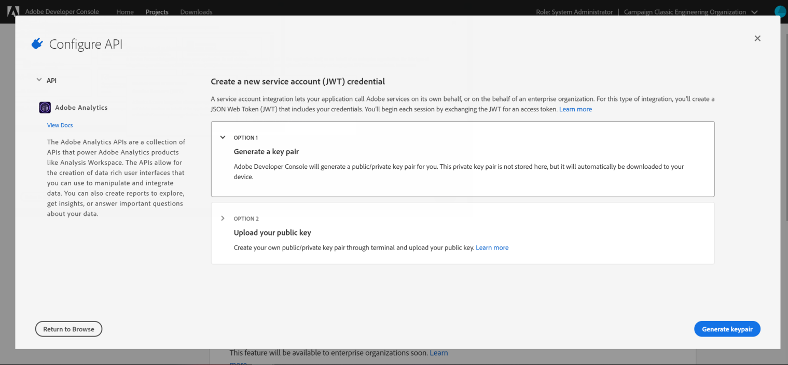

# Configuración de la E/S de Adobe para Adobe Experience Cloud Triggers {#configuring-adobe-io}

>[!CAUTION]
>
>Si utiliza una versión anterior de la integración de Triggers mediante tokens JWT o autenticación oAuth, **debe pasar a la E/S de Adobe como se describe a continuación**. Los modos de autenticación JWT y oAuth ya no se utilizan. [Más información](https://github.com/AdobeDocs/analytics-1.4-apis)

## Requisitos previos {#adobe-io-prerequisites}

Antes de iniciar esta implementación, compruebe que:

* una versión reciente de Adobe Campaign: 19.1.8 o 20.2.1 y versiones posteriores,
* un IMSOrgID válido: el identificador de organización del sistema Identity Management (IMS) es el identificador único dentro del Adobe Experience Cloud, que se utiliza, por ejemplo, para el servicio VisitorID y el inicio de sesión único (SSO) de IMS,
* un acceso de desarrollador a la organización IMS.

>[!NOTE]
>
>Si necesita solicitar los privilegios de administrador del sistema de la organización IMS, siga el procedimiento detallado [en esta página](https://helpx.adobe.com/ca/enterprise/admin-guide.html/ca/enterprise/using/manage-developers.ug.html) para proporcionar este acceso a todos los Perfiles del producto.


## Paso 1: Crear/actualizar proyecto de E/S de Adobe {#creating-adobe-io-project}

1. Acceda a la E/S de Adobe e inicie sesión con el administrador del sistema justo para IMSorg.

   >[!NOTE]
   >
   > Asegúrese de haber iniciado sesión en el portal de IMSorg correcto.

1. Extraiga el ID de cliente de integración existente del archivo de configuración de instancia ims/authIMSTAClientId. El atributo no existente o vacío indica que el ID de cliente no está configurado.

   >[!NOTE]
   >
   >Si el ID de cliente está vacío, puede acceder directamente **[!UICONTROL Create a New project]** a la E/S de Adobe.

1. Identifique el proyecto existente mediante el ID de cliente extraído. Busque proyectos existentes con el mismo ID de cliente que el extraído en el paso anterior.

   

1. Seleccione **[!UICONTROL + Add to Project]** y elija **[!UICONTROL API]**.

   

1. En la ventana **[!UICONTROL Add an API]** seleccione **[!UICONTROL Adobe Analytics]**.

   

1. Elija **[!UICONTROL Service Account (JWT)]** como tipo de autenticación.

   

1. Si el ID de cliente estaba vacío, seleccione **[!UICONTROL Generate a key pair]** para crear un par de claves pública y privada.

   

1. Cargue la clave pública y haga clic en **[!UICONTROL Next]**.

   

1. Elija el perfil del producto llamado **Analytics-&lt; Nombre de la organización >** y haga clic en **[!UICONTROL Save configured API]**.

   

1. En el proyecto, seleccione **[!UICONTROL Service Account (JWT)]** y copie la siguiente información:
   * **[!UICONTROL Client ID]**
   * **[!UICONTROL Client Secret]**
   * **[!UICONTROL Technical account ID]**
   * **[!UICONTROL Organization ID]**

   

## Paso 2: Añadir las credenciales del proyecto en Adobe Campaign {#add-credentials-campaign}

Para agregar las credenciales del proyecto en Adobe Campaign, ejecute el siguiente comando como usuario &#39;neolano&#39; en todos los contenedores de la instancia de Adobe Campaign para insertar las **[!UICONTROL Technical Account]** credenciales en el archivo de configuración de la instancia.

```
nlserver config -instance:<instance name> -setimsjwtauth:Organization_Id/Client_Id/Technical_Account_ID[/Client_Secret[/Base64_encoded_Private_Key]]
```

>[!NOTE]
>
>Debe codificar la clave privada en formato UTF-8 base64. Recuerde quitar la nueva línea de la clave antes de codificarla, excepto la clave privada. La clave privada debe ser la misma que se utilizó para crear la integración.

## Paso 3: Actualizar etiqueta canalizada {#update-pipelined-tag}

Para actualizar [!DNL pipelined] la etiqueta, debe actualizar el tipo de autenticación al proyecto de E/S de Adobe en el archivo de configuración **config-&lt; instance-name >.xml** como se indica a continuación:

```
<pipelined ... authType="imsJwtToken"  ... />
```
