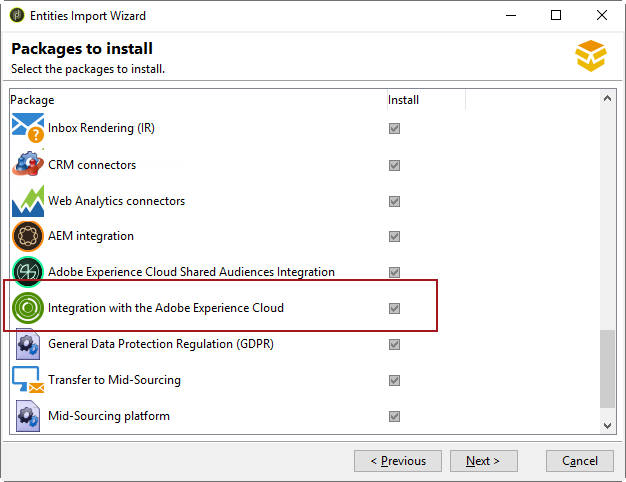
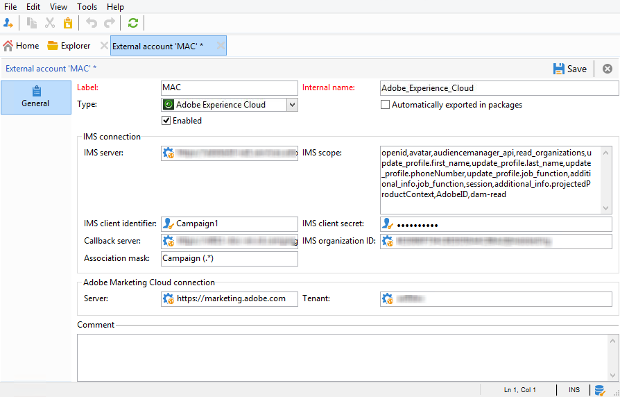

# Configuración de IMS{#configuring-ims}

>[!IMPORTANT]
>
>Como usuario de Managed Services o alojado en Campaign, la implementación de Adobe IMS es propiedad de Adobe. Los pasos que se describen a continuación solo se aplican a clientes locales e híbridos.
> La implementación de Adobe IMS solo deben realizarla los administradores técnicos de Adobe. Póngase en contacto con su representante de Adobe para iniciar el proceso de implementación.

## Requisitos previos {#prerequisites}

* Debe tener un nombre e ID de organización de Adobe Experience Cloud. Para encontrar su ID de organización, consulte [esta página](https://experienceleague.adobe.com/docs/core-services/interface/administration/organizations.html?lang=es){_blank}.
* Debe añadir usuarios en Experience Cloud. Para obtener más información, consulte [esta página](https://experienceleague.adobe.com/docs/core-services/interface/administration/admin-getting-started.html?lang=es){_blank}.

>[!NOTE]
>
>Asegúrese de que los usuarios estén vinculados a los grupos de Adobe Experience Cloud que se sincronizan con Adobe Campaign. [Más información](#configuring-the-external-account).

## Actualización de la consola {#updating-the-console}

Para utilizar esta funcionalidad, es imprescindible instalar la versión más reciente de la consola del cliente.

## Instalación del paquete {#installing-the-package}

Debe instalar el paquete integrado **[!UICONTROL Integration with the Adobe Experience Cloud]**. La instalación de un paquete de integración se realiza de la misma forma que la de un paquete estándar, la cual se detalla en [esta página](../../installation/using/installing-campaign-standard-packages.md).

## Configuración de la cuenta externa {#configuring-the-external-account}

Configure la cuenta externa de **Adobe Experience Cloud** en **[!UICONTROL Administration > Platform > External accounts]**.

Introduzca la siguiente información:

* La información de conexión para el servidor IMS utilizado (ID y secreto). Esta información la proporciona el equipo del Servicio de atención al cliente de Adobe. Para obtener más información, consulte las [preguntas frecuentes de los administradores de Adobe Experience Cloud](https://experienceleague.adobe.com/docs/core-services/interface/manage-users-and-products/faq.html?lang=es).

  La dirección **[!UICONTROL Callback server]** debe especificarse en **https**. Este campo corresponde a la dirección URL de acceso de la instancia de Adobe Campaign.

* ID de organización: para encontrar su ID de organización, consulte [esta página](https://experienceleague.adobe.com/docs/core-services/interface/administration/organizations.html?lang=es){_blank}.

* Máscara de asociación: este campo permite definir la sintaxis que permite sincronizar los nombres de configuración en Enterprise Dashboard con los grupos de Adobe Campaign. Si utiliza la sintaxis “Campaign - tenant_id - (.&#42;)”, el grupo creado en Adobe Campaign se vinculará al nombre de configuración “Campaign - tenant_id - internal_name” en Enterprise Dashboard.

* La información de conexión de Adobe Experience Cloud, que es el nombre del inquilino de Adobe Experience Cloud.
