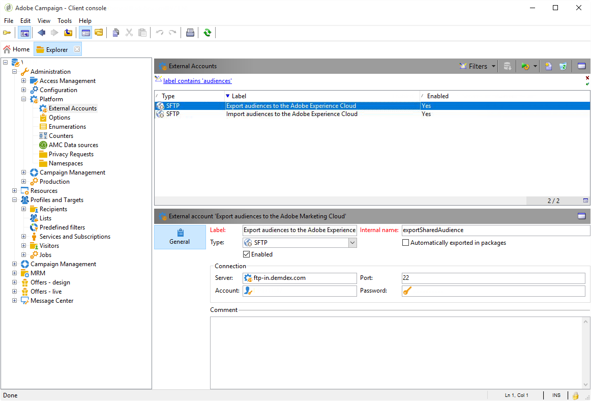
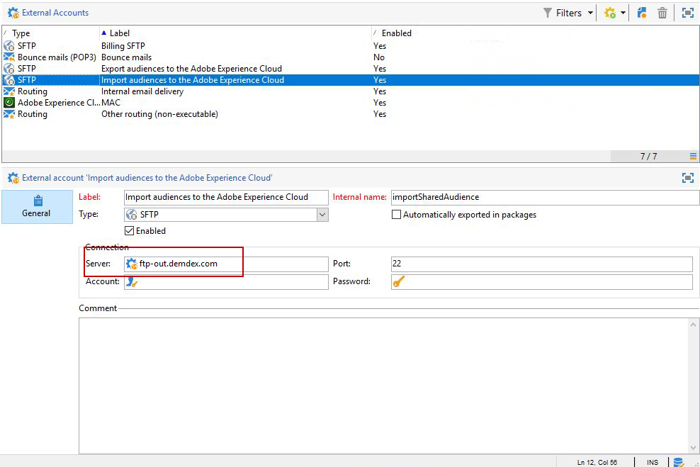

# Configuración de la integración de públicos compartidos en Adobe Campaign{#configuring-shared-audiences-integration-in-adobe-campaign}


Una vez enviada esta solicitud, Adobe procede a suministrarle la integración y a ponerse en contacto con usted para proporcionarle los detalles y la información necesarios para finalizar la configuración:

1. [Paso 1: Configuración o verificación de las cuentas externas en Adobe Campaign](#step-1--configure-or-check-the-external-accounts-in-adobe-campaign)
1. [Paso 2: Configuración de la fuente de datos](#step-2--configure-the-data-source)
1. [Paso 3: Configuración del servidor de seguimiento de Campaign](#step-3--configure-campaign-tracking-server)
1. [Paso 4: Configuración del servicio de ID de visitante](#step-4--configure-the-visitor-id-service)

>[!IMPORTANT]
>
>Si está utilizando el dominio demdex y sigue la sintaxis **ftp-out.demdex.com** para la cuenta externa de importación y **ftp-in.demdex.com** para la cuenta externa de exportación, debe adaptar la implementación en consecuencia y desplazarse al conector Amazon Simple Storage Service (S3) para importar o exportar datos. Para obtener más información sobre cómo configurar sus cuentas externas con Amazon S3, consulte esta [sección](../../integrations/using/configuring-shared-audiences-integration-in-adobe-campaign.md#step-1--configure-or-check-the-external-accounts-in-adobe-campaign).

El diagrama siguiente detalla cómo funciona esta integración. AAM son las siglas de Adobe Audience Manager y AC son las siglas de Adobe Campaign.

{align="center"}

## Paso 1: Configuración o verificación de las cuentas externas en Adobe Campaign {#step-1--configure-or-check-the-external-accounts-in-adobe-campaign}

En primer lugar, se deben configurar o verificar las cuentas externas en Adobe Campaign de la siguiente manera:

1. Haga clic en el icono **[!UICONTROL Explorer]**.
1. Vaya a **[!UICONTROL Administration > Platform > External accounts]**. Las cuentas SFTP mencionadas deberían estar ya configuradas por Adobe, y se le debe haber comunicado la información necesaria.

   * **[!UICONTROL importSharedAudience]**: cuenta específica para la importación de públicos.
   * **[!UICONTROL exportSharedAudience]**: cuenta específica para la exportación de públicos.

   

1. Seleccione la cuenta externa **[!UICONTROL Export audiences to the Adobe Marketing Cloud]**.

1. Del desplegable **[!UICONTROL Type]**, seleccione **[!UICONTROL AWS S3]**.

1. Proporcione los siguientes detalles:

   * **[!UICONTROL AWS S3 Account Server]**
La URL del servidor debe completarse de la siguiente manera:

     ```
     <S3bucket name>.s3.amazonaws.com/<s3object path>
     ```

   * **[!UICONTROL AWS access key ID]** Para saber dónde encontrar el ID de clave de acceso de AWS, consulte [esta página](https://docs.aws.amazon.com/general/latest/gr/aws-sec-cred-types.html#access-keys-and-secret-access-keys).

   * **[!UICONTROL Secret access key to AWS]**
Para saber dónde encontrar la clave de acceso secreta a AWS, consulte [esta página](https://aws.amazon.com/fr/blogs/security/wheres-my-secret-access-key/).

   * **[!UICONTROL AWS Region]**
Para obtener más información sobre la región AWS, consulte esta [página](https://aws.amazon.com/about-aws/global-infrastructure/regions_az/).

   

1. Haga clic en **[!UICONTROL Save]** y configure la cuenta externa **[!UICONTROL Import audiences from the Adobe Marketing Cloud]** como se detalla en los pasos anteriores.

Las cuentas externas ya están configuradas.

## Paso 2: Configuración de la fuente de datos {#step-2--configure-the-data-source}

La **ID de destinatario - visitante** se crea dentro de Audience Manager. Constituye una fuente de datos de serie y configurada de forma predeterminada para la ID del visitante. Los segmentos creados con Campaign forman parte de esta fuente de datos.

Para configurar la fuente de datos **[!UICONTROL Recipient - Visitor ID]**:

1. En el nodo **[!UICONTROL Explorer]**, seleccione **[!UICONTROL Administration > Platform > AMC Data sources]**.
1. Seleccione **[!UICONTROL Recipient - Visitor ID]**.
1. Introduzca el **[!UICONTROL Data Source ID]** y **[!UICONTROL AAM Destination ID]** proporcionados por Adobe.

   

## Paso 3: Configuración del servidor de seguimiento de Campaign {#step-3--configure-campaign-tracking-server}

Para la configuración de la integración con Audience Manager, también es necesario configurar el servidor de seguimiento de Campaign.

Para permitir que los públicos compartidos funcionen con el ID de visitante, el dominio del servidor de seguimiento debe ser un subdominio de la dirección URL en la que se hizo clic o del sitio web principal.

>[!IMPORTANT]
>
>Debe verificar que el servidor de seguimiento de Campaign esté registrado en el dominio (CNAME). Se puede encontrar más información sobre la delegación de nombres de dominio en [este artículo](https://experienceleague.adobe.com/docs/control-panel/using/subdomains-and-certificates/setting-up-new-subdomain.html?lang=es).

## Paso 4: Configuración del servicio de ID de visitante {#step-4--configure-the-visitor-id-service}

En caso de que el servicio de ID de visitante no se haya configurado en las propiedades web o sitios web, consulte el siguiente [documento](https://experienceleague.adobe.com/docs/id-service/using/implementation/setup-aam-analytics.html?lang=es) o el siguiente [vídeo](https://helpx.adobe.com/marketing-cloud/how-to/email-marketing.html#step-two) para aprender a configurar el servicio.

Sincronizar los identificadores de cliente con el ID declarado mediante la función `setCustomerID` en el servicio de ID de Experience Cloud con el código de integración: `AdobeCampaignID`. El `AdobeCampaignID` debe coincidir con el valor de la clave de reconciliación establecida en la fuente de datos del destinatario configurada en [Paso 2: Configuración de las fuentes de datos](#step-2--configure-the-data-sources).

La configuración y el aprovisionamiento han finalizado, la integración ya puede utilizarse para importar y exportar públicos o segmentos.
