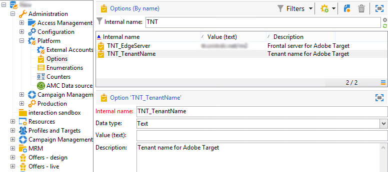

# Configuración de la integración con Adobe Target{#configuring-the-integration-with-adobe-target}

>[!CAUTION]
>
> Como cliente alojado o híbrido, póngase en contacto con su representante de Adobe para configurar esta integración. Los pasos siguientes solo se aplican a clientes locales.

Esta integración requiere:

* Organizaciones de Adobe Experience Cloud y Adobe Target
* Un “rawbox” de Adobe Target determinada para establecer la conexión con Adobe Campaign

Para configurar esta integración en Adobe Campaign, siga los pasos a continuación:

1. Instale el paquete integrado **[!UICONTROL Integration with the Adobe Experience Cloud]**. [Más información](../../platform/using/working-with-data-packages.md#importing-packages)

   Esto le permite acceder a los recursos compartidos a través del Digital Asset Manager.

1. Permita la conexión mediante IMS (servicio de conexión con Adobe ID) para utilizar imágenes compartidas mediante Adobe Experience Cloud en sus correos electrónicos. [Más información](../../integrations/using/about-adobe-id.md)
1. Navegue a **[!UICONTROL Administration > Platform > Options]** para configurar las opciones del servidor y la organización (inquilino) de Adobe Target:

   

   * **[!UICONTROL TNT_EdgeServer]** : Servidor de Adobe Target utilizado para la integración. Esta opción está seleccionada de forma predeterminada. Este valor corresponde al **[!UICONTROL Domain Server]** de Adobe Target, seguido del valor **/m2**. Por ejemplo: **tt.omtrdc.net/m2**.
   * **[!UICONTROL TNT_TenantName]** : Nombre de la organización de Adobe Target. Este valor corresponde al nombre de **[!UICONTROL Client]** de Adobe Target.

>[!CAUTION]
>
>Para las arquitecturas híbridas y alojadas, estas opciones deben configurarse en todos los servidores, incluidos el [servidor intermediario](../../installation/using/mid-sourcing-server.md) y la [instancia de ejecución](../../message-center/using/configuring-instances.md#execution-instance).