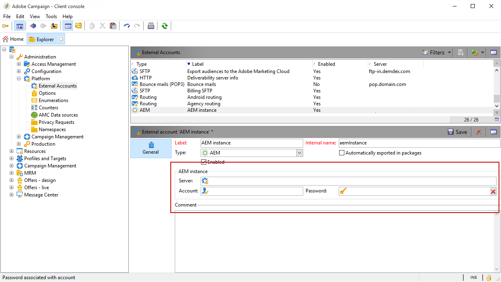

# Configuración de la integración{#configuring-the-integration}

## Configuración en Adobe Campaign {#configuring-in-adobe-campaign}

Para utilizar estas dos soluciones juntas, debe configurarlas para que se conecten entre sí.

Siga los pasos siguientes para iniciar la configuración en Adobe Campaign:

1. [Instalación del paquete de integración de AEM en Adobe Campaign.](#install-the-aem-integration-package-in-adobe-campaign)
1. [Configuración de la cuenta externa](#configure-the-external-account)
1. [Configuración del filtrado de recursos de AEM](#configure-aem-resources-filtering)

Para las configuraciones avanzadas, como la gestión de campos y bloques personalizados. Consulte la [documentación](https://helpx.adobe.com/experience-manager/6-5/sites/administering/using/campaignonpremise.html) de Adobe Experience Manager.

### Instalación del paquete de integración de AEM en Adobe Campaign.{#install-the-aem-integration-package-in-adobe-campaign}

Primero debe instalar el paquete **[!UICONTROL AEM integration]**.

1. Desde la instancia de Adobe Campaign, seleccione **[!UICONTROL Tools]** en la barra de herramientas superior.
1. Seleccione **[!UICONTROL Tools > Advanced > Import package...]**.

   

1. Seleccione **[!UICONTROL Install a standard package]**.
1. Marque **[!UICONTROL AEM integration]** y luego haga clic en el botón **[!UICONTROL Next]**.

   

1. En la siguiente ventana, haga clic en el botón **[!UICONTROL Start]** para iniciar la instalación del paquete. Cierre la ventana una vez finalizada la instalación.

### Configuración de la zona de seguridad para el operador AEM {#configure-the-security-zone-for-aem-operator}

El paquete **[!UICONTROL AEM integration]** establece el operador **[!UICONTROL aemserver]** en Campaign. Este operador se utiliza para conectar el servidor de Adobe Experience Manager a Adobe Campaign.

Es necesario configurar una zona de seguridad para que este operador se conecte a Adobe Campaign a través de Adobe Experience Manager.

>[!CAUTION]
>
>Recomendamos encarecidamente que cree una zona de seguridad específica de AEM para evitar problemas de seguridad. Para obtener más información, consulte la [Guía](../../installation/using/security-zones.md) de instalación.

Si la instancia de Campaign está alojada en Adobe, póngase en contacto con el equipo del [Servicio de atención al cliente de Adobe](https://helpx.adobe.com/es/enterprise/admin-guide.html/enterprise/using/support-for-experience-cloud.ug.html). Si utiliza Campaign en modo local, siga los pasos siguientes:

1. Abra el archivo de configuración **serverConf.xml**.
1. Acceda al atributo **allowUserPassword** de la zona de seguridad seleccionada y configúrela como **true**.

   Esto permite a Adobe Experience Manager conectarse a Adobe Campaign por medio de un inicio de sesión con contraseña.

### Configuración de la cuenta externa {#configure-the-external-account}

El paquete **[!UICONTROL AEM integration]** creó la cuenta externa para Adobe Experience Cloud. A continuación, es necesario configurarla para conectarse con la instancia de Adobe Experience Manager.

Para configurar la cuenta externa de AEM, siga los siguientes pasos:

1. Haga clic en el botón **[!UICONTROL Explorer]**.

   

1. Seleccione **[!UICONTROL Administration > Platform > External accounts]**.
1. En la lista **[!UICONTROL External account]**, seleccione **[!UICONTROL AEM instance]**.
1. Introduzca los parámetros de la instancia de creación de AEM:

   * **[!UICONTROL Server]**
   * **[!UICONTROL Account]**
   * **[!UICONTROL Password]**

   >[!NOTE]
   >
   >Asegúrese de que la dirección **[!UICONTROL Server]** no termina con una barra diagonal.

   

1. Marque la casilla **[!UICONTROL Enabled]**.
1. Haga clic en el botón **[!UICONTROL Save]**.

### Configuración del filtrado de recursos de AEM {#configure-aem-resources-filtering}

La opción **AEMResourceTypeFilter** se utiliza para filtrar tipos de recursos de Experience Manager que se pueden utilizar en Adobe Campaign. Esto permite a Adobe Campaign recuperar los contenidos de Experience Manager específicamente diseñados para usarlos únicamente en Adobe Campaign.

Para comprobar si la opción **[!UICONTROL AEMResourceTypeFilter]** está configurada:

1. Haga clic en el botón **[!UICONTROL Explorer]**.
1. Seleccione **[!UICONTROL Administration > Platform > Options]**.
1. En la lista **[!UICONTROL Options]**, seleccione **[!UICONTROL AEMResourceTypeFilter]**.
1. En el campo **[!UICONTROL Value (text)]**, la ruta debe ser la siguiente:

   ```
   mcm/campaign/components/newsletter,mcm/campaign/components/campaign_newsletterpage,mcm/neolane/components/newsletter
   ```

   O en algunos casos:

   ```
   mcm/campaign/components/newsletter
   ```

   

## Configuración en Adobe Experience Manager {#configuring-in-adobe-experience-manager}

Siga los pasos a continuación para iniciar la configuración en Adobe Experience Manager:

1. Configure **duplicación** para que se duplique desde la instancia de creación de AEM a la instancia de publicación AEM.

   Para aprender a configurar la duplicación, consulte la [documentación](https://helpx.adobe.com/experience-manager/6-5/sites/deploying/using/replication.html) de Adobe Experience Manager.

1. Instale la integración **FeaturePack** en la instancia de creación y luego duplique la instalación en la instancia de publicación (solo para las versiones de AEM 5.6.1 y 6.0).

   Para aprender a instalar FeaturePack, consulte la [documentación](https://helpx.adobe.com/experience-manager/aem-previous-versions.html) de Adobe Experience Manager.

1. Para conectar Adobe Experience Manager a Adobe Campaign, configure un **Cloud Service** específico.

   Para aprender a conectar ambas soluciones a través de los servicios de Cloud, consulte la [documentación](https://helpx.adobe.com/experience-manager/6-5/sites/administering/using/campaignonpremise.html#ConfiguringAdobeExperienceManager) de Adobe Experience Manager .

1. Configure el **servicio externalizador**.

   Para aprender a configurarlo, consulte la [documentación](https://helpx.adobe.com/experience-manager/6-5/sites/developing/using/externalizer.html) de Adobe Experience Manager.
