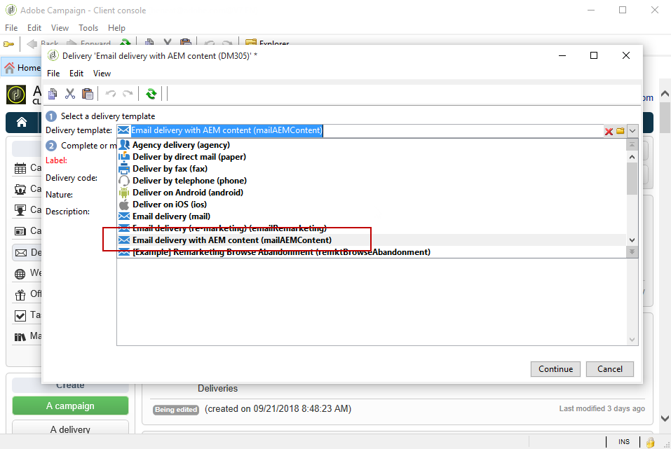

# Creación de un newsletter de Experience Manager{#creating-an-experience-manager-newsletter}

Esta integración puede utilizarse, por ejemplo, para crear un boletín en Adobe Experience Manager para su uso posterior en Adobe Campaign como parte de una campaña de correo electrónico.

Para ver un ejemplo más detallado sobre cómo utilizar esta integración, consulte esta [guía paso a paso](https://helpx.adobe.com/es/campaign/kb/acc-aem.html).

**Desde Adobe Experience Manager:**

1. En la instancia de autor de AEM, haga clic en el logotipo de **Adobe Experience** en la parte superior izquierda de la página y seleccione **[!UICONTROL Sites]**.

   

1. Seleccione **[!UICONTROL Campaigns > Name of your brand (here We.Retail) > Main Area > Email campaigns]**.
1. Haga clic en el botón **[!UICONTROL Create]** situado en la parte superior derecha de la página y seleccione **[!UICONTROL Page]**.

   

1. Seleccione la plantilla de **[!UICONTROL Adobe Campaign Email (AC 6.1)]** y asigne un nombre al newsletter.
1. Una vez creada la página, acceda al menú **[!UICONTROL Page information]** y haga clic en **[!UICONTROL Open Properties]**.

   

1. En la pestaña **[!UICONTROL Cloud Services]**, seleccione **[!UICONTROL Adobe Campaign]** como **[!UICONTROL Cloud service configuration]** y la instancia de Adobe Campaign en la segunda lista desplegable.

   

1. Edite su contenido del correo electrónico añadiendo componentes como, por ejemplo, campos de personalización de Adobe Campaign.
1. Cuando el correo electrónico esté listo, acceda al menú **[!UICONTROL Page information]** y haga clic en **[!UICONTROL Start workflow]**.

   

1. En la primera lista desplegable, seleccione **[!UICONTROL Publish to Adobe Campaign]** como modelo de flujo de trabajo y haga clic en **[!UICONTROL Start workflow]**.

   

1. A continuación, como en el paso anterior, ejecute el flujo de trabajo **[!UICONTROL Approve for Campaign]**.
1. Se muestra un aviso legal en la parte superior de la página. Haga clic en **[!UICONTROL Complete]** para confirmar la revisión y, a continuación, en **[!UICONTROL Ok]**.

   

1. Haga clic nuevamente en **[!UICONTROL Complete]** y seleccione **[!UICONTROL Newsletter approval]** en la **[!UICONTROL Next Step]** lista desplegable.

   

El boletín ya está listo y sincronizado en Adobe Campaign.

**Desde Adobe Campaign:**

1. En la pestaña **[!UICONTROL Campaigns]** , haga clic en **[!UICONTROL Deliveries]** luego **[!UICONTROL Create]**.

   

1. En la lista desplegable **[!UICONTROL Delivery template]** , seleccione la plantilla **[!UICONTROL Email delivery with AEM content (mailAEMContent)]** .

   

1. Añada a la entrega una **[!UICONTROL Label]** y haga clic en **[!UICONTROL Continue]**.
1. Haga clic en el botón **[!UICONTROL Synchronize]**.

   Si este botón no aparece en la interfaz, haga clic en el botón **[!UICONTROL Properties]** y seleccione la pestaña **[!UICONTROL Advanced]**. El campo **[!UICONTROL Content editing mode]** debe configurarse como **[!UICONTROL AEM]** con la instancia AEM en el campo **[!UICONTROL AEM account]**.

   

1. Seleccione la entrega creada anteriormente en Adobe Experience Manager y haga clic en **[!UICONTROL Ok]**.
1. Haga clic en el botón **[!UICONTROL Refresh content]** en cuanto se realicen algunos cambios en la entrega de AEM.

   

El correo electrónico está listo para enviarlo a su audiencia.
