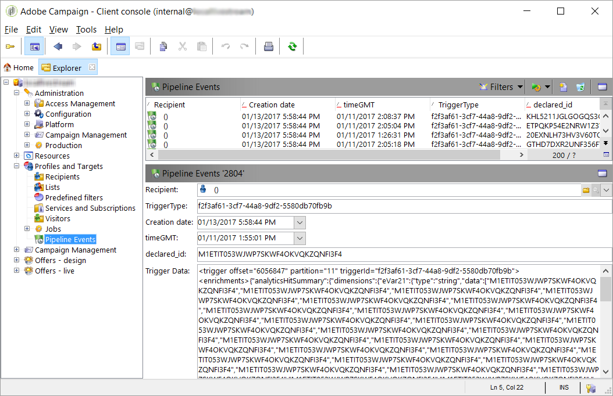

# Configuración de eventos para la implementación personalizada {#events}

Algunas partes de esta configuración tienen un desarrollo personalizado y requieren lo siguiente:

* Conocimientos prácticos sobre análisis de JSON, XML y Javascript en Adobe Campaign.
* Conocimientos prácticos de las API QueryDef y Writer.
* Nociones de trabajo de cifrado y autenticación mediante claves privadas.

Como la edición del código de JavaScript requiere habilidades técnicas, no lo intente sin tener la comprensión adecuada.

## Procesamiento de eventos en JavaScript {#events-javascript}

### Archivo JavaScript {#file-js}

La canalización utiliza una función de JavaScript para procesar cada mensaje. Esta función está definida por el usuario.

Se configura en la opción **[!UICONTROL NmsPipeline_Config]** bajo el atributo &quot;JSConnector&quot;. Se llama a este javascript cada vez que se recibe un evento. Está dirigido por el proceso [!DNL pipelined].

El archivo de JavaScript de muestra es cus:triggers.js.

### Función JavaScript {#function-js}

El [!DNL pipelined] Javascript debe iniciarse con una función específica.

Esta función se llama una vez por cada evento:

```
function processPipelineMessage(xmlTrigger) {}
```

Debería devolverse como

```
<undefined/>
```

Debe reiniciar [!DNL pipelined] después de editar el JavaScript.

### Activar formato de datos {#trigger-format}

Los datos [!DNL trigger] se pasan a la función JS en formato XML.

* El atributo **[!UICONTROL @triggerId]** contiene el nombre del [!DNL trigger].
* El elemento **enriquecimientos** en formato JSON contiene los datos generados por Adobe Analytics y se adjunta al activador.
* **[!UICONTROL @offset]** es el &quot;puntero&quot; del mensaje. Indica el orden del mensaje en la cola.
* **[!UICONTROL @partition]** es un contenedor de mensajes dentro de la cola. El desplazamiento es relativo a una partición. <br>Hay unas 15 particiones en la cola.

Ejemplo:

```
<trigger offset="1500435" partition="4" triggerId="LogoUpload_1_Visits_from_specific_Channel_or_ppp">
 <enrichments>{"analyticsHitSummary":{"dimensions":{" eVar01":{"type":"string","data":["PI4INE1ETDF6UK35GO13X7HO2ITLJHVH"],"name":" eVar01","source":"session summary"}, "timeGMT":{"type":"int","data":[1469164186,1469164195],"name":"timeGMT","source":"session summary"}},"products":{}}}</enrichments>
 <aliases/>
 </trigger>
```

### Enriquecimiento del formato de datos {#enrichment-format}

>[!NOTE]
>
>Es un ejemplo específico de varias implementaciones posibles.

El contenido se define en formato JSON en Adobe Analytics para cada activador.
Por ejemplo, un activador LogoUpload_upload_Visits:

* **[!UICONTROL eVar01]** puede contener el ID del comprador en formato de cadena que se utiliza para conciliar con destinatarios de Adobe Campaign. <br>Debe conciliarse para encontrar el ID del comprador, que es la clave primaria.

* **[!UICONTROL timeGMT]** puede contener la hora del activador del lado de Adobe Analytics en formato UTC Epoch (segundos desde 1/1/1970 UTC).

Ejemplo:

```
{
 "analyticsHitSummary": {
 "dimensions": {
 "eVar01": {
 "type": "string",
 "data": ["PI4INE1ETDF6UK35GO13X7HO2ITLJHVH"],
 "name": " eVar01",
 "source": "session summary"
 },
 "timeGMT": {
 "type": "int",
 "data": [1469164186, 1469164195],
 "name": "timeGMT",
 "source": "session summary"
 }
 },
 "products": {}
 }
 }
```

### Orden del procesamiento de eventos{#order-events}

Los eventos se procesan de a uno, por orden de desplazamiento. Cada subproceso del [!DNL pipelined] procesa una partición diferente.

El &quot;desplazamiento&quot; del último evento recuperado se almacena en la base de datos. Por lo tanto, si el proceso se detiene, se reinicia a partir del último mensaje. Estos datos se almacenan en el esquema integrado xtk:pipelineOffset.

Este puntero es específico para cada instancia y cada consumidor. Por lo tanto, cuando muchas instancias acceden a la misma canalización con diferentes consumidores, cada una recibe todos los mensajes y en el mismo orden.

El parámetro **consumidor** de la opción de canalización identifica la instancia que realiza la llamada.

Actualmente, no hay forma de tener diferentes colas para entornos separados como &quot;staging&quot; o &quot;dev&quot;.

### Registro y gestión de errores {#logging-error-handling}

Los registros como logInfo() se dirigen al registro [!DNL pipelined]. Los errores como logError() se escriben en el registro [!DNL pipelined] y hacen que el evento se coloque en una cola de reintentos. En este caso, debe comprobar el registro de canalización.
Los mensajes de error se vuelven a intentar varias veces en la duración establecida en las opciones [!DNL pipelined].

Para fines de depuración y monitorización, los datos de desencadenador completos se escriben en la tabla de desencadenadores del campo &quot;data&quot; en formato XML. De forma alternativa, el logInfo() que contenga los datos desencadenadores tiene el mismo propósito.

### Análisis de los datos {#data-parsing}

Este código JavaScript de muestra analiza el eVar01 en los enriquecimientos.

```
function processPipelineMessage(xmlTrigger)
 {
 (…)
 var shopper_id = ""
 if (xmlTrigger.enrichments.length() > 0)
 {
 if (xmlTrigger.enrichments.toString().match(/eVar01/) != undefined)
 {
 var enrichments = JSON.parse(xmlTrigger.enrichments.toString())
 shopper_id = enrichments.analyticsHitSummary.dimensions. eVar01.data[0]
 }
 }
 (…)
 }
```

Tenga cuidado al analizar para evitar errores.
Dado que este código se utiliza para todos los activadores, la mayoría de los datos no son obligatorios. Por lo tanto, se puede dejar vacío cuando no esté presente.

### Almacenamiento del activador {#storing-triggers-js}

>[!NOTE]
>
>Es un ejemplo específico de varias implementaciones posibles.

Este código JS de muestra guarda el activador en la base de datos.

```
function processPipelineMessage(xmlTrigger)
 {
 (…)
 var event = 
 <pipelineEvent
 xtkschema = "cus:pipelineEvent"
 _operation = "insert"
 created = {timeNow}
 lastModified = {timeNow}
 triggerType = {triggerType}
 timeGMT = {timeGMT}
 shopper_id = {shopper_id}
 data = {xmlTrigger.toXMLString()}
 />
 xtk.session.Write(event)
 return <undef/>;
 }
```

### Restricciones {#constraints}

El rendimiento de este código debe ser óptimo, ya que se ejecuta a altas frecuencias y puede causar posibles efectos negativos en otras actividades de marketing. Especialmente si se procesan más de un millón de eventos de activación por hora en el servidor de marketing o si no se ha ajustado correctamente.

El contexto de este JavaScript es limitado. No todas las funciones de la API están disponibles. Por ejemplo, getOption() o getCurrentdate() no funcionan.

Para permitir un procesamiento más rápido, se ejecutan varios subprocesos de esta secuencia de comandos al mismo tiempo. El código debe ser seguro para subprocesos.

## Almacenamiento de los eventos {#store-events}

>[!NOTE]
>
>Es un ejemplo específico de varias implementaciones posibles.

### esquema de evento de canalización{#pipeline-event-schema}

Los Eventos se almacenan en una tabla de la base de datos. Se utiliza en campañas de marketing para clientes de destinatario y enriquece los correos electrónicos mediante activadores.
Aunque cada activador puede tener una estructura de datos distinta, todos los activadores se pueden guardar en una sola tabla.
El campo triggerType identifica de dónde se originan los datos.

Este es un ejemplo de código de esquema para esta tabla:

| Atributo | Tipo | Etiqueta | Descripción |
|:-:|:-:|:-:|:-:|
| pipelineEventId | Largo | Clave principal | La clave primaria interna del activador. |
| datos | Nota | Activar datos | El contenido completo de los datos desencadenadores en formato XML. Para fines de depuración y auditoría. |
| triggerType | Cadena 50 | TriggerType | Nombre del activador. Identifica el comportamiento del cliente en el sitio web. |
| shopper_id | Cadena 32 | shopper_id | Identificador interno del comprador. Definido por el flujo de trabajo de reconciliación. Si es cero, significa que el cliente es desconocido en Campaign. |
| shopper_key | Largo | shopper_key | El Identificador externo del comprador según Analytics. |
| created | Datetime | Creado | Hora a la que se creó el evento en Campaign. |
| lastModified | Datetime | Última modificación | La última vez que se modificó el evento en Adobe. |
| timeGMT | Datetime | Marca de tiempo | Hora a la que se generó el evento en Analytics. |

### Visualización de los eventos {#display-events}

Los eventos se pueden mostrar con un formulario sencillo basado en el esquema de eventos.

>[!NOTE]
>
>El nodo Evento de canalización no está integrado y debe añadirse, así como el formulario relacionado debe crearse en Campaign. Estas operaciones están restringidas únicamente a usuarios expertos. Para obtener más información, consulte estas secciones: [Jerarquía de navegación](../../platform/using/adobe-campaign-explorer.md#about-navigation-hierarchy) y [Edición de formularios](../../configuration/using/editing-forms.md).



## Procesamiento de los eventos {#processing-the-events}

### Flujo de trabajo de reconciliación {#reconciliation-workflow}

La reconciliación es el proceso de hacer coincidir el cliente de Adobe Analytics con la base de datos de Adobe Campaign. Por ejemplo, los criterios para la coincidencia pueden ser shopper_id.

Por motivos de desempeño, la coincidencia debe realizarse en modo por lotes mediante un flujo de trabajo.
La frecuencia debe establecerse en 15 minutos para optimizar la carga de trabajo. Como consecuencia, el retraso entre una recepción de evento en Adobe Campaign y su procesamiento por un flujo de trabajo de marketing es de hasta 15 minutos.

### Opciones para la reconciliación de unidades en JavaScript {#options-unit-reconciliation}

Es posible ejecutar la consulta de reconciliación para cada activador en JavaScript. Tiene un mayor impacto en el rendimiento y ofrece resultados más rápidos. Podría ser necesario para casos de uso específicos cuando sea necesaria la reactividad.

Puede resultar difícil implementarlo si no se establece ningún índice en shopper_id. Si los criterios se encuentran en un servidor de base de datos independiente al servidor de marketing, utiliza un vínculo de base de datos, que tiene un rendimiento deficiente.

### Flujo de trabajo de depuración {#purge-workflow}

Los activadores se procesan dentro de la hora. El volumen puede ser de aproximadamente 1 millón de activadores por hora. Esto explica por qué se debe implementar un flujo de trabajo de depuración. La depuración se ejecuta una vez al día y elimina todos los activadores que tengan más de tres días.

### Flujos de trabajo de la campaña {#campaign-workflow}

El flujo de trabajo de la campaña de desencadenadores suele ser similar al de otras campañas recurrentes que se han utilizado.
Por ejemplo, puede establecer un inicio con una consulta en los activadores que buscan eventos específicos durante el último día. Ese destinatario se utiliza para enviar el correo electrónico. Los enriquecimientos o datos pueden provenir del activador. Marketing puede utilizarla de forma segura, ya que no requiere ninguna configuración.
