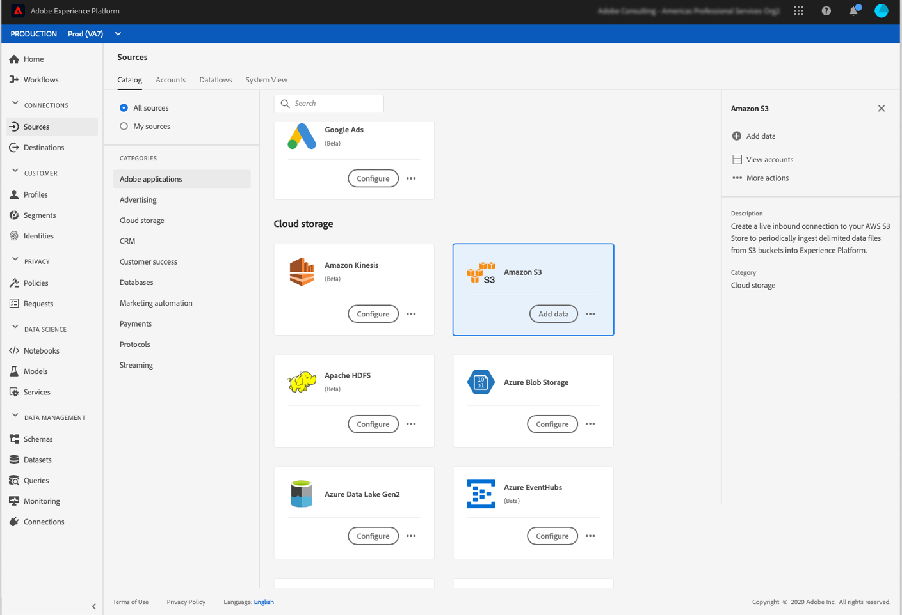

# Exportación de datos de Campaign a Adobe Experience Platform {#sources}

Para exportar datos de Campaign Classic a la plataforma de datos del cliente en tiempo real de Adobe (RTCDP), primero debe crear un flujo de trabajo en Campaign Classic para exportar los datos que desee compartir a su ubicación de S3 o Azure Blob Storage.

Una vez configurado el flujo de trabajo y enviado los datos a su ubicación de almacenamiento, debe conectar su ubicación de S3 o Azure Blob Storage como **fuente** en Adobe Experience Platform.

>[!NOTE]
>
>Tenga en cuenta que se recomienda exportar solo los datos generados por Campaign (por ejemplo, envíos, aperturas, clics, etc.) a Adobe Experience Platform. Los datos que se incorporan desde una fuente de terceros (como su CRM) deben importarse directamente en Adobe Experience Platform.

## Creación de un flujo de trabajo de exportación en Campaign Classic

Para exportar datos de Campaign Classic a la ubicación de S3 o Azure Blob Storage, debe crear un flujo de trabajo para dirigir los datos que desea exportar y enviarlos a su ubicación de almacenamiento.

Para ello, añada y configure lo siguiente:

* Una actividad **[!UICONTROL Data extraction (file)]** para extraer los datos de destino en un archivo CSV. Para obtener más información sobre cómo configurar esta actividad, consulte[esta sección](../../workflow/using/extraction--file-.md).

   

* Una actividad **[!UICONTROL File transfer]** para transferir el archivo CSV a su ubicación de almacenamiento. Para obtener más información sobre cómo configurar esta actividad, consulte [esta sección](../../workflow/using/file-transfer.md).

   

Por ejemplo, el flujo de trabajo siguiente extrae registros de forma regular en un archivo CSV y, a continuación, transfiere el archivo a una ubicación de almacenamiento.

## Conecte la ubicación de almacenamiento como origen

A continuación, se enumeran los pasos principales para conectar su ubicación de S3 o Azure Blob Storage como **origen** en Adobe Experience Platform. Encontrará información detallada sobre cada uno de estos pasos en la [Documentación de conectores de origen](https://experienceleague.adobe.com/docs/experience-platform/sources/home.html?lang=es).

1. En el menú **[!UICONTROL Sources]** de Adobe Experience Platform, cree una conexión con su ubicación de almacenamiento:

   * [Creación de una conexión de origen de Amazon S3](https://experienceleague.adobe.com/docs/experience-platform/sources/ui-tutorials/create/cloud-storage/s3.html?lang=es)
   * [Conector de Azure Blob](https://experienceleague.adobe.com/docs/experience-platform/sources/connectors/cloud-storage/blob.html?lang=es)

   >[!NOTE]
   >
   >La ubicación de almacenamiento puede ser Amazon S3, SFTP con contraseña, SFTP con clave SSH o conexiones Azure Blob. El método preferido para enviar datos a Adobe Campaign es mediante Amazon S3 o Azure Blob:

   

1. Configure un flujo de datos para una conexión por lotes de almacenamiento en la nube. Un flujo de datos es una tarea programada que recupera e ingiere datos de la ubicación de almacenamiento en un conjunto de datos de Adobe Experience Platform. Estos pasos le permiten configurar la ingesta de datos desde su ubicación de almacenamiento, incluida la selección de datos y la asignación de los campos CSV a un esquema XDM.

   Esta información está disponible en [esta página](https://experienceleague.adobe.com/docs/experience-platform/sources/ui-tutorials/dataflow/cloud-storage.html?lang=es).

   

1. Una vez configurado el origen, Adobe Experience Platform importará el archivo desde la ubicación de almacenamiento proporcionada.

   Esta operación se puede programar según sus necesidades. Se recomienda realizar la exportación hasta 6 veces al día, en función de la carga ya presente en la instancia.
