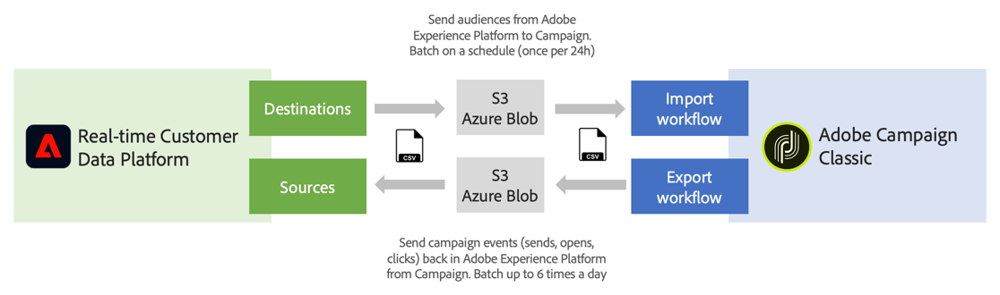

# Introducción a orígenes y destinos {#rtcdp}

## Acerca de los orígenes y destinos

Con Adobe Experience Platform, puede compartir datos entre Campaign Classic y la plataforma de datos del cliente en tiempo real de Adobe (RTCDP). Esto le permite dirigirse a las audiencias de Adobe Experience Platform en sus flujos de trabajo de Campaign y, a continuación, enviar los datos de la plataforma de datos del cliente en tiempo real de Adobe relacionados con estas audiencias, como envíos, aperturas y clics.

* Con **Destinos**, introduzca audiencias de Adobe Experience Platform en Campaign Classic. Esto le permite activar los datos conocidos y desconocidos para sus campañas de marketing.
* Con **Orígenes**, exporte los datos de Campaign Classic (por ejemplo, envíos, aperturas, clics) a Adobe Experience Platform. Esto le permite centralizar los datos que recopila de orígenes diferentes en un solo lugar y utilizar las perspectivas obtenidas de él para hacer más.

>[!IMPORTANT]
>
>Tenga en cuenta los límites del almacenamiento de SFTP, el almacenamiento de la base de datos y el perfil activo según el contrato de Adobe Campaign al usar esta funcionalidad.

Para obtener una descripción más detallada de la plataforma de datos del cliente en tiempo real de Adobe, los destinos y los orígenes, consulte estas páginas:

* [Plataforma de datos del cliente en tiempo real de Adobe](https://experienceleague.adobe.com/docs/experience-platform/rtcdp/overview.html?lang=es)
* [Documentación de destinos](https://experienceleague.adobe.com/docs/experience-platform/destinations/home.html?lang=es)
* [Documentación de orígenes](https://experienceleague.adobe.com/docs/experience-platform/sources/home.html?lang=es)

## Conectar Campaign Classic con Adobe Experience Platform

Para poder compartir datos entre Adobe Experience Platform y Campaign Classic, primero debe conectar Adobe Campaign como **destino** y conectar su ubicación de AWS S3 o Azure Blob Storage como **origen** en Adobe Experience Platform.

Una vez configurados los conectores, puede configurar una importación de datos o exportación a Campaign Classic mediante los flujos de trabajo.

Para obtener más información sobre cómo configurar estos procesos de importación y exportación, consulte estas secciones:

* [Ingesta de segmentos de Adobe Experience Platform en Campaign](../../integrations/using/ingest-aep-data.md)
* [Exportación de datos de Campaign a Adobe Experience Platform](../../integrations/using/export-campaign-data.md)
