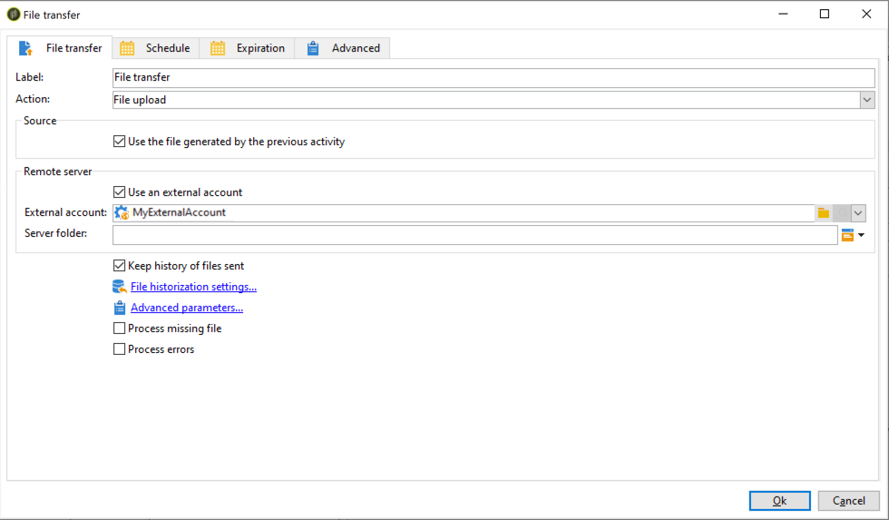

# Ingesta de segmentos de Adobe Experience Platform en Campaign {#destinations}

Para introducir público de Adobe Experience Platform en Campaign y utilizarlo en sus flujos de trabajo, primero debe conectar Adobe Campaign como **destino** de Adobe Experience Platform y configurarlo con el segmento a exportar.

Una vez configurado el destino, los datos se exportan a su ubicación de almacenamiento y deberá crear un flujo de trabajo dedicado en Campaign Classic para introducirlo.

## Conexión de Adobe Campaign como destino

En Adobe Experience Platform, para configurar una conexión con Adobe Campaign, seleccione una ubicación de almacenamiento para los segmentos exportados. Estos pasos también le permiten seleccionar los segmentos que desea exportar y especificar los campos XDM adicionales que incluir.

Para obtener más información, consulte la [documentación de destinos](https://experienceleague.adobe.com/docs/experience-platform/destinations/catalog/email-marketing/adobe-campaign.html?lang=es#catalog).

Una vez configurado el destino, Adobe Experience Platform crea un archivo .txt o .csv delimitado por tabuladores en la ubicación de almacenamiento proporcionada. Esta operación se programa y realiza una vez cada 24 horas.

Ahora puede configurar un flujo de trabajo de Campaign Classic para introducir el segmento en Campaign.

## Creación de un flujo de trabajo de importación en Campaign Classic

Una vez configurado Campaign Classic como destino, debe crear un flujo de trabajo dedicado para importar el archivo que ha exportado Adobe Experience Platform.

Para ello, debe añadir y configurar una actividad **[!UICONTROL File transfer]**. Para obtener más información sobre cómo configurar esta actividad, consulte la [documentación de Campaign v8](https://experienceleague.adobe.com/docs/campaign/automation/workflows/wf-activities/event-activities/file-transfer.html?lang=es){target="_blank"}.

A continuación, puede crear un flujo de trabajo según sus necesidades (actualizar la base de datos con los datos del segmento, realizar envíos en canales múltiples al segmento, etc.).

Por ejemplo, el flujo de trabajo siguiente descarga diariamente el archivo desde su ubicación de almacenamiento y, a continuación, actualiza la base de datos de Campaign con los datos del segmento.

