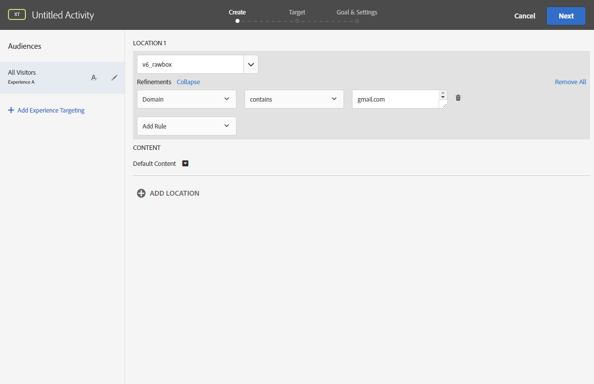

# Inserción de una imagen dinámica{#inserting-a-dynamic-image}

Esta sección detalla los pasos necesarios en Adobe Campaign para integrar una imagen de Adobe Target en un mensaje de correo electrónico.

Debe llevar a cabo previamente las siguientes acciones en Adobe Target:

* Cree una o varias [ofertas de redirección](https://docs.adobe.com/help/en/target/using/experiences/offers/offer-redirect.html), en las que debe especificar la URL de la imagen que desea utilizar.
* Cree una o varias [audiencias](https://marketing.adobe.com/resources/help/en_US/target/target/t_create-audience.html) para definir el público objetivo de la actividad.
* Cree una actividad de [Compositor de experiencias basadas en formularios](https://docs.adobe.com/content/help/en/target/using/activities/abtest/create/test-create-ab.html), en la que debe seleccionar un “rawbox” y especificar varias experiencias, dependiendo del número de ofertas de redirección creadas. Para cada experiencia, debe seleccionar una de las ofertas de redirección creadas.

   Para especificar estas experiencias, puede crear segmentos utilizando la información de Adobe Campaign. Para utilizar datos de Adobe Campaign en las reglas de selección de la oferta, debe especificar los datos en el “rawbox” en Adobe Target.

Para insertar una imagen de Adobe Target en un envío de Adobe Campaign:

1. Creación de un envío de correo electrónico.
1. En los campos de personalización disponibles, seleccione **[!UICONTROL Include > Dynamic image served by Adobe Target]**.

   

1. En la ventana que se abre, seleccione la imagen que aparece por defecto en el mensaje de correo electrónico. Puede especificar la dirección URL de la imagen o utilizar una [imagen compartida](../../integrations/using/sharing-assets-with-adobe-experience-cloud.md).
1. Introduzca el nombre del “rawbox” especificado en Adobe Target.
1. Enter a URL in the **[!UICONTROL Landing Page]** field if you want the default image to redirect to a default landing page. Esta URL es opcional y solo para aquellos casos en que la imagen predeterminada se muestra en el mensaje de correo electrónico final.
1. Si utiliza permisos de empresa en la configuración de Adobe Target, añada la propiedad correspondiente en este campo. Obtenga más información sobre los permisos de empresa de Target en [esta página](https://marketing.adobe.com/resources/help/en_US/target/target/properties-overview.html). Este campo es opcional y no es necesario si no se utilizan permisos de empresa en Target.
1. In **[!UICONTROL Additional decision parameters]**, specify the mapping between the fields defined in the Adobe Target segments and the Adobe Campaign fields. Los campos de Adobe Campaign utilizados deben haberse especificado en el “rawbox”.

   

   La definición de un parámetro en Adobe Target se realiza mediante el “rawbox” creado al integrar la imagen de destino en Adobe Campaign y la opción **Refinamientos**.

   

   Este ejemplo muestra cómo definir distintas experiencias para hombres y mujeres.

También puede definir varios casos en función del dominio y la dirección de correo electrónico del usuario. Los datos se recuperan automáticamente del navegador del usuario cuando se abre el correo electrónico.

Al previsualizar el correo electrónico, puede ver, cuando selecciona diferentes perfiles, que la imagen insertada cambia según los parámetros especificados en la actividad de Adobe Target y en Adobe Campaign.

Puede medir los resultados de los envíos en Adobe Target.

