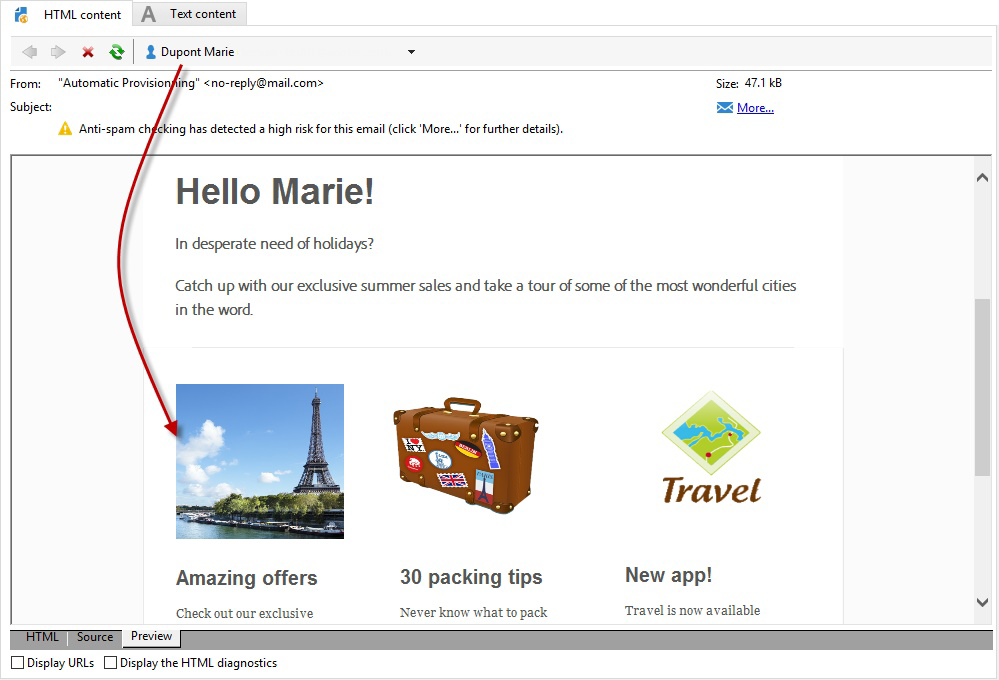

# Inserción de contenido dinámico de Destinatario {#inserting-a-dynamic-image}

En esta guía, se muestra cómo integrar una oferta dinámica desde Target en un mensaje de correo electrónico en Adobe Campaign.

Queremos crear un envío que incluya un bloque de imagen que cambie de manera dinámica según el país del destinatario. Los datos se envían con cada solicitud mbox y dependen de la dirección IP del visitante.

En este correo electrónico, queremos que una de las imágenes cambie de manera dinámica según las siguientes experiencias de los usuarios:

* El correo electrónico se abre en Francia.
* El correo electrónico se abre en Estados Unidos.
* Si no se aplica ninguna de estas condiciones, se muestra una imagen predeterminada.

Para que esto funcione, se deben realizar los dos pasos siguientes en Adobe Campaign y Target:

1. [Inserción de la oferta dinámica en un mensaje de correo electrónico](../../integrations/using/inserting-a-dynamic-image.md#inserting-dynamic-offer)
1. [Creación de ofertas personalizadas](../../integrations/using/inserting-a-dynamic-image.md#create-redirect-offers)
1. [Creación de audiencias](../../integrations/using/inserting-a-dynamic-image.md#audiences-target)
1. [Creación de una actividad de segmentación de experiencias](../../integrations/using/inserting-a-dynamic-image.md#creating-targeting-activity)
1. [Previsualización y envío del correo electrónico](../../integrations/using/inserting-a-dynamic-image.md#preview-send-email)

## Inserción de la oferta dinámica en un mensaje de correo electrónico {#inserting-dynamic-offer}

En Adobe Campaign, cuando haya terminado de definir el destino y el contenido de su correo electrónico, puede insertar una imagen dinámica desde Target.

Para ello, especifique la URL de la imagen predeterminada, el nombre de la ubicación y los campos que desee transferir al destino.

En Adobe Campaign, hay dos formas de insertar una imagen dinámica desde Target en un mensaje de correo electrónico:

* Si utiliza el editor de contenido digital, elija una imagen existente y seleccione **[!UICONTROL Insert]** > **[!UICONTROL Dynamic image served by Adobe Target]** en la barra de herramientas.

   

* Si está utilizando el editor estándar, coloque el cursor donde desee insertar la imagen y, en el menú desplegable de personalización, seleccione **[!UICONTROL Include]** > **[!UICONTROL Dynamic image served by Adobe Target...]**.

   

### Definición de los parámetros de la imagen {#defining-image-parameters}

* La URL de **[!UICONTROL Default image]**: Esta es la imagen que se muestra cuando no se cumple ninguna de las condiciones. También puede seleccionar una imagen de su biblioteca de activos.
* **[!UICONTROL Target location]**: Introduzca un nombre para la ubicación de su oferta dinámica. Debe seleccionar esta ubicación en la actividad de Target.
* **[!UICONTROL Landing Page]**: Si desea que la imagen predeterminada se redirija a una página de aterrizaje predeterminada. Esta URL es opcional y solo para aquellos casos en que la imagen predeterminada se muestra en el mensaje de correo electrónico final.
* **[!UICONTROL Additional decision parameters]**: especifique la asignación entre los campos definidos en los segmentos de Adobe Target y los campos de Adobe Campaign. Los campos de Adobe Campaign utilizados deben haberse especificado en el “rawbox”. En el ejemplo, añadimos el campo País.

Si utiliza permisos de empresa en la configuración de Adobe Target, añada la propiedad correspondiente en este campo. Obtenga más información sobre los permisos de empresa de Target en [esta página](https://docs.adobe.com/content/help/es-ES/target/using/administer/manage-users/enterprise/properties-overview.html).

## Creación de ofertas personalizadas {#create-redirect-offers}

En Target puede crear distintas versiones de la oferta. Según cada experiencia de usuario, se puede crear una oferta de redireccionamiento y puede especificar la imagen que desee mostrar.

En este caso, necesitamos dos ofertas de redirección, la tercera (la predeterminada) se define en Adobe Campaign.

1. Para crear una nueva oferta de redirección en Target Standard, en la pestaña **[!UICONTROL Content]**, haga clic en **[!UICONTROL Code offers]**.

1. Haga clic en **[!UICONTROL Create]**, luego en **[!UICONTROL Redirect Offer]**.

   

1. Introduzca un nombre para la oferta y la URL de su imagen.

   

1. Siga el mismo procedimiento para la oferta de redirección restante. Para obtener más información, consulte [esta página](https://docs.adobe.com/help/es-ES/target/using/experiences/offers/offer-redirect.html).

## Creación de audiencias {#audiences-target}

En Target, debe crear las dos audiencias en las que se clasifican las personas que visitan la oferta para enviarles los diferentes contenidos. Para cada audiencia, añada una regla para definir quién puede ver la oferta.

1. Para crear una nueva audiencia en Target, en la pestaña **[!UICONTROL Audiences]**, haga clic en **[!UICONTROL Create Audience]**.

   

1. Añada un nombre a su audiencia.

   

1. Haga clic en **[!UICONTROL Add a rule]** y seleccione una categoría. La regla utiliza criterios específicos para dirigirse a los visitantes. Puede restringir las reglas añadiendo condiciones o creando nuevas reglas en otras categorías.

1. Siga el mismo procedimiento para las audiencias restantes.

## Creación de una actividad de segmentación de experiencias    {#creating-targeting-activity}

En Target, es necesario crear una actividad de segmentación de experiencias, definir las diferentes experiencias y asociarlas a las ofertas correspondientes.

### Definición de la audiencia {#defining-the-audience}

1. Para crear una actividad de segmentación de experiencias, en la pestaña **[!UICONTROL Activities]**, haga clic en **[!UICONTROL Create Activity]** y, a continuación, en **[!UICONTROL Experience Targeting]**.

   

1. Seleccione **[!UICONTROL Form]** como **[!UICONTROL Experience Composer]**.

1. Haga clic en el botón **[!UICONTROL Change audience]** para elegir una audiencia.

   

1. Seleccione la audiencia que se creó en los pasos anteriores.

   

1. Para crear otra experiencia, haga clic en **[!UICONTROL Add Experience Targeting]**.

### Definición de la ubicación y el contenido {#defining-location-content}

Añada un contenido para cada audiencia:

1. Seleccione el nombre de la ubicación que eligió al insertar la oferta dinámica en Adobe Campaign.

   

1. Haga clic en el botón desplegable y seleccione **[!UICONTROL Change Redirect Offer]**.

   

1. Seleccione la oferta de redirección que había creado anteriormente.

   

1. Siga el mismo procedimiento para la segunda experiencia.

### Definición de la actividad {#defining-activity}

La ventana de **[!UICONTROL Target]** resume la actividad. Si es necesario, puede añadir otras experiencias.

La ventana de **[!UICONTROL Goal & Settings]** permite personalizar la actividad estableciendo una prioridad, un objetivo o una duración.

La sección **[!UICONTROL Reporting Settings]** permite seleccionar una acción y editar los parámetros que determinan cuándo se logra el objetivo.

## Vista previa y envío del correo electrónico en Campaign Classic {#preview-send-email}

En Adobe Campaign, ahora puede previsualizar el correo electrónico y probar su renderizado en distintos destinatarios. Observe que la imagen cambia según las diferentes experiencias creadas. Para obtener más información sobre la creación de correos electrónicos, consulte esta [página](../../delivery/using/defining-the-email-content.md).

Ya está listo para enviar su correo electrónico, incluida una oferta dinámica de Target.

