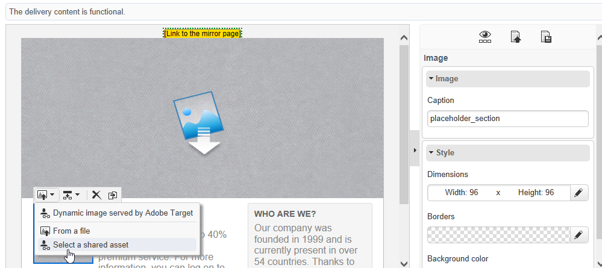

# Inserción de un activo compartido{#inserting-a-shared-asset}

Los activos compartidos desde Adobe Experience Cloud se pueden utilizar en los mensajes de correo electrónico y páginas de aterrizaje de la siguiente manera:

1. Cree un nuevo correo electrónico o una nueva página de aterrizaje.

   Si utiliza recursos de la biblioteca de recursos de Adobe Experience Manager, utilice una plantilla de envío creada al [configurar la integración](../../integrations/using/configuring-access-to-assets.md#integrating-with-aem-assets).

   If you do not have this specific template, make sure that in the delivery **Properties**, the **[!UICONTROL Content editing mode]** (**[!UICONTROL Advanced]** tab) is set to **DCE** and that the AEM external account that you want to use for accessing your AEM Assets resource library is provided.

1. En la ventana de edición, seleccione la opción para añadir una imagen:

   * Si utiliza el modo [de edición](../../delivery/using/defining-the-email-content.md#adding-images)estándar, seleccione **[!UICONTROL Image]** > **[!UICONTROL Select a shared asset]**.

      

   * If you are using the [advanced editing mode](../../web/using/about-campaign-html-editor.md) (DCE), go to an image block, then via the contextual menu, select **[!UICONTROL Select a shared asset]**.

      

      >[!NOTE]
      >
      >No se pueden insertar imágenes compartidas desde Adobe Campaign en el [acceso web](../../platform/using/adobe-campaign-workspace.md#console-and-web-access) al utilizar el DCE.

1. En la ventana de selección que se abre, seleccione una imagen y, a continuación, confirme la selección.

   Las imágenes disponibles provienen de la biblioteca de Adobe Experience Cloud o de la biblioteca de AEM Assets, según la configuración de la instancia de Adobe Campaign. Consulte la sección [Configuración del acceso a los recursos](../../integrations/using/configuring-access-to-assets.md) .

   

>[!NOTE]
>
>Si se utiliza la integración con Adobe Target, se puede utilizar una imagen compartida como imagen predeterminada. Consulte [esta página](../../integrations/using/integrating-with-adobe-target.md).

