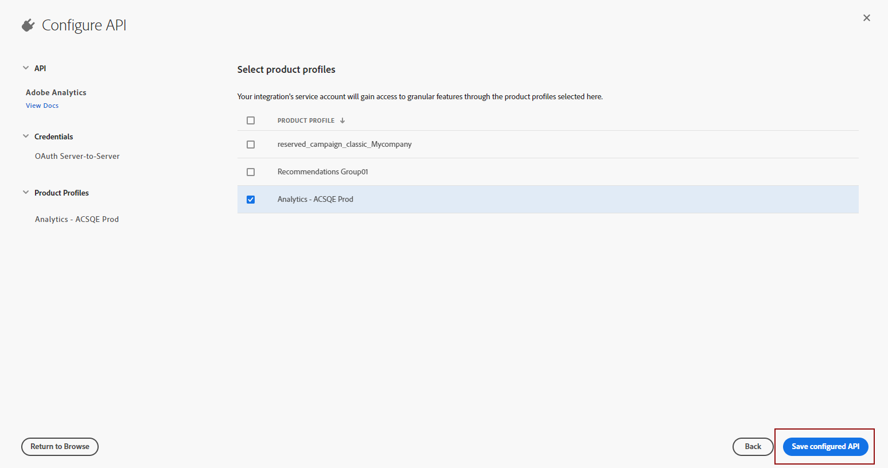

# Creación de la cuenta técnica de Adobe {#create-service-account}

Las credenciales de autenticación de servidor a servidor permiten al servidor de la aplicación generar tokens de acceso y realizar llamadas de API en nombre de la propia aplicación. [Más información](https://developer.adobe.com/developer-console/docs/guides/authentication/ServerToServerAuthentication/)

## Migración de integraciones existentes {#migrate-jwt}

Adobe está desaprobando la credencial de la cuenta de servicio (JWT). Las integraciones de Campaign con soluciones y aplicaciones de Adobe ahora deben depender de las credenciales de servidor a servidor de OAuth.

Si ha implementado integraciones entrantes o salientes con Campaign antes de junio de 2024, debe actualizar su entorno de Campaign a la versión 7.4.1 y migrar su cuenta técnica a oAuth como se detalla [en esta documentación](https://developer.adobe.com/developer-console/docs/guides/authentication/ServerToServerAuthentication/migration){target="_blank"}. Las credenciales de la cuenta de servicio existente (JWT) seguirán funcionando hasta el **martes, 30 de junio de 2025**.

Una vez completada la migración, debe asociar la nueva credencial a Campaign como se explica en [esta sección](#add-credentials).

## Crear nueva cuenta técnica de OAuth para nuevas integraciones {#oauth-service}

Para crear la cuenta técnica de OAuth para nuevas integraciones, siga estos pasos:

1. Acceda a la consola de Adobe Developer e inicie sesión como **Administrador del sistema** de su organización.

   Para obtener más información acerca de las funciones de administrador, consulte esta [página](https://helpx.adobe.com/es/enterprise/using/admin-roles.html).

1. Haga clic en **[!UICONTROL Create a new project]**.

   

1. Haga clic en **[!UICONTROL Add to Project]** y seleccione **[!UICONTROL API]**.

   

1. Seleccione el producto que desea integrar con Campaign y haga clic en **[!UICONTROL Next]**.

1. Elija **[!UICONTROL OAuth Server-to-Server]** como tipo de autenticación y haga clic en **[!UICONTROL Next]**.

   

1. Seleccione el vínculo **[!UICONTROL Product profile]** a su proyecto.

   Puede crear uno nuevo si es necesario. [Más información](https://helpx.adobe.com/es/enterprise/using/manage-product-profiles.html)

1. A continuación, haga clic en **[!UICONTROL Save Configured API]**.

   

1. En el proyecto, en Credencial, seleccione [!DNL OAuth Server-to-Server] y copie la siguiente información:

   * **[!UICONTROL Client ID]**
   * **[!UICONTROL Client secret]**
   * **[!UICONTROL Technical account ID]**
   * **[!UICONTROL Organization ID]**

## Añadir credenciales del proyecto OAuth en Campaign {#add-credentials}

Una vez ejecutados los pasos anteriores, añada las credenciales del proyecto OAuth en Adobe Campaign.

>[!NOTE]
>
>Como cliente de Cloud Services alojados o administrados, estos pasos no son necesarios: Adobe ya ha agregado las credenciales del proyecto de OAuth a su entorno.
>

Como cliente on-premise o híbrido, siga estos pasos:

1. Inicie sesión mediante SSH en cada contenedor donde esté instalada la instancia de Adobe Campaign.

1. Agregue las credenciales de su proyecto OAuth en Adobe Campaign ejecutando el siguiente comando como usuario `neolane`. Esto insertará las credenciales **[!UICONTROL Technical Account]** en el archivo de configuración de instancia.

   ```
   nlserver config -instance:<instance_name> -setimsoauth:ims-org-id/client-id/technical-account-id/client-secret
   ```

   >[!NOTE]
   >
   > Para las versiones anteriores a la 7.4.1, use `setimsauth` o `setimsjwtauth` en lugar de `setimsoauth`.


