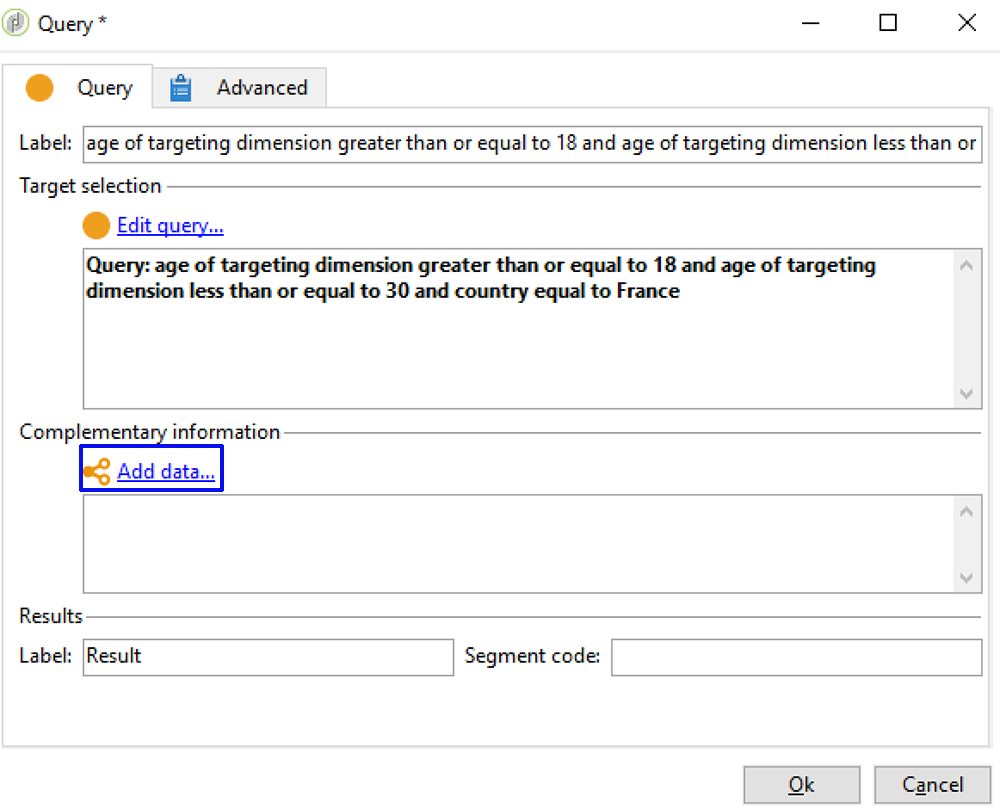
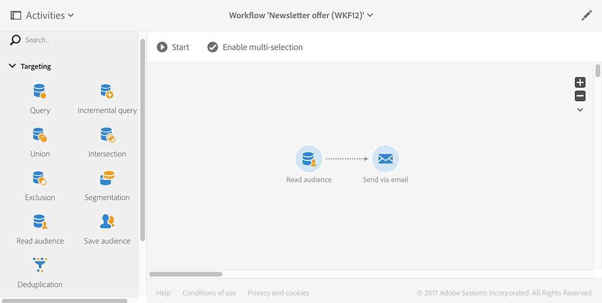

# Sincronización de audiencias{#synchronizing-audiences}

Puede crear una lista refinada mediante las funciones avanzadas de Campaign v7 y compartir esta lista directamente como una audiencia, en tiempo real y sin fisuras con Campaign Standard (incluidos los datos adicionales). El usuario de Campaign Standard puede consumir la audiencia en Adobe Campaign Standard.

Los objetivos complejos que impliquen datos adicionales no duplicados en Campaign Standard solo se pueden lograr con Campaign v7.

Con Campaign Standard también puede compartir listas de destinatarios o datos procedentes de un conector como Microsoft Dynamics.

Este ejemplo de uso muestra cómo preparar el objetivo de su entrega en Campaign v7 y cómo reutilizar este objetivo y sus datos adicionales en una entrega creada y realizada con Adobe Campaign Standard.

>[!NOTE]
>
>También puede enriquecer los datos utilizando los acumulados y las colecciones en Adobe Campaign Standard si todos los datos que necesita ya están duplicados.

## Requisitos previos {#prerequisites}

Para lograr esto, es necesario lo siguiente:

* Los destinatarios almacenados en la base de datos de Campaign v7 y sincronizarlos con Campaign Standard. Consulte la sección [Sincronización de perfiles](../../integrations/using/synchronizing-profiles.md).
* Datos adicionales, como suscripciones o transacciones, almacenados en las tablas relacionadas con nms:recipients en la base de datos de Campaign v7. Estos datos pueden proceder de esquemas OOB o tablas personalizadas de Campaign v7. De forma predeterminada no están disponibles en Campaign Standard, ya que no están sincronizados.
* El derecho para ejecutar los flujos de trabajo en Campaign v7 y Campaign Standard.
* El derecho para crear y ejecutar una entrega en Campaign Standard.

## Creación de un flujo de trabajo de objetivos con datos adicionales en Campaign v7 {#create-a-targeting-workflow-with-additional-data-in-campaign-v7}

Los objetivos complejos que impliquen datos adicionales no duplicados en Campaign Standard solo se pueden lograr con Campaign v7.

Una vez definidos el objetivo y los datos adicionales, es posible guardarlo como una lista que pueda compartirse con Campaign Standard.

>[!NOTE]
>
>Este es un ejemplo. Según sus necesidades, puede simplemente crear una consulta con una lista de destinatarios y compartirla con ACS sin más procesamiento. También puede utilizar otras actividades de gestión de datos para preparar el objetivo final.

Para obtener la audiencia final y sus datos adicionales:

1. Cree un nuevo de flujo de trabajo desde **[!UICONTROL Profiles and Targets]** > **[!UICONTROL Jobs]** > **[!UICONTROL Targeting workflows]**.
1. Añada una actividad de **[!UICONTROL Query]** y seleccione los destinatarios a los que desea enviar el correo electrónico final. Por ejemplo, todos los destinatarios de entre 18 y 30 años que viven en Francia.

   

1. Añada los datos adicionales desde la consulta. Para obtener más información, consulte la sección [Adición de información](../../workflow/using/query.md#adding-data).

   Este ejemplo muestra cómo añadir un acumulado para contar cuántos envíos recibió un destinatario en un año.

   En **[!UICONTROL Query]**, seleccione **[!UICONTROL Add data...]**

   

1. Seleccione **[!UICONTROL Data linked to the filtering dimension]** y haga clic en **[!UICONTROL Next]**.

   

1. Elija **[!UICONTROL Data linked to the filtering dimension]** y luego seleccione el nodo **[!UICONTROL Recipient delivery logs]** y haga clic en **[!UICONTROL Next]**.

   

1. Seleccione **[!UICONTROL Aggregates]** en el campo **[!UICONTROL Data collected]** y haga clic en **[!UICONTROL Next]**.

   

1. Añada una condición de filtrado para tener en cuenta solo los registros creados durante los últimos 365 días y haga clic en **[!UICONTROL Next]**.

   

1. Defina las columnas de salida. En este caso, la única columna necesaria es la del número de envíos. Para ello:

   * En la parte derecha de la ventana, seleccione **[!UICONTROL Add]**.
   * En la ventana **[!UICONTROL Select field]**, haga clic en **[!UICONTROL Advanced selection]**.
   * Seleccione **[!UICONTROL Aggregate]**, luego **[!UICONTROL Count]**. Marque la opción **[!UICONTROL Distinct]** y haga clic en **[!UICONTROL Next]**.
   * En la lista de campos, seleccione el campo utilizado para la función **Recuento**. Seleccione un campo que se rellene siempre, por ejemplo, el campo **[!UICONTROL Primary key]**, y haga clic en **[!UICONTROL Finish]**.
   * Cambie la expresión en la columna **[!UICONTROL Alias]**. Este alias le permite recuperar fácilmente la columna añadida en la entrega final. Por ejemplo, **NBdeliveries**.
   * Haga clic en **[!UICONTROL Finish]** y guarde la configuración de la actividad **[!UICONTROL Query]**.

   

1. Guarde el flujo de trabajo. En la siguiente sección se muestra cómo compartir la población con ACS.

## Uso compartido del objetivo con Campaign Standard {#share-the-target-with-campaign-standard}

Una vez definido el público objetivo, puede compartirlo con ACS a través de una actividad de **[!UICONTROL List update]**.

1. En el flujo de trabajo creado anteriormente, añada una actividad **[!UICONTROL List update]** y especifique la lista que desea actualizar o crear.

   Especifique la carpeta en la que desea guardar la lista en Campaign v7. Las listas están sujetas a la asignación de carpetas definida durante la implementación, lo cual puede afectar a su visibilidad una vez compartidas en Campaign Standard. Consulte la sección [Conversión de derechos](../../integrations/using/acs-connector-principles-and-data-cycle.md#rights-conversion).

1. Asegúrese de que la opción **[!UICONTROL Share with ACS]** esté seleccionada. Está activada de forma predeterminada.

   

1. Guarde y ejecute el flujo de trabajo.

   El objetivo y sus datos adicionales se guardan en una lista de Campaign v7 y se comparten inmediatamente como una audiencia de lista en Campaign Standard. Solo los perfiles que se hayan duplicado se comparten con ACS.

Si se produce un error en la actividad **[!UICONTROL List update]**, significa que la sincronización con Campaign Standard puede haber fallado. Para poder ver más detalles sobre qué ha fallado, vaya a **[!UICONTROL Administration]** > **[!UICONTROL ACS Connector]** > **[!UICONTROL Process]** > **[!UICONTROL Diagnosis]**. Esta carpeta contiene los flujos de trabajo de sincronización activados por la ejecución de la actividad **[!UICONTROL List update]**. Consulte la sección [Solución de problemas del conector ACS](../../integrations/using/troubleshooting-the-acs-connector.md).

## Recuperación de los datos en Campaign Standard y uso en una entrega {#retrieve-the-data-in-campaign-standard-and-use-it-in-a-delivery}

Una vez que el flujo de trabajo de objetivo se ejecuta en Campaign v7, puede encontrar la audiencia de lista en modo de solo lectura desde el menú **[!UICONTROL Audiences]** de Campaign Standard.

Mediante la creación de un flujo de trabajo de entrega en Campaign Standard, es posible utilizar esta audiencia, así como los datos adicionales que contiene, en una entrega.

1. Cree un nuevo flujo de trabajo a través del menú **[!UICONTROL Marketing activities]**.
1. Añada una actividad **[!UICONTROL Read audience]** y seleccione la audiencia que ha compartido previamente desde Campaign v7.

   Esta actividad se utiliza para recuperar los datos de la audiencia seleccionada. También puede aplicar un **[!UICONTROL Source Filtering]** adicional si lo necesita utilizando la pestaña correspondiente de esta actividad.

1. Añada una actividad **[!UICONTROL Email delivery]** y configúrela como cualquier otra [actividad de entrega de correo electrónico](https://docs.adobe.com/content/help/es-ES/campaign-standard/using/managing-processes-and-data/channel-activities/email-delivery.html).
1. Abra el contenido de la entrega.
1. Añada un campo personalizado. En la ventana emergente, busque el nodo **[!UICONTROL Additional data (targetData)]**. Este nodo contiene los datos adicionales de la audiencia que se calcularon en el flujo de trabajo inicial de objetivo. Puede utilizarlos como cualquier otro campo personalizado.

   Para este ejemplo, el dato adicional proveniente del flujo de trabajo de objetivo original es el número de envíos a cada destinatario en los últimos 365 días. El alias de NBdeliveries especificado en el flujo de trabajo de objetivo se puede ver aquí.

   

1. Guarde la entrega y el flujo de trabajo.

   El flujo de trabajo está listo para ejecutarse. La entrega se analiza y está listo para su entrega.

   

## Realización y monitorización de su entrega {#send-and-monitor-your-delivery}

Una vez que la entrega y el contenido estén listos, realice la entrega tal y como se describe más detalladamente en [esta sección](https://docs.adobe.com/content/help/en/campaign-standard/using/managing-processes-and-data/channel-activities/email-delivery.html):

1. Ejecute el flujo de trabajo de entrega. Este paso prepara la entrega del correo electrónico.
1. En el panel de entrega, confirme manualmente que la entrega se puede realizar.
1. Monitorice los informes y “logs” de entrega

   * **En Campaign Standard**: Aceda a [informes](https://docs.adobe.com/content/help/es-ES/campaign-standard/using/reporting/about-reporting/about-dynamic-reports.html) y [registros](https://docs.adobe.com/content/help/es-ES/campaign-standard/using/testing-and-sending/monitoring-messages/monitoring-a-delivery.html) relacionados a la entrega como para cualquier entrega.
   * **en Campaign v7 y Campaign Standard**: Las ID de entrega, los registros generales de correo electrónico y los registros de seguimiento de correo electrónico se sincronizan con Campaign v7. A continuación, puede obtener una visualización a 360 grados de sus campañas de marketing desde Campaign v7.

      Las cuarentenas se sincronizan automáticamente con Campaign v7. Esto permite tener en cuenta la información que no se debe enviar de cara a la siguiente actividad de objetivos realizada en Campaign v7.

      Puede encontrar más información sobre la administración de la cuarentena en Campaign Standard en [esta sección](https://docs.adobe.com/content/help/es-ES/campaign-standard/using/testing-and-sending/monitoring-messages/understanding-quarantine-management.html).

