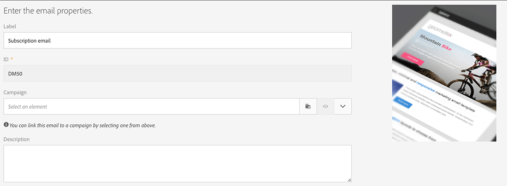

# Sincronización de perfiles{#synchronizing-profiles}

El conector ACS duplica los datos de Campaign v7 a Campaign Standard. Los datos recibidos de Campaign v7 se pueden utilizar en Campaign Standard para crear envíos. Puede ver cómo se sincronizan los perfiles realizando las operaciones enumeradas a continuación.

* **Add new recipients**: Cree un destinatario nuevo en Campaign v7 y confirme que el perfil correspondiente se haya duplicado en Campaign Standard. Consulte [Creación de un destinatario nuevo](#creating-a-new-recipient).
* **Update recipients**: Edite un destinatario nuevo en Campaign v7 y vea el perfil correspondiente en Campaign Standard para confirmar que la actualización se haya duplicado. Consulte [Edición de un destinatario](#editing-a-recipient).
* **Build a workflow in Campaign Standard**: Cree un flujo de trabajo en Campaign Standard que incluya una consulta con una audiencia o perfiles duplicados de Campaign v7. Consulte [Creación de un flujo de trabajo](#creating-a-workflow).
* **Create a delivery in Campaign Standard**: Siga el flujo de trabajo hasta la finalización para realizar una entrega. Consulte [Creación de una entrega](#creating-a-delivery).
* **Verify the unsubscription link**: Utilice una aplicación web de Campaign v7 para asegurarse de que la selección del destinatario de darse de baja de un servicio se envíe a la base de datos de Campaign v7. La opción de dejar de recibir el servicio se duplica en Campaign Standard. Consulte [Modificación del vínculo de baja de suscripción](#changing-the-unsubscription-link).

## Requisitos previos {#prerequisites}

Las secciones siguientes describen cómo el conector ACS ayuda a añadir y editar destinatarios en Campaign v7 y a utilizarlos después en una entrega de Campaign Standard. El conector ACS requiere lo siguiente:

* duplicación de destinatarios de Campaign v7 en Campaign Standard.
* Derechos de usuario para ejecutar flujos de trabajo en Campaign v7 y en Campaign Standard.
* Derechos de usuario para crear y ejecutar una entrega en Campaign Standard.

## Modificación del vínculo de baja de suscripción {#changing-the-unsubscription-link}

Cuando un destinatario hace clic en el vínculo de baja de suscripción en un mensaje de correo electrónico enviado por Campaign Standard, se actualiza el perfil correspondiente en Campaign Standard. Para asegurarse de que un perfil duplicado incluya la opción para el usuario de darse baja de un servicio, la información debe enviarse a Campaign v7 en lugar de a Campaign Standard. Para ejecutar el cambio, el servicio de baja está vinculado con una aplicación web de Campaign v7 en lugar de Campaign Standard.

>[!NOTE]
>
>Solicite al consultor que configure la aplicación web para el servicio de baja antes de iniciar los pasos siguientes.

## Creación de un destinatario nuevo {#creating-a-new-recipient}

1. Cree un destinatario nuevo en Campaign v7 para la duplicación en Campaign Standard. Introduzca la mayor cantidad de información posible, incluidos el apellido, el nombre, la dirección de correo electrónico y la dirección postal del destinatario. No obstante, no seleccione **[!UICONTROL Salutation]**, ya que este se añade en la siguiente sección, [Edición de un destinatario](#editing-a-recipient). Para obtener más información, consulte [Adición de destinatarios](../../platform/using/adding-profiles.md).

   

1. Confirme que el nuevo destinatario se ha añadido a Campaign Standard. Al revisar el perfil, asegúrese de que los datos introducidos en Campaign v7 también estén disponibles en Campaign Standard. Para saber dónde encontrar los perfiles en Campaign Standard, consulte [Conceptos básicos de navegación](https://docs.adobe.com/content/help/es-ES/campaign-standard/using/getting-started/discovering-the-interface/interface-description.html).

   

   De forma predeterminada, la duplicación periódica del conector ACS se produce una vez cada 15 minutos. Para obtener más información, consulte [Duplicación de datos](../../integrations/using/acs-connector-principles-and-data-cycle.md#data-replication).

## Edición de un destinatario {#editing-a-recipient}

Los pasos siguientes para cambiar un único punto de datos proporcionan un ejemplo sencillo de cómo Campaign v7 se convierte en la base de datos primaria para Campaign Standard cuando se utiliza la duplicación de datos. Modificar o eliminar los datos duplicados en Campaign v7 tiene el mismo efecto en los datos correspondientes de Campaign Standard.

1. Elija el destinatario recién creado en [Creación de un nuevo destinatario](#creating-a-new-recipient) y edite el nombre del destinatario. Por ejemplo, seleccione un **[!UICONTROL Salutation]** para el destinatario (por ejemplo, Sr. o Sra.). Para obtener más información, consulte [Edición de un perfil](../../platform/using/editing-a-profile.md).

   

1. Confirme que el nombre del destinatario se ha actualizado en Campaign Standard. Para saber dónde encontrar los perfiles en Campaign Standard, consulte [Conceptos básicos de navegación](https://docs.adobe.com/content/help/en/campaign-standard/using/getting-started/discovering-the-interface/interface-description.html).

   

   De forma predeterminada, la duplicación periódica del conector ACS se produce una vez cada 15 minutos. Para obtener más información, consulte [Duplicación de datos](../../integrations/using/acs-connector-principles-and-data-cycle.md#data-replication).

## Creación de un flujo de trabajo {#creating-a-workflow}

Los perfiles y servicios duplicados de Campaign v7 están disponibles para los profesionales de marketing digital a fin de aprovechar los datos enriquecidos en Campaign Standard. Las instrucciones siguientes muestran cómo añadir una consulta a un flujo de trabajo de Campaign Standard y cómo utilizarla con la base de datos duplicada.

Para obtener más información e instrucciones completas sobre los flujos de trabajo de Campaign Standard, consulte [Flujos de trabajo](../../workflow/using/about-workflows.md).

1. Vaya a Campaign Standard y haga clic en **[!UICONTROL Marketing Activities]**.
1. En la parte superior derecha, haga clic en **[!UICONTROL Create]**.
1. Haga clic **[!UICONTROL Workflow]**.
1. Haga clic en **[!UICONTROL New workflow]** y **[!UICONTROL Next]**.
1. Introduzca un nombre para el flujo de trabajo en el campo **[!UICONTROL Label]** e información adicional si es necesario. Haga clic **[!UICONTROL Next]**.
1. Desde **[!UICONTROL Targeting]** en la parte izquierda, arrastre un destinatario **[!UICONTROL Query]** al espacio de trabajo.

   

1. Haga doble clic en la actividad **[!UICONTROL Query]** y seleccione un parámetro que pueda utilizarse con la base de datos duplicada. Por ejemplo, puede:

   * Arrastre **[!UICONTROL Profiles]** al espacio de trabajo. Utilice el menú desplegable de campos para elegir **[!UICONTROL Is external resource]** y buscar perfiles duplicados desde Campaign v7.
   * Arrastre otros parámetros de consulta para segmentar más los perfiles duplicados.

## Creación de envíos {#creating-a-delivery}

>[!NOTE]
>
>Las instrucciones para crear la entrega continúan el flujo de trabajo iniciado con [Creating a workflow](#creating-a-workflow).

Los profesionales del marketing digital pueden aprovechar la aplicación web de Campaign v7 para asegurarse de que la decisión de un destinatario de darse de baja de la suscripción a un servicio se envía a la base de datos Campaign v7. Después de que el destinatario haga clic en el vínculo de baja de suscripción, la opción para detener la recepción del servicio se duplica de Campaign v7 a Campaign Standard. Para obtener más información, consulte [Cambio del vínculo de cancelación de suscripción](#changing-the-unsubscription-link).

Siga los pasos a continuación para añadir una entrega de correo electrónico a un flujo de trabajo existente con el servicio de baja de suscripción creado en Campaign v7. Para obtener más información e instrucciones completas sobre los flujos de trabajo de Campaign Standard, consulte este [documento](../../workflow/using/about-workflows.md).

>[!NOTE]
>
>Solicite al consultor que configure la aplicación web para el servicio de baja antes de iniciar los pasos siguientes.

1. Haga clic en **[!UICONTROL Channels]** a la izquierda.
1. Arrastre **[!UICONTROL Email delivery]** hasta el flujo de trabajo existente en el espacio de trabajo.

   

1. Haga doble clic en la actividad **[!UICONTROL Email delivery]** y seleccione **[!UICONTROL Single send email]** o **[!UICONTROL Recurring email]**. Seleccione las opciones y haga clic en **[!UICONTROL Next]**.
1. Haga clic en **[!UICONTROL Send via email]** y luego en **[!UICONTROL Next]**.

   

1. Introduzca un nombre para la entrega en el campo **[!UICONTROL Label]** e información adicional si es necesario. Haga clic **[!UICONTROL Next]**.

   

1. En el campo **[!UICONTROL Subject]** introduzca el asunto que debe aparecer en la bandeja de entrada del correo electrónico del destinatario.
1. Haga clic en **[!UICONTROL Change content]** para añadir una plantilla HTML.

   

1. Seleccione el contenido que incluye el vínculo de baja de suscripción al servicio. Haga clic **[!UICONTROL Confirm]**.

   

1. El vínculo de baja actual debe reemplazarse por uno nuevo que utilice la aplicación web creada por el consultor. Busque el vínculo de baja en la parte inferior del contenido del correo electrónico y haga clic en él una vez. Haga clic en el icono de la papelera para eliminar el vínculo.

   

1. Haga clic dentro de la misma área de contenido y escriba **Enlace de baja**.

   

1. Resalte el texto con el cursor y haga clic en el icono de cadena.
1. Haga clic **[!UICONTROL Link to a landing page]**.

   

1. Haga clic en el icono de la carpeta para seleccionar la página de aterrizaje.

   

1. Seleccione la aplicación web que el consultor ha creado y haga clic en **[!UICONTROL Confirm]**.

   

1. Haga clic **[!UICONTROL Create]**.
1. Vuelva al flujo de trabajo haciendo clic en el nombre de la entrega.

   

1. Haga clic en **[!UICONTROL Start]** para realizar la entrega. El icono de entrega de correo electrónico parpadea para indicar que se está preparando la realización de la entrega.

   

1. Haga doble clic en el canal **[!UICONTROL Email delivery]** y seleccione **[!UICONTROL Confirm]** para enviar el correo electrónico. Haga clic en **[!UICONTROL OK]** para enviar los mensajes.

   

## Verificación del servicio de baja de suscripción {#verifying-the-unsubscription-service}

Siga las instrucciones de [Creación de un flujo de trabajo](#creating-a-workflow) y de [Creación de una entrega](#creating-a-delivery) antes de pasar a los pasos que se describen a continuación.

1. El destinatario hace clic en el vínculo de baja en el correo electrónico enviado.

   

1. El destinatario confirma la baja.

   

1. Los datos del destinatario en Campaign v7 se actualizan para reflejar que el usuario se ha dado de baja de la suscripción. Confirme que la casilla **[!UICONTROL No longer contact (by any channel)]** esté seleccionada para el destinatario. Para obtener información sobre cómo ver un destinatario en Campaign v7, consulte [Edición de un perfil](../../platform/using/editing-a-profile.md).

   

1. Vaya a Campaign Standard y abra los detalles del perfil del destinatario. Confirme que aparece una casilla de verificación junto a **[!UICONTROL No longer contact (by any channel)]**. Para saber dónde encontrar los perfiles en Campaign Standard, consulte [Conceptos básicos de navegación](https://docs.adobe.com/content/help/en/campaign-standard/using/getting-started/discovering-the-interface/interface-description.html).

   
