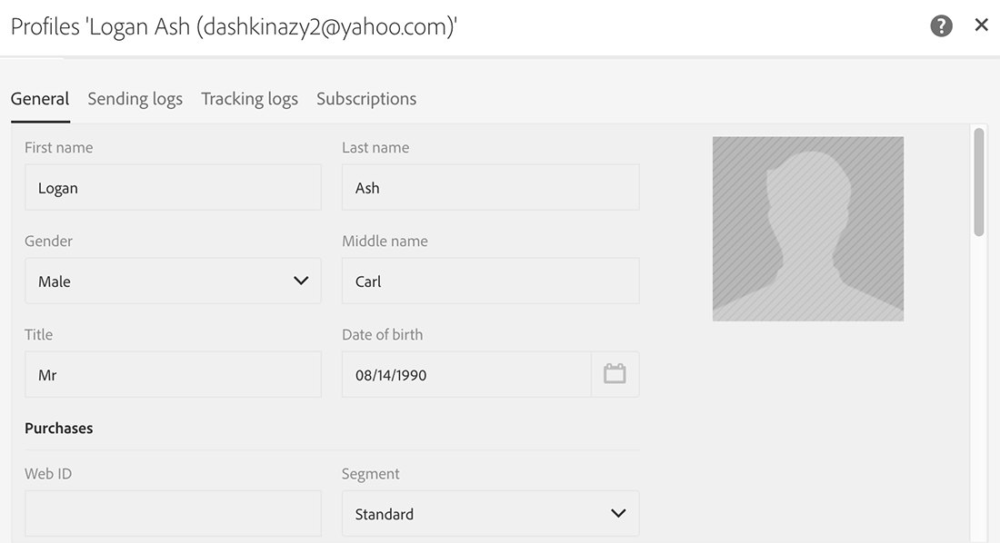
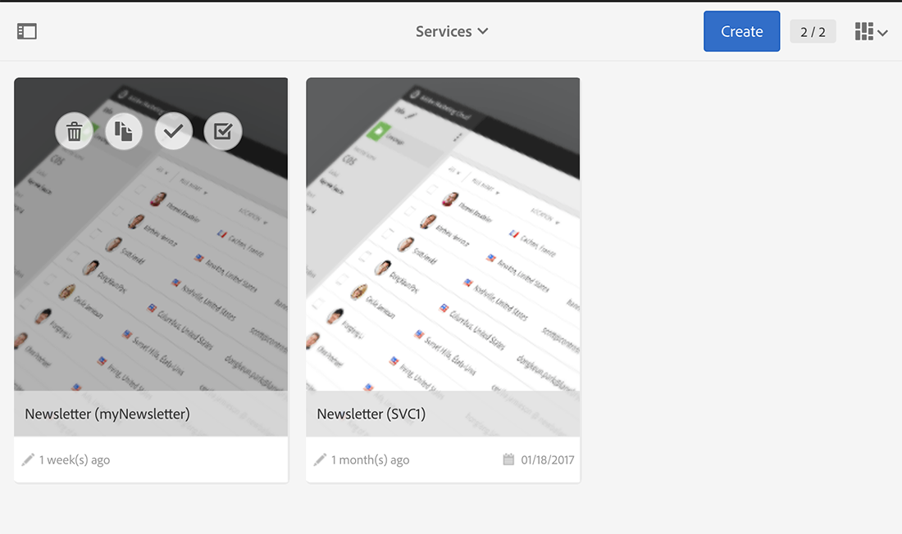

# Sincronización de aplicaciones web{#synchronizing-web-applications}

En este ejemplo de uso, se envía una comunicación mediante Campaign Standard en la que se incluye un enlace a una aplicación web de Campaign v7. Cuando el destinatario hace clic en el enlace del correo electrónico, la aplicación web muestra un formulario con varios campos precargados con los datos del destinatario, como así también un enlace de suscripción a un boletín informativo. El destinatario puede actualizar sus datos y suscribirse al servicio. Su perfil se actualiza en Campaign v7 y la información se duplica en Campaign Standard.

Si tiene muchos servicios y aplicaciones web en Campaign v7, puede elegir no recrearlos todos en Campaign Standard. El conector ACS permite utilizar todas las aplicaciones y servicios web de Campaign v7 existentes y los relaciona con un envío realizado por Campaign Standard.

## Requisitos previos {#prerequisites}

Para lograr esto, es necesario lo siguiente:

* Los destinatarios almacenados en la base de datos de Campaign v7 y sincronizarlos con Campaign Standard. Consulte la sección [Sincronización de perfiles](../../integrations/using/synchronizing-profiles.md) .
* Un servicio y una aplicación web creados y publicados en Campaign v7.
* the web application must contain a **[!UICONTROL Pre-loading]** activity using the **[!UICONTROL Adobe Campaign encryption]** identification method.

## Creación de la aplicación y el servicio web {#creating-the-web-application-and-service}

En Campaign v7 puede crear aplicaciones web que permitan a los destinatarios suscribirse a un servicio. La aplicación y el servicio web están diseñados y almacenados en Campaign v7. Este servicio se puede actualizar a través de una comunicación de Campaign Standard. Para obtener más información sobre las aplicaciones web en Campaign v7, consulte [esta sección](../../web/using/adding-fields-to-a-web-form.md#subscription-checkboxes).

En Campaign v7 se han creado los siguientes objetos:

* un servicio de boletín informativo,
* una aplicación web que contiene una **[!UICONTROL Pre-loading]**, una **[!UICONTROL Page]** y una **[!UICONTROL Storage]** actividad.

1. Go to **[!UICONTROL Resources > Online > Web applications]** and select an existing web application.

   

1. Edite la **[!UICONTROL Preloading]** actividad. Se activa la **[!UICONTROL Auto-load data referenced in the form]** casilla y se selecciona el método **[!UICONTROL Adobe Campaign encryption]** de identificación. Esto permite que la aplicación web precargue los campos del formulario con los datos almacenados en la base de datos de Adobe Campaign. Consulte [este documento](../../web/using/publishing-a-web-form.md#pre-loading-the-form-data).

   

1. Edite el **[!UICONTROL Page]**. Three fields (Name, Email and Phone) have been included, as well as a check box to invite the recipient to subscribe to a newsletter (**[!UICONTROL Newsletter]** service).

   

1. Vaya a **[!UICONTROL Profiles and Target > Services and subscriptions]** y abra el **[!UICONTROL Newsletter]** servicio. Este es el servicio que se actualiza desde la comunicación de Campaign Standard. Puede ver que ningún destinatario se ha suscrito a este servicio aún.

   

1. Vaya a **[!UICONTROL Profiles and Targets > Recipient]** y seleccione un destinatario. Puede ver que aún no se ha suscrito al servicio.

   

## Duplicación de datos {#replicating-the-data}

Para poder duplicar los datos necesarios entre Campaign v7 y Campaign Standard hay disponibles varias plantillas de flujo de trabajo de duplicación. The **[!UICONTROL Profiles replication]** workflow automatically replicates all the Campaign v7 recipients to Campaign Standard. See [Technical and replication workflows](../../integrations/using/acs-connector-principles-and-data-cycle.md#technical-and-replication-workflows). The **[!UICONTROL Landing pages replication]** workflow enables the replication of the web applications we want to use in Campaign Standard.

Para comprobar que los datos se hayan duplicado correctamente, siga estos pasos en Campaign Standard:

1. From the home screen, click on **[!UICONTROL Customer profiles]**.

   

1. Busque el destinatario de Campaign v7 y compruebe que aparece en Campaign Standard.

   

1. From the top bar, click on **[!UICONTROL Marketing activities]**, and search for the Campaign v7 web application. Se muestra como una página de destino en Campaign Standard.

   

1. Click the **[!UICONTROL Adobe Campaign]** logo, in the top left corner, then select **Profiles &amp; audiences > Services** and check that the newsletter service is there as well.

   

## Diseño y envío del correo electrónico {#designing-and-sending-the-email}

En esta parte, se muestra cómo incluir en un correo electrónico de Campaign Standard un enlace a la página de destino duplicada desde una aplicación web de Campaign v7.

Los pasos para crear, diseñar y enviar el correo electrónico son los mismos que para un correo electrónico clásico. Consulte la documentación de [Adobe Campaign Standard](https://helpx.adobe.com/support/campaign/standard.html).

1. Cree un nuevo correo electrónico y seleccione uno o más perfiles duplicados como audiencia.
1. Edite el contenido e inserte un **[!UICONTROL Link to a landing page]**.

   

1. Seleccione la página de destino duplicada desde la aplicación web de Campaign v7.

   

1. Prepare su correo electrónico, envíe sus pruebas y envíe el correo electrónico final.
1. Uno de los destinatarios abre el correo electrónico y hace clic en el enlace de suscripción al boletín informativo.

   

1. Añade el número de teléfono y marca la casilla de suscripción al boletín informativo.

   

## Recuperación de la información actualizada {#retrieving-the-updated-information}

Cuando el destinatario actualiza sus datos desde la aplicación web, Adobe Campaign v7 recupera de forma sincrónica la información actualizada. A continuación, se duplica desde Campaign v7 a Campaign Standard.

1. En Campaign v7, vaya a **[!UICONTROL Profiles and Target > Services and subscriptions]** y abra el **[!UICONTROL Newsletter]** servicio. Puede ver que el destinatario aparece ahora en la lista de suscriptores.

   

1. Vaya a **[!UICONTROL Profiles and Targets > Recipient]** y seleccione el destinatario. Puede ver que el número de teléfono ahora está guardado.

   

1. In the **[!UICONTROL Subscriptions]** tab, we can also see that he has subscribed to the newsletter service.

   

1. Espere unos minutos para que se ejecute el flujo de trabajo de duplicación de perfiles.
1. En Campaign Standard, acceda a su perfil de destinatario para comprobar que los datos actualizados se hayan duplicado correctamente desde Campaign v7.

   

1. Edite el perfil. Puede ver que el número de teléfono está actualizado.

   

1. Click on the **[!UICONTROL Subscriptions]** tab. Ahora aparece el servicio de boletín informativo.

   

