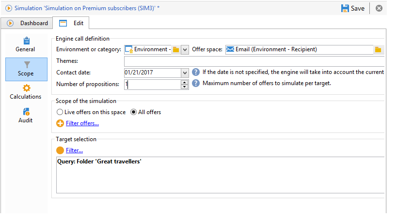
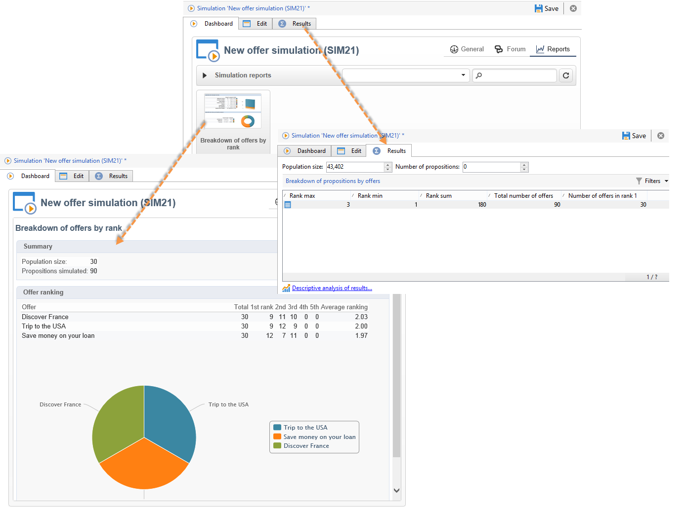

# Acerca de la simulación de ofertas{#about-offers-simulation}

El módulo de **Simulation** permite probar la distribución de ofertas pertenecientes a una categoría o a un entorno antes de enviar la propuesta a los destinatarios.

La simulación tiene en cuenta los contextos y las reglas de idoneidad aplicadas previamente a las ofertas (consulte [Resumen del catálogo de ofertas](../../interaction/using/offer-catalog-overview.md)), así como las normas de presentación (consulte). [Presentación de la oferta de gestión](../../interaction/using/managing-offer-presentation.md) Esto permite probar y perfeccionar varias versiones de la propuesta de oferta sin utilizar realmente una por encima o por debajo del objetivo, ya que la simulación no tiene ningún impacto en los destinatarios a los que va dirigida.

Para aprender a simular una oferta, lea los pasos a continuación.

[ También puede ver este vídeo](https://helpx.adobe.com/campaign/classic/how-to/simulate-offer-in-acv6.html?playlist=/ccx/v1/collection/product/campaign/classic/segment/digital-marketers/explevel/intermediate/applaunch/introduction/collection.ccx.js&amp;ref=helpx.adobe.com).

## Pasos principales para crear una simulación {#main-steps-for-creating-a-simulation}

Para ejecutar una simulación de ofertas, siga los siguientes pasos:

1. En la pestaña **[!UICONTROL Profiles and Targets]**, haga clic en el vínculo **[!UICONTROL Simulations]** y, luego, haga clic en el botón **[!UICONTROL Create]**.

   

1. Guarde y edite la simulación que acaba de crear.
1. Vaya a la pestaña **[!UICONTROL Edit]** y especifique la configuración de ejecución.

   Para obtener más información, consulte [Configurar una ejecución](../../interaction/using/execution-settings.md).

   

   >[!NOTE]
   >
   >Los ajustes de ejecución solo están disponibles si se utiliza la interacción con Campaign.

1. Especifique el ámbito de la simulación.

   Para obtener más información, consulte [Definición del alcance](../../interaction/using/simulation-scope.md#definition-of-the-scope).

   

1. Añada los ejes del sistema de informes para mejorar el informe **[!UICONTROL Offer distribution by rank]** (opcional).

   Para obtener más información, consulte [Adición de ejes al sistema de informes](../../interaction/using/simulation-scope.md#adding-reporting-axes).

   

1. Haga clic en **[!UICONTROL Save]** para guardar los ajustes de la simulación.
1. Inicie la simulación a través del panel de control.

   

1. Compruebe el resultado de la simulación y visualice el informe de análisis.

   Para obtener más información, consulte [Simulación de seguimiento](../../interaction/using/simulation-tracking.md).

   
