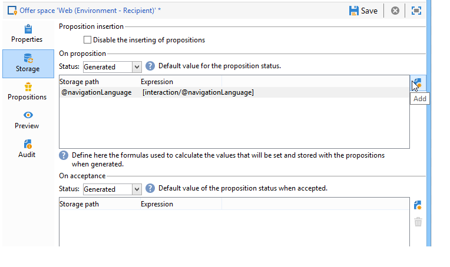

# Datos adicionales{#additional-data}

Durante una llamada al motor de interacción, se puede transferir información adicional contextual. Estos datos pueden proceder de los datos de destino almacenados en la tabla de trabajo de un flujo de trabajo (canal saliente) o de los datos de llamada enviados mediante el sitio web durante la llamada (canal entrante). Se puede utilizar estos datos adicionales en las reglas de idoneidad, en la personalización de ofertas, y también almacenarlos en una tabla de propuestas.

Para el canal entrante, puede resultar útil recuperar información como el idioma del explorador de la persona que consulta la oferta o el nombre del agente del centro de llamadas, por ejemplo. Se puede utilizar estos datos de llamada en las reglas de idoneidad para presentar una oferta solo a aquellas personas que vean la página web en francés o en inglés.

En un flujo de trabajo de destino (canal saliente), se pueden utilizar los datos de destino durante una llamada al motor. Por ejemplo, se puede enriquecer el destino con datos de una transacción vinculada de destinatario o con una base de datos externa, a través de FDA.

## Configuraciones de datos adicionales {#additional-data-configuration}

Se debe ampliar el esquema **nms:interaction** vinculado al entorno y declarar la lista de campos adicionales que se van a utilizar durante una llamada al motor de interacción. Al crear la regla de idoneidad o al personalizar una oferta, estos campos van a ser accesibles desde el nodo **Interaction** (consulte [Usar datos adicionales](#using-additional-data)).

Para el canal entrante, se deben añadir los campos de datos de llamada al nodo **Interaction**.

```
<element label="Interactions" labelSingular="Interaction" name="interaction">
  <attribute label="Navigation language" name="navigationLanguage" type="string"/>
</element>
```

>[!NOTE]
>
>Las colecciones XML se admiten en el canal entrante, pero los vínculos a otros esquemas no.

Para el canal saliente, se debe añadir un elemento **targetData** que contenga los campos adicionales al nodo **Interaction**.

```
<element label="Interactions" labelSingular="Interaction" name="interaction">
  <element name="targetData">
    <attribute label="Date of last transaction" name="lastTransactionDate" type="datetime"/>
  </element>
</element>
```

>[!NOTE]
>
>Las colecciones no son compatibles con el canal saliente. Sin embargo, se pueden crear vínculos con otros esquemas.

Si se desea almacenar estos datos en la tabla de propuestas, también se debe extender el esquema **nms:propositionRcp** y declarar estos campos.

```
<element label="Recipient offer propositions" labelSingular="Recipient offer proposition" name="propositionRcp">
  <attribute label="Last transaction date" name="lastTransactionDate" type="datetime"/>
  <attribute label="Navigation language" name="navigationLanguage" type="string"/>
</element>
```

## Implementación de datos adicionales {#additional-data-implementation}

### Canal de entrada (página web) {#input-channel--web-page-}

Para transferir datos adicionales al llamar al motor, se debe añadir la variable **interactionGlobalCtx** al código JavaScript de la página web. Inserte el nodo **Interaction** que contiene los datos de llamada en esta variable. Se debe respetar la misma estructura xml que se encuentra en el esquema **de nms:interaction.** Consulte: [Configuración de datos adicional](#additional-data-configuration).

```
interactionGlobalCtx = "<interaction navigationLanguage='"+myLanguage+"'/>";
```

### Canal de salida {#output-channel}

Se debe crear un flujo de trabajo que cargue datos adicionales en la tabla de trabajo respetando la misma estructura xml y los mismos nombres internos que en el esquema **nms:interaction.** Consulte: [Configuración de datos adicional](#additional-data-configuration).

## Uso de datos adicionales {#using-additional-data}

### Reglas de elegibilidad {#eligibility-rules}

Se pueden utilizar los datos adicionales en las reglas de idoneidad para ofertas, categorías y ponderaciones.

Por ejemplo, se puede elegir que la oferta se muestre únicamente a las personas que ven la página en inglés.


>[!NOTE]
>
>Se debe limitar la regla en los canales para los que se definen los datos. En este ejemplo, se limita la regla en el canal web entrante (campo **[!UICONTROL Taken into account if]**).

### Personalización {#personalization}

Asimismo, se pueden utilizar estos datos adicionales al personalizar una oferta. Por ejemplo, se puede agregar una condición para el idioma de navegación.


>[!NOTE]
>
>Se debe limitar la personalización en los canales para los que se definen los datos. En este ejemplo, se limita la regla en el canal web entrante.

Si se ha personalizado una oferta con datos adicionales, estos datos no van a aparecer en la vista previa de manera predeterminada ya que no está disponible en la base de datos. En la pestaña **[!UICONTROL Example of call data]** del entorno, se deben añadir muestras de valor para utilizarlas en la vista previa. Respete la misma estructura xml que se encuentra en la extensión de esquema **nms:interaction.** Para obtener más información, consulte [Configuración de datos adicional](#additional-data-configuration).


Al obtener una vista previa, haga clic en **[!UICONTROL Content personalization options for the preview]** y seleccione un valor en el campo **[!UICONTROL Call data]**.


### Almacenamiento {#storage}

Durante una llamada al motor, se pueden almacenar datos adicionales en la tabla de propuestas para enriquecer la base de datos. Estos datos se pueden utilizar, por ejemplo, en los informes, en los cálculos de ROI o en los procesos posteriores.

>[!NOTE]
>
>Se debe ampliar el esquema **nms:propositionRcp** y declarar los campos que van a contener los datos que deben almacenarse. Para más información sobre esto: [Configuración de datos adicional](#additional-data-configuration).

En el espacio de oferta, vaya a la pestaña **[!UICONTROL Storage]** y haga clic en el botón **[!UICONTROL Add]**.

En la columna **[!UICONTROL Storage path]**, seleccione el campo de almacenamiento en la tabla de propuestas. En la columna **[!UICONTROL Expression]**, seleccione el campo adicional del nodo **[!UICONTROL Interaction]**.

Se puede recuperar los datos de llamada cuando la propuesta se genere o cuando se acepte (cuando la persona haga clic en la oferta).


