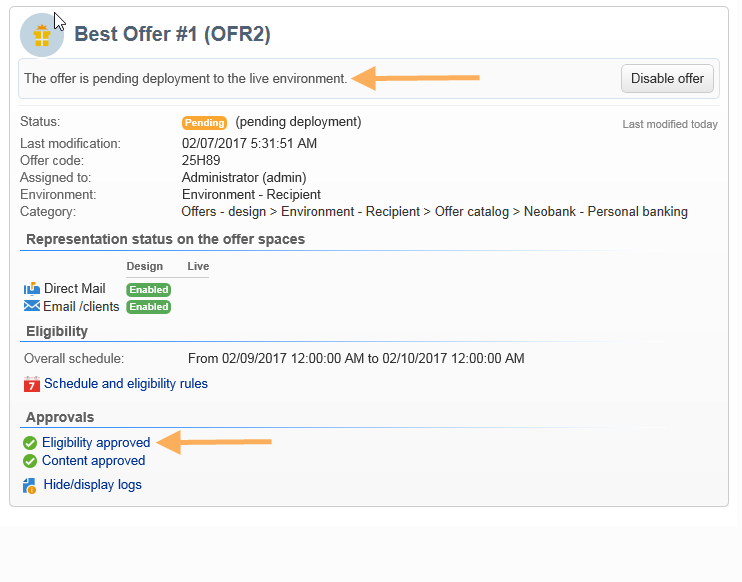
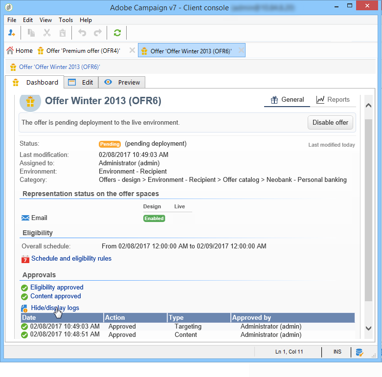
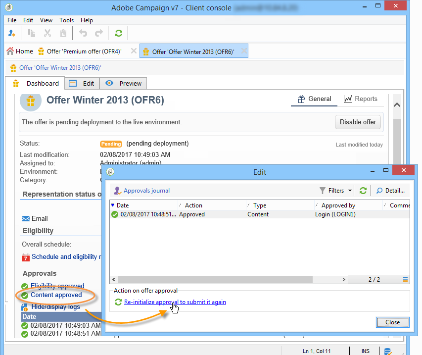

# Aprobación y activación de una oferta{#approving-and-activating-an-offer}

Una vez finalizado el contenido de la oferta, es necesario aprobarla para que se duplique en el entorno en vivo y se distribuya. La aprobación se refiere al contenido de la oferta y sus requisitos.

El titular del panel de oferta indica si la oferta debe ir a través del ciclo de aprobación o no.

## Aprobación del contenido de la oferta {#approving-offer-content}

La aprobación del contenido de la oferta implica seleccionar la representación que desea poner a disposición del entorno en directo.

El contenido de una oferta tiene una representación por espacio. Dado que cada espacio de oferta tiene su propia estructura y sus propias funciones de procesamiento, la representación de la oferta puede variar.

Puede optar por aprobar el contenido de la oferta en algunos espacios disponibles y rechazarlo en otros.

>[!IMPORTANT]
>
>Una vez aprobado el contenido y la idoneidad de una oferta, el flujo de trabajo de la publicación (notificación de la oferta) se ejecuta automáticamente. La oferta está activa y disponible en todos los espacios activados.

Para aprobar el contenido de la oferta, siga estos pasos:

1. Haga clic en el **[!UICONTROL Approval]** botón y seleccione **[!UICONTROL Approve content]** en la ventana emergente.

   

1. Using the drop-down list, select the representations you want to keep editing or those you want to publish to the live environment, then click **[!UICONTROL Content approval]**.

   

   Una vez aprobado el contenido de la oferta, la información se actualiza en la tabla del panel de ofertas.

   

   >[!NOTE]
   >
   >The **[!UICONTROL Content approved]** mention does not mean that all the offer representations have been enabled and approved. Indica que se ha alcanzado el proceso de aprobación del contenido, aunque no todas las ofertas se hayan habilitado o aprobado.

## Aprobación de los requisitos para la oferta {#approving-offer-eligibility}

La aprobación de los requisitos de oferta implica aceptar o rechazar los pesos de la oferta y las reglas de idoneidad también configuradas en la oferta o heredadas de las reglas creadas en la categoría principal.

>[!IMPORTANT]
>
>Una vez aprobado el contenido y la idoneidad de una oferta, el flujo de trabajo de la publicación (notificación de la oferta) se ejecuta automáticamente. La oferta está activa y disponible en todos los espacios activados.

* The full list of rules can be viewed by clicking **[!UICONTROL Schedule and eligibility rules]**.

   

* Para cambiar las reglas de elegibilidad, haga clic en **[!UICONTROL Reject]** y luego en **[!UICONTROL Eligibility approval]**.

   

   Los distintos estados se actualizan en el panel de ofertas.

   

* To accept the offer eligibility, click **[!UICONTROL Approve eligibility]**.

   

   Approve eligibility, add a comment if necessary, then click **[!UICONTROL Eligibility approval]**.

   

   Los distintos estados se actualizan en el panel de ofertas.

   

## Seguimiento de la aprobación {#approval-tracking}

El seguimiento de la aprobación está disponible en el panel de ofertas. Haga clic **[!UICONTROL Hide/display logs]** para acceder a él.

>[!NOTE]
>
>Tracking is also available in the **[!UICONTROL Audit]** tab of the offer, with details of reviewers&#39; comments.

## Reinicio de la aprobación {#restart-the-approval}

Una vez lanzada la aprobación, puede ser relanzada. Para ello, siga estas instrucciones:

1. Haga clic **[!UICONTROL Content approved]** en el panel de oferta.
1. En la **[!UICONTROL Edit]** ventana que aparece, seleccione la aprobación para reiniciar y, a continuación, haga clic en **[!UICONTROL Re-initialize approval to submit it again]**.
1. Confirm by clicking **[!UICONTROL Ok]**.

## Publicación de la oferta {#publishing-the-offer}

Una vez que el contenido y la idoneidad de una oferta se hayan aprobado, la oferta se publica mediante un flujo de trabajo que se ejecuta automáticamente para cada oferta cuyo ciclo de aprobación haya finalizado. The **[!UICONTROL Offer notification]** workflow also runs every hour in order to synchronize (if necessary) the spaces and categories contained in the offer catalog from the design environment to the live environment.

El panel de la oferta disponible en el entorno de diseño contiene información sobre la publicación, incluido el nombre de la oferta coincidente del entorno en directo.

Para mostrar la oferta disponible en el entorno en directo, haga clic en la etiqueta de oferta: la oferta en directo tiene un panel que contiene toda la información relevante.

## Desactivación de una oferta {#disabling-an-offer}

Una vez aprobada la oferta, puede desactivarla.

To do this, go to the dashboard for an online offer or an offer waiting to go online, then click **[!UICONTROL Disable offer]**.

You can also directly disable a category by going to the **[!UICONTROL Eligibility]** tab and checking the **[!UICONTROL Enabled]** box.

>[!NOTE]
>
>Cuando se elimina una oferta en un entorno de diseño, se desactiva automáticamente en el entorno en línea relacionado. Tras un periodo de retención de propuestas, las ofertas desactivadas se eliminan del entorno en línea.

