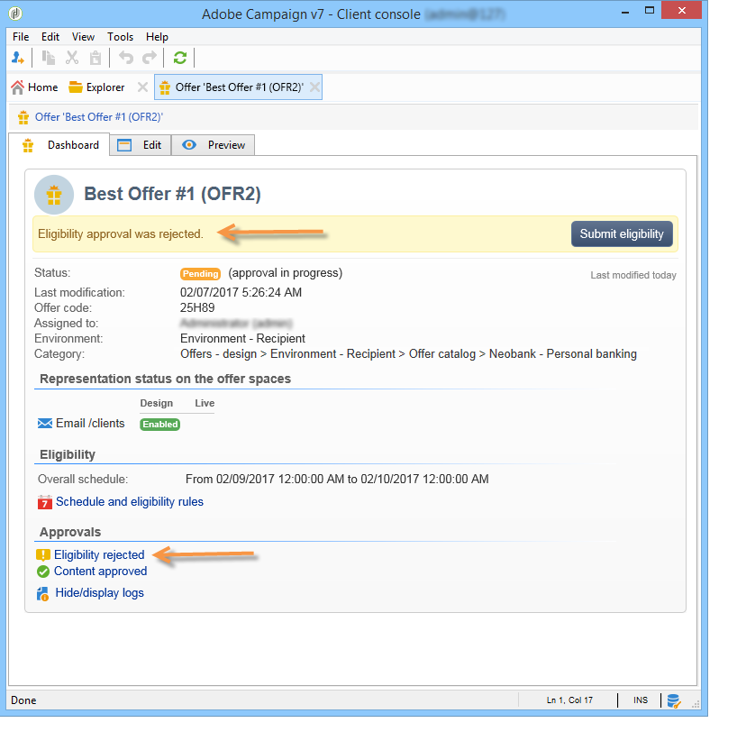
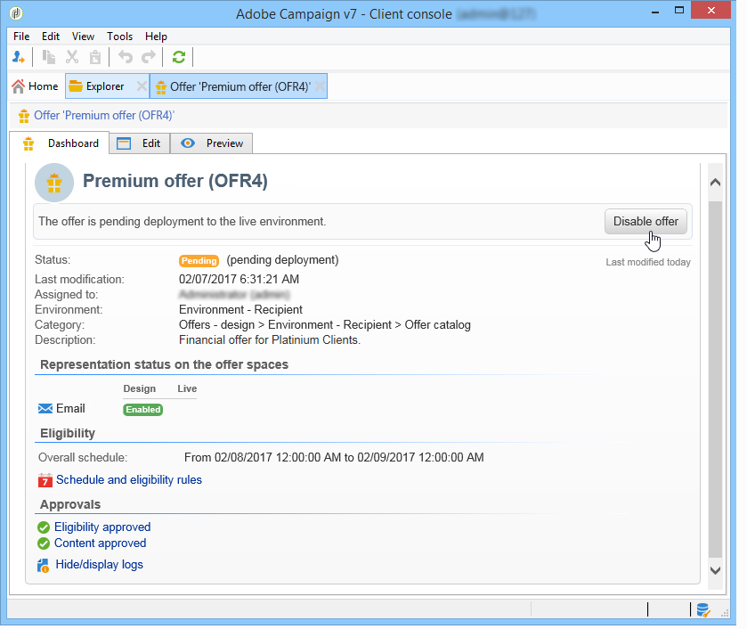

# Aprobación y activación de una oferta{#approving-and-activating-an-offer}

Una vez finalizado el contenido de la oferta, es necesario aprobarla para que se duplique en el entorno en vivo y se distribuya. La aprobación se refiere al contenido de la oferta y sus requisitos.

El titular del panel de oferta indica si la oferta debe ir a través del ciclo de aprobación o no.

## Aprobación del contenido de la oferta {#approving-offer-content}

La aprobación del contenido de la oferta implica seleccionar la representación que desea poner a disposición del entorno en directo.

El contenido de una oferta tiene una representación por espacio. Dado que cada espacio de oferta tiene su propia estructura y sus propias funciones de procesamiento, la representación de la oferta puede variar.

Puede optar por aprobar el contenido de la oferta en algunos espacios disponibles y rechazarlo en otros.

>[!CAUTION]
>
>Una vez aprobado el contenido y la idoneidad de una oferta, el flujo de trabajo de la publicación (notificación de la oferta) se ejecuta automáticamente. La oferta está activa y disponible en todos los espacios activados.

Para aprobar el contenido de la oferta, siga estos pasos:

1. Haga clic en el botón **[!UICONTROL Aprobación]** y seleccione **[!UICONTROL Aprobar contenido]** en la ventana emergente.

   

1. En la lista desplegable, seleccione las representaciones que desea seguir editando o las que desee publicar en el entorno en directo y, a continuación, haga clic en **[!UICONTROL Aprobar contenido]**.

   

   Una vez aprobado el contenido de la oferta, la información se actualiza en la tabla del panel de ofertas.

   

   >[!NOTE]
   >
   >La mención **[!UICONTROL Aprobar contenido]** no significa que todas las representaciones de la oferta se hayan habilitado y aprobado. Indica que se ha alcanzado el proceso de aprobación del contenido, aunque no todas las ofertas se hayan habilitado o aprobado.

## Aprobación de los requisitos para la oferta {#approving-offer-eligibility}

La aprobación de los requisitos de oferta implica aceptar o rechazar los pesos de la oferta y las reglas de idoneidad también configuradas en la oferta o heredadas de las reglas creadas en la categoría principal.

>[!CAUTION]
>
>Una vez aprobado el contenido y la idoneidad de una oferta, el flujo de trabajo de la publicación (notificación de la oferta) se ejecuta automáticamente. La oferta está activa y disponible en todos los espacios activados.

* La lista completa de reglas puede verse haciendo clic en **[!UICONTROL Horario y reglas de elegibilidad]**.

   

* Para cambiar las reglas de elegibilidad, haga clic en **[!UICONTROL Rechazar]**, luego haga clic en **[!UICONTROL Aprobar elegibilidad]**.

   

   Los distintos estados se actualizan en el panel de ofertas.

   

* Para aceptar la idoneidad de la oferta, haga clic en **[!UICONTROL Aprobar elegibilidad]**.

   

   Apruebe la idoneidad, añada un comentario si es necesario y haga clic en **[!UICONTROL Aprobar elegibilidad]**.

   

   Los distintos estados se actualizan en el panel de ofertas.

   

## Seguimiento de la aprobación {#approval-tracking}

El seguimiento de la aprobación está disponible en el panel de ofertas. Haga clic en **[!UICONTROL Ocultar/mostrar registros]** para acceder.

>[!NOTE]
>
>El seguimiento también está disponible en la pestaña **[!UICONTROL Auditoría]** de la oferta, con detalles de los comentarios de los revisores.

## Reinicio de la aprobación {#restart-the-approval}

Una vez lanzada la aprobación, puede ser relanzada. Para ello, siga estas instrucciones:

1. Haga clic en **[!UICONTROL Contenido aprobado]** en el panel de ofertas.
1. En la ventana **[!UICONTROL Editar]** que aparece, seleccione la aprobación para reiniciar, luego haga clic en **[!UICONTROL Reinicialice la aprobación para enviarla nuevamente]**.
1. Confirme haciendo clic en **[!UICONTROL Ok]**.

## Publicación de la oferta {#publishing-the-offer}

Una vez que el contenido y la idoneidad de una oferta se hayan aprobado, la oferta se publica mediante un flujo de trabajo que se ejecuta automáticamente para cada oferta cuyo ciclo de aprobación haya finalizado. El flujo de trabajo de **[!UICONTROL Notificación de oferta]** también se ejecuta cada hora para sincronizar (si es necesario) los espacios y las categorías que contiene el catálogo de ofertas desde el entorno de diseño al entorno en vivo.

El panel de la oferta disponible en el entorno de diseño contiene información sobre la publicación, incluido el nombre de la oferta coincidente del entorno en directo.

Para mostrar la oferta disponible en el entorno en directo, haga clic en la etiqueta de oferta: la oferta en directo tiene un panel que contiene toda la información relevante.

## Desactivación de una oferta {#disabling-an-offer}

Una vez aprobada la oferta, puede desactivarla.

Para ello, vaya al panel de una oferta en línea o de una oferta esperando para conectarse y, a continuación, haga clic en **[!UICONTROL Desactivar oferta]**.

También puede deshabilitar directamente una categoría si ingresa a la pestaña **[!UICONTROL Elegibilidad]** y activa la casilla **[!UICONTROL Habilitado]**.

>[!NOTE]
>
>Cuando se elimina una oferta en un entorno de diseño, se desactiva automáticamente en el entorno en línea relacionado. Tras un periodo de retención de propuestas, las ofertas desactivadas se eliminan del entorno en línea.

